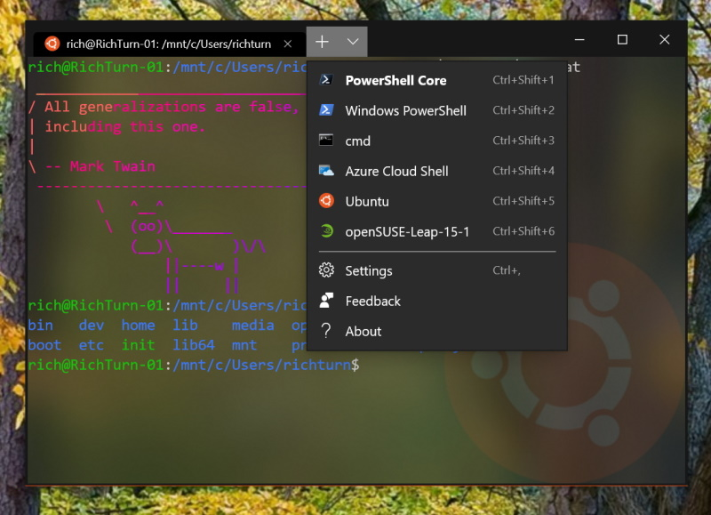

# Settings.json Documentation

## Globals

Properties listed below affect the entire window, regardless of the profile settings.

| Property | Necessity | Type | Default | Description |
| -------- | --------- | ---- | ------- | ----------- |
| `alwaysShowTabs` | _Required_ | Boolean | `true` | When set to `true`, tabs are always displayed. When set to `false` and `showTabsInTitlebar` is set to `false`, tabs only appear after typing <kbd>Ctrl</kbd> + <kbd>T</kbd>. |
| `copyOnSelect` | Optional | Boolean | `false` | When set to `true`, a selection is immediately copied to your clipboard upon creation. When set to `false`, the selection persists and awaits further action. |
| `copyFormatting` | Optional | Boolean | `false` | When set to `true`, the color and font formatting of selected text is also copied to your clipboard. When set to `false`, only plain text is copied to your clipboard. |
| `defaultProfile` | _Required_ | String | PowerShell guid | Sets the default profile. Opens by typing <kbd>Ctrl</kbd> + <kbd>T</kbd> or by clicking the '+' icon. The guid of the desired default profile is used as the value. |
| `initialCols` | _Required_ | Integer | `120` | The number of columns displayed in the window upon first load. |
| `initialPosition` | Optional | String | `","` | The position of the top left corner of the window upon first load. On a system with multiple displays, these coordinates are relative to the top left of the primary display. If `launchMode` is set to `"maximized"`, the window will be maximized on the monitor specified by those coordinates. |
| `initialRows` | _Required_ | Integer | `30` | The number of rows displayed in the window upon first load. |
| `launchMode` | Optional | String | `default` | Defines whether the Terminal will launch as maximized or not. Possible values: `"default"`, `"maximized"` |
| `rowsToScroll` | Optional | Integer | `system` | The number of rows to scroll at a time with the mouse wheel. This will override the system setting if the value is not zero or "system". |
| `theme` | _Required_ | String | `system` | Sets the theme of the application. Possible values: `"light"`, `"dark"`, `"system"` |
| `showTerminalTitleInTitlebar` | _Required_ | Boolean | `true` | When set to `true`, titlebar displays the title of the selected tab. When set to `false`, titlebar displays "Windows Terminal". |
| `showTabsInTitlebar` | Optional | Boolean | `true` | When set to `true`, the tabs are moved into the titlebar and the titlebar disappears. When set to `false`, the titlebar sits above the tabs. |
| `snapToGridOnResize` | Optional | Boolean | `false` | When set to `true`, the window will snap to the nearest character boundary on resize. When `false`, the window will resize "smoothly" |
| `tabWidthMode` | Optional | String | `equal` | Sets the width of the tabs. Possible values: <br><ul><li>`"equal"`: sizes each tab to the same width</li><li>`"titleLength"`:  sizes each tab to the length of its title</li><li>`"compact"`: sizes each tab to the length of its title when focused, and shrinks to the size of only the icon when the tab is unfocused.</li></ul> |
| `wordDelimiters` | Optional | String | <code>&nbsp;&#x2f;&#x5c;&#x28;&#x29;&#x22;&#x27;&#x2d;&#x3a;&#x2c;&#x2e;&#x3b;&#x3c;&#x3e;&#x7e;&#x21;&#x40;&#x23;&#x24;&#x25;&#x5e;&#x26;&#x2a;&#x7c;&#x2b;&#x3d;&#x5b;&#x5d;&#x7b;&#x7d;&#x7e;&#x3f;│</code><br>_(`│` is `U+2502 BOX DRAWINGS LIGHT VERTICAL`)_ | Determines the delimiters used in a double click selection. |
| `confirmCloseAllTabs` | Optional | Boolean | `true` | When set to `true` closing a window with multiple tabs open WILL require confirmation.  When set to `false` closing a window with multiple tabs open WILL NOT require confirmation. |
| `startOnUserLogin` | Optional | Boolean | `false` | When set to `true` enables the launch of Windows Terminal at startup. Setting to `false` will disable the startup task entry. Note: if the Windows Terminal startup task entry is disabled either by org policy or by user action this setting will have no effect. |
| `disabledProfileSources` | Optional | Array[String] | `[]` | Disables all the dynamic profile generators in this list, preventing them from adding their profiles to the list of profiles on startup. This array can contain any combination of `Windows.Terminal.Wsl`, `Windows.Terminal.Azure`, or `Windows.Terminal.PowershellCore`. For more information, see [UsingJsonSettings.md](https://github.com/microsoft/terminal/blob/master/doc/user-docs/UsingJsonSettings.md#dynamic-profiles) |
| `experimental.rendering.forceFullRepaint` | Optional | Boolean | `false` | When set to true, we will redraw the entire screen each frame. When set to false, we will render only the updates to the screen between frames. |
| `experimental.rendering.software` | Optional | Boolean | `false` | When set to true, we will use the software renderer (a.k.a. WARP) instead of the hardware one. |

## Profiles

Properties listed below are specific to each unique profile.

| Property | Necessity | Type | Default | Description |
| -------- | --------- | ---- | ------- | ----------- |
| `guid` | _Required_ | String | | Unique identifier of the profile. Written in registry format: `"{00000000-0000-0000-0000-000000000000}"`. |
| `name` | _Required_ | String | | Name of the profile. Displays in the dropdown menu. <br>Additionally, this value will be used as the "title" to pass to the shell on startup. Some shells (like `bash`) may choose to ignore this initial value, while others (`cmd`, `powershell`) may use this value over the lifetime of the application. This "title" behavior can be overridden by using `tabTitle`. |
| `acrylicOpacity` | Optional | Number | `0.5` | When `useAcrylic` is set to `true`, it sets the transparency of the window for the profile. Accepts floating point values from 0-1. |
| `antialiasingMode` | Optional | String | `"grayscale"` | Controls how text is antialiased in the renderer. Possible values are "grayscale", "cleartype" and "aliased". Note that changing this setting will require starting a new terminal instance. |
| `background` | Optional | String | | Sets the background color of the profile. Overrides `background` set in color scheme if `colorscheme` is set. Uses hex color format: `"#rrggbb"`. |
| `backgroundImage` | Optional | String | | Sets the file location of the Image to draw over the window background. |
| `backgroundImageAlignment` | Optional | String | `center` | Sets how the background image aligns to the boundaries of the window. Possible values: `"center"`, `"left"`, `"top"`, `"right"`, `"bottom"`, `"topLeft"`, `"topRight"`, `"bottomLeft"`, `"bottomRight"` |
| `backgroundImageOpacity` | Optional | Number | `1.0` | Sets the transparency of the background image. Accepts floating point values from 0-1. |
| `backgroundImageStretchMode` | Optional | String | `uniformToFill` | Sets how the background image is resized to fill the window. Possible values: `"none"`, `"fill"`, `"uniform"`, `"uniformToFill"` |
| `closeOnExit` | Optional | String | `graceful` | Sets how the profile reacts to termination or failure to launch. Possible values: `"graceful"` (close when `exit` is typed or the process exits normally), `"always"` (always close) and `"never"` (never close). `true` and `false` are accepted as synonyms for `"graceful"` and `"never"` respectively. |
| `colorScheme` | Optional | String | `Campbell` | Name of the terminal color scheme to use. Color schemes are defined under `schemes`. |
| `commandline` | Optional | String | | Executable used in the profile. |
| `cursorColor` | Optional | String | | Sets the cursor color of the profile. Overrides `cursorColor` set in color scheme if `colorscheme` is set. Uses hex color format: `"#rrggbb"`. |
| `cursorHeight` | Optional | Integer | | Sets the percentage height of the cursor starting from the bottom. Only works when `cursorShape` is set to `"vintage"`. Accepts values from 25-100. |
| `cursorShape` | Optional | String | `bar` | Sets the cursor shape for the profile. Possible values: `"vintage"` ( &#x2583; ), `"bar"` ( &#x2503; ), `"underscore"` ( &#x2581; ), `"filledBox"` ( &#x2588; ), `"emptyBox"` ( &#x25AF; ) |
| `fontFace` | Optional | String | `Cascadia Mono` | Name of the font face used in the profile. We will try to fallback to Consolas if this can't be found or is invalid. |
| `fontSize` | Optional | Integer | `12` | Sets the font size. |
| `fontWeight` | Optional | String | `normal` | Sets the weight (lightness or heaviness of the strokes) for the given font. Possible values: `"thin"`, `"extra-light"`, `"light"`, `"semi-light"`, `"normal"`, `"medium"`, `"semi-bold"`, `"bold"`, `"extra-bold"`, `"black"`, `"extra-black"`, or the corresponding numeric representation of OpenType font weight. |
| `foreground` | Optional | String | | Sets the foreground color of the profile. Overrides `foreground` set in color scheme if `colorscheme` is set. Uses hex color format: `#rgb` or `"#rrggbb"`. |
| `hidden` | Optional | Boolean | `false` | If set to true, the profile will not appear in the list of profiles. This can be used to hide default profiles and dynamically generated profiles, while leaving them in your settings file. |
| `historySize` | Optional | Integer | `9001` | The number of lines above the ones displayed in the window you can scroll back to. |
| `icon` | Optional | String | | Image file location of the icon used in the profile. Displays within the tab and the dropdown menu. |
| `padding` | Optional | String | `8, 8, 8, 8` | Sets the padding around the text within the window. Can have three different formats: `"#"` sets the same padding for all sides, `"#, #"` sets the same padding for left-right and top-bottom, and `"#, #, #, #"` sets the padding individually for left, top, right, and bottom. |
| `scrollbarState` | Optional | String | `"visible"` | Defines the visibility of the scrollbar. Possible values: `"visible"`, `"hidden"` |
| `selectionBackground` | Optional | String | | Sets the selection background color of the profile. Overrides `selectionBackground` set in color scheme if `colorscheme` is set. Uses hex color format: `"#rrggbb"`. |
| `snapOnInput` | Optional | Boolean | `true` | When set to `true`, the window will scroll to the command input line when typing. When set to `false`, the window will not scroll when you start typing. |
| `altGrAliasing` | Optional | Boolean | `true` | By default Windows treats Ctrl+Alt as an alias for AltGr. When altGrAliasing is set to false, this behavior will be disabled. |
| `source` | Optional | String | | Stores the name of the profile generator that originated this profile. _There are no discoverable values for this field._ |
| `startingDirectory` | Optional | String | `%USERPROFILE%` | The directory the shell starts in when it is loaded. |
| `suppressApplicationTitle` | Optional | Boolean | `false` | When set to `true`, `tabTitle` overrides the default title of the tab and any title change messages from the application will be suppressed. When set to `false`, `tabTitle` behaves as normal. |
| `tabTitle` | Optional | String | | If set, will replace the `name` as the title to pass to the shell on startup. Some shells (like `bash`) may choose to ignore this initial value, while others (`cmd`, `powershell`) may use this value over the lifetime of the application.  |
| `useAcrylic` | Optional | Boolean | `false` | When set to `true`, the window will have an acrylic background. When set to `false`, the window will have a plain, untextured background. The transparency only applies to focused windows due to OS limitation. |
| `experimental.retroTerminalEffect` | Optional | Boolean | `false` | When set to `true`, enable retro terminal effects. This is an experimental feature, and its continued existence is not guaranteed. |

## Schemes

Properties listed below are specific to each color scheme. [ColorTool](https://github.com/microsoft/terminal/tree/master/src/tools/ColorTool) is a great tool you can use to create and explore new color schemes. All colors use hex color format.

| Property | Necessity | Type | Description |
| -------- | ---- | ----------- | ----------- |
| `name` | _Required_ | String | Name of the color scheme. |
| `foreground` | _Required_ | String | Sets the foreground color of the color scheme. |
| `background` | _Required_ | String | Sets the background color of the color scheme. |
| `selectionBackground` | Optional | String | Sets the selection background color of the color scheme. |
| `cursorColor` | Optional | String | Sets the cursor color of the color scheme. |
| `black` | _Required_ | String | Sets the color used as ANSI black. |
| `blue` | _Required_ | String | Sets the color used as ANSI blue. |
| `brightBlack` | _Required_ | String | Sets the color used as ANSI bright black. |
| `brightBlue` | _Required_ | String | Sets the color used as ANSI bright blue. |
| `brightCyan` | _Required_ | String | Sets the color used as ANSI bright cyan. |
| `brightGreen` | _Required_ | String | Sets the color used as ANSI bright green. |
| `brightPurple` | _Required_ | String | Sets the color used as ANSI bright purple. |
| `brightRed` | _Required_ | String | Sets the color used as ANSI bright red. |
| `brightWhite` | _Required_ | String | Sets the color used as ANSI bright white. |
| `brightYellow` | _Required_ | String | Sets the color used as ANSI bright yellow. |
| `cyan` | _Required_ | String | Sets the color used as ANSI cyan. |
| `green` | _Required_ | String | Sets the color used as ANSI green. |
| `purple` | _Required_ | String | Sets the color used as ANSI purple. |
| `red` | _Required_ | String | Sets the color used as ANSI red. |
| `white` | _Required_ | String | Sets the color used as ANSI white. |
| `yellow` | _Required_ | String | Sets the color used as ANSI yellow. |

## Keybindings

Properties listed below are specific to each custom key binding.

| Property | Necessity | Type | Description |
| -------- | ---- | ----------- | ----------- |
| `command` | _Required_ | String | The command executed when the associated key bindings are pressed. |
| `keys` | _Required_ | Array[String] or String | Defines the key combinations used to call the command. |
| `action` | Optional | String | Adds additional functionality to certain commands. |

### Implemented Commands and Actions

Commands listed below are per the implementation in [`src/cascadia/TerminalApp/AppKeyBindingsSerialization.cpp`](https://github.com/microsoft/terminal/blob/master/src/cascadia/TerminalApp/AppKeyBindingsSerialization.cpp).

Keybindings can be structured in the following manners:

For commands without arguments:
<br>
`{ "command": "commandName", "keys": [ "modifiers+key" ] }`

For commands with arguments:
<br>
`{ "command": { "action": "commandName", "argument": "value" }, "keys": ["modifiers+key"] }`

| Command | Command Description | Action (*=required) | Action Arguments | Argument Descriptions |
| ------- | ------------------- | ------ | ---------------- | ----------------- |
| `adjustFontSize` | Change the text size by a specified point amount. | `delta` | integer | Amount of size change per command invocation. |
| `closePane` | Close the active pane. | | | |
| `closeTab` | Close the current tab. | | | |
| `closeWindow` | Close the current window and all tabs within it. | | | |
| `copy` | Copy the selected terminal content to your Windows Clipboard. | `singleLine` | boolean | When `true`, the copied content will be copied as a single line. When `false`, newlines persist from the selected text. |
| `duplicateTab` | Make a copy and open the current tab. | | | |
| `find` | Open the search dialog box. | | | |
| `moveFocus` | Focus on a different pane depending on direction. | `direction`* | `left`, `right`, `up`, `down` | Direction in which the focus will move. |
| `newTab` | Create a new tab. Without any arguments, this will open the default profile in a new tab. | 1. `commandLine`<br>2. `startingDirectory`<br>3. `tabTitle`<br>4. `index`<br>5. `profile` | 1. string<br>2. string<br>3. string<br>4. integer<br>5. string | 1. Executable run within the tab.<br>2. Directory in which the tab will open.<br>3. Title of the new tab.<br>4. Profile that will open based on its position in the dropdown (starting at 0).<br>5. Profile that will open based on its GUID or name. |
| `nextTab` | Open the tab to the right of the current one. | | | |
| `openNewTabDropdown` | Open the dropdown menu. | | | |
| `openSettings` | Open the settings file. | | | |
| `paste` | Insert the content that was copied onto the clipboard. | | | |
| `prevTab` | Open the tab to the left of the current one. | | | |
| `resetFontSize` | Reset the text size to the default value. | | | |
| `resizePane` | Change the size of the active pane. | `direction`* | `left`, `right`, `up`, `down` | Direction in which the pane will be resized. |
| `scrollDown` | Move the screen down. | | | |
| `scrollUp` | Move the screen up. | | | |
| `scrollUpPage` | Move the screen up a whole page. | | | |
| `scrollDownPage` | Move the screen down a whole page. | | | |
| `splitPane` | Halve the size of the active pane and open another. Without any arguments, this will open the default profile in the new pane. | 1. `split`*<br>2. `commandLine`<br>3. `startingDirectory`<br>4. `tabTitle`<br>5. `index`<br>6. `profile`<br>7. `splitMode` | 1. `vertical`, `horizontal`, `auto`<br>2. string<br>3. string<br>4. string<br>5. integer<br>6. string<br>7. string | 1. How the pane will split. `auto` will split in the direction that provides the most surface area.<br>2. Executable run within the pane.<br>3. Directory in which the pane will open.<br>4. Title of the tab when the new pane is focused.<br>5. Profile that will open based on its position in the dropdown (starting at 0).<br>6. Profile that will open based on its GUID or name.<br>7. Controls how the pane splits. Only accepts `duplicate` which will duplicate the focused pane's profile into a new pane. |
| `switchToTab` | Open a specific tab depending on index. | `index`* | integer | Tab that will open based on its position in the tab bar (starting at 0). |
| `toggleFullscreen` | Switch between fullscreen and default window sizes. | | | |
| `unbound` | Unbind the associated keys from any command. | | | |

### Accepted Modifiers and Keys

#### Modifiers
`ctrl+`, `shift+`, `alt+`

#### Keys

| Type | Keys |
| ---- | ---- |
| Function and Alphanumeric Keys | `f1-f24`, `a-z`, `0-9` |
| Symbols | ``` ` ```, `-`, `=`, `[`, `]`, `\`, `;`, `'`, `,`, `.`, `/` |
| Arrow Keys | `down`, `left`, `right`, `up`, `pagedown`, `pageup`, `pgdn`, `pgup`, `end`, `home`, `plus` |
| Action Keys | `tab`, `enter`, `esc`, `escape`, `space`, `backspace`, `delete`, `insert` |
| Numpad Keys | `numpad_0-numpad_9`, `numpad0-numpad9`, `numpad_add`, `numpad_plus`, `numpad_decimal`, `numpad_period`, `numpad_divide`, `numpad_minus`, `numpad_subtract`, `numpad_multiply` |

## Background Images and Icons

Some Terminal settings allow you to specify custom background images and icons. It is recommended that custom images and icons are stored in system-provided folders and are referred to using the correct [URI Schemes](https://docs.microsoft.com/en-us/windows/uwp/app-resources/uri-schemes). URI Schemes provide a way to reference files independent of their physical paths (which may change in the future).

The most useful URI schemes to remember when customizing background images and icons are:

| URI Scheme | Corresponding Physical Path | Use / description |
| --- | --- | ---|
| `ms-appdata:///Local/` | `%localappdata%\Packages\Microsoft.WindowsTerminal_8wekyb3d8bbwe\LocalState\` | Per-machine files |
| `ms-appdata:///Roaming/` | `%localappdata%\Packages\Microsoft.WindowsTerminal_8wekyb3d8bbwe\RoamingState\` | Common files |

> ⚠ Note: Do not rely on file references using the `ms-appx` URI Scheme (i.e. icons). These files are considered an internal implementation detail and may change name/location or may be omitted in the future.

### Icons

Terminal displays icons for each of your profiles which Terminal generates for any built-in shells - PowerShell Core, PowerShell, and any installed Linux/WSL distros. Each profile refers to a stock icon via the `ms-appx` URI Scheme.

> ⚠ Note: Do not rely on the files referenced by the `ms-appx` URI Scheme - they are considered an internal implementation detail and may change name/location or may be omitted in the future.

You can refer to you own icons if you wish, e.g.:

```json
    "icon" : "C:\\Users\\richturn\\OneDrive\\WindowsTerminal\\icon-ubuntu-32.png",
```

> 👉 Tip: Icons should be sized to 32x32px in an appropriate raster image format (e.g. .PNG, .GIF, or .ICO) to avoid having to scale your icons during runtime (causing a noticeable delay and loss of quality.)

### Custom Background Images

You can apply a background image to each of your profiles, allowing you to configure/brand/style each of your profiles independently from one another if you wish.

To do so, specify your preferred `backgroundImage`, position it using `backgroundImageAlignment`, set its opacity with `backgroundImageOpacity`, and/or specify how your image fill the available space using `backgroundImageStretchMode`.

For example:
```json
    "backgroundImage": "C:\\Users\\richturn\\OneDrive\\WindowsTerminal\\bg-ubuntu-256.png",
    "backgroundImageAlignment": "bottomRight",
    "backgroundImageOpacity": 0.1,
    "backgroundImageStretchMode": "none"
```

> 👉 Tip: You can easily roam your collection of images and icons across all your machines by storing your icons and images in OneDrive (as shown above).

With these settings, your Terminal's Ubuntu profile would look similar to this:


