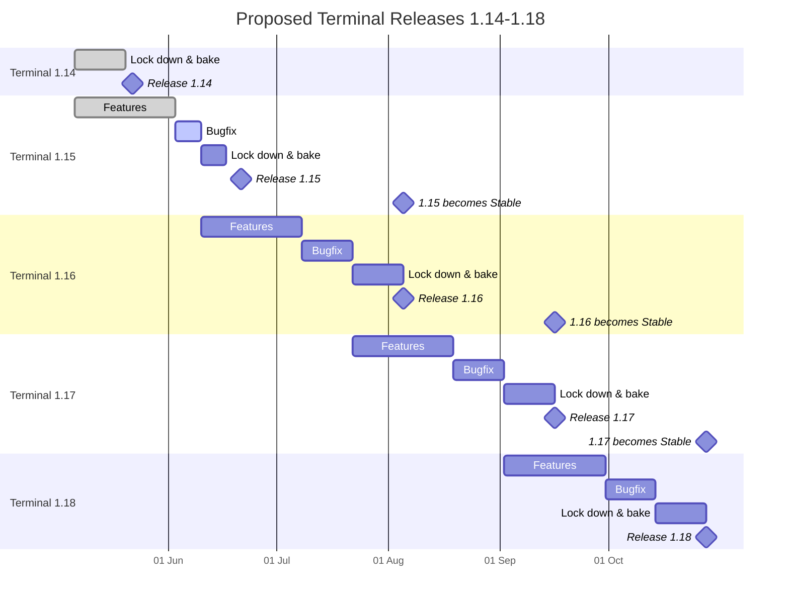

# Terminal 2022 Roadmap

## Overview 

This document outlines the roadmap of features we're planning for the Windows Terminal during 2022. This serves as a successor to the [Terminal v2 Roadmap], to reflect changes to our planning going forward.

Initially we had planned on a discrete "Terminal v2" goal, but over the last 18 months it's become clear to the team that we don't need a strict "2.0" release. We can continue serving the community effectively with continual, incremental updates. Should a future release warrant a substantial change to the Terminal worthy of the "2.0" moniker, we can re-evaluate then.

In 2022, we're going to try tracking our overall work with two "semester" milestones, "[22H1]" and "[22H2]", which roughly align with internal deadlines. Although the Windows Terminal ships updates out-of-band from the rest of the OS, we still have commitments to fixing bugs in the broader console ecosystem. Those changes need to be made in sync with the rest of the OS. Aligning our external milestones with those deadlines should help make sure we get bugs resolved in a timely fashion and checked into the OS.

These have additionally inherited the remainder of the work that was originally targeting the Terminal v2 milestone. As we burn down the features and bugs in these milestones, we'll draw new features into them from the "[Up Next]" milestone, which is itself populated from the highest-priority elements of the [Backlog].

## Milestones

Windows Terminal is engineered and delivered as a set of 6-week milestones. New features will go into [Windows Terminal Preview](https://aka.ms/terminal-preview) first, then a month after they've been in Preview, those features will move into [Windows Terminal](https://aka.ms/terminal). These timelines are rough estimates, not strict rules.

## Terminal Roadmap / Timeline

Below is the schedule for when milestones will be included in release builds of Windows Terminal and Windows Terminal Preview. The dates are rough estimates and are subject to change.

| Milestone End Date | Milestone Name | Preview Release Blog Post |
| ------------------ | -------------- | ------------------------- |
| 2020-06-18 | [1.1] in Windows Terminal Preview | [Windows Terminal Preview 1.1 Release](https://devblogs.microsoft.com/commandline/windows-terminal-preview-1-1-release/) |
| 2020-07-31 | [1.2] in Windows Terminal Preview [1.1] in Windows Terminal | [Windows Terminal Preview 1.2 Release] |
| 2020-08-31 | [1.3] in Windows Terminal Preview [1.2] in Windows Terminal | [Windows Terminal Preview 1.3 Release] |
| 2020-09-30 | [1.4] in Windows Terminal Preview [1.3] in Windows Terminal | [Windows Terminal Preview 1.4 Release] |
| 2020-11-30 | [1.5] in Windows Terminal Preview [1.4] in Windows Terminal | [Windows Terminal Preview 1.5 Release] |
| 2021-01-31 | [1.6] in Windows Terminal Preview [1.5] in Windows Terminal | [Windows Terminal Preview 1.6 Release] |
| 2021-03-01 | [1.7] in Windows Terminal Preview [1.6] in Windows Terminal | [Windows Terminal Preview 1.7 Release] |
| 2021-04-14 | [1.8] in Windows Terminal Preview [1.7] in Windows Terminal | [Windows Terminal Preview 1.8 Release] |
| 2021-05-31 | [1.9] in Windows Terminal Preview [1.8] in Windows Terminal | [Windows Terminal Preview 1.9 Release] |
| 2021-07-14 | [1.10] in Windows Terminal Preview [1.9] in Windows Terminal | [Windows Terminal Preview 1.10 Release] |
| 2021-08-31 | [1.11] in Windows Terminal Preview [1.10] in Windows Terminal | [Windows Terminal Preview 1.11 Release] |
| 2021-10-20 | [1.12] in Windows Terminal Preview [1.11] in Windows Terminal | [Windows Terminal Preview 1.12 Release] |
| 2022-02-03 | [1.13] in Windows Terminal Preview [1.12] in Windows Terminal | [Windows Terminal Preview 1.13 Release] |
| 2022-05-24 | [1.14] in Windows Terminal Preview [1.13] in Windows Terminal | [Windows Terminal Preview 1.14 Release] |
|  | [1.15] in Windows Terminal Preview [1.14] in Windows Terminal |  |
|  | [1.16] in Windows Terminal Preview [1.15] in Windows Terminal |  |
|  | [1.17] in Windows Terminal Preview [1.16] in Windows Terminal |  |

### Release outline

Below is a VERY vague outline of the remaining calendar year that was drafted late May 2022. This was drafted for internal planning purposes, as a guide. It is not meant to represent official dates. More often than not, releases are synced to official features landing, rather than arbitrary dates. Drift from this initial draft is entirely expected.

## Issue Triage & Prioritization

Incoming issues/asks/etc. are triaged several times a week, labeled appropriately, and assigned to a milestone in priority order:

* P0 (serious crashes, data loss, etc.) issues are scheduled to be dealt with ASAP. These go in the current release milestone (e.g. at time of writing, these would go into 1.13).
* P1 issues/features/asks are typically assigned to the current or the following release milestone.
* P2 & P3 issues will typically go in the second semester for the year.
* Accessibility and Console issues that need to go into the Windows OS typically go into the current semester.
* Issues/features/asks not related to existing features in the 22H1/22H2 semesters are assigned to the [Backlog] for subsequent triage, prioritization & scheduling.

[1.1]: https://github.com/microsoft/terminal/milestone/24
[1.2]: https://github.com/microsoft/terminal/milestone/25
[1.3]: https://github.com/microsoft/terminal/milestone/26
[1.4]: https://github.com/microsoft/terminal/milestone/28
[1.5]: https://github.com/microsoft/terminal/milestone/30
[1.6]: https://github.com/microsoft/terminal/milestone/31
[1.7]: https://github.com/microsoft/terminal/milestone/32
[1.8]: https://github.com/microsoft/terminal/milestone/33
[1.9]: https://github.com/microsoft/terminal/milestone/34
[1.10]: https://github.com/microsoft/terminal/milestone/35
[1.11]: https://github.com/microsoft/terminal/milestone/36
[1.12]: https://github.com/microsoft/terminal/milestone/38
[1.13]: https://github.com/microsoft/terminal/milestone/39
[1.14]: https://github.com/microsoft/terminal/milestone/41
[1.15]: https://github.com/microsoft/terminal/milestone/47
[1.16]: https://github.com/microsoft/terminal/milestone/48
[1.17]: https://github.com/microsoft/terminal/milestone/49

[22H1]: https://github.com/microsoft/terminal/milestone/43
[22H2]: https://github.com/microsoft/terminal/milestone/44
[Up Next]: https://github.com/microsoft/terminal/milestone/37
[Backlog]: https://github.com/microsoft/terminal/milestone/45

[Terminal v2 Roadmap]: https://github.com/microsoft/terminal/tree/main/doc/terminal-v2-roadmap.md

[Windows Terminal Preview 1.2 Release]: https://devblogs.microsoft.com/commandline/windows-terminal-preview-1-2-release/
[Windows Terminal Preview 1.3 Release]: https://devblogs.microsoft.com/commandline/windows-terminal-preview-1-3-release/
[Windows Terminal Preview 1.4 Release]: https://devblogs.microsoft.com/commandline/windows-terminal-preview-1-4-release/
[Windows Terminal Preview 1.5 Release]: https://devblogs.microsoft.com/commandline/windows-terminal-preview-1-5-release/
[Windows Terminal Preview 1.6 Release]: https://devblogs.microsoft.com/commandline/windows-terminal-preview-1-6-release/
[Windows Terminal Preview 1.7 Release]: https://devblogs.microsoft.com/commandline/windows-terminal-preview-1-7-release/
[Windows Terminal Preview 1.8 Release]: https://devblogs.microsoft.com/commandline/windows-terminal-preview-1-8-release/
[Windows Terminal Preview 1.9 Release]: https://devblogs.microsoft.com/commandline/windows-terminal-preview-1-9-release/
[Windows Terminal Preview 1.10 Release]: https://devblogs.microsoft.com/commandline/windows-terminal-preview-1-10-release/
[Windows Terminal Preview 1.11 Release]: https://devblogs.microsoft.com/commandline/windows-terminal-preview-1-11-release/
[Windows Terminal Preview 1.12 Release]: https://devblogs.microsoft.com/commandline/windows-terminal-preview-1-12-release/
[Windows Terminal Preview 1.13 Release]: https://devblogs.microsoft.com/commandline/windows-terminal-preview-1-13-release/
[Windows Terminal Preview 1.14 Release]: https://devblogs.microsoft.com/commandline/windows-terminal-preview-1-14-release/
