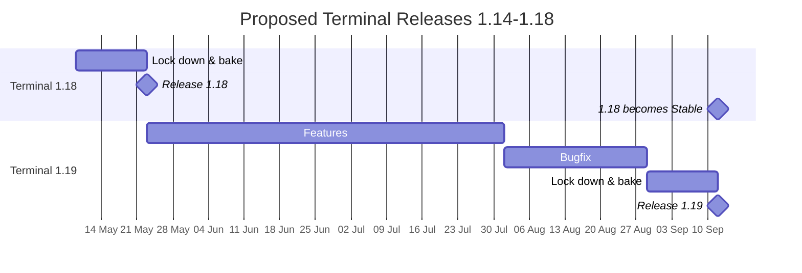

# Terminal 2023 Roadmap

## Overview 

This document outlines the roadmap of features we're planning for the Windows Terminal during 2023. This serves as a successor to the [2022 Roadmap], to reflect changes to our planning going forward.

## Release cadence

We've settled on a roughly quarterly release cycle - about once every three months. In May we released [Terminal 1.18]. We're targeting 1.19 for sometime in late September, and 1.20 likely in early January 2024. (These timelines are rough estimates, not strict rules. For example, 1.18's release was pushed back slightly to better align with Build 2023.)

New features will go into [Windows Terminal Preview](https://aka.ms/terminal-preview) first. Typically, one release after they've been in Preview, those features will move into [Windows Terminal](https://aka.ms/terminal) ("Terminal Stable"). In the case of some more risky or experimental features, we might hold them to only Preview builds for an extended period[^1].

| Quarter | Date       | Release Version | Preview Release Blog Post |
| --------|------------|---------------- | ------------------------- |
| CY23 Q1 | 2023-01-24 | [Terminal 1.17] | [Windows Terminal Preview 1.17 Release] |
| CY23 Q2 | 2023-05-23 | [Terminal 1.18] | [Windows Terminal Preview 1.18 Release] |
| CY23 Q3 |            | [Terminal 1.19] | [Windows Terminal Preview 1.19 Release] |
| CY23 Q4 |            | [Terminal 1.20] | [Windows Terminal Preview 1.20 Release] |

Within a single milestone, we typically reserve the last month as "bake time", to polish off bugfixes and get the release ready to ship. In this last month, we'll likely slow down our ingestion of community PRs just to stabilize what's already in `main`. For example, a given release might look like:

_informative, not normative_

## Up next in the Terminal

### Terminal 1.19

* Canary builds. Nightly builds of the Terminal from `main`. More unstable, but quicker access to experimental features.
* Terminal AI. While this will only be shipping in Canary builds to begin with, the v0 implementation will be available roughly at the same time as 1.19.
* The Suggestions UI. This is the starting point for shell completions [#3121], tasks [#1595], and probably Terminal AI at some point too.
* Unicode input for `cmd.exe` (and any other console app using "cooked reads"). See [#15567]
* Miscellaneous performance improvements. Conhost should be a _lot_ faster now.
* Broadcast input mode, for sending text to multiple panes at once.

## Team member "north stars"

For a more fluid take on what each of the team's personal goals are, head on over to [Core team North Stars]. This has a list of more long-term goals that each team member is working towards, but not things that are necessarily committed work.

[^1]: A conclusive list of these features can be found at [../src/features.xml](../src/features.xml). Note that this is a raw XML doc used to light up specific parts of the codebase, and not something authored for human consumption.

[2022 Roadmap]: ./roadmap-2022.md

[Terminal 1.17]: https://github.com/microsoft/terminal/releases/tag/v1.17.1023
[Terminal 1.18]: https://github.com/microsoft/terminal/releases/tag/v1.18.1462.0
[Windows Terminal Preview 1.17 Release]: https://devblogs.microsoft.com/commandline/windows-terminal-preview-1-17-release/
[Windows Terminal Preview 1.18 Release]: https://devblogs.microsoft.com/commandline/windows-terminal-preview-1-18-release/

[@DHowett]: https://github.com/DHowett
[@zadjii-msft]: https://github.com/zadjii-msft
[@lhecker]: https://github.com/lhecker
[@carlos-zamora]: https://github.com/carlos-zamora
[@PankajBhojwani]: https://github.com/PankajBhojwani

[Core team North Stars]: https://github.com/microsoft/terminal/wiki/Core-team-North-Stars

[#1595]: https://github.com/microsoft/terminal/issues/1595
[#3121]: https://github.com/microsoft/terminal/issues/3121
[#15567]: https://github.com/microsoft/terminal/issues/15567
