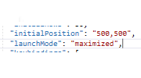

# Set the initial position for terminal

## Abstract

This spec is for task #1043 “Be able to set an initial position for the terminal”. It goes over the details of a new feature that allows users to set the initial position and size of the terminal. Expected behavior and design of this feature is included. Besides, future possible follow-up works are also addressed.

## Inspiration

The idea is to allow users to set the initial position of the Terminal when they launch it, prevent the Terminal from appearing on unexpected position (e.g. outside of the screen bounds). We are also going to let users choose to maximize the window when they launch it.

## Solution Design

For now, the Terminal window is put on a default initial position. The program uses CW_USEDEFAULT in the screen coordinates for top-left corner. We have two different types of window – client window and non-client window. However, code path for window creation (WM_CREATE message is shared by the two types of windows) are almost the same for the two types of windows, except that there are some differences in calculation of the width and height of the window.

Three new properties should be added in the json settings file:

**initialX**: int. This set the initial horizontal position of the top-left corner of the window. This property is optional. If not provided, system default position will be used. 

**initialY**: int. This set the initial vertical position of the top-left corner of the window. This property is optional. If not provided, system default position will be used.

**launchMode**: string. Determine the launch mode. There are two modes for now
                         1. maximize: the window will be maximized when launch.
                         2. default: the window will be initialized with system default size. 

The steps of this process:

1. Set the top-left origin, width and height to CW_USEDEFAULT.
2. Get the dpi of the nearest monitor; Load settings.
3. From settings, find the user-defined initial position and launch mode. 
4. If the user sets custom initial position, calculate the new position considering the current dpi and monitor. If not, use system default value.
5. If the user set launch mode as "maximize", calculate the new height and width. If the user choose "default", use system default size.
6. SetWindowPos with the new position and dimension of the window. 

Step 2 to 6 should be done in `AppHost::_HandleCreateWindow`, which is consistent to the current code.

In step 4, we may need to consider the dpi of the current monitor and multi-monitor scenario when calculating the initial position of the window.

Edge cases:

1. Multiple monitors. The user should be able to set the initial position to any monitors attached. For the monitors on the left side of the major monitor, the initial position values are negative. 
2. If the initial position is larger than the screen resolution and the window top left corner is off-screen, we should let user be able to see and drag the window back on screen. One solution is to set the initial position to the top left corner of the nearest monitor if the top left is off-screen.
3. If the user wants to launch maximized and provides an initial position, we should launch the maximized window on the top left corner of the monitor where the position is located.
4. Launch the Terminal on a monitor with custom dpi. Changing the dpi of the monitor will not affect the initial position of the top left corner. So we do not need to handle this case. 
5. Launch the Terminal on a monitor with custom resolution. Changing the resolution will change the available point for the initial position. (2) already covers this case. 

## UI/UX Design

Upon successful implementation, the user is able to add new properties to the json profile file, which is illustrated in the picture below:

The rest of the UI will be the same of the current Terminal experience, except that the initial position may be different.

## Capabilities

### Accessibility

This feature will not impact accessibility of Windows Terminal.

### Security

This should not introduce any new security issues.

### Reliability

This new feature allows the users to set custom initial position of the Terminal App window, which helps them to avoid embarassing window launch situation such as launching outside the screen bounds. Thus, it improves the reliability.

### Compatibility

This feature won't break existing features of Terminal.

### Performance, Power, and Efficiency

More data reading and calculation will be included in Terminal Launch process, which may inversely influence the launch time. However, the impact is trivial. 

## Potential Issues

1. The dpi of the monitor may impact the initial position even if the json profile settings are the same. We need to consider the dpi of the user's monitor and calculate the initial position in the current screen coordinates. Testing with different monitor dpi are also necessary.

2. We need to consider multi-monitor scenario. If the user has multiple monitors, we must guarantee that the Terminal could be iniitalized as expected. More discussions on what should we do in this scenario with the github community is needed. 

## Future considerations

For now, this feature only allows the user to set initial positon and choose whether to maximize the window when launch. In the future, we may consider follow-up features like:

1. Save the position of the Terminal on exit, and restore the position on the next launch. This could be a true/false feature that users could choose to set.

2. We may need to consider multiple Terminal windows scenario. If the user opens multiple Terminal windows, then we need to consider how to save and restore the position. 

3. We may also consider more launch modes. Like full screen mode and minimized mode. 

Github issue for future follow-ups: https://github.com/microsoft/terminal/issues/766

## Resources

Github issue:
https://github.com/microsoft/terminal/issues/1043
