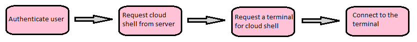
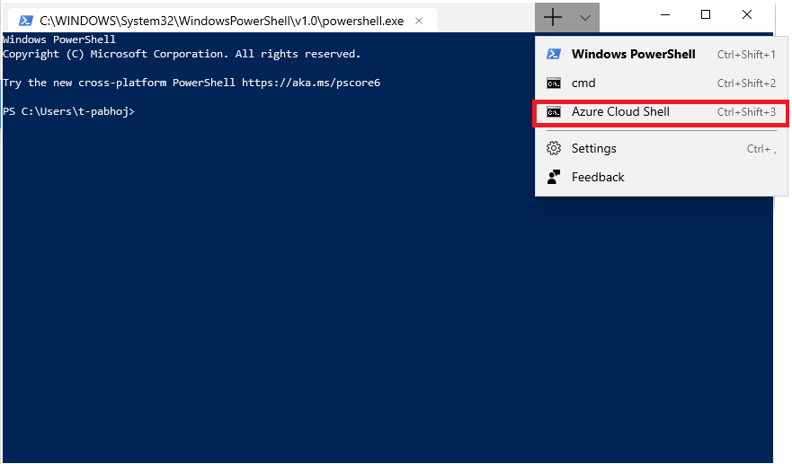

# Azure cloud shell connector

## Abstract

This spec goes over the details of how a feature enabling Windows Terminal users to connect to the Azure cloud shell should behave. It includes implementation and design considerations. 

## Inspiration

The idea is to give developers access to their Azure services smoothly within the Windows Terminal app, letting them engage with Azure technologies in a convenient manner. By integrating the Azure cloud shell into Windows Terminal, we can do just that. 

## Solution Design

The flowchart below shows the process by which the Azure cloud shell will be integrated into Windows Terminal. 

The first three steps - authenticating the user, requesting a cloud shell and requesting a terminal - will be done via http requests. These requests will use the [cpprestsdk](https://github.com/Microsoft/cpprestsdk) library as that library is also owned by Microsoft, making it easy to resolve issues should any arise. 

Authenticating the user will use [device code flow](https://github.com/AzureAD/microsoft-authentication-library-for-dotnet/wiki/Device-Code-Flow) since Windows Terminal does not support browser access (yet). As for the authentication endpoint, Azure AD v1.0 will be used because Azure AD v2.0 (also known as Microsoft Identity Platform) [does not support login to personal accounts with device code flow](https://github.com/AzureAD/microsoft-authentication-library-for-dotnet/wiki/Device-Code-Flow#constraints) at this time. Furthermore, upon successful authentication, the login/token information will be stored so that users will not need to repeatedly go through device code flow for future logins. Since this is sensitive information, the tokens will be stored with [Windows Storage](https://docs.microsoft.com/en-us/uwp/api/windows.storage) and encrypted with [Windows Security Data Protection](https://docs.microsoft.com/en-us/uwp/api/windows.security.cryptography.dataprotection.dataprotectionprovider). 

The last step - connecting to the terminal - will be done via a websocket connection to allow easier communication between the app and the server. 

The entire feature will be implemented in an isolated manner - i.e. it should have little to no dependency on the Windows Terminal app itself. This will allow the feature to become a plugin/extension once Windows Terminal supports plugins. More specifically, the connector will ascribe to the existing ITerminalConnection interface, making this simply another type of connection that Windows Terminal can make. 

## UI/UX Design

Upon successful implementation, a new profile option will appear for users as illustrated in the picture below (the profile will have its own unique icon when implemented).

As for the rest of the UI, the implementation will adopt the user's preferences from the Windows Terminal app. 

## Capabilities

### Accessibility

This feature will not impact accessibility of Windows Terminal. 

### Security

Any feature that connects to a network introduces some security risks. However, with proper usage of Azure AD v1.0 and careful storage of tokens received from the server, these risks will be mitigated. 

### Reliability

This feature will not impact reliability of Windows Terminal. 

### Compatibility

With the implementation being mostly decoupled from the Windows Terminal app itself, no existing code/behaviours should break due to this feature. 

### Performance, Power, and Efficiency

This feature will not impact performance, power or efficiency of Windows Terminal.

## Potential Issues

1. This implementation depends on another open source project, [cpprestsdk](https://github.com/Microsoft/cpprestsdk). Thus, any issues with their code will affect this feature. However, given that cpprestsdk is a Microsoft project, we can expect a level of reliability and also solve issues internally if needed.
2. The proposed authentication endpoint is Azure AD v1.0 instead of Azure AD v2.0 (also known as Microsoft Identity Platform). Azure AD v1.0 is still supported for now, but there is a risk of it becoming deprecated at some point in the future. However, given that it is once again another Microsoft-owned project, we can request support for it through an internal channel. In the worst case, our implementation can switch to Microsoft Identity Platform (which would only requires some minor edits to the http requests). 
3. The Azure cloud shell API is not public, meaning that implementing this feature in an official capacity would require app permissions from the Azure cloud shell team. This brings about another dependency, but once again issues can be resolved through internal Microsoft channels. 

## Future considerations

This could potentially be the first plugin for Windows Terminal once the app allows for plugins/extensions! 

## Resources

* [Azure AD v1.0](https://docs.microsoft.com/en-us/azure/active-directory/develop/v1-overview)
* [cpprestsdk](https://github.com/Microsoft/cpprestsdk)
* [Device code flow](https://github.com/AzureAD/microsoft-authentication-library-for-dotnet/wiki/Device-Code-Flow)
* [Windows Storage](https://docs.microsoft.com/en-us/uwp/api/windows.storage)
* [Windows Security Data Protection](https://docs.microsoft.com/en-us/uwp/api/windows.security.cryptography.dataprotection.dataprotectionprovider)
