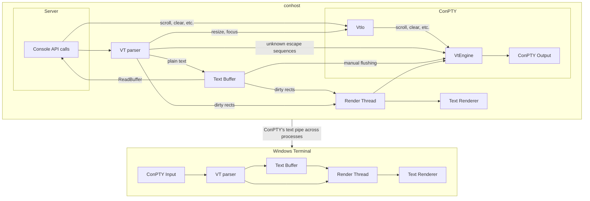
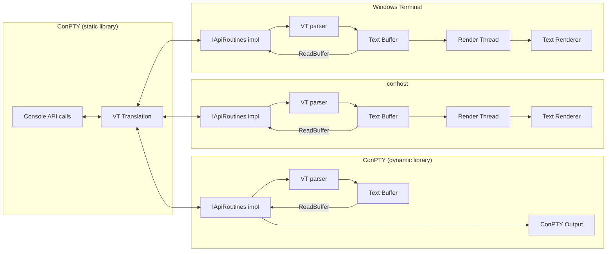
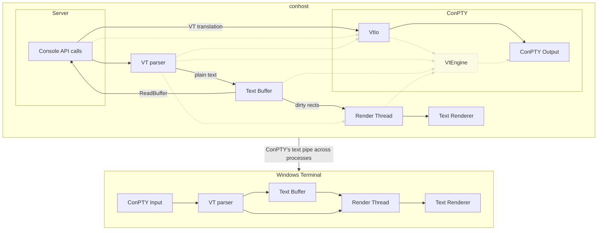
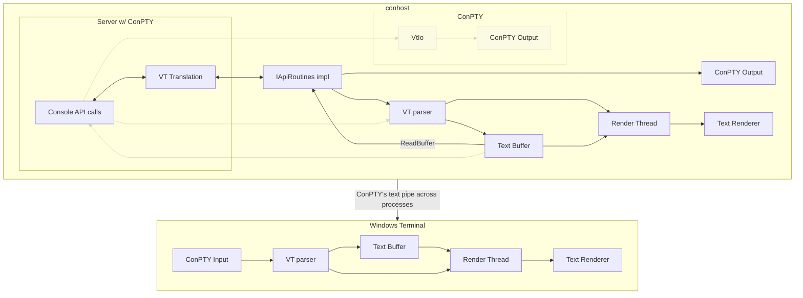
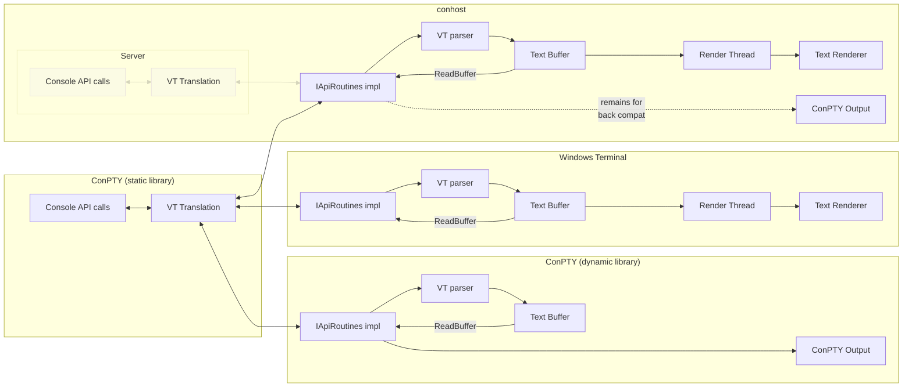

# In-process ConPTY

## tl;dr

**Why?**
* Out-of-process leads to out-of-sync issues.
* Not all Console APIs have a VT equivalent.
* Time consuming maintenance work due to poor encapsulation inside conhost.

**How?**
1. Remove `VtEngine` and translate Console API calls directly to VT.
2. Move all Console API related code from the `Host` to the `Server` project.
   Narrow the `IApiRoutines` interface down to its essentials.
   Replace relevant singletons with instances.
3. Make `Server` a standalone library with `IApiRoutines` as its primary callback interface.
   Integrate the library in Windows Terminal.
4. (Long term goal:) Ship the `Server` library as part of Windows. Build conhost itself on top of it.

## Why?

**Before:**



**After:**



To extend on the [tl;dr](#tldr):
* ConPTY runs outside the hosting terminal which leads to an unsolvable issue: The buffer contents between ConPTY and the terminal can go out of sync.
  * The terminal and ConPTY may implement escape sequences differently.
  * ...may implement text processing differently.
  * ...may implement text reflow (resize) differently.
  * Resizing the terminal and ConPTY is asynchronous and there may be concurrent text output.
  * ...and it may uncover text from the scrollback, which ConPTY doesn't know about.
* Some Console API methods cannot be represented via escape sequences and so ConPTY cannot produce them either.
  The most basic example of this is the lack of LVB gridlines.
* The above suggested new architecture represents a significant simplification with no loss in features.
* ConPTY has fulfilled our needs a thousand times over, but as it's layered on top of conhost it has resulted in software decay.
  The layer boundary has blurred over the years resulting in debugging and maintenance difficulties.
  Lastly, its performance is insufficient and has been subject to much debate.
  It's on us now to pay our debt and clean up the architecture so that ConPTY, conhost, and Windows Terminal can be built on top of it.

Considerations:
* A named `MUTEX` can theoretically solve parts of the out-of-sync issue, because it could be used to synchronize buffer reflow.
  However, this requires the lock to be acquired on every API call, on top of the regular console lock, which raises ABBA deadlock concerns.
  Making this setup not just hopefully but also provably robust, is likely to be very difficult.
  It also doesn't solve any of the other listed problems.

## Goal 1: Remove VtEngine

### Goal



### Goals

* Remove VtEngine
* Remove `--vtmode`
* Remove `--resizeQuirk`
* Add buffering to `VtIo` and hook it up to the output pipe
* Implement direct VT translations for all relevant Console APIs

### Discussion

The idea is that we can translate Console API calls directly to VT at least as well as the current VtEngine setup can.
For instance, a call to `SetConsoleCursorPosition` clearly translates directly to a `CUP` escape sequence.
Effectively, instead of translating output asynchronously in the renderer thread, we'll do it synchronously right during the Console API call.

Apart from the Console APIs, the "cooked read" implementation, which handles our builtin "readline"-like text editor, will need to receive some larger changes as well.
Its popups use `ReadConsoleOutput` and `WriteConsoleOutput` to backup and restore the affected rectangle.
It also directly interfaces with the backing text buffer and its translation to VT relies on the existence of VtEngine.
This results in all of the same issues that were previously outlined.
In order to solve this, the popups need to be rewritten to use escape sequences so that they can be directly passed to the hosting terminal.
They should also always be below the current prompt line so that we don't need to perform a potentially lossy backup/restore operation.

The `--vtmode xterm-ascii` switch exists for the telnet client as it only supports ASCII as per RFC854 section "THE NVT PRINTER AND KEYBOARD".
However, telnet is the only user of this flag and it's trivial to do there (for instance by stripping high codepoints in `WriteOutputToClient` in `telnet/console.cpp`), so there's no reason for us to keep this logic in the new code.

This change will result in a significant reduction in complexity of our architecture.
VT input from the shell or other clients will be given 1:1 to the hosting terminal, which will resolve our ordering and buffering issues.

## Goal 2: Move Console API implementations to Server

### Goal



### Goals

* Move the API implementation from the `Host` to the `Server` project.
* Narrow down the `IApiRoutines` interface to its essentials.
* Replace affected singletons with regular class instances.

### Discussion

The basic idea is that instead of having 3 arrows going in and out of the Server component, we got exactly 1.
This makes the console server and its VT translation a reusable component, which we need so that we can solve the out-of-sync issues by integrating it into Windows Terminal.
To make the Server API convenient to use, the interface needs to be narrowed down to as few methods as possible. This interface is currently called `IApiRoutines`.

### API Design

Design goals:
* Low overhead<br>
  The API should never be the reason why the terminal is slow.
  Among others, the design includes both UTF8 and UTF16 functions, as both encodings are common on Windows and the server component should not make assumptions which one the terminal prefers.
* Easy to use<br>
  The Console API is unfortunately quite powerful.
  In order to make implementing the callback interface still reasonably easy, the API should have as few methods as are needed.
  If a complex Console API call can be expressed as a series of simpler ones, and if no other performance expectations exist, it should be expressed via the simpler ones.
* Works even if only partially implemented<br>
  Example: `CreateConsoleScreenBuffer` is seldomly used, but its existence adds significant complexity to the callback API design and potential implementations.
  A terminal should either be able to return `E_NOTIMPL` and we provide a fallback, or we provide guidance for how reasonable fallbacks can be implemented (e.g. by using the xterm alt buffer in this example).

> [!IMPORTANT]
> The following API design is a rough draft just to convey the general idea.
> It does not represent a complete, finished design.
> This document will be updated once work on the API begins and the actual API requirements become clearer.

```cs
// The Console API is built around a freely addressable frame buffer. It allows you to
// address any part of the buffer, even those outside of what's considered the "viewport":
//
//                       ┌──────────────────┐
//                       │y=-3              │
//                       │                  │    ╮
//                       │                  │    │
//                    ╭  ├──────────────────┤    ├── VT scrollback (partially addressed)
//                    │  │y=0               │    │
//                    │  │                  │  ╮ ╯
//                    │  │                  │  │
//   Console Buffer ──┤  ├──────────────────┤  ├──── VT Viewport (top y = 1)
//                    │  │y=3               │  │
//                    │  │                  │  ╯
//                    │  │                  │
//                    ╰  └──────────────────┘
//
// The good news is that nothing prevents you from giving the Console Buffer the exact
// same size as the VT Viewport and for modern terminals doing so is recommended.
// That way, coordinates are viewport-relative and content below/above the viewport is never addressed:
//
//                       ┌──────────────────┐    ╮
//                       │y=-3              │    │
//                       │                  │    ├── VT scrollback (unused)
//                       │                  │    │
//                    ╭  ├──────────────────┤  ╮ ╯
//                    │  │y=0               │  │
//   Console Buffer ──┤  │                  │  ├──── VT Viewport
//                    │  │                  │  │
//                    ╰  └──────────────────┘  ╯
//
// Coordinates are 0-indexed. Note that while INT32 coordinates are used by this API, coordinates below
// 0 and above 65535 are generally invalid as the Console ABI currently uses unsigned 16-Bit integers.

struct CONSRV_POINT_I32 {
    INT32 x;
    INT32 y;
};

struct CONSRV_POINT_F32 {
    float x;
    float y;
};

// These flags are also defined via Windows.h.
#if 0
// These flags are equivalent to the classic 4-bit indexed colors in VT via SGR.
// However, the position of the blue and red bits are swapped.
#define FOREGROUND_BLUE            0x0001 // Text color contains blue.
#define FOREGROUND_GREEN           0x0002 // Text color contains green.
#define FOREGROUND_RED             0x0004 // Text color contains red.
#define FOREGROUND_INTENSITY       0x0008 // Text color is intensified.
#define BACKGROUND_BLUE            0x0010 // Background color contains blue.
#define BACKGROUND_GREEN           0x0020 // Background color contains green.
#define BACKGROUND_RED             0x0040 // Background color contains red.
#define BACKGROUND_INTENSITY       0x0080 // Background color is intensified.

// These two bits are used to represent wide glyphs.
#define COMMON_LVB_LEADING_BYTE    0x0100 // Leading byte.
#define COMMON_LVB_TRAILING_BYTE   0x0200 // Trailing byte.

// This bit is equivalent to the "CSI 7 m" reverse video escape sequence.
#define COMMON_LVB_REVERSE_VIDEO   0x4000 // Reverse foreground and background attribute.

// NOTE: These flags have no equivalent in VT. COMMON_LVB_UNDERSCORE in particular is not the same as a
// "CSI 4 m" underline in VT, despite the name. They're used to give a cell border (= grid) lines.
#define COMMON_LVB_GRID_HORIZONTAL 0x0400 // Top horizontal.
#define COMMON_LVB_GRID_LVERTICAL  0x0800 // Left vertical.
#define COMMON_LVB_GRID_RVERTICAL  0x1000 // Right vertical.
#define COMMON_LVB_UNDERSCORE      0x8000 // Underscore.
#endif

// This struct is binary compatible to the CHAR_INFO struct from the Windows API and functionally equivalent.
//
// The following rules MUST be followed:
// * Each instance represents 1 column in the terminal.
// * Any cells that aren't representable with a single UCS-2 character, or are wider than 2 columns,
//   must be replaced with U+FFFD. Grapheme clusters, surrogate pairs, and similar, are not allowed.
//   Keep in mind that U+FFFD is a narrow character. It does not get the wide wide-glyph treatment below.
// * Colors that cannot be represented via the `attributes` flags can be replaced with an approximation.
//   Alternatively, `FOREGROUND_BLUE | FOREGROUND_GREEN | FOREGROUND_RED` can be used (no `BACKGROUND` bit set).
// * If a wide glyph (2 columns wide) is encountered, the following applies:
//   * Create 2 consecutive CONSRV_CHAR_INFO instances (as per the first rule).
//   * Repeat the same `character` in both instances, even if it's U+FFFD.
//   * Assign the first instance an `attributes` flag of `COMMON_LVB_LEADING_BYTE`
//     and the second one `COMMON_LVB_TRAILING_BYTE`.
//   * BUT if the request for a CONSRV_CHAR_INFO only partially intersects a wide glyph, replace the character
//     (and only the character) with U+0020 whitespace. This also means that `COMMON_LVB_LEADING/TRAILING_BYTE`
//     should not be set, because the returned character isn't wide anymore. An example:
//     If you have a red "猫" on top of a blue background in the buffer and a single `CONSRV_CHAR_INFO` is requested
//     for the left half of the glyph, then you should set `character` to whitespace and `attributes` to
//     `FOREGROUND_RED | BACKGROUND_BLUE`. Debug builds of ConPTY will assert that you do this.
//
// For more documentation about the `attributes` flags, see the constants defined above.
struct CONSRV_CHAR_INFO {
    wchar_t character;
    UINT16 attributes;
};

struct CONSRV_UTF8_STRING {
    [size_is(length)] const char* data;
    DWORD length;
};

struct CONSRV_UTF16_STRING {
    [size_is(length)] const wchar_t* data;
    DWORD length;
};

// NOTE: At the time of writing the required fields are not fully known.
// NOTE: boolean is 8 Bits large.
struct CONSRV_INFO {
    // NOTE: msys2 relies on the HWND value to uniquely identify terminal sessions.
    // If we were to hand out the multiplexed terminal window HWND to msys2, it will break. Either we need to
    // create fake windows inside conhost (very bad & buggy) or break msys2 intentionally (also very bad).
    HWND window;
    CONSRV_UTF16_STRING originalWindowTitle;
    CONSRV_UTF16_STRING windowTitle;

    CONSRV_POINT_I32 bufferSizeInCells;
    CONSRV_POINT_I32 cursorPositionInCells;
    CONSRV_POINT_I32 viewPositionInCells;
    CONSRV_POINT_I32 viewSizeInCells;
    CONSRV_POINT_F32 cellSizeInDIP;
    COLORREF colorTable[16];

    CONSRV_POINT_I32 selectionStart;
    CONSRV_POINT_I32 selectionEnd;
    boolean selectionActive;
    boolean selectionRectangular;
    boolean selectionMouseDown;

    float cursorHeight;
    boolean cursorHidden;
};

// Any item that has changed relative to the current CONSRV_INFO will be set to a non-null pointer.
// In other words, members that are null represent those that remain unchanged.
//
// If the request cannot be supported return E_INVALIDARG. For instance, you may choose to
// do so if you receive a `bufferSizeInCells` change while the xterm alt buffer is active.
//
// NOTE: At the time of writing the required fields are not fully known.
struct CONSRV_INFO_CHANGE {
    CONSRV_POINT_I32* bufferSizeInCells;
    CONSRV_POINT_I32* cursorPositionInCells;
    CONSRV_POINT_I32* viewPositionInCells;
    CONSRV_POINT_I32* viewSizeInCells;
    COLORREF* colorTable; // The referenced array is always 16 items large.

    float* cursorHeight;
    boolean* cursorHidden;

    CONSRV_UTF16_STRING* fontName;
    UINT32* fontFamily;
    UINT32* fontWeight;
    CONSRV_POINT_I32* fontSize;
};

interface IConsoleServer : IUnknown {
    // TODO: This interface is incomplete. Among others, a way to launch new application into the server is missing.

    // ConPTY manages stdin as a ring buffer for you. When the terminal has focus, you simply need to write your input.
    // Keyboard input MUST be written via `WriteInputRecords`. The other 2 functions DO NOT parse any VT sequences.
    // They're instead meant either for VT responses (DECRPM, etc.) and for dumping plain text (clipboard, etc.).
    void WriteInputRecords([in] DWORD count, [in, length_is(count)] const INPUT_RECORD* records);
    void WriteInputUTF8([in] CONSRV_UTF8_STRING text);
    void WriteInputUTF16([in] CONSRV_UTF16_STRING text);
};

// First of all: You don't need to implement all functions and all structs perfectly for ConPTY to work decently well.
// For instance, if you don't implement `CONSRV_INFO::cursorHeight` properly, barely anything will happen.
interface IConsoleServerCallback : IUnknown {
    // The console server is single-threaded and no two calls will be made simultaneously. These two functions
    // simply allow you to synchronize the calls down below if your application is multi-threaded.
    //
    // Lock() will always be called before any of the functions below are called.
    // Lock() and Unlock() do not need to support recursive locking.
    // Any other calls between Lock() and Unlock() should be treated as an atomic operation.
    //
    // It is recommended to use a fair lock instead of OS primitives like SRWLOCK. These callback functions may be
    // much more often than your text renderer, etc., runs. An unfair lock will result in thread starvation.
    HRESULT Lock();
    HRESULT Unlock();

    // If called, you're requested to create a new console alt buffer. The Console API supports having
    // multiple concurrent such buffers. They're not the same as the xterm alt buffer, however (CSI ? 1049 h):
    // They can be resized to be larger than the current viewport and switching between such buffers DOES NOT
    // clear them nor does it reset any other per-buffer state.
    //
    // If you have trouble adding support for multiple console alt buffers, consider using the xterm alt buffer
    // (CSI ? 1049 h) for the first buffer that gets created, and return E_OUTOFMEMORY for any further buffers.
    HRESULT CreateBuffer([out] void** buffer);

    // ReleaseBuffer is called once the buffer isn't needed anymore. It's guaranteed to be called and it's guaranteed
    // to be called after ActivateBuffer() was used to switch to another buffer (or the main buffer).
    HRESULT ReleaseBuffer([in] void* buffer);

    // This switches between different console alt buffers. Switching to a buffer should change the content that's
    // being shown, similar to the xterm alt buffer, however unlike it doing so DOES NOT reset any per-buffer state.
    // All it does is to basically swap out the underlying, active text buffer of the terminal.
    //
    // If `buffer` is NULL it's a request to switch back to the main buffer.
    //
    // `temporary` is a hint. If it's `true` it indicates that the previous buffer will soon be activated again.
    // In other words, on Unlock() the buffer was active during Lock() will be active again.
    // It's recommended that temporary switches are lightweight as they may occur relatively often.
    HRESULT ActivateBuffer([in] void* buffer, [in] boolean temporary);

    //
    // Any functions past this point operate on the currently active buffer.
    //

    // This function gets a snapshot of the terminal and buffer state.
    //
    // You must ensure that the returned pointer stays valid until the next GetInfo() or Unlock() call,
    //   or until the currently active buffer is released.
    // You don't need to return a new instance on each call. ConPTY will only use the last returned pointer.
    // You don't need to keep the CONSRV_INFO struct constantly up to date, but you're allowed to do so.
    //   For instance, it's valid to change the `.cursorPosition` when SetCursorPosition() is called.
    //
    // It's recommended that this function is lightweight as it may be called relatively often.
    const CONSRV_INFO* GetInfo();

    // When this method is called you're asked to apply any non-null member of the given CONSRV_INFO_CHANGE struct
    // to the active buffer. For instance a non-null `.cursorPosition` is identical to calling `SetCursorPosition`,
    // a non-null `.bufferSize` is a request to resize the terminal, and so on.
    HRESULT SetInfo([in] const CONSRV_INFO_CHANGE* info);

    // As explained in the CONSRV_POINT_I32 documentation, ConPTY coordinates may be outside of the VT viewport.
    // This function is necessary in order to support this. If you assign the console buffer the same size
    // as the VT viewport, `pos` can be translated to VT using
    //   printf("\x1b[%d;%dC", pos.y + 1, pos.x + 1);
    HRESULT SetCursorPosition([in] CONSRV_POINT_I32 pos);

    // The Console API supports 4 gridline attributes which cannot be translated to VT.
    // This function is necessary to represent those. If you don't plan to support the gridlines,
    // you can translate the attributes to VT with the following code or some equivalent:
    //   static const uint8_t lut[] = { 30, 34, 32, 36, 31, 35, 33, 37, 90, 94, 92, 96, 91, 95, 93, 97 };
    //   const auto fg = lut[attributes & 0xf];
    //   const auto bg = lut[(attributes >> 4) & 0xf] + 10;
    //   printf("\x1b[%d;%dm", fg, bg);
    //
    // `attributes` of exactly `FOREGROUND_BLUE | FOREGROUND_GREEN | FOREGROUND_RED` are often used to indicate the
    // default colors in Windows Console applications, and so you may choose to translate attributes like that as:
    //   printf("\x1b[39;49");
    //
    // You may also choose to support COMMON_LVB_REVERSE_VIDEO, which translates to:
    //   printf("\x1b[7m");
    HRESULT SetCurrentAttributes([in] UINT16 attributes);

    // Starting from column `pos.x` in row `pos.y`, this reads `count`-many characters and attributes.
    // `pos` and `count` will be clamped such that reads never extend outside of the `CONSRV_INFO::bufferSize`.
    //
    // However, it may still read cells that have never been written to (for instance below the current viewport!).
    // Such reads should not fail. Simply fill the `infos` array with whitespaces and a default attribute of your chosing,
    // but `FOREGROUND_BLUE | FOREGROUND_GREEN | FOREGROUND_RED` is recommended (no other bits set).
    //
    // NOTE that this API should ignore any line renditions (DECDWL, DECDHL), margins (DECSLRM, ...), etc.
    // Reading outside of the "valid" range for a given row should behave exactly like reading below the viewport,
    // as described in the previous paragraph.
    HRESULT ReadBuffer([in] CONSRV_POINT_I32 pos, [in] INT32 count, [out, length_is(count)] CONSRV_CHAR_INFO* infos);

    // These two functions are used to layout text for the internal "GNU Readline"-like implementation.
    // `text`        is the string to operate on. As with any other method, input validation should be performed.
    //               It's preferred to pretend as if invalid codepoints (in particular invalid surrogate pairs)
    //               are U+FFFD, because this provides the user with some level of text editing capability.
    //               The alternative is to have none at all when facing invalid strings which is strictly worse.
    // `maxClusters` is the maximum amount of "cursor movements" these functions should apply
    //               (like when pressing the left/right arrow buttons).
    // `maxColumns`  is the maximum amount of columns the functions may iterate over. When the text is "a猫" and
    //               `maxColumns` is 2, then the result should be "a", because "猫" doesn't fit anymore.
    // `position`    on input contains the current position of the cursor inside `text`, counted in characters from the
    //               start of the `text`. On output it's supposed to contain the new cursor position.
    //               `position` may be out of bounds and you should clamp it to a valid range first.
    // `columns`     on output should contain the number of columns that have been iterated over.
    //
    // The idea is that a `maxClusters = 1` and `maxColumns = inf` can be used to implement left/right cursor movement,
    // while `maxClusters = inf` and `maxColumns = window width` can be used to layout text within the window.
    //
    // You don't need to handle escape characters. These functions will never be called with any present.
    // For robustness against bugs it's however recommended to handle them anyway, in whatever way you wish.
    // If you have no preference, it's recommended to treat them as zero-width characters.
    HRESULT MeasureTextForward([in] CONSRV_UTF16_STRING text, [in] DWORD maxClusters, [in] DWORD maxColumns, [in, out] DWORD* position, [out] DWORD* columns);
    HRESULT MeasureTextBackward([in] CONSRV_UTF16_STRING text, [in] DWORD maxClusters, [in] DWORD maxColumns, [in, out] DWORD* position, [out] DWORD* columns);

    // UTF8 and UTF16 are both widely used text encodings on Windows and it's recommended that both
    // functions are reasonably fast. ConPTY will translate all non-Unicode text to UTF16 for you.
    // You must validate incoming text. It's recommended to replace invalid codepoints with U+FFFD.
    // You don't need to check for broken up codepoints at the start/end of the text, as ConPTY will handle that for you.
    HRESULT WriteUTF8([in] boolean raw, [in] CONSRV_UTF8_STRING text);
    HRESULT WriteUTF16([in] boolean raw, [in] CONSRV_UTF16_STRING text);
};
```

The list shows how each Console API function is implemented in terms of the above interface.
* Aliases
  <br>Fully implemented inside the server component without API.
  * `AddConsoleAlias`
  * `GetConsoleAlias`
  * `GetConsoleAliases`
  * `GetConsoleAliasesLength`
  * `GetConsoleAliasExes`
  * `GetConsoleAliasExesLength`
* History
  <br>Fully implemented inside the server component without API.
  * `ExpungeConsoleCommandHistory`
  * `GetConsoleCommandHistory`
  * `GetConsoleCommandHistoryLength`
  * `GetConsoleHistoryInfo`
  * `SetConsoleHistoryInfo`
  * `SetConsoleNumberOfCommands`
* stdin
  <br>Fully implemented inside the server component without API.
  * `FlushConsoleInputBuffer`
  * `GetConsoleInput`
  * `GetConsoleInputCodePage`
  * `GetConsoleInputMode`
  * `GetNumberOfConsoleInputEvents`
  * `ReadConsole`
  * `SetConsoleInputCodePage`
  * `SetConsoleInputMode`
  * `WriteConsoleInput`
* Unsupported since conhost v1
  * `GetConsoleDisplayMode`
  * `GetConsoleLangId`
  * `SetConsoleDisplayMode`
* Buffer management
  * `GetConsoleScreenBufferInfoEx`:
    Gets information from server's internal `SCREEN_INFORMATION` class (which represents the `HANDLE`).
  * `SetConsoleScreenBufferInfoEx`:
    Sets information on server's internal `SCREEN_INFORMATION` class.
  * `CreateConsoleScreenBuffer`:
    `CreateBuffer`
  * `SetConsoleActiveScreenBuffer`:
    `ActivateBuffer` + `SetInfo`
  * `SetConsoleScreenBufferSize`:
    `SetInfo`
* Cursor
  * `GetConsoleCursorInfo`:
    `GetInfo`
  * `SetConsoleCursorInfo`:
    `SetInfo`
  * `SetConsoleCursorPosition`:
    `GetInfo`
* Fonts
  * `GetConsoleFontSize`:
    `GetInfo`
  * `GetCurrentConsoleFontEx`:
    `GetInfo`
  * `SetCurrentConsoleFontEx`:
    `SetInfo`
* Window management
  * `GetConsoleOriginalTitle`:
    `GetInfo`
  * `GetConsoleSelectionInfo`:
    `GetInfo`
  * `GetConsoleTitle`:
    `GetInfo`
  * `GetConsoleWindow`:
    `GetInfo`
  * `GetLargestConsoleWindowSize`:
    `GetInfo`; The window frame size can be inferred from the difference between the `GetWindowRect(hwnd)` and the `viewSizeInCells * cellSizeInDIP`.
    The max. cell count can then be calculated by getting the `MonitorFromWindow(hwnd)` size, subtracting the frame size and calculating the cell count.
  * `GetNumberOfConsoleMouseButtons`:
    Implemented inside the server component via `GetSystemMetrics(SM_CMOUSEBUTTONS)`
  * `SetConsoleTitle`:
    `SetInfo`
  * `SetConsoleWindowInfo`:
    `SetInfo`
* stdout (writing)
  * `FillConsoleOutputAttribute`:
    Set the new attributes with `SetCurrentAttributes`.
    For each line, get the existing contents with `ReadBuffer`, `SetCursorPosition` to the start, concatenate the cells and write them with `WriteUTF16`.
  * `FillConsoleOutputCharacter`:
    For each line, get the existing contents with `ReadBuffer`, `SetCursorPosition` to the start, concatenate the cells and write them with `WriteUTF16`.
    At the start of each line and every time the attributes change use `SetCurrentAttributes` to set them up.
  * `GetConsoleOutputCodePage`:
    Implemented inside the server component.
  * `GetConsoleOutputMode`:
    Implemented inside the server component.
  * `ScrollConsoleScreenBuffer`:
    **TODO**: It may be necessary to add a `ScrollBuffer` API to make vertical scrolling across the entire buffer width faster. This fast pass currently exists as well.
    Otherwise, this will be translated to: Read all lines in the source rectangle with `ReadBuffer`.
    Then refer to the `WriteConsoleOutput` implementation for writing it to the target.
  * `SetConsoleOutputCodePage`:
    Implemented inside the server component.
  * `SetConsoleOutputMode`:
    Implemented inside the server component.
  * `SetConsoleTextAttribute`:
    `SetCurrentAttributes`
  * `WriteConsole`:
    `WriteUTF8` if `CP_UTF8` is active and otherwise `WriteUTF16`.
  * `WriteConsoleOutput`:
    For each line, `SetCursorPosition` to the start, concatenate the cells and write them with `WriteUTF16`.
    At the start of each line and every time the attributes change use `SetCurrentAttributes` to set them up.
  * `WriteConsoleOutputAttribute`:
    Same as `FillConsoleOutputAttribute`, but with varying attributes.
  * `WriteConsoleOutputCharacter`:
    Same as `FillConsoleOutputCharacter`, but with varying characters.
* stdout (reading)
  <br>Each of these will be translated to a series of `ReadBuffer` calls, one for each line.
  * `ReadConsoleOutput`
  * `ReadConsoleOutputAttribute`
  * `ReadConsoleOutputCharacter`

## Goal 3: Productize Server

### Goal



After creating an _internal_ API in conhost, the next logical step is for us to extract the interface as a public one and consume it in Windows Terminal.
At this point we should also see if we can find early adopters of the API in other projects.

## Stretch Goal 4: Ship Server in Windows

The console server on Windows has been an internal ABI for the longest time.
As we have started shipping ConPTY bundled with conhost/OpenConsole to other projects, the internal ABI has become a public one.
While we have no intention of ever breaking forward compatability of the console server with future Windows versions, it would be reassuring if the ABI long-term became internal once more.
This will allow us complete freedom over its design, even in the decades to come, and allow us to fully shim any 3rd party applications on Windows if a ABI change were to ever happen.
