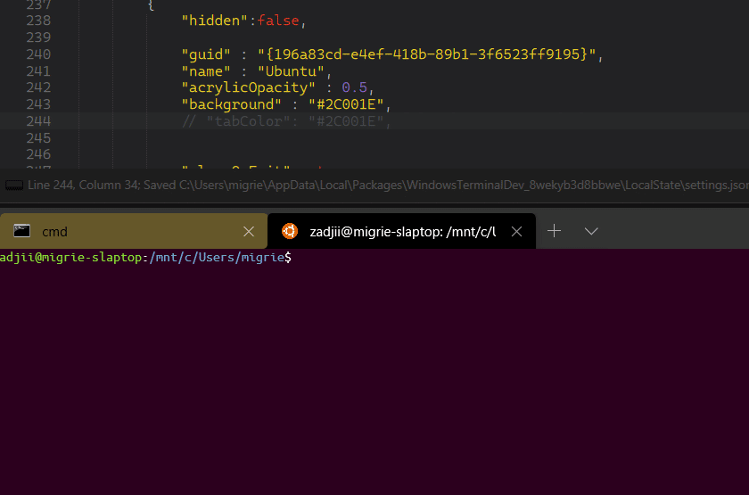

# Per-Profile Tab Colors

## Abstract

This spec describes a way to specify tab colors in a profile in a way that will
be forward compatible with theming the Terminal. This spec will be largely
dedicated to the design of a single setting, but within the context of theming.

## Inspiration

Following the addition of the Tab Color Picker in [#3789], we've had numerous
requests for the ability to set the color of a tab directly within a profile.
While largely we're tracking theming in [#3327], including the specification of
a tab color, the theming spec ([#5772] )is very large and will take a while to
revise and approve. This spec is intended to pull a single point out from that
spec to make it more easily reviewable, and implement it in a way that will
continue working when we add support for themes in the future.

## Solution Design

To enable per-profile tab colors, we'll add a single setting: `tabColor`. For
now[[1](#user-content-footnote-1)], this setting will accept any
`#rrggbb` color string.

Since each profile creates a `Pane` with a `TermControl`, we'll need to store
this color not in the `Tab`, but somewhere below `Pane`, so that when you switch
between Panes in a tab with different `tabColor`s, the color will update
automatically. When a new `TermControl` is created, we'll store this color in the
`TermControl`'s `Terminal` core. This is to support the future possibility of
setting the tab color via VT sequences.

A Tab's color will be the result of layering a variety of sources, from the bottom up:

Color | | Set by
-- | -- | --
Runtime Color | _optional_ |Color Picker / `setTabColor` action
Control Tab Color | _optional_ | Profile's `tabColor`, or a color set by VT
Theme Tab Background | _optional_ | `tab.backgroundColor` in the theme
Tab Default Color | **default** | TabView in XAML

Some examples:
* **Scenario 1**: The user has set `"tabColor": "#ff0000"` in their profile.
  When they create tabs with that profile, instead of appearing in the default
  color for the TabView, they'll be `#ff0000`.
* **Scenario 2**: The user has set `"tabColor": "#ff0000"` in their profile.
  When they try to set the color for that tab (with the color picker) to
  `#0000ff`, the tab's color is updated to reflect this new blue color. When
  they clear the runtime color (with the color picker), the tab will return to
  `#ff0000`.
* **Scenario 3**: The user has two profiles with colors set, one to `"tabColor":
  "#ff0000"`, and the other with `"tabColor": "#00ff00"`. If they open these
  profiles in two panes side-by side, the tab's color will update to reflect the
  color from the currently-focused control.
* **Scenario 4**: The user has two profiles with colors set, one to `"tabColor":
  "#ff0000"`, and the other with `"tabColor": "#00ff00"`. If they open these
  profiles in two panes side-by side, and try to set the color for that tab
  (with the color picker) to `#0000ff`, the tab's color is updated to reflect
  this new blue color. Regardless of which pane is focused, the tab will be
  blue.
* **Scenario 5**: The user has set `"tabColor": "#ff0000"` in their profile
  ("Profile A"), and `"tab.backgroundColor": "#00ff00"`in their theme. When they
  create tabs with "Profile A", the tabs will appear red. Other tabs (for
  profiles without `tabColor` set) will appear green, using the color from the
  theme.

## UI/UX Design

In general, this is going to look exactly like the colored tabs look now.

## Capabilities

<table>
<tr>
<td><strong>Accessibility</strong></td>
<td>
N/A
</td>
</tr>
<tr>
<td><strong>Security</strong></td>
<td>
N/A
</td>
</tr>
<tr>
<td><strong>Reliability</strong></td>
<td>
No expected change
</td>
</tr>
<tr>
<td><strong>Compatibility</strong></td>
<td>
This entire spec outlines how this feature is designed with a emphasis on future
compatibility. As such, there are no expected regressions in the future when we
do add support for themes.
</td>
</tr>
<tr>
<td><strong>Performance, Power, and Efficiency</strong></td>
<td>
No expected change
</td>
</tr>
</table>

## Potential Issues

None expected.

## Footnotes

<a id="footnote-1"><a>[1]: When full theming support is added, themes will
provide support for setting colors as one of a variety of values:

  * An `#rrggbb` string
  * The system accent color
  * The current background color of the Terminal
  * A value from a given resource key from XAML

When support for these other types of "smart" colors is added, then the profile
`tabColor` setting will also gracefully accept these values.

## Future considerations

* It's not out of the realm of possibility that someone might want to color each
  _pane_'s color at runtime. In that case, the runtime color would be stored in
  the `Pane`, not the `Tab`.

<!-- Footnotes -->

[#1337]: https://github.com/microsoft/terminal/issues/1337
[#3789]: https://github.com/microsoft/terminal/issues/3789
[#3327]: https://github.com/microsoft/terminal/issues/3327
[#5772]: https://github.com/microsoft/terminal/pull/5772
