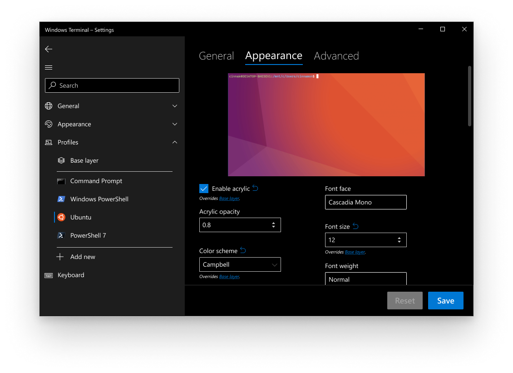

# Cascading Settings

## Abstract

Windows Terminal's settings model adheres to a cascading settings architecture. This allows a settings object to be defined incrementally across multiple layers of declarations. The value for any global setting like `copyOnSelect`, for example, is set to your settings.json value if one is defined, otherwise defaults.json, and otherwise a system set value. Profiles in particular are more complicated in that they must also take into account the values in `profiles.defaults` and dynamic profile generators.

This spec explores how to represent this feature in the Settings UI.

## Inspiration

Cascading settings (and `profiles.defaults` by extension) provides some major benefits:
1. opt-in behavior for settings values provided in-box (i.e. reset to default)
2. easy way to apply a setting to all your Profiles
3. (future feature) simple way to base a Profile off of another Profile

The following terminal emulators approach this issue as follows.
| Terminal Emulator(s) | Relevant Features/Approach |
|--|--|
| ConEmu, Cmder | "Clone" a separate Profile |
| Fluent Terminal | "Restore Defaults" button on each page |
| iTerm2 | "Bulk Copy from Selected Profile..." and "Duplicate Profile" |

Other Settings UIs have approached this issue as follows:
| Project | Relevant Approach |
|--|--|
| Visual Studio | Present a dropdown with your options. An extra "\<inherit\>" option is shown to inherit a value from another place. |

## Solution Design

The XAML implementation will consist of introducing a `ContentControl` for each setting. The `ContentControl` simply wraps the XAML control used for a setting, then adds the chosen UI approach below.

The `ContentControl` will take advantage of the following TerminalSettingsModel APIs for each setting:
```c++
// Note: String and "Name" are replaced for each setting
bool HasName();
void ClearName();
String Name();
void Name(String val);
```

## UI/UX Design Proposals

### Full Parity with JSON

One path we could take is to ensure everything you can do in the JSON file, you can do inside the Settings UI. Below are some options to ensure full parity with JSON.

#### 1: Text under a setting control

Each setting inside a profile's page will have text underneath its control. This text will either say that it overrides the setting from Global or that it inherits the setting from Global.



**Pros**

- You can read where a setting is coming from.
- The Global page is linked, to allow for easy navigation.
- There's a reset button.

**Cons**

- Adds a lot of text to the screen.

**Pitfalls**

- What happens if a setting is inherited from defaults.json? Does the user have to navigate to Global to see that those settings are inherited from defaults.json?

#### 2: \<inherit\> option

Each setting is an Editable ComboBox (except for boolean and enumerable settings). For booleans, the items will be Enabled and Disabled in a regular ComboBox. Enumerable settings will have their options listed in a regular ComboBox. For integers, most commonly used numbers will be listed.


**Pros**

- Doesn't clutter the screen.

**Cons**

- Every setting is a dropdown.

**Pitfalls**

- How will color pickers work with this scenario?

**Other considerations**

Each dropdown has either "inherit" or "custom". If the user selects "custom", the original control will appear (i.e. a color picker for colors or a number picker for integers).

This option was not chosen because it added too much overhead for changing a setting. For example, if you wanted to enable acrylic, you'd have to click the dropdown, select custom, watch the checkbox appear, and then select the checkbox.

#### 3: Lock Button

Every setting will have a lock button next to it. If the lock is locked, that means the setting is being inherited from Global, and the control is disabled. If the user wants to edit the setting, they can click the lock, which will changed it to the unlocked lock icon, and the control will become enabled.


**Pros**

- Least amount of clutter on the screen while still keeping the original controls

**Cons**

- The lock concept is slightly confusing. Some may assume locking the setting means that it *won't* be inherited from Global and that it's "locked" to the profile. This is the opposite case for its current design. However, flipping the logic of the locks wouldn't make sense with an unlocked lock and a disabled control.

### Partial Parity with JSON

#### Add New --> Duplicate/Clone/Copy Profile

#### Reset Profile button

#### "Apply to all profiles" button

## Capabilities

[comment]: # Discuss how the proposed fixes/features impact the following key considerations:

### Accessibility

[comment]: # How will the proposed change impact accessibility for users of screen readers, assistive input devices, etc.

### Security

[comment]: # How will the proposed change impact security?

### Reliability

[comment]: # Will the proposed change improve reliability? If not, why make the change?

### Compatibility

[comment]: # Will the proposed change break existing code/behaviors? If so, how, and is the breaking change "worth it"?

### Performance, Power, and Efficiency

## Potential Issues

[comment]: # What are some of the things that might cause problems with the fixes/features proposed? Consider how the user might be negatively impacted.

## Future considerations

[comment]: # What are some of the things that the fixes/features might unlock in the future? Does the implementation of this spec enable scenarios?

## Resources

[comment]: # Be sure to add links to references, resources, footnotes, etc.
