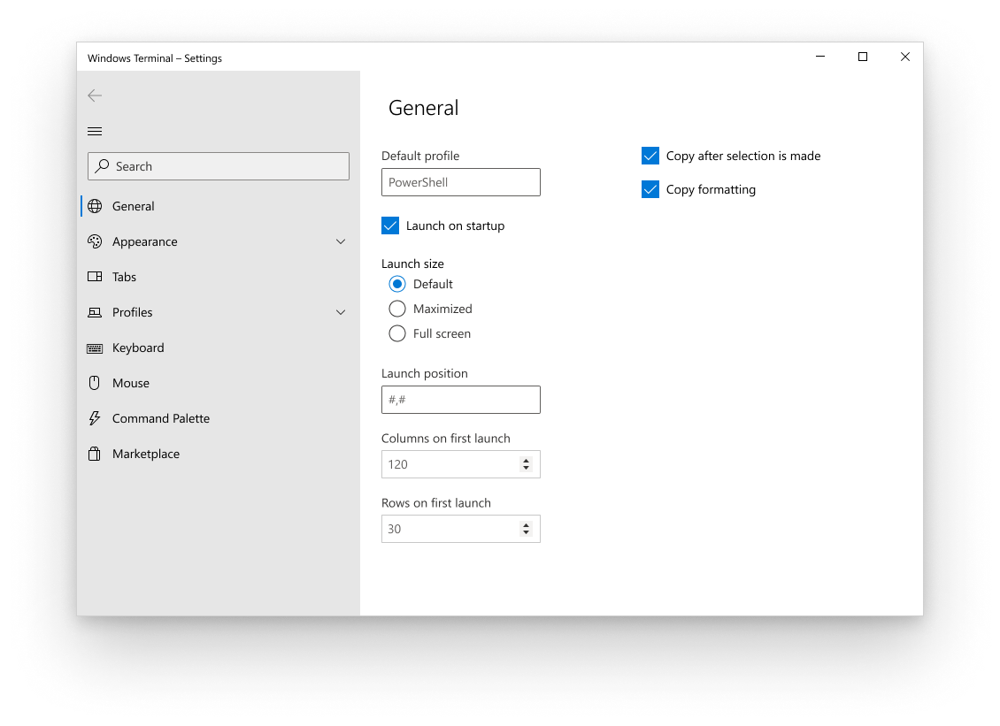
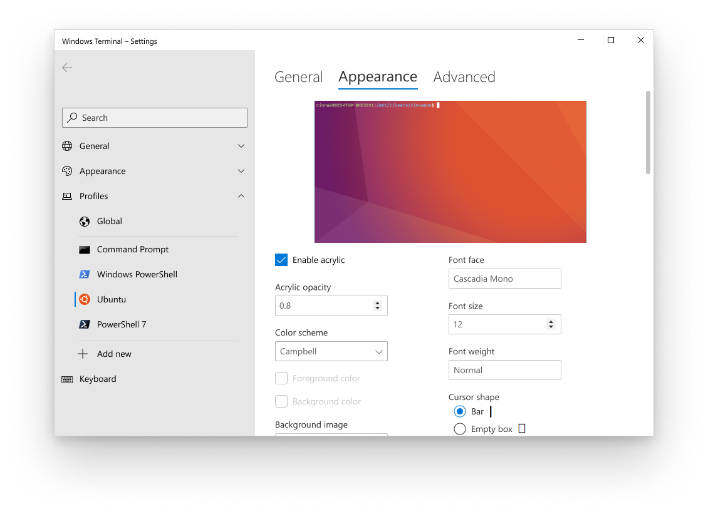
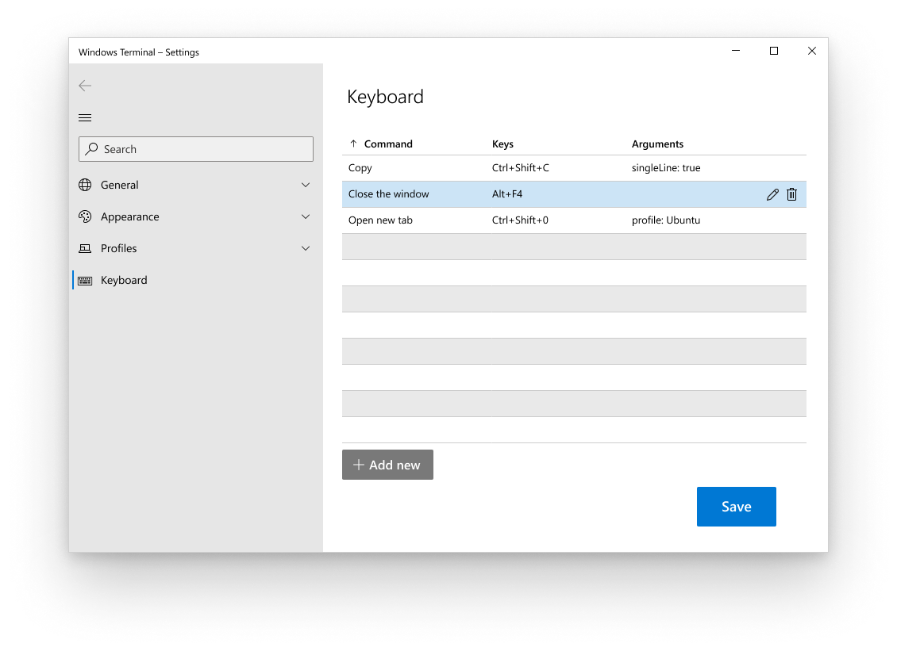
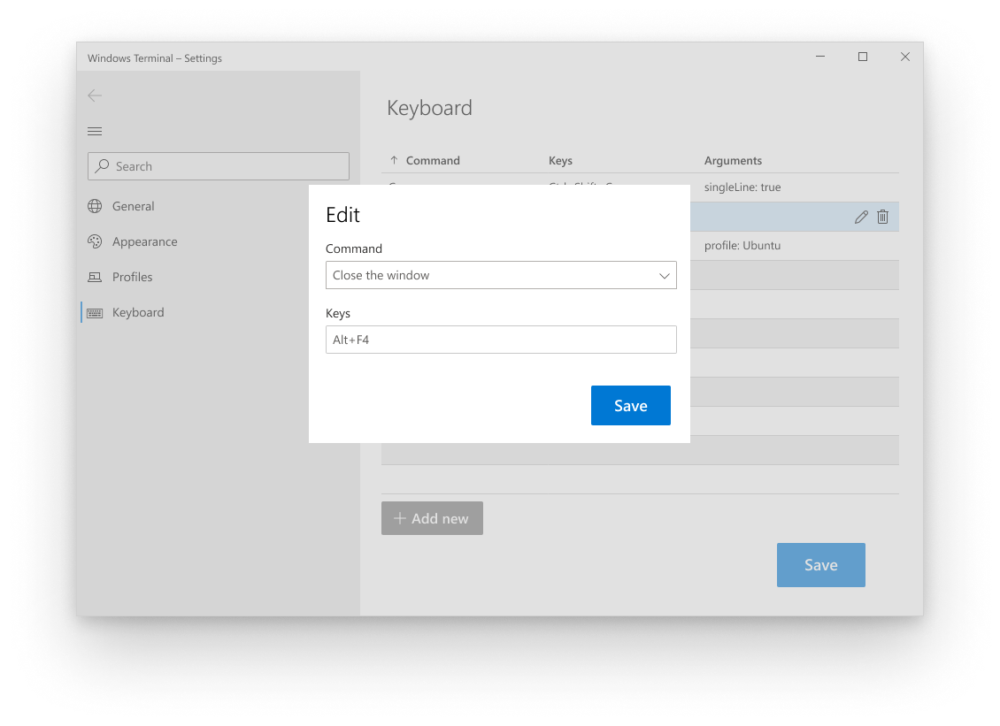
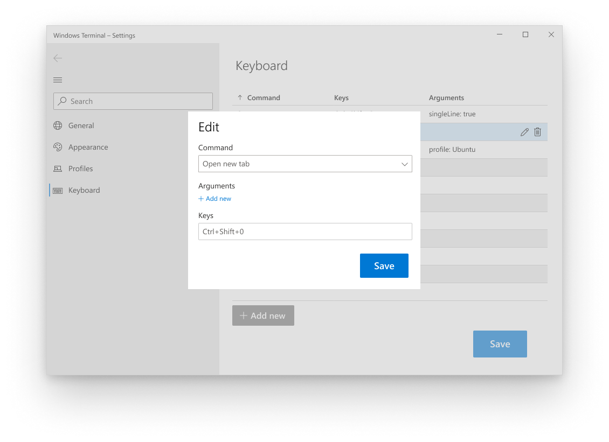
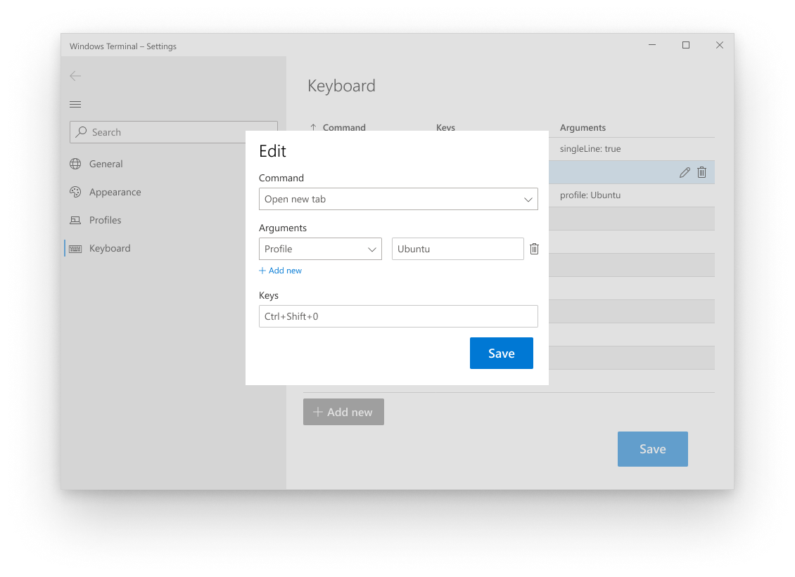

# Settings UI Design

## Abstract

This design document describes how each page of the settings UI will be laid out along with design mockups to display how the UI will appear. The mock ups are for appearance purposes and some layouts and naming may be different in this doc. This doc should be considered the final say.

## UI Design

### Overall navigation with Startup page

This is the list of the top-level navigation items that will appear on the left nav bar:

- General
    - Startup
    - Interaction
    - Rendering
- Appearance
    - Global
    - Color schemes
    - Themes*
- Profiles
    - Defaults
    - Enumerate profiles
    - Add new
- Keyboard
- Mouse*
- Command Palette*
- Marketplace*

\* Themes, mouse, command palette, and marketplace will be added once they're implemented.

### Profile appearance page

This page requires special design because it includes the TerminalControl window to preview appearance changes. This preview window will appear on the following pages:

- Appearance - Color Schemes
- Profiles - Appearance

### Keyboard page

The keyboard page will list the enabled key bindings and provide a way for users to add and remove them.

When someone hovers over one of the items in the table, the Edit and Delete buttons will appear. Below is what the modal looks like if they were to click Edit on a command that does not have any arguments/actions. In the future, we would want this text box to be able to listen for key combinations. This would add a "listen" button to the UI.

If the command they select has additional arguments/actions, the modal will dynamically size as arguments/actions are added.

## Settings layout

Below is the list of all settings on their respective pages in the settings UI. The title row aligns with the navigation view on the left of the UI. Bolded headers in those columns align with top nav on the page.

| General - Startup | General - Interaction | General - Rendering | Appearance - Global | Appearance - Color Schemes | Profiles - Global | Profiles - Enumerate profiles | Profiles - Add new |
| ---------------- | --------------------- | ------------------- | ------------------- | -------------------------- | ----------------- | ----------------------------- | ------------------ |
| Default profile (dropdown) | Copy after selection is made (checkbox) | Software rendering (checkbox) | Theme (radio) | Name (text box) | **General** | **General** | **General** | **General** |
| Launch on startup (checkbox) | Copy formatting (checkbox) | Screen redrawing (checkbox) | Show/Hide the title bar (checkbox) | Cursor color (color picker) | Command line (text box) | Scrollbar visibility (radio) | Scrollbar visibility (radio) |
| Launch size (radio) | Word delimiters (text box) | | Show terminal title in title bar (checkbox) | Selection background (color picker) | Starting directory (browse button) | Command line (browse button) | Command line (browse button) |
| Launch position (text box) | Window resize behavior (checkbox) | | Always show tabs (checkbox) | Background (color picker) | Icon (browse button) | Starting directory (browse button) | Starting directory (browse button) |
| Columns on first launch (number picker) | | | Tab width mode (radio) | Foreground (color picker) | Tab title (text box) | Name (text box) | Name (text box) |
| Rows on first launch (number picker) | | | Hide close all tabs popup (checkbox) | Black (color picker) | Scrollbar visibility (radio) | Icon (browse button) | Icon (browse button) |
| Automatically create new profiles when new shells are installed (checkbox) | | | | Blue (color picker) | **Appearance** | Tab title (text box) | Tab title (text box) |
| | | | | Cyan (color picker) | Font face (text box) | **Appearance** | **Appearance** |
| | | | | Green (color picker) | Font size (number picker) | Retro terminal effects (checkbox) | Retro terminal effects (checkbox) |
| | | | | Purple (color picker) | Font weight (dropdown) | Font face (text box) | Font face (text box) |
| | | | | Red (color picker) | Padding (text box) | Font size (number picker) | Font size (number picker) |
| | | | | White (color picker) | Cursor shape (radio) | Font weight (dropdown) | Font weight (dropdown) |
| | | | | Yellow (color picker) | Cursor color (color picker) | Padding (text box) | Padding (text box) |
| | | | | Bright black (color picker) | Cursor height (number picker) | Cursor shape (radio) | Cursor shape (radio) |
| | | | | Bright blue (color picker) | Color scheme (dropdown) | Cursor color (color picker) | Cursor color (color picker) |
| | | | | Bright cyan (color picker) | Foreground color (color picker) | Cursor height (number picker) | Cursor height (number picker) |
| | | | | Bright green (color picker) | Background color (color picker) | Color scheme (dropdown) | Color scheme (dropdown) |
| | | | | Bright purple (color picker) | Selection background color (color picker) | Foreground color (color picker) | Foreground color (color picker) |
| | | | | Bright red (color picker) | Enable acrylic (checkbox) | Background color (color picker) | Background color (color picker) |
| | | | | Bright white (color picker) | Acrylic opacity (number picker) | Selection background color (color picker) | Selection background color (color picker) |
| | | | | Bright yellow (color picker) | Background image (browse button) | Enable acrylic (checkbox) | Enable acrylic (checkbox) |
| | | | | | Background image stretch mode (radio) | Acrylic opacity (number picker) | Acrylic opacity (number picker) |
| | | | | | Background image alignment (dropdown) | Background image (browse button) | Background image (browse button) |
| | | | | | Background image opacity (number picker) | Background image stretch mode (radio) | Background image stretch mode (radio) |
| | | | | | Retro terminal effects (checkbox) | Background image alignment (dropdown) | Background image alignment (dropdown) |
| | | | | | **Advanced** | Background image opacity (number picker) | Background image opacity (number picker) |
| | | | | | Hide profile from dropdown (checkbox) | **Advanced** | **Advanced** |
| | | | | | Suppress title changes (checkbox) | GUID (text box) | GUID (text box) |
| | | | | | Antialiasing text (radio) | Hide profile from dropdown (checkbox) | Hide profile from dropdown (checkbox) |
| | | | | | AltGr aliasing (checkbox) | Suppress title changes (checkbox) | Suppress title changes (checkbox) |
| | | | | | Scroll to input when typing (checkbox) | Antialiasing text (radio) | Antialiasing text (radio) |
| | | | | | History size (number picker) | AltGr aliasing (checkbox) | AltGr aliasing (checkbox) |
| | | | | | How the profile closes (radio) | Scroll to input when typing (checkbox) | Scroll to input when typing (checkbox) |
| | | | | | | History size (number picker) | History size (number picker) |
| | | | | | | How the profile closes (radio) | How the profile closes (radio) |

## Potential Issues

## Future considerations

## Resources
