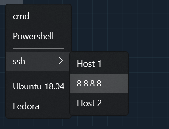

# New Tab Menu Customization

## Abstract

Many users have lots and _lots_ of profiles that they use. Some of these
profiles the user might not use that frequently. When that happens, the new tab
dropdown can become quite cluttered.

A common ask is for the ability to reorder and reorganize this dropdown. This
spec provides a design for how the user might be able to specify the
customization in their settings.

## Inspiration

Largely, this spec was inspired by discussion in
[#1571](https://github.com/microsoft/terminal/issues/1571#issuecomment-519504048)
and the _many_ linked threads.

## Solution Design

This design proposes adding a new setting `"newTabMenu"`. When unset, (the
default), the new tab menu is populated with all the profiles, in the order they
appear in the users settings file. When set, this enables the user to control
the appearance of the new tab dropdown. Let's take a look at an example:

```json
{
    "profiles":{ ... },
    "newTabMenu": [
        { "type":"profile", "profile": "cmd" },
        { "type":"profile", "profile": "Windows PowerShell" },
        { "type":"separator" },
        {
            "type":"folder",
            "name": "ssh",
            "icon": "C:\\path\\to\\icon.png",
            "entries":[
                { "type":"profile", "profile": "Host 1" },
                { "type":"profile", "profile": "8.8.8.8" },
                { "type":"profile", "profile": "Host 2" }
            ]
        },
        { "type":"separator" },
        { "type":"profile", "profile": "Ubuntu-18.04" },
        { "type":"profile", "profile": "Fedora" }
    ]
}
```

If a user were to use this as their new tab menu, that they would get is a menu
that looks like this:



_fig 1_: A _very rough_ mockup of what this feature might look like

There are five `type`s of objects in this menu:
* `"type":"profile"`: This is a profile. Clicking on this entry will open a new
  tab, with that profile. The profile is identified with the `"profile"`
  parameter, which accepts either a profile `name` or GUID. The icon for this
  entry will be the profile's icon, and the text on the entry will be the
  profile's name.
* `"type":"separator"`: This represents a XAML `MenuFlyoutSeparator`, enabling
  the user to visually space out entries.
* `"type":"folder"`: This represents a nested menu of entries.
  - The `"name"` property provides a string of text to display for the group.
  - The `"icon"` property provides a path to a image to use as the icon. This
    property is optional.
  - The `"entries"` property specifies a list of menu entries that will appear
    nested under this entry. This can contain other `"type":"folder"` groups as
    well!
  - The `"inline"` property accepts two values
    - `auto`: When the folder only has one entry in it, don't actually create a
      nested layer to then menu. Just place the single entry in the layer that
      folder would occupy. (Useful for dynamic profile sources with only a
      single entry).
    - `never`: (**default**) Always create a nested entry, even for a single
      sub-item.
  - The `allowEmpty` property will force this entry to show up in the menu, even
    if it doesn't have any profiles in it. This defaults to `false`, meaning
    that folders without any entries in them will just be ignored when
    generating the menu. This will be more useful with the `matchProfile` entry,
    below.

    When this is true, and the folder is empty, we should add a
    placeholder `<empty>` entry to the menu, to indicate that no profiles were
    in that folder.
    - _This setting is probably pretty niche, and not a requirement_. More of a
      theoretical suggestion than anything.
    - In the case of no entries for this folder, we should make sure to also
      reflect the `inline` property:
      - `allowEmpty:true`, `inline:auto`: just ignore the entry at all. Don't
        add a placeholder to the parent list.
      - `allowEmpty:true`, `inline:never`: Add a nested entry, with an
        `<empty>` placeholder.
      - `allowEmpty:false`, `inline:auto`: just ignore the entry at all. Don't
        add a placeholder to the parent list.
      - `allowEmpty:false`, `inline:never`: just ignore the entry at all. Don't
        add a placeholder to the parent list.
* `"type":"action"`: This represents a menu entry that should execute a specific
  `ShortcutAction`.
  - the `id` property will specify the global action ID (see [#6899], [#7175])
    to identify the action to perform when the user selects the entry. Actions
    with invalid IDs will be ignored and omitted from the list.
  - The text for this entry will be the action's label (which is
    either provided as the `"name"` in the global list of actions, or the
    generated name if no `name` was provided)
  - The icon for this entry will similarly re-use the action's `icon`.
* `"type":"remainingProfiles"`: This is a special type of entry that will be
  expanded to contain one `"type":"profile"` entry for every profile that was
  not already listed in the menu. This will allow users to add one entry for
  just "all the profiles they haven't manually added to the menu".
  - This type of entry can only be specified once - trying to add it to the menu
    twice will raise a warning, and ignore all but the first `remainingProfiles`
    entry.
  - This type of entry can also be set inside a `folder` entry, allowing users
    to highlight only a couple profiles in the top-level of the menu, but
    enabling all other profiles to also be accessible.
  - The "name" of these entries will simply be the name of the profile
  - The "icon" of these entries will simply be the profile's icon
  - This won't include any profiles that have been included via `matchProfile`
    entries (below)
* `"type": "matchProfile"`: Expands to all the profiles that match a given
  string. This lets the user easily specify a whole collection of profiles for a
  folder, without needing to add them all manually.
  - `"name"`, `"commandline"` or `"source"`: These three properties are used to
    filter the list of profiles, based on the matching property in the profile
    itself. The value is a string to compare with the corresponding property in
    the profile. A full string comparison is done - not a regex or partial
    string match.

The "default" new tab menu could be imagined as the following blob of json:

```json
{
    "newTabMenu": [
        { "type":"remainingProfiles" }
    ]
}
```

Alternatively, we could consider something like the following. This would place
CMD, PowerShell, and all PowerShell cores in the root at the top, followed by
nested entries for each subsequent dynamic profile generator.

```jsonc
{
    "newTabMenu": [
        { "type":"profile", "profile": "cmd" },
        { "type":"profile", "profile": "Windows PowerShell" },
        { "type": "matchProfile", "source": "Microsoft.Terminal.PowerShellCore" }
        {
            "type": "folder",
            "name": "WSL",
            "entries": [ { "type": "matchProfile", "source": "Microsoft.Terminal.Wsl" } ]
        },
        {
            "type": "folder",
            "name": "Visual Studio",
            "entries": [ { "type": "matchProfile", "source": "Microsoft.Terminal.VisualStudio" } ]
        },
        // ... etc for other profile generators
        { "type": "remainingProfiles" }
    ]
}
```

I might only recommend that for `userDefaults.json`, which is the json files
used as a template for a user's new settings file. This would prevent us from
moving the user's cheese too much, if they're already using the Terminal and
happy with their list as is. Especially consider someone who's default profile
is a WSL distro, which would now need two clicks to get to.

> _note_: We will also want to support the same `{ "key": "SomeResourceString"}`
> syntax used by the Command Palette commands
> for specifying localizable names, if we chose to pursue this route.

### Other considerations

Also considered during the investigation for this feature was re-using the list
of profiles to expose the structure of the new tab menu. For example, doing
something like:

```json
"profiles": {
  "defaults": {},
  "list":
  [
    { "name": "cmd" },
    { "name": "powershell" },
    { "type": "separator" },
    {
      "type": "folder" ,
      "profiles": [
        { "name": "ubuntu" }
      ]
    }
  ]
}
```

This option was not pursued because we felt that it needlessly complicated the
contents of the list of profiles objects. We'd rather have the `profiles` list
exclusively contain `Profile` objects, and have other elements of the json
_refer_ to those profiles. What if someone would like to have an action that
opened a new tab with profile index 4, and then they set that action as entry 4
in the profile's list? That would certainly be some sort of unexpected behavior.

Additionally, what if someone wants to have an entry that opens a tab with one
pane with one profile in it, and another pane with different profile in it? Or
what if they want the same profile to appear twice in the menu?

By overloading the structure of the `profiles` list, we're forcing all other
consumers of the list of profiles to care about the structure of the elements of
the list. These other consumers should only really care about the list of
profiles, and not necessarily how they're structured in the new tab dropdown.
Furthermore, it complicates the list of profiles, by adding actions intermixed
with the profiles.

The design chosen in this spec more cleanly separates the responsibilities of
the list of profiles and the contents of the new tab menu. This way, each object
can be defined independent of the structure of the other.

Regarding implementation of `matchProfile` entries: In order to build the menu,
we'll evaluate the entries in the following order:

* all explicit `profile` entries
* then all `matchProfile` entries, using profiles not already specified
* then expand out `remainingProfiles` with anything not found above.

As an example:

```jsonc
{
    "newTabMenu": [
        { "type": "matchProfile", "source": "Microsoft.Terminal.Wsl" }
        {
            "type": "folder",
            "name": "WSLs",
            "entries": [ { "type": "matchProfile", "source": "Microsoft.Terminal.Wsl" } ]
        },
        { "type": "remainingProfiles" }
    ]
}
```

For profiles { "Profile A", "Profile B (WSL)", "Profile C (WSL)" }, This would
expand to:

```
New Tab Button ▽
├─ Profile A
├─ Profile B (WSL)
├─ Profile C (WSL)
└─ WSLs
   └─ Profile B (WSL)
   └─ Profile C (WSL)
```

## UI/UX Design

See the above _figure 1_.

The profile's `icon` will also appear as the icon on `profile` entries. If
there's a keybinding bound to open a new tab with that profile, then that will
also be added to the `MenuFlyoutItem` as the accelerator text, similar to the
text we have nowadays.

Beneath the list of profiles will _always_ be the same "Settings", "Feedback"
and "About" entries, separated by a `MenuFlyoutSeparator`. This is consistent
with the UI as it exists with no customization. These entries cannot be removed
with this feature, only the list of profiles customized.

## Capabilities

### Accessibility

This menu will be added to the XAML tree in the same fashion as the current new
tab flyout, so there should be no dramatic change here.

### Security

_(no change expected)_

### Reliability

_(no change expected)_

### Compatibility

_(no change expected)_

### Performance, Power, and Efficiency

_(no change expected)_

## Potential Issues

Currently, the `openTab` and `splitPane` keybindings will accept a `index`
parameter to say either:
* "Create a new tab/pane with the N'th profile"
* "Create a new tab/pane with the profile at index N in the new
tab dropdown".

These two were previously synonymous, as the N'th profile was always the N'th in
the dropdown. However, with this change, we'll be changing the meaning of that
argument to mean explicitly the first option - "Open a tab/pane with the N'th
profile".

A previous version of this spec considered changing the meaning of that
parameter to mean "open the entry at index N", the second option. However, in
[Command Palette, Addendum 1], we found that naming that command would become
unnecessarily complex.

To cover that above scenario, we could consider adding an `index` parameter to
the `openNewTabDropdown` action. If specified, that would open either the N'th
action in the dropdown (ignoring separators), or open the dropdown with the n'th
item selected.

The N'th entry in the menu won't always be a profile: it might be a folder with
more options, or it might be an action (that might not be opening a new tab/pane
at all).

Given all the above scenarios, `openNewTabDropdown` with an `"index":N`
parameter will behave in the following ways. If the Nth top-level entry in the
new tab menu is a:
* `"type":"profile"`: perform the `newTab` or `splitPane` action with that profile.
* `"type":"folder"`: Focus the first element in the sub menu, so the user could
  navigate it with the keyboard.
* `"type":"separator"`: Ignore these when counting top-level entries.
* `"type":"action"`: Perform the action.

So for example:

```
New Tab Button ▽
├─ Folder 1
│  └─ Profile A
│  └─ Action B
├─ Separator
├─ Folder 2
│  └─ Profile C
│  └─ Profile D
├─ Action E
└─ Profile F
```

And assuming the user has bound:
```json
{
  "bindings":
  [
    { "command": { "action": "openNewTabDropdown", "index": 0 }, "keys": "ctrl+shift+1" },
    { "command": { "action": "openNewTabDropdown", "index": 1 }, "keys": "ctrl+shift+2" },
    { "command": { "action": "openNewTabDropdown", "index": 2 }, "keys": "ctrl+shift+3" },
    { "command": { "action": "openNewTabDropdown", "index": 3 }, "keys": "ctrl+shift+4" },
  ]
}
```

* <kbd>ctrl+shift+1</kbd> focuses "Profile A", but the user needs to press
  enter/space to creates a new tab/split
* <kbd>ctrl+shift+2</kbd> focuses "Profile C", but the user needs to press
  enter/space to creates a new tab/split
* <kbd>ctrl+shift+3</kbd> performs Action E
* <kbd>ctrl+shift+4</kbd> Creates a new tab/split with Profile F

## Future considerations

* The user could set a `"name"`/`"text"`, or `"icon"` property to these menu
  items manually, to override the value from the profile or action. These
  settings would be totally optional, but it's not unreasonable that someone
  might want this.
* We may want to consider adding a default icon for all folders or actions in
  the menu. For example, a folder (like 📁) for `folder` entries, or something
  like ⚡ for actions. We'll leave these unset by default, and evaluate setting
  these icons by default in the future.
* Something considered during review was a way to specify "All my WSL profiles".
  Maybe the user wants to have all their profiles generated by the WSL Distro
  Generator appear in a "WSL" folder. This would likely require a more elaborate
  filtering syntax, to be able to select only profiles where a certain property
  has a specific value. Consider the user who has multiple "SSH
  me@\<some host\>.com" profiles, and they want all their "SSH\*" profiles to
  appear in an "SSH" folder. This feels out-of-scope for this spec.
* A similar structure could potentially also be used for customizing the context
  menu within a control, or the context menu for the tab. (see [#3337])
  - In both of those cases, it might be important to somehow refer to the
    context of the current tab or control in the json. Think for example about
    "Close tab" or "Close other tabs" - currently, those work by _knowing_ which
    tab the "action" is specified for, not by actually using a `closeTab` action.
    In the future, they might need to be implemented as something like
    - Close Tab: `{ "action": "closeTab", "index": "${selectedTab.index}" }`
    - Close Other Tabs: `{ "action": "closeTabs", "otherThan": "${selectedTab.index}" }`
    - Close Tabs to the Right: `{ "action": "closeTabs", "after": "${selectedTab.index}" }`
* We may want to consider regex, tag-based, or some other type of matching for
  `matchProfile` entries in the future. We originally considered using regex for
  `matchProfile` by default, but decided instead on full string matches to leave
  room for regex matching in the future. Should we chose to pursue something
  like that, we should use a settings structure like:

  ```json
  "type": "profileMatch",
  "source": { "type": "regex", "value": ".*wsl.*" }
  ```
* We may want to expand `matchProfile` to match on other properties too. (`title`?)
* We may want to consider adding support for capture groups, e.g.
  ```json
  {
    "type": "profileMatch",
    "name": { "type": "regex", "value": "^ssh: (.*)" }
  }
  ```
  for matching to all your `ssh: ` profiles, but populate the name in the entry
  with that first capture group. So, ["ssh: foo", "ssh: bar"] would just expand
  to a "foo" and "bar" entry.

## Updates

_February 2022_: Doc updated in response to some discussion in [#11326] and
[#7774]. In those PRs, it became clear that there needs to be a simple way of
collecting up a whole group of profiles automatically for sorting in these
menus. Although discussion centered on how hard it would be for extensions to
provide that customization themselves, the `match` statement was added as a way
to allow the user to easily filter those profiles themselves.

This was something we had originally considered as a "future consideration", but
ultimately deemed it to be out of scope for the initial spec review.

<!-- Footnotes -->
[#2046]: https://github.com/microsoft/terminal/issues/2046
[Command Palette, Addendum 1]: https://github.com/microsoft/terminal/blob/main/doc/specs/%232046%20-%20Unified%20keybindings%20and%20commands%2C%20and%20synthesized%20action%20names.md

[#3337]: https://github.com/microsoft/terminal/issues/3337
[#6899]: https://github.com/microsoft/terminal/issues/6899
[#7175]: https://github.com/microsoft/terminal/issues/7175
[#11326]: https://github.com/microsoft/terminal/issues/11326
[#7774]: https://github.com/microsoft/terminal/issues/7774
