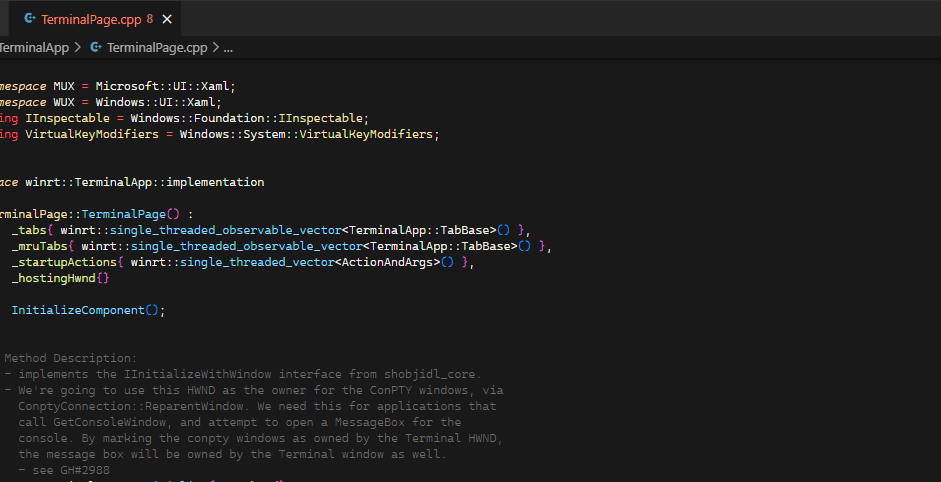
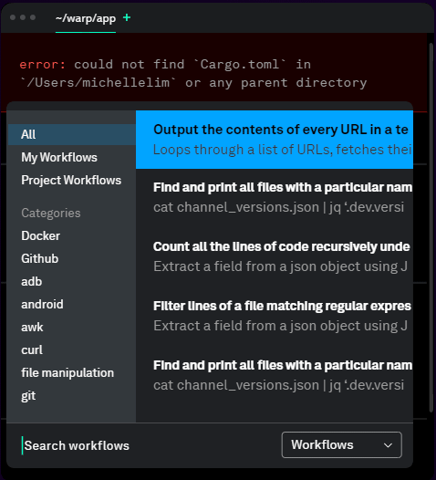
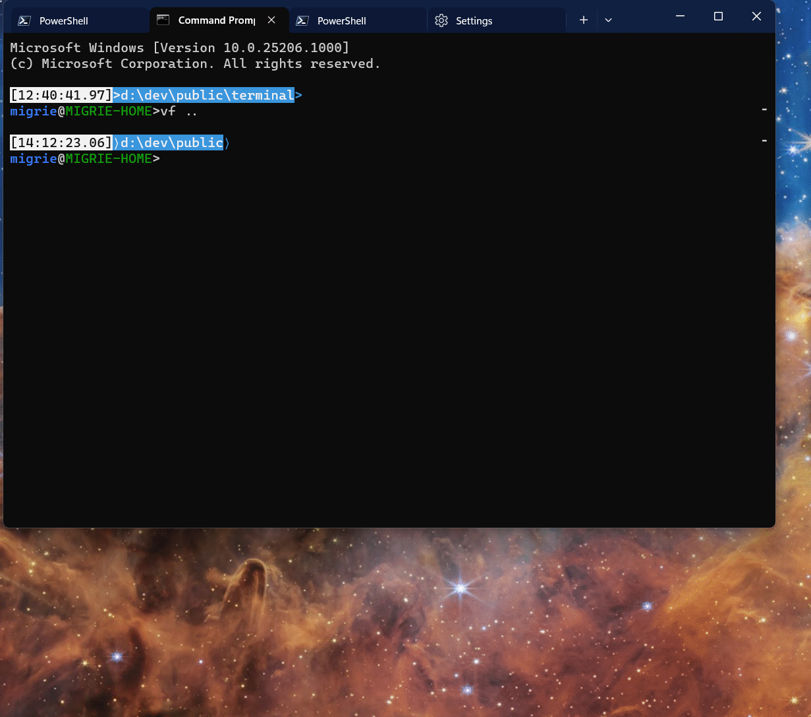

# Windows Terminal - Snippets  <!-- nee "Tasks" -->

## Abstract

The command line is a highly powerful tool. However, its power is dependent on
the user's knowledge of the specific commands, flags and parameters needed to
perform tasks from the command-line. For simple everyday commands, this might
not be so hard. For longer commands, or ones used less frequently, there's quite
a bit of mental overhead trying to recall the exact syntax. For teams, it might
be helpful to share these tasks with everyone on the project. The Terminal can
be an avenue by which complicated tasks can be remembered, shared, discovered,
and recalled by the user simply thinking **"what do I want to do"**, rather than
"how do I do it".

## Background

> **Note**:
>
> This largely builds off of work in the [Suggestions UI], for displaying these
> tasks to the user. Make sure to read that spec first.

### Inspiration

The primordial version of this idea was probably [#keep] - a command-line tool I
wrote for stashing long command-lines and directories, and recalling them with
just a number. We've had many variations on this idea over the years - [#1595]
was probably the first such request on the Terminal repo. ITerm2 also had [a
similar feature](https://iterm2.com/images/CommandHistory.png). Theirs was more
directly tied to shell integration (that menu is populated from commands that
they know were run in the shell). In the absence of shell integration though, it
should be able to save these commands to a menu manually.

Consider [VsCode Tasks]. These are files which can be placed in the root of
a workspace, and share common tasks between users of that workspace. They've got
support for starting processes, with a set of args. These args can also be
picked at runtime, and custom sets of arguments can be specified for individual
arguments.

It is hard to say that the ultimate vision here isn't partially inspired by the
"[workflows]" of [Warp], or by [Fig]. These are modern tools that seek to
augment the command-line experience, by making the command-line more
approachable. Warp quite clearly has the same concept in "workflows" - scripts
which the user can build and Warp (a Terminal emulator) can insert quickly. Fig,
on the other hand, is more focused on just simplifying the command-line
experience. Fig is more about providing additional metadata to the user as
they're typing. They are [also working on workflows], so there's clearly quite a
bit of ecosystem-wide demand for more discoverable command-line tooling.

We've had verbatim feedback that developers already attempt to record useful
commandlines in various different ways - in OneNotes, in shell scripts, in
aliases. Furthermore, developers often share these commands with the rest of
their teams. Providing a unified way to easily store, browse, and use these
command lines should be valuable to developers  already doing this. A static
file in their project containing commands for the whole team seems like a simple
solution to this problem.

### User Stories

Story |  Size | Description
--|-----------|--
A | ✅ Done   | Users can bring up a menu of command line tasks and quickly execute them
B | ✅ Done   | Fragment apps can provide tasks to a users settings
C | 🚶 Walk   | The user can save commands straight to their settings with a `wt` command
D | 🚶 Walk   | Users can have different tasks enabled for different profiles(/shells?)
E | 🚶 Walk   | The Terminal displays a Snippets Pane for easy browsing of relevant snippets
F | 🏃‍♂️ Run    | The terminal can automatically look for command fragments in the tree of the CWD
G | 🏃‍♂️ Run    | Snippets with multiple lines can be sent only conditionally on the success of the previous command (with shell integration)
H | ✅ Done   | Snippets can be filtered by text the user has already typed
I | 🚀 Sprint | Snippets can have prompt-able sections of input
J | 🚀 Sprint | Community tasks are hosted in a public GH repo
K | 🚀 Sprint | A simple UX (either web or in Terminal) is exposed for interacting with public GH repo of tasks

### Elevator Pitch

The Terminal can remember long command-lines and display them with user-friendly
descriptions of _what they actually do_. These tasks can be searched by intent,
rather than the particular combination of flags. They can be shared with members
of your team, so everyone has easy access to common tasks for a project.

### Why not just aliases / native script files?

Why not just take these tasks and put them into a shell alias? For longer tasks,
why not just stick them in a `.ps1`/`.bat`/`.sh`/etc file? This is an option
that's existed since the time immemorial. However, this still requires the user
to remember that they've created these aliases/scripts, remember where they're
stored, and remember how they work.

By providing a dedicated UI for these command-lines, they can always be at your
fingertips. No need to remember what the alias for a particular command-line is -
just look up what you want to do. Aliases and scripts are no longer scattered
across `.bashrc`, `.bash_profile`, `.profile`, etc, they can all be stashed in
the Terminal config, or in the project they're relevant to. By stashing them
alongside the code, then anyone else coming to work on the code can have
immediate access to useful sets of tasks.

Aliases have a tendency towards more experienced shell users. This proposal
instead brings the power of these aliases and scripts right to the foreground,
with a cross-shell mechanism of exposing them to even beginners. With fragment
extensions, tools can bundle common workflows together with their application so
the Terminal can automatically load them for the user.

## Business Justification

It will delight developers.

## Scenario Details

### Implementation Details

For the most part, this is already implemented as the `sendInput` action. These
actions send text to the terminal already, and work quite well as snippets.

#### Basics

We'll want to also augment `sendInput` to add support for `input` as an array of
strings, not only a single string value. When the input is a list of strings,
then the terminal can send each string, separated by the <kbd>enter</kbd> key.
We can also add a `waitForSuccess` parameter to `sendInput` (with a default
value of `false`). If that's set to `true`, **and shell integration is enabled**,
then the Terminal will wait to send each command until the previous command
exits.

As another minor improvement, we'll add a `description` property to Commands.
This will allow users to add additional information to snippets which we can
surface. Additionally, extension authors could provide more details as well.

As a matter of renaming, we'll also update `"source": "tasks"` for the
`SuggestionsSource` enum to instead be `snippets` (and gracefully update that
where we find it). "tasks" was an older name for this feature, and "snippets"
will better align with our partners in VsCode.

##### Multi-line snippets example

Consider the [following script](https://gist.github.com/zadjii-msft/b598eebd6c5601328498e3e7acc581a7):

```pwsh
$s=Invoke-GitHubGraphQlApi "query{organization(login:`"Microsoft`"){projectV2(number: 159) { id } } }"

$tasks = get-GitHubIssue  -Labels "Issue-Task" -state open
$bugs = get-GitHubIssue  -Labels "Issue-Bug" -state open
$issues = $tasks + $bugs

$issues | ? {$_.labels.Name -NotContains "Needs-Triage" } | ? { $_.milestone.title -Ne "Icebox ❄" } | ? type -Ne "PullRequest" | select -expand node_id | % {
  $resp = Add-GitHubBetaProjectItem -ProjectNodeId $s.organization.projectV2.id -ContentNodeId $_ ;
}
```

As just a raw sendInput action with a single `input`, this would look like the following:

```jsonc
{
    "command":
    {
        "action": "sendInput",
        "input": "$s=Invoke-GitHubGraphQlApi \"query{organization(login:`\"Microsoft`\"){projectV2(number: 159) { id } } }\"\r\n$tasks = get-GitHubIssue  -Labels \"Issue-Task\" -state open\r\n$bugs = get-GitHubIssue  -Labels \"Issue-Bug\" -state open\r\n$issues = $tasks + $bugs\r\n$issues | ? {$_.labels.Name -NotContains \"Needs-Triage\" } | ? { $_.milestone.title -Ne \"Icebox ❄\" } | ? type -Ne \"PullRequest\" | select -expand node_id | % {\r\n  $resp = Add-GitHubBetaProjectItem -ProjectNodeId $s.organization.projectV2.id -ContentNodeId $_ ;\r\n}"
    },
    "name": "Upload to project board",
    "description": "Sync all our issues and bugs that have been triaged and are actually on the backlog to the big-ol project",
},
```

This JSON is basically entirely unusable. Since JSON doesn't support multiline
strings, then every line has to be joined to a single line, separated by `\r\n`.

Instead, the following version of this command uses an array for the `input`
parameter. This then implies that each string should be sent in sequence, with
<kbd>enter</kbd> between them.

```jsonc
{
    "command":
    {
        "action": "sendInput",
        "input":
        [
            "$s=Invoke-GitHubGraphQlApi \"query{organization(login:`\"Microsoft`\"){projectV2(number: 159) { id } } }\"",
            "$tasks = get-GitHubIssue  -Labels \"Issue-Task\" -state open",
            "$bugs = get-GitHubIssue  -Labels \"Issue-Bug\" -state open",
            "$issues = $tasks + $bugs",
            "$issues | ? {$_.labels.Name -NotContains \"Needs-Triage\" } | ? { $_.milestone.title -Ne \"Icebox ❄\" } | ? type -Ne \"PullRequest\" | select -expand node_id | % {",
            "  $resp = Add-GitHubBetaProjectItem -ProjectNodeId $s.organization.projectV2.id -ContentNodeId $_ ;",
            "}",
            ""
        ]
    },
    "name": "Upload to project board",
    "description": "Sync all our issues and bugs that have been triaged and are actually on the backlog to the big-ol project",
},
```

This is slightly more maintainable. Assuming the user also has shell integration
enabled, they could also set `"waitForSuccess": true`, and if any part of the
script fails, then the rest of it won't be sent to the shell[[1](#footnote-1)].

#### Fragment actions

This was already added in [#16185]. These will allow third-party developers to
create apps which add additional snippets to the Terminal. These will require
app developers to add `id`s to each action they add in this way. Users can then
bind that action `id` to a keybinding, if they so choose.

Case in point:
https://github.com/abduvik/just-enough-series/tree/master/courses/docker+docker-compose.
Something like that should be able to be easily added directly to the Terminal.

### Snippets pane

With non-terminal content landing in 1.21 Preview, it's now simple to add
additional types of panes to add to the Terminal. We'll support a new pane
`"type": "snippets"`, to support opening the Snippets pane.

This will be a pane with a `TreeView` in it and a text box to filter results
(ala the Command Palette).

Each item in the TreeView will be a kind of `FilteredCommand`, with a play
button to support quickly running the command.

This pane could also support all the different suggestion sources that the
Suggestions UI supports - `recentCommands` could be plumbed into it from the
currently active This pane could also support checkboxes to filter different
suggestion sources.

### Per-Project Snippets (`.wt.json`)

Users may also want to leave snippets in the root of their repo, for others to
use as well. To support this, the Terminal will automatically look for a
`.wt.json` file in any directories that are parents of the CWD of the shell, and
load actions from that file as well. The syntax for this file will be a modified
version of the standard settings schema. As an example:

```json
{
    "$version": "1.0.0",
    "snippets":
    [
        {
            "input": "bx",
            "name": "Build project",
            "description": "Build the project in the CWD"
        },
        {
            "input": "bcz",
            "name": "Clean & build solution",
            "icon": "\uE8e6",
            "description": "Start over. Go get your coffee. "
        },
        {
            "input": "nuget push -ApiKey az -source TerminalDependencies %userprofile%\\Downloads" ,
            "name": "Upload package to nuget feed",
            "icon": "\uE898",
            "description": "Go download a .nupkg, put it in ~/Downloads, and use this to push to our private feed."
        },
    ]
}
```

Instead of `actions`, the top-level list is `snippets`. These snippet objects
are a simplification of the `Command` object. They have a `name`, `description`,
and `icon` properties, just like a `Command`. However, instead of an arbitrary
`action`, we will just have the `SendInput` action's args as properties directly
in the object.

Additionally, we'll also support a `$version` field, in case we ever want to
make breaking changes to the schema. When this is missing, we'll just assume the
version to be `1.0.0`, which is this originally proposed schema.

By default, a `TermControl` is always initialized with the CWD set to the
`startingDirectory` of a profile. So, even for users that don't have shell
integration enabled, the Terminal will still be able to load snippets from the
`.wt.json` in the profile's `startingDirectory`. If the user has shell
integration configured to tell the Terminal about the CWD, then we'll refresh
that list as the user changes directories.

* In `Terminal.Settings.Model`, we will store a cached map of path->actions.
  * that if multiple panes are all in the same CWD, they don't need to
    individually re-read the file from disk and regenerate that part of the map.
* I believe it should be impossible for a keybinding to be bound to a local
  action. Even if it has an ID, the file won't be loaded when we build the
  keymap, and we don't really want the keymap changing based on CWD. Also, with
  the actions living in an entirely separate map of CWD->actions, the
  keybindings in the main map won't be able to easily get to them. See also
  [Security considerations](#security) for more.
* If the Snippets pane or Suggestions UI is opened with `snippets` as a source,
  then we'll just append the appropriate list of suggestions for the active
  control's CWD.
  * We don't need to have the control raise an event when the CWD changes - we
    can lazy-load these actions when a UI element that requires it is first
    invoked.
* These _local_ snippets will not be included in the Command Palette.
  (`sendInput` actions in the settings file and in fragments still will be,
  however)
  * The Command Palette is quite tightly bound to our own ActionMap settings
    model, accumulated through complicated layering of defaults, fragments, and
    user settings. It's not trivially mutable at runtime in the way that
    context-sensitive snippets would require.
  * The Suggestions UI and Snippets pane are both surfaces that are better
    equipped to handle context-relevant actions, especially where the context is
    a `TermControl`.
  * The Suggestions UI and snippets pane will give us more flexibility in
    customizing the experience specifically for snippets. Case in point - we'll
    want to filter the suggestions UI based on both the `Name` _and_ the `Input`
    of the send input command. Contrast that with the Command Palette which is
    currently only capable of filtering based on names.
* If we find multiple `.wt.json` files in the ancestors of the CWD (e.g. for
  `c:\a\b\c\d\`, there's a `c:\a\.wt.json` and a `c:\a\b\c\.wt.json`), then
  we'll add each one separately to the map of paths->directories. When
  requesting the actual actions for `c:\a\b\c\d\`, we'll layer the ones from
  `c:\a\` before the ones from `c:\a\b\c`, so that deeper descendants take
  precedence.
  * For example, `c:\a\.wt.json` has a snippet with `input: "foo", name:
    "Build"`, and `c:\a\b\c\.wt.json` has a snippet with `input: "bar", name:
    "Build"`. When the user is under `c:\a\b\c`, the Terminal will show `bar`
    when the user selects the `Build` suggestion. Otherwise, if the user is
    under `c:\a`, then the Terminal will show `foo`.
* If we fail to parse the `.wt.json` file, then we'll ignore it. For parsing
  errors, we'll want to display warnings to the user:
  * If the user had opened the suggestions UI, we can display a Toast the first
    time we fail to load it to show the error.
  * In the snippets pane, we can have static text along the lines of "failed to
    parse snippets found in `path/to/file`" at the top of the pane.

### Saving snippets from the commandline

_This has already been prototyped in [#16513]_

Users should be able to save commands as snippets directly from the commandline.
Consider: you've just run the command that worked the way you need it to. You
shouldn't have to open the settings to then separately copy-paste the command in
to save it. It should be as easy as <kbd>Up</kbd>, <kbd>Home</kbd>, `wt x-save `,
<kbd>Enter</kbd>.

This will be powered by a `saveSnippet` action behind the scenes. However, we
won't actually parse these actions from a user's settings file. They don't
really make sense to have the action to save a snippet to the settings file, in
the settings file already.

The exact syntax of `x-save` is as follows:

#### `x-save` subcommand

`x-save [--name,-n name][--description,-d description][-- commandline]`

Saves a given commandline as a sendInput action to the Terminal settings file.
This will immediately write the Terminal settings file.

**Parameters**:
* `--name,-n name`: The name to assign to the `name` parameter of the saved
  command. If omitted, then the parameter will be left blank, and the command
  will use the auto-generated "Send input:..." name in menus.
* `--description,-d`: The description to optionally assign to the command.
* `commandline`: The commandline to save as the `input` of the `sendInput` action.

If the `save` subcommand is ran without any other subcommands, the Terminal will
imply the `-w 0` arguments, to attempt to send this action to the current
Terminal window (unless of course, `-w` was manually provided on the
commandline). This is done to avoid a new terminal window popping up, just to
inform the user a command was saved. When run with other subcommands, then the
action will just be ran in the same window as all the other subcommands.

> [!NOTE]
> In team discussions, we've decided to accept this for now as
> experimental. We have some concerns about how effective we'll be at dealing
> with all the weird edge cases of string escaping. For now, we'll keep this
> subcommand as `x-save`, where `x-` implies "experimental".
>
> Perhaps once we add a dialog for saving these snippets, we can promote it out of experimental.

### UI/UX Design

For the most part, we'll be using the [Suggestions UI] to display tasks to the
user. This is a text cursor-relative UI surface that can quickly display actions
to the user, in the context of what they're working on.

The following are some examples from VsCode and Warp. These are meant to be
illustrative of what these menus already look like in the wild:





A prototype of saving a command directly to the user's settings, then invoking
it via the suggestions UI


A prototype of reading tasks from the CWD



The initial version of the snippets pane:


## Tenets

<table>

<tr><td><strong>Compatibility</strong></td><td>

I considered supporting YAML for local snippets (`.wt.json`), instead of JSON.
JSON is not super friendly to command-lines - since everything's gotta be
encapsulated as a string. Embedding tabs `\t`, newlines `\r`, escape characters,
is fairly straightforward. However, quotes can get complicated fast in JSON,
since they've got to be escaped too, and with many CLI utilities also having
separate quote-parsing rules, JSON can get unwieldy quickly.

However, supporting YAML directly would require us to spec out a YAML syntax for
these files, and also find an OSS YAML parser and implement support for it. That
would be quite a bit more expensive than JSON.

</td></tr>

<tr><td><strong>Accessibility</strong></td><td>

Nothing particular to call out here. The Snippets pane will need to be a11y
tested, like most of our other UI surfaces.

</td></tr>

<tr><td><strong>Sustainability</strong></td><td>

No substantial climate impacts expected here. We're not using expensive compute
resources for this feature, so the impact should be comparable to any other
Terminal feature.

</td></tr>

<tr><td><strong>Localization</strong></td><td>

I'm mildly worried here about the potential for community-driven tasks to have
non-localized descriptions. We may need to accept a `description:{ en-us:"",
pt-br:"", ...}`-style map of language->string descriptions. That may just need
to be a future consideration for now.

</td></tr>

<tr><td><a name="security"></a><strong>Security</strong></td><td>

Another reason we shouldn't support keys being able to be lazy-bound to local
snippets: It's entirely too easy for `malicious.exe` to create a file in
`%HomePath%` that creates a snippet for `\u003pwn-your-machine.exe\r` (or
similar). Any app can read your settings file, and it is again too easy for that
malicious app to set its own action `id` to the same as some other well-meaning
local snippet's ID which you DO have bound to a key.

When we first load the snippets from the `.wt.json` file, we'll want to also ask
them if they trust that folder. This is similar to the way that VsCode et. al.
If they accept, then we'll add that folder to a list of trusted folders (and
store permanently in `state.json`). If they don't, then we'll just ignore that
file. To make things easier for the user, we can also add a checkbox to "trust
the parent folder" in the dialog (again, similar to VsCode).

We'll also want to engage our security partners to see if there's anything extra
we'll need to do to ensure we're securely parsing random JSON files that we
don't own.

</td></tr>

</table>

### Other potential issues

Something like `wt save ping 8.8.8.8 > foo.txt` isn't going to work the way
users want. The shell is gonna get the first crack at parsing that commandline,
and is going to try and redirect the _output of `wt`_ to `foo.txt`.

Predictably, local snippets won't work over ssh or other remote connections.
Terminal is only able to read files off the local filesystem. We'll at best be
able to read snippets from the directory they `ssh`'d _from_ locally.

## Implementation Plan

### 🐣 Crawl
* [ ] The Command Palette and Suggestions UI need to be able to display both the
  command name and a tooltip for the comment
  - This will need to be reconciled with [#7039], which tracks displaying
    non-localized names in the command palette
  - It won't be a TeachingTip, since those are an unmitigated disaster. But we
    can just fake it with another text box.
  - A prototype can be found in [#17376]
* [X] [#1595] Add the Suggestions UI, with support for `tasks`
* [x] Fragments can add **actions** to a user's settings

### 🚶 Walk
* [ ] The terminal can look for a settings file of tasks in a profile's
  `startingDirectory` (regardless of shell integration being enabled)
* [ ] [#5790] - profile specific actions
* [ ] [#12857] Ability to save selected text as a `sendInput` action
* [x] [#12861] Re-evaluate showing some sort of "ghost text" or other preview for snippets

### 🏃‍♂️ Run
* [ ] When the user `cd`s to a directory (with shell integration enabled), the
  terminal can load the tasks from that directory tree
* [ ] [#10436] Users can manage all their fragments extensions directly in the Settings UI
* [ ] The suggestions UI & snippets pane can filter not only on name of a
  command, but for snippets, the input as well.
* [ ] [#12927] Enlighten the suggestions UI to support (_a yet undeclared syntax
  for_) snippets with prompt-able sections in them

<!--

These are perhaps too vague to be included in the official spec, but they are left here for posterity:

### 🚀 Sprint

* [ ] Fork of [#12927] - prompt-able sections can accept a command to
  dynamically populate options, a la VsCode's tasks.json
* [ ] Stand up a dedicated repo for `terminal-snippets`
  * [ ] Pull those down, or compile them in, or so -->

## Conclusion

Snippets are something that developers immediately understand the value of.
After talking with users, everyone we talked with immediately understood the
concept, and you could see the gears turning on ways to integrate this into
their own workflows.

### Future Considerations

* We may want to add additional params to the `save` subcommand in the future,
  to configure where the snippet is saved:
  * `--local`: Save to the `.wt.json` in the CWD, if there is one (or create
    one)
  * `--parent`: Save to the `.wt.json` in the first ancestor of the CWD, if
    there is one. Otherwise, create one here.
  * `--settings`: Manually save to the settings file?
  * `--profile`: save to this profile???? Not sure if this is actually possible.
    Maybe with the `WT_SESSION_ID` env var to figure out which profile is in use
    for the pane with that ID
    * This would probably require per-profile actions, which are woefully under specified
  * `--local`/`--parent`/`--settings` was well received in team discussion -
    maybe we should just do them now.
* Longer workflows might be better exposed as notebooks. We've already got a
  mind to support [markdown in a notebook-like
  experience](https://github.com/microsoft/terminal/issues/16495) in the
  Terminal. For longer scripts that may need rich markup between commands, that
  will likely be a better UX.
* For what it is worth, [Warp] uses .yaml files for their "workflows". As an
  example, see
  [`clone_all_repos_in_org.yaml`](https://github.com/warpdotdev/workflows/blob/main/specs/git/clone_all_repos_in_org.yaml).
  We may want to straight up just seamlessly support that syntax as well.
  * Converting them to WT-compatible json is fairly trivial [[2](#footnote-2)].
    * We may want to consider supporting YAML like this for `wt import`, ala [#10083]
    * Similarly, we could import the YAML in the settings UI in a fashion similar
      to how we import color schemes:
  * Furthermore, the commands are all licensed under Apache 2.0, which means they
    can be easily consumed by other OSS projects and shared with other developers.
  * This leads us to the next future consideration:
* Discoverability will be important. Perhaps the actions page could have a
  toggle to immediately filter to "snippets"? Which then also displays some text
  like "Tip: save snippets directly from the commandline with
  `wt save <the commandline>`".
* We should easily be able to put "Save command as snippet" into the quick fix
  menu next to an individual prompt, when shell integration is enabled.
* We should most definitely add a dialog for saving snippets directly in the Terminal.
  * We'd have inputs for the commandline, name, description.
  * Obviously, it'd be easy to have a "Add new" button (to open that dialog) on
    the snippets pane.
  * We could have `wt save` open that dialog prepopulated, rather than just
    saving the command directly.
  * We could even also find a way to prepopulate that dialog with the recent
    commands (from shell integration)!
* As a potential v2.0 of the snippets file schema, we may look to the
  `.vscode/tasks.json` schema for inspiration. That file supports much more
  complex task definitions. Notably, with the ability to prompt the user for
  different inputs, for different parameter values. This is something that would
  play well off of [#12927]
* We may want to consider a future property of snippets like `shell`, which
  specifies which shells a snippet can be used with. We could then only filter
  to the snippets that will work with the current shell. This is left for the
  future because we don't have a reliable way of knowing what shell application
  the user is currently running.
* We may want to consider promoting `sendInput` actions to a top-level
  `snippets` array in `settings.json` in the future. That might make sharing
  them from one user's settings, to a `.wt.json`, and back, a little easier.

#### Community Snippets

_The big stretch version of this feature._

It would be supremely cool to have a community curated list of Snippets, for
various tools. Stored publicly on a GitHub repo (a la the winget-pkgs repo).
Users can submit Snippets with descriptions of what the Snippet does. The
Terminal can plug into that repo automatically and fetch the latest community
commands, immediately giving the user access to a wide berth of common
Snippets. That could easily be done as another suggestion source.

#### Profiles in `.wt.json`

If we've got a `.wt.json` in a given directory, should we be dynamically
adding/removing other settings too? Wouldn't profiles also make sense? Take for
example, the Terminal repo. We've got a PowerShell build environment and a CMD
one. What if we could drop two profiles in the `.wt.json` file, with the
`commandline`'s set up to call those scripts as needed?

However, what does that even mean? We wouldn't know that file exists till we see
it the first time. Maybe there's room to integrate that with Dev Home ala
[microsoft/DevHome/3005]. Though, that probably makes the most sense as a winget
DSC to create a fragment profile instead.

## Resources

### Footnotes

<a name="footnote-1"></a>[1]: Shell integration would be a strict requirement
for that parameter to work as intended. Without also enabling shell integration,
then the Terminal would only send the first line of the script, then wait
forever for a `FTCS_COMMAND_FINISHED`.

<a name="footnote-2"></a>[2]:  For your consideration, I made a python script
that will take the Warp workflow YAML and convert it into json that the Terminal
can load. Go checkout [`dump_workflows.py`](./dump-workflows.py) to see it. It's
super straightforward.


[Fig]: https://github.com/withfig/autocomplete
[Warp]: https://www.warp.dev/
[workflows]: https://docs.warp.dev/features/workflows
[also working on workflows]: https://fig.io/user-manual/workflows
[winget script]: https://github.com/microsoft/PowerToys/blob/main/.github/workflows/package-submissions.yml
[#1595]: https://github.com/microsoft/terminal/issues/1595
[#7039]: https://github.com/microsoft/terminal/issues/7039
[#3121]: https://github.com/microsoft/terminal/issues/3121
[#10436]: https://github.com/microsoft/terminal/issues/10436
[#12927]: https://github.com/microsoft/terminal/issues/12927
[#12857]: https://github.com/microsoft/terminal/issues/12857
[#5790]: https://github.com/microsoft/terminal/issues/5790
[Notebooks]: ./Markdown%20Notebooks.md
[Suggestions UI]: ./Suggestions-UI.md
[#keep]: https://github.com/zadjii/keep
[VsCode Tasks]: https://github.com/microsoft/terminal/blob/main/.vscode/tasks.json

[#16185]: https://github.com/microsoft/terminal/pull/16185
[#16513]: https://github.com/microsoft/terminal/pull/16513
[#12861]: https://github.com/microsoft/terminal/issues/12861
[#16495]: https://github.com/microsoft/terminal/issues/16495
[#17376]: https://github.com/microsoft/terminal/pull/17376
[#10083]: https://github.com/microsoft/terminal/issues/10083
[#8639]: https://github.com/microsoft/terminal/issues/8639

[microsoft/DevHome/3005]: https://github.com/microsoft/DevHome/issues/3005
