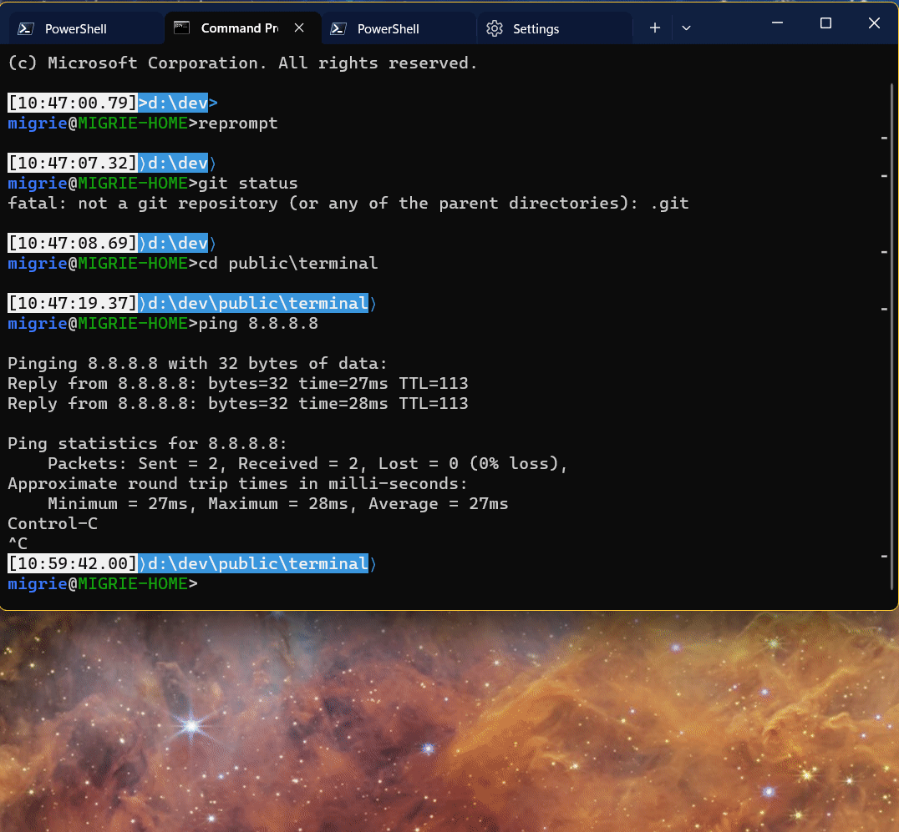
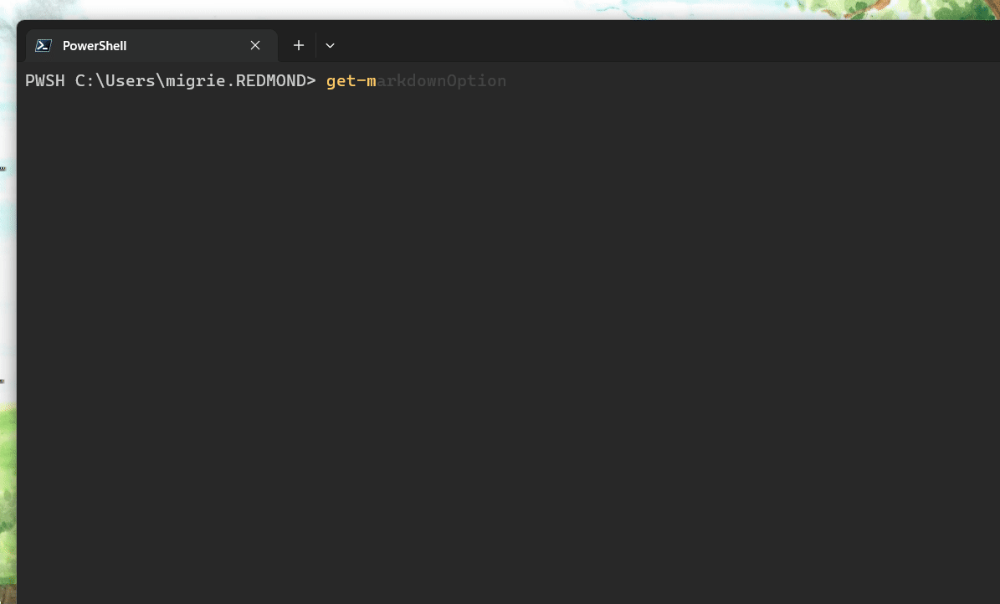

# Windows Terminal - Suggestions UI

## Abstract

Multiple related scenarios have come up where it would be beneficial to display
actionable UI to the user within the context of the active terminal itself. This
UI would be akin to the Intellisense UI in Visual Studio. It appears right where
the user is typing, and can help provide immediate content for the user, based
on some context. The "Suggestions UI" is this new ephemeral UI within the
Windows Terminal that can display different types of actions, from different
sources.

## Background

The Suggestions UI is the singular UI by which the Terminal can display a
variety of suggestions to the user. These include:

* Recent commands the user has executed in this terminal, powered by shell integration.
* Recent directories, similarly powered by shell integration
* Completions from the shell itself (like the shell completions in PowerShell)
* Tasks, which are `sendInput` actions from the user's settings
* Buffer Completions, which is a dumb type of autocomplete based on words in the buffer
* and more (as provided via extensions)

All of these scenarios are places where it makes sense to present the user a
menu at the point of text insertion in the terminal control itself.

### Inspiration

Primarily, the inspiration is any Intellisense-like experience, in any app.
Visual Studio, VsCode, PowerShell, vim, Sublime any JetBrains IDE - there's more
than enough examples in the wild.

Ultimately, the inspiration for the Suggestions UI came from a bunch of places
all at once. In the course of a few months though, it became clear that we'd
need a unified UI for displaying a variety of suggestion-like experiences in the
Terminal. Our work with the PowerShell and VsCode teams helped refine these
requests all into the unified design below.

### User Stories

  Size     |  Description
-----------|--
 🐣 Crawl  | The user can bring up the Suggestions UI with recent commands, powered by shell integration
 🐣 Crawl  | [#12863] The user can bring up the Suggestions UI with recent directories, powered by shell integration
 🚶 Walk   | The user can bring up the Suggestions UI with tasks from their settings
 🚶 Walk   | CLI apps can invoke the Suggestions UI with a new VT sequence
 🚶 Walk   | The Suggestions UI can be opened using the current typed commandline as a filter
 🚶 Walk   | Recent commands and directories are stored in `state.json`, across sessions
 🏃‍♂️ Run    | Suggestions can have descriptions presented in / alongside the UI
 🏃‍♂️ Run    | The Suggestions UI can be opened without any nesting
 🏃‍♂️ Run    | The Suggestions UI can be opened, nested by `source` of the suggestion
 🚀 Sprint | Extensions can provide suggestion sources for the Suggestions UI
 🚀 Sprint | The Suggestions UI can be opened in "inline" mode, only showing the text of the first suggestion

### Elevator Pitch

The Suggestions UI is a UI element displayed in the Terminal for providing
different types of text suggestions to the user - anything from recently run
commands, to saved commands, to tab-completion suggestions from the shell
itself.

## Business Justification

It will delight developers.

Furthermore, our partners on the Visual Studio team have been requesting similar
functionality for some time now. The way autocompletion menus in PowerShell
currently interact with UIA clients leaves much to be desired. They'd like a way
to provide richer context to screen readers. Something to enable the terminal to
more specifically describe the context of what's being presented to the user.

## Scenario Details

### UI/UX Design

#### Prototypes

The following gif was a VsCode prototype of [shell-driven autocompletion]. This
is the point of reference we're starting from when talking about what the
suggestions UI might look like.


These suggestions are populated by logic within PowerShell itself, and
communicated to the Terminal. The Terminal can then display them in the
Suggestions UI.

The following demonstrate a prototype of what that might look like for the
Terminal. These are meant to be informative, not normative, representations of
what the UI would look like.


A prototype of the recent commands UI, powered by shell integration:



A prototype of the tasks UI, powered by the user's settings:


(admittedly, the `TeachingTip` in that gif is a prototype and was later replaced
with a better version.)

In general, the Suggestions UI will present a list of elements to select from,
near the text cursor. This control might be contain a text box for filtering
these items (a "**palette**"), or it might not (a "**menu**").



#### Palette vs Menu

Depending on how the suggestions UI is invoked, we may or may not want to
display a text box for filtering these suggestions. Consider the Intellisense
menu in Visual Studio. That's a UI that only allows for up/down for navigation
(and enter/tab for selecting the suggestion).

For suggestions driven by the Terminal, we'll display a filtering text box in
the Suggestions UI. This is similar to the command palette's search - a fuzzy
search to filter the contents. This is the "**palette**" style of the
suggestions dialog.

For completions driven by the shell, we should probably not display the
filtering text box. This is the "**menu**" style of the suggestion dialog. The
user is primarily interacting with the shell here, not the Terminal.

> **Warning**
> TODO! For discussion, possibly with a real UX designer.

How should we handle completions here? Tab? Enter? Right-Arrow? Should we have
an element selected when we open the menu, or should tab/enter only work once
the user has used the arrows at least once? Sublime allows for <kbd>tab</kbd> to
complete the suggestion immediately.

Consider also that these suggestions might be provided by the shell, as the user
is typing at a commandline shell. For something like PowerShell, the user might
want to start typing a command and have it tab-complete based off the shell's
tab expansion rules. PowerShell's inline suggestions use right-arrow to
differentiate "use this suggestion" vs tab for "tab expand what I'm typing at
the prompt". We should probably preserve this behavior.

We probably don't want to provide different experiences for the **menu** version
of the Suggestions UI vs. the **palette** version. In the palette version, the
user won't be pressing tab to tab-complete at the shell - the focus is out of
the of terminal and in the Suggestions UI. With the menu version, the focus is
still "in the terminal", and users would expect tab to tab-complete.

We will want to make sure that there's some semblance of consistency across our
implementation for the Suggestions UI, our own Command Palette, VsCode's
intellisense and their own implementation of shell-completions in the Terminal.

> **Note**
> In my prototype, for the "Menu" mode, I accepted ALL of right-arrow, tab, and
> enter as "accept completion", and any other key dismissed the UI. This _felt_
> right for that mode. I'm not sure we could make the same call for "palette"
> mode, where we'd need tab for navigating focus.

### Implementation Details

#### Fork the Command Palette

We're largely going to start with the Command Palette to build the Suggestions
UI[[1](#footnote-1)]. The Command Palette is already a control we've built for displaying a
transient list of commands and dispatching them to the rest of the app.

Currently, the Command Palette is a single static control, at the top-center of
the Terminal window, and occupying a decent portion of the screen. For the
Suggestions UI, we'll instead want to make sure that the control appears
relative to the current cursor position.

We'll start by taking the command palette, and copying it over to a new control.
This will allow us to remove large chunks of code dealing with different modes
(i.e. the tab switcher), and code dealing with prefix characters to switch
modes.

We'll need to make some small modifications to enable the Suggestions UI to
* work as a text cursor-relative control
* exist as a Flyout outside the bounds of the Terminal window
* If the Suggestions UI is too close to the bottom of the screen, we'll need it to open
  "upwards", with the search box at the _bottom_ and the list extending above it
* prevent it from switching to command-line mode
* display tooltips / `TeachingTip`s / some secondary flyout with a description
  of the suggestion (if provided)

#### Completion sources

The Suggestions UI will support suggestions from a variety of different
"sources". As an example, consider the following actions:

```json
        { "command": { "action":"suggestions", "source": "commandHistory" } },
        { "command": { "action":"suggestions", "source": "directoryHistory" } },

        { "command": { "action":"suggestions", "source": "tasks" } },
        { "command": { "action":"suggestions", "source": "local" } },

        { "command": { "action":"suggestions", "source": ["local", "tasks", "commandHistory"] } },

        { "command": { "action":"suggestions", "source": "Microsoft.Terminal.Extensions.BufferComplete" } },
```

Each of these `suggestions` actions would open the Suggestions UI with a
different set of actions.

* `commandHistory`: Use commands from this session, as identified via shell
  integration. This won't be able to return any suggestions if the user has not
  configured their shell to support shell integration sequences yet.
* `directoryHistory`: Populate the list with a series of `cd {path}` commands,
  where the paths are populated via shell integration. Paths are in MRU order.
* `tasks`: Populate the list with all `sendInput` actions in the user's settings
  file. The command structure should remain unchanged. For example, if they have
  `sendInput` actions nested under a "git" command, then the "git" entry will
  remain in this tasks view with their `sendInput` actions nested inside it. For
  more details, see the [Tasks] spec.
* `local`: Populate the list with tasks that are located in the CWD, in a file
  named `.wt.json`. For more details, see the [Tasks] spec.
* `Microsoft.Terminal.Extensions.BufferComplete`: As an example, this
  demonstrates how an action might be authored to reference a suggestion source
  from an extension[[2](#footnote-2)].

Each of these different sources will build a different set of `Command`s,
primarily populated with `sendInput` actions. We'll load those `Command`s into
the Suggestions UI control, and open it at the text cursor.

To drill in on a single example - the `commandHistory` source. In that
particular case, the TerminalPage will query the active TermControl for a list
of its recent commands. If it knows these (via shell integration), then the
TerminalPage will use that list of commands to build a list of `sendInput`
actions. Those will then get fed to the suggestions UI.

Not listed above is [shell-driven autocompletion]. These aren't something that
the Terminal can invoke all on its own - these are something the shell would
need to invoke themselves.

#### Prepopulate the current commandline context

Consider the following scenario. A user has typed `git c` in their shell, and
has [shell integration] enabled for their shell. They want to open the
Suggestions UI filtered to their recent history, but starting with what they've
already typed. To support this scenario, we'll add an additional property:

* `"useCommandline"`: `bool` (**default**: `true`)
  * `true`: the current commandline the user has typed will prepopulate the
    filter of the Suggestions UI. This requires that the user has enabled shell
    integration in their shell's config.
  * `false`: the filter will start empty, regardless of what the user has typed.

With that setting, the user can achieve their desired UX with the following action:

```json
{ "command": { "action":"suggestions", "source": "commandHistory", "useCommandline": true } },
```

Now, when they type `git c` and invoke the Suggestions UI, they can immediately
start searching for recent commands that started with `git c`.

The primary use case for `useCommandline: false` was for `"nesting": "source"`.
When filtering a list of ["Tasks...", "Recent commands...", "Recent
directories...", "Docker...", "Git..."], then there's minimal value to start by
filtering to "git c".

#### Default actions

I propose adding the following actions to the Terminal by default:

```json
{ "command": { "action":"suggestions", "source": "commandHistory", "useCommandline": true } },
{ "command": { "action":"suggestions", "source": "directoryHistory" } },
{ "command": { "action":"suggestions", "source": ["local", "tasks", "commandHistory"], "useCommandline": true, "nesting": "disabled" } },
{ "command": { "action":"suggestions", "source": ["all"], "useCommandline": false, "nesting": "source" } },
```

These actions are colloquially:
* Give me suggestions from my recent commands, using what I've typed
* Give me suggestions of directories I've recently been in
* _(After [Tasks] are implemented)_ Give me suggestions from recent commands,
  commands I've saved, and commands for this project. Don't nest any, so they're
  all in the top-level menu. Use what I've typed already to start filtering.
* Just open the Suggestions UI with all suggestions sources, and group them by
  the source of the suggestions.

This should cover most of the basic use cases for suggestions.

#### Who owns this menu?

There was some discussion of who should own the suggestions menu. The control
itself? Or the app hosting the control?

A main argument for hosting this UI in the control itself is that any consumer
of the `TermControl` should be able to display the [shell-driven autocompletion]
menu. And they should get the UI from us "for free". Consumers shouldn't need to
reimplement it themselves. This probably could be done without many changes:
* Instead of operating on `Command`s and actions from the terminal settings,
  the control could just know that all the entries in the menu are "send
  input" "actions".
* The control could offer a method to manually invoke the Suggestions UI for a
  list of {suggestion, name, description} objects.
* The app layer could easily translate between sendInput actions and these
  pseudo-actions.

A big argument in favor of having the app layer host the control: Consider an
app like Visual Studio. When they embed the control, they'll want to style the
shell-completions UI in their own way. They already have their own intellisense
menu, and their own UI paradigm.

For now, we'll leave this as something that's owned by the app layer. When we
get around to finalizing the [shell-driven autocompletion] design, we can
iterate on ideas for supporting both consumers that want to use a pre-built
suggestions control, or consumers who want to bring their own.

## Tenets

<table>

<tr><td><strong>Compatibility</strong></td><td>

This shouldn't break any existing flows. This is a general purpose UI element,
to be extended in a variety of ways. Those customizations will all be opt-in by
the user, so I'm not expecting any breaking compatibility changes here.

</td></tr>

<tr><td><strong>Accessibility</strong></td><td>

The Suggestions UI was designed with the goal of making commandline shell
suggestions _more_ accessible. As Carlos previously wrote:

> Screen readers struggle with this because the entire menu is redrawn every time, making it harder to understand what exactly is "selected" (as the concept of selection in this instance is a shell-side concept represented by visual manipulation).
>
> ...
>
> _\[Shell driven suggestions\]_ can then be leveraged by Windows Terminal to create UI elements. Doing so leverages WinUI's accessible design.

This will allow the Terminal to provide more context-relevant information to
screen readers.

</td></tr>

<tr><td><strong>Sustainability</strong></td><td>

No sustainability changes expected.

</td></tr>

<tr><td><strong>Localization</strong></td><td>

The localization needs of the Suggestions UI will be effectively the same as the
needs of the Command Palette.

The Terminal will have no way to localize suggestions that are provided via
[shell-driven autocompletion]. These are just verbatim strings that the shell
told us to use. We don't consider this to be something to worry about, however.
This is no different than the fact that Terminal cannot localize the `Get-Help`
(or any other) output of PowerShell.

</td></tr>

</table>

## Implementation Plan

This is more of an informative outline, rather than a normative one. Many of the
things from Crawl, Walk, and Run are all already in PRs as of the time of this
spec's review.

### 🐣 Crawl

* [ ] Fork the Command palette to a new UI element, the `SuggestionsControl`
* [ ] Enable previewing `sendInput` actions in the Command Palette and `SuggestionsControl`
* [ ] Enable the `SuggestionsControl` to open top-down (aligned to the bottom of the cursor row) or bottom-up (aligned to the top of the cursor row).
* [ ] Disable sorting on the `SuggestionsControl` - elements should presumably be pre-sorted by the source.
* [ ] Expose the recent commands as a accessor on `TermControl`
* [ ] Add a `suggestions` action which accepts a single option `recentCommands`. These should be fed in MRU order to the `SuggestionsControl`.
* [ ] Expose the recent directories as an accessor on `TermControl`, and add a `recentDirectories` source.

### 🚶 Walk

* [ ] Add a `tasks` source to `suggestions` which opens the Suggestions UI with
  a tree of all `sendInput` commands
* [ ] Enable the `SuggestionsControl` to open with or without a search box
* [ ] Plumb support for shell-driven completions through the core up to the app
* [ ] Expose the _current_ commandline from the `TermControl`
* [ ] Add a `useCommandline` property to `suggestions`, to prepopulate the search with the current commandline.
* [ ] Persist recent commands / directories accordingly

### 🏃‍♂️ Run

* [ ] Add a `description` field to `Command`
* [ ] Add a `TeachingTip` (or similar) to the Suggestions UI to display
  descriptions (when available)
* [ ] Use the `ToolTip` property of shell-driven suggestions as the description
* [ ] Add a boolean `nesting` property which can be used to disable nesting on the `tasks` source.
* [ ] Add the ability for `nesting` to accept `enabled`/`disabled` as `true`/`false` equivalents
* [ ] Add the ability for `nesting` to accept `source`, which instead groups all
  commands to the Suggestions UI by the source of that suggestion.

### 🚀 Sprint

The two "sprint" tasks here are much more ambitious than the other listed
scenarios, so breaking them down to atomic tasks sees less reasonable. We'd have
to spend a considerable amount more time figuring out _how_ to do each of these
first.

For example - extensions. We have yet to fully realize what extensions _are_.
Determining how extensions will provide suggestions is left as something we'll
need to do as a part of the Extensions spec.

## Conclusion

Here's a sample json schema for the settings discussed here.

```json
"OpenSuggestionsAction": {
  "description": "Arguments corresponding to a Open Suggestions Action",
  "allOf": [
    {
      "$ref": "#/$defs/ShortcutAction"
    },
    {
      "properties": {
        "action": {
          "type": "string",
          "const": "suggestions"
        },
        "source": {
          "$ref": "#/$defs/SuggestionSource",
          "description": "Which suggestion sources to filter."
        },
        "useCommandline": {
          "default": false,
          "description": "When set to `true`, the current commandline the user has typed will prepopulate the filter of the Suggestions UI. This requires that the user has enabled shell integration in their shell's config. When set to false, the filter will start empty."
        },
        "nesting": {
          "default": true,
          "description": "When set to `true`, suggestions will follow the provided nesting structure. For Tasks, these will follow the structure of the Command Palette. When set to `false`, no nesting will be used (and all suggestions will be in the top-level menu.",
          "$comment": "This setting is a possible follow-up setting, not required for v1. "
        }
      }
    }
  ]
},
"BuiltinSuggestionSource": {
  "enum": [
    "commandHistory",
    "directoryHistory",
    "tasks",
    "local",
    "all"
  ],
  "type": "string"
},
"SuggestionSource": {
  "default": "all",
  "description": "Either a single suggestion source, or an array of sources to concatenate. Built-in sources include `commandHistory`, `directoryHistory`, `tasks`, and `local`. Extensions may provide additional values. The special value `all` indicates all suggestion sources should be included",
  "$comment": "`tasks` and `local` are sources that would be added by the Tasks feature, as a follow-up"
  "oneOf": [
    {
      "type": [ "string", "null", "BuiltinSuggestionSource" ]
    },
    {
      "type": "array",
      "items": { "type": "BuiltinSuggestionSource" }
    },
    {
      "type": "array",
      "items": { "type": "string" }
    }
  ]
},
```

### Future Considerations

* Another extension idea: `WithFig.FigCompletions`. Imagine an extension that
  could parse existing [Fig] completion specs, and provide those as suggestions
  in this way.
  * This might be a good example of an async suggestion source. The current
    commandline is used as the starting filter, and the suggestions would be
    populated by some `fig` process / thread / async operation that returns the
    suggestions.
* If the user hasn't enabled shell completion, we could add text to the
  `commandHistory` or `directoryHistory` menus to inform the user how they could
  go enable shell integration. We already have a docs page dedicated to this, so
  we could start by linking to that page. More notes on this in [Automatic shell
  integration](#Automatic-shell-integration).
* Maybe there could be a per-profile setting for automatic suggestions after
  some timeout. Like, as you type, a menu version of the Suggestions UI appears.
  So you could just start typing `git c`, and it would automatically give you a
  menu with suggestions, implicitly using the typed command as the "filter".
  * Maybe we could do this as an `implicit` property on the `suggestions` action


#### Description Tooltips

> **Note**: _This is left as a future consideration for the initial draft of
> this spec. I'd like to flesh out [shell-driven autocompletion] more before
> committing any plans here._

It would be beneficial for the Suggestions UI to display additional context to
the user. Consider a extension that provides some commands for the user, like a
hypothetical "Docker" extension. The extension author might be able to give the
commands simplified names, but also want to expose a more detailed description
of the commands to the user.

Or consider the Suggestions UI when invoked by [shell-driven autocompletion].
The shell might want to provide help text to the user with each of the
suggestions. This would allow a user to browse through the suggestions that they
might not know about, and learn how they work before committing to one.

Only the help text for the currently hovered command should be presented to the
user. To support this kind of UX, we'll add an optional flyout of some sort to
display with the Suggestions UI. This flyout will only appear if there's more
information provided to the Terminal.

This might be in the form of a `TeachingTip`, as in this example:


Actions in the settings could also accept an optional `description` property, to
specify the string that would be presented in that flyout.

#### Automatic shell integration

A large portion of these features all rely on shell integration being enabled by
the user. However, this is not a trivial thing for the Terminal to do on behalf
of the user. Shell integration relies on changes to the user's shell config. If
the Terminal were to try and configure those itself, we may accidentally destroy
configuration that the user has already set up. Hence why the Terminal can't
just have a "Light up all the bells and whistles" toggle in the Settings UI.

This is a non-trivial problem to solve, so it is being left as a future
consideration, for a later spec. It deserves its own spec to sort out how we
should expose this to users and safely implement it.

#### Pre-filtering the UI & filter by source

> **Note**: _This is a brainstorm I considered while writing this spec. I would
> not include it in the v1 of this spec. Rather, I'd like to leave it for
> where we might go with this UX in the future._

Do want to support different _types_ of nesting? So instead of just the default,
there could be something like `nesting: "source"`, to create a menu structured
like:

```
Suggestions UI
├─ Recent Commands...
│  ├─ git checkout main
│  ├─ git fetch
│  └─ git pull
├─ Recent Directories...
│  ├─ d:\dev
│  ├─ d:\dev\public
│  └─ d:\dev\public\terminal
├─ Saved tasks...
│  ├─ Git...
│  │  └─ git commit -m "
│  │  └─ git log...
│  └─ bx & runut
└─ Docker
   ├─ docker build --platform linux/amd64 <path>
   └─ docker logs -f --tail <lines_count> <container_name>
```

> **Note**
> I'm using `Docker` as an example fragment extension that provides
> some `docker` commands. When grouping by `"source"`, we could pull those into
> a separate top-level entry. When not grouping by `"source"`, those would still
> show up with the rest of `tasks`. )

#### Store recent commands across sessions

> **Note**
> _I'm not sure we really want to put this in this spec or not, hence
> why it is in the "Future considerations" section. I think it is worth
> mentioning. This might be better served in the [shell integration] doc._

We'll probably want a way for recent commands to be saved across sessions. That way, your `cmd.exe` command history could persist across sessions. We'd need:

* A setting to enable this behavior
* A setting to control the context of these saved commandlines.
  * Do we want them saved per-profile, or globally?
  * If they're saved per-profile, maybe a profile can opt-in to loading all the commands?
  * How does defterm play with this? Do we "layer" by concatenating per-profile commands with `profiles.defaults` ones?
* A button in the Settings UI for clearing these commands
* Should fragments be able to prepopulate "recent commands"?
  * I'm just gonna say _no_. That would be a better idea for Tasks (aka just a `sendInput` Action that we load from the fragment normally as a Task), or a specific suggestion source for the fragment extension.

#### Inline mode

> **Note**
> _This is a half-baked idea with some potential. However, I don't
> think it needs to be a part of the v1 of the Suggestions UI, so I'm leaving it
> under future considerations for a future revision._

Do we want to have a suggestions UI "mode", that's just **one** inline
suggestion, "no" UI? Some UX ala the `PsReadline` recent command suggestion
feature. Imagine, we just display the IME ghost text thing for the first result,
given the current prompt?

Take the following action as an example:

```json
{ "command": { "action":"suggestions", "source": "commandHistory", "useCommandline": true, "inline": true } },
```

Type the start of some command at the prompt, and press that key. Presto, we do
the `pwsh` thing. Ghost text appears for the first match in the `commandHistory`
for what the user has typed. If they press another key, ~they've typed into the
"hidden" Suggestions UI, which filters the (hidden) list more, and updates the
one inline suggestion.~

Or, instead, typed keys go to the shell, and then we re-query the commandline,
and update the filter accordingly. That would allow tab-completion to still
work. We'd use <kbd>right arrow</kbd> to accept the suggestion (and dismiss the
ghost text preview).

This would seemingly SUPER conflict with PowerShell's own handler. Probably not
something someone should enable for PowerShell 7 profiles if they're using that
feature.

### Rejected ideas

These are musings from earlier versions of the spec.
* **Asynchronous prompting**: This was rejected because it was so fundamentally
  different from the rest of the UX of the Suggestions UI, it didn't make sense
  to try and also do that behavior.
* ...

#### REJECTED: Asynchronous prompting

Certain suggestion sources might want to provide results asynchronously.
Consider a source that might want to make a web request to populate what strings
to suggest. That source might want to prompt the user for input first, then
dispatch the request, then populate the UI. Or something like a `fig`-like
suggestion source, which would need to parse some files from the disk to
generate the list of suggestions.

The easiest way to do this would be to provide a secondary UI element for
prompting the user for input, doing the request in the background, then opening
the UI later. However, that feels a little disjointed. Could we instead provide
a more continuous experience?

The following is a proposal for using the Suggestions UI itself as the control
to prompt the user for input.

```c++
TerminalPage::SetUpSuggestionsUI()
{
    const auto& asyncSource{ AsyncSuggestions() };

    suggestionsUI.OnInputChanged({ asyncSource, AsyncSuggestions::InputChangedHandler});
    // In this example, we don't want the UI to filter item based on the input
    // string - the source has already determined the list of relevant matches.
    suggestionsUI.FilterByInput(false);

    asyncSource.SuggestionsChanged([](const auto& newCommands){
        suggestionsUI.Loading(false);
        suggestionsUI.Commands(newCommands);
    })
}

void AsyncSuggestions::InputChangedHandler(FilterChangedArgs args)
{
    // kick off a trailing ThrottledFunc to do a new query
    _loadNewResults->Run(args.NewInputText());
    // If we get another request, we might want to cancel the pending throttled
    // func entirely, and start the timeout fresh. Just so that we only make a
    // query for the final string they type.

    args.RequestLoading(true); // pass a boolean back up in the args, so that
    // the Suggestions UI can clear out the current commands, and start displaying an
    // indeterminate progress wheel.
}
```

That would basically _have_ to be special cased for this source, at least for
now. We could refactor that later to better deal with extensions.

Let's make sure this would work for something `fig`-like, where the "prompt" is
literally the prompt, what the user has already typed at the commandline.

After some discussion:
* How do we differentiate the prompting version of the Suggestions UI from the
  filtering version?
  * The prompting version _doesn't_ filter results
* Async modes wouldn't work with sync ones at all. E.g. if you did `source:
  ["tasks", "myAsyncSource"]`. It doesn't make sense to start with a list of
  `tasks`, then type, find no tasks, but then oh! the UI fills in some other
  suggestions too. That's weird.

## Resources

These are some other work streams that have a lot of tie-in to the Suggestions
UI. These are all being spec'd at roughly the same time, so links may not be
fully up to date.
* [Shell integration]
* [Shell-driven autocompletion]
* [Tasks]

### Footnotes

<a name="footnote-1"><a>[1]: We've had discussion in the past ([#7285]) about
possibly creating a more abstract "Live filtering list view" to replace the
Command Palette. We could most certainly use that here too. We've decided to
initially go with a fork for now.

<a name="footnote-2"><a>[2]: Obviously, we're not having a real discussion about
extensions in this doc. This example is solely to show that there's room for
extensions to work with the "source" property in this design. What the final
shape of extensions will be is very much still to be determined.


[Fig]: https://github.com/withfig/autocomplete
[Warp]: https://www.warp.dev/
[workflows]: https://docs.warp.dev/features/workflows
[also working on workflows]: https://fig.io/user-manual/workflows
[winget script]: https://github.com/microsoft/PowerToys/blob/main/.github/workflows/package-submissions.yml
[#1595]: https://github.com/microsoft/terminal/issues/1595
[#7039]: https://github.com/microsoft/terminal/issues/7039
[#3121]: https://github.com/microsoft/terminal/issues/3121
[#10436]: https://github.com/microsoft/terminal/issues/10436
[#12927]: https://github.com/microsoft/terminal/issues/12927
[#12863]: https://github.com/microsoft/terminal/issues/12863
[#7285]: https://github.com/microsoft/terminal/issues/7285
[#14939]: https://github.com/microsoft/terminal/issues/7285

[#keep]: https://github.com/zadjii/keep
[VsCode Tasks]: ../../../.vscode/tasks.json

<!-- Note: This is its own spec in progress, but for the time being #12862 will do -->
[Tasks]: https://github.com/microsoft/terminal/issues/12862
<!-- Note: This is just a link to the PR that introduced the shell integration spec -->
[shell integration]: https://github.com/microsoft/terminal/pull/14792
<!-- Note: If I ever write a spec for this, go ahead and replace this link -->
[shell-driven autocompletion]: https://github.com/microsoft/terminal/issues/3121
