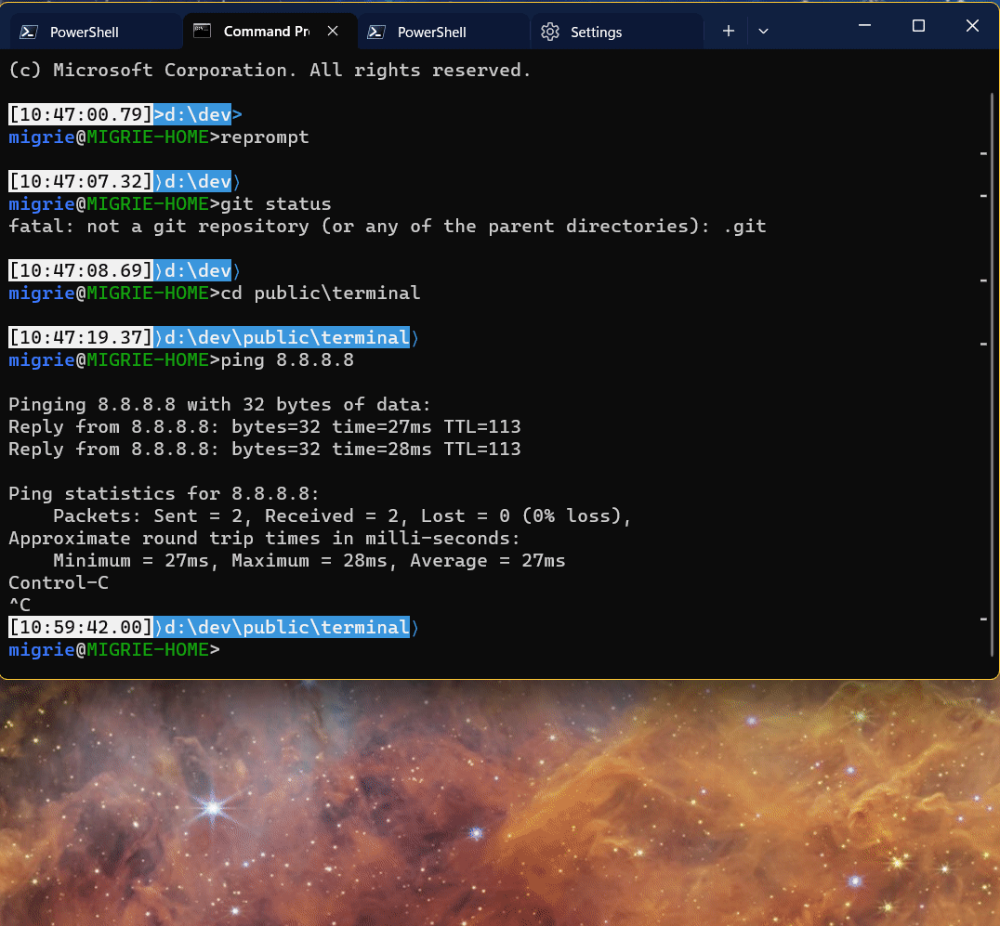
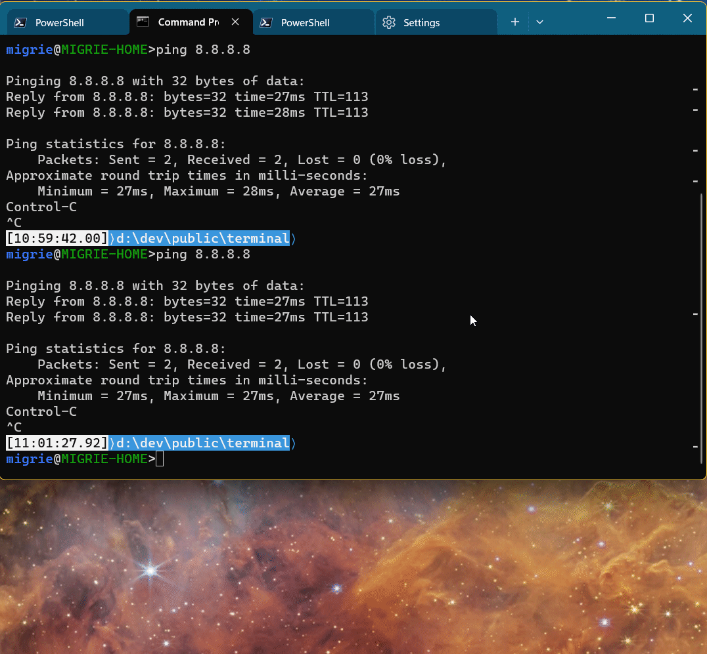

# Windows Terminal - Snippets  <!-- nee "Tasks" -->

## Abstract

The command line is a highly powerful tool. However, its power is dependent on
the user's knowledge of the specific commands, flags and parameters needed to
perform tasks from the command-line. For simple everyday commands, this might not
be so hard. For longer commands, or ones used less frequently, there's quite a
bit of mental overhead trying to recall the exact syntax. For teams, it might be
helpful to share these tasks with everyone on the project. The Terminal can be a
aveneue by which complicated tasks can be remembered, shared, discovered and
recalled by the user simply thinking **"what do I want to do"**, rather than
"how do I do it".

## Background

> **Note**:
>
> This largely builds off of work in the [Suggestions UI], for displaying these
> tasks to the user. Make sure to read that spec first.

### Inspiration

The primordial version of this idea was probably [#keep] - a command-line tool I
wrote for stashing long command-lines and directories, and recalling them with
just a number. We've had many variations on this idea over the years - [#1595]
was probably the first such request on the Terminal repo. ITerm2 also had [a
similar feature](https://iterm2.com/images/CommandHistory.png). Theirs was more
directly tied to shell integration (that menu is populated from commands that
they know were run in the shell). In the absence of shell integration though, it
should be able to save these commands to a menu manually.

It is hard to say that the ultimate vision here isn't partially inspired by the
"[workflows]" of [Warp], or by [Fig]. These are modern tools that seek to
augment the command-line experience, by making the command-line more
approachable. Warp quite clearly has the same concept in "workflows" - scripts
which the user can build and Warp (a Terminal emulator) can insert quickly. Fig,
on the other hand, is more focused on just simplifing the command-line
experience. Fig is more about providing additional metadata to the user as
they're typing. They are [also working on workflows], so there's clearly quite a
bit of ecosystem-wide demand for more discoverable command-line tooling.

Consider also [VsCode Tasks]. These are files which can be placed in the root of
a workspace, and share common tasks between users of that workspace. They've got
support for starting processes, with a set of args. These args can also be
picked at runtime, and custom sets of arguments can be specified for individual
arguments.

We've had verbatim feedback that developers already attempt to record useful 
commandlines in various different ways - in OneNotes, in shell scripts, in 
aliases. Furthermore, developers often share these commands with the rest of 
their teams. Providing a unified way to easily store, browse, and use these 
command lines should be valuable to developers  already doing this. A static 
file in their project containing commands for the whole team seems like a simple 
solution to this problem.

### User Stories

Story |  Size | Description
--|-----------|--
A | ✅  | Users can bring up a menu of command line tasks and quickly execute them
B | ✅   | Fragment apps can provide tasks to a users settings
D | 🚶 Walk   | The user can save commands straight to their settings with a `wt` command
E | 🚶 Walk   | Users can have different tasks enabled for different profiles(/shells?)
G | 🚶 Walk   | The Terminal displays a Snippets Pane for easy browsing of relevant snippets 
Y | 🚶 Walk   | Users should be able to save snippets directly from the commandline 
F | 🏃‍♂️ Run    | The terminal can automatically look for command fragments in the tree of the CWD
X | 🏃‍♂️ Run    | Snippets with multiple lines can be sent only conditionally on the success of the previous command (with shell integration)
J | ✅    | Snippets can be filtered by text the user has already typed
K | 🚀 Sprint | Snippets can have promptable sections of input
L | 🚀 Sprint | Community tasks are hosted in a public GH repo
M | 🚀 Sprint | A simple UX (either web or in Terminal) is exposed for interacting with public GH repo of tasks

### Elevator Pitch

The Terminal can remember long command-lines and display them with user-friendly
descriptions of _what they actually do_. These tasks can be searched by intent,
rather than the particular combination of flags. They can be shared with members
of your team, so everyone has easy access to common tasks for a project.

### Why not just aliases / native script files?

Why not just take these tasks and put them into a shell alias? For longer tasks,
why not just stick them in a `.ps1`/`.bat`/`.sh`/etc file? This is an option
that's existed since the time immemorial. However, this still requires the user
to remember that they've created these aliases/scripts, remember where they're
stored, and remember how they work.

By providing a dedicated UI for these command-lines, they can always be at your
fingertips. No need to remember what the alias for a particular command-line is -
just look up what you want to do. Aliases and scripts are no longer scattered
across `.bashrc`, `.bash_profile`, `.profile`, etc, they can all be stashed in
the Terminal config, or in the project they're relevant to. By stashing them
alongside the code, then anyone else coming to work on the code can have
immediate access to useful sets of tasks.

Aliases have a tendency towards more experienced shell users. This proposal
instead brings the power of these aliases and scripts right to the foreground,
with a cross-shell mechanism of exposing them to even beginners. With fragment
extensions, tools can bundle common workflows together with their application so
the Terminal can automatically load them for the user.

## Business Justification

It will delight developers.

## Scenario Details

### Implementation Details

For the most part, this is already implemented as the `sendInput` action. These 
actions send text to the terminal already, and work quite well as snippets. 

#### Basics

We'll want to also augment `sendInput` to add support for `input` as an array of strings, not only a single string value. When the input is a list of strings, then the terminal can send each string, seperated by the <kbd>enter</kbd> key. 
We can also add a `waitForSuccess` parameter to `sendInput` (with a default value of `false`). If that's set to `true`, and shell integration is enabled, then the Terminal will wait to send each command until the previous command exits. 

As another minor improvement, we'll add a `description` property to Commands. This will allow users to add additional information to snippets which we can surface. Additionally, extension authors could provide more details as well. 

As a matter of renaming, we'll also update `"source": "tasks"` for the `SuggestionsSource` enum to instead be `snippets` (and gracefully update that where we find it). "tasks" was an older name for this feature, and "snippets" will better align with our partners in VsCode. 

##### Multi-line snippets example

Consider the [following script](https://gist.github.com/zadjii-msft/b598eebd6c5601328498e3e7acc581a7):

```pwsh
$s=Invoke-GitHubGraphQlApi "query{organization(login:`"Microsoft`"){projectV2(number: 159) { id } } }"

$tasks = get-githubissue  -Labels "Issue-Task" -state open
$bugs = get-githubissue  -Labels "Issue-Bug" -state open
$issues = $tasks + $bugs

$issues | ? {$_.labels.Name -notcontains "Needs-Triage" } | ? { $_.milestone.title -Ne "Icebox ❄" } | ? type -Ne "PullRequest" | select -expand node_id | % {
  $resp = add-githubbetaprojectitem -projectnodeid $s.organization.projectV2.id -ContentNodeId $_ ;
}
```

As just a raw sendInput action with a single `input`, this would look like the following:

```jsonc
{
    "command":
    {
        "action": "sendInput",
        "input": "$s=Invoke-GitHubGraphQlApi \"query{organization(login:`\"Microsoft`\"){projectV2(number: 159) { id } } }\"\r\n$tasks = get-githubissue  -Labels \"Issue-Task\" -state open\r\n$bugs = get-githubissue  -Labels \"Issue-Bug\" -state open\r\n$issues = $tasks + $bugs\r\n$issues | ? {$_.labels.Name -notcontains \"Needs-Triage\" } | ? { $_.milestone.title -Ne \"Icebox ❄\" } | ? type -Ne \"PullRequest\" | select -expand node_id | % {\r\n  $resp = add-githubbetaprojectitem -projectnodeid $s.organization.projectV2.id -ContentNodeId $_ ;\r\n}"
    },
    "name": "Upload to project board",
    "description": "Sync all our issues and bugs that have been triaged and are actually on the backlog to the big-ol project",
},
```

This JSON is basically entirely unusable. Since JSON doesn't support multiline
strings, then every line has to be joined to a single line, seperated by `\r\n`.

Insstead, the following version of this command uses an array for the `input` parameter. This then implies that each string should be sent in sequence, with <kbd>enter</kbd> between
them.

```jsonc
{
    "command":
    {
        "action": "sendInput",
        "input":
        [
            "$s=Invoke-GitHubGraphQlApi \"query{organization(login:`\"Microsoft`\"){projectV2(number: 159) { id } } }\"",
            "$tasks = get-githubissue  -Labels \"Issue-Task\" -state open",
            "$bugs = get-githubissue  -Labels \"Issue-Bug\" -state open",
            "$issues = $tasks + $bugs",
            "$issues | ? {$_.labels.Name -notcontains \"Needs-Triage\" } | ? { $_.milestone.title -Ne \"Icebox ❄\" } | ? type -Ne \"PullRequest\" | select -expand node_id | % {",
            "  $resp = add-githubbetaprojectitem -projectnodeid $s.organization.projectV2.id -ContentNodeId $_ ;",
            "}",
            ""
        ]
    },
    "name": "Upload to project board",
    "description": "Sync all our issues and bugs that have been triaged and are actually on the backlog to the big-ol project",
},
```
This is slightly more maintainable. But now, a user could set `"waitForSuccess": true`, and if any part of the script fails, then the rest of it won't be sent to the shell. 

#### Fragment actions

This was already added in [#TODO!](https://link/to/issue). These will allow third-party developers to create apps which add additional snippets to the Terminal. These will require app developers to add `id`s to each action they add in this way. Users can then bind that action `id` to a keybinding, if they so choose. 

#### Examples


### Snippets pane

With non-terminal content landing in 1.21 Preview, it's now simple to add additional types of panes to add to the Terminal. We'll support a new pane `"type": "snippets"`, to support opening the Snippets pane. 

This will be a pane with a `TreeView` in it and a text box to filter results (ala the Command Palette). 

Each item in the TreeView will be a kind of `FilteredCommand`, with a play button to support quickly running the command. 

This pane could also support all the different suggestion sources that the Suggestions UI supports - `recentCommands` could be plumbed into it from the currently active 
This pane could also support checkboxes to filter different suggestion sources. 

### Per-Project Snippets (`.wt.json`)

> [INFO!]
>
> TODO!: Let's make sure to discuss the filename. It doesn't need to be `.wt.json`. That seemed to match things like `.clang-format`, `.vsconfig`, etc, but then also included the extension. However, node projects just use `package.json` without the leading `.` for storing per-project commands. Perhaps `.wt.json` is the worst of both? The best of both?

Users may also want to leave snippets in the root of their repo, for others to use as well. To support this, the Terminal will automatically look for a `.wt.json` file in any directories that are parents of the CWD of the shell, and load actions from that file as if it were a fragment extension as well. That will start with the `startingDirectory` for any new panes created. If the user has shell integration configured to tell the Terminal about the CWD, then we'll refresh that list as the user changes directories. 

* In `Terminal.Settings.Model`, we will store a cached map of path->actions. 
  * that if multiple panes are all in the same CWD, they don't need to individually re-read the file from disk and regenerate that part of the map. 
* I believe it should be impossible for a keybinding to be bound to a local action. Even if it has an ID, the file won't be loaded when we build the keymap, and we don't really want the keymap changing based on CWD. Also, with the actions living in an entirely separate map of CWD->actions, the keybindings in the main map won't be able to easily get to them. See also [Security considerations](#TODO!/link/me/up) for more.
* If the Snippets pane or Sugestions UI is opened with `local` suggestions as a source, then we'll just append the appropriate list of suggestions for the active control's CWD. 
  * We don't need to have the control raise an event when the CWD changes - we can lazy-load these actions when a UI element that requires it is first invoked. 
* The Command Palette is trickier, since it binds directly to the action map. We'd need to be able to freely modify that map at runtime, which might be prohibitively annoying. 
<!-- * If we want these actions to show up in the Command Palette, we'll need to:
  * We'll stash these actions in the action map as they're loaded. (in `Terminal.Settings.Model`)
  * We'll need to be able to dynamically remove them at runtime from the map (in `Terminal.Settings.Model`) -->
* If we find multiple `.wt.json` files in the ancestors of the CWD (e.g. for `c:\a\b\c\d\`, there's a `c:\a\.wt.json` and a `c:\a\b\c\.wt.json`), then we'll add each one separately to the map of paths->CWDs. When requesting the actual actions for `c:\a\b\c\d\`, we'll layer the ones from `c:\a\` before the ones from `c:\a\b\c`, so that deeper descendants take precedence.  

### Saving snippets from the commandline

_This has laready been prototyped in [#TODO!](add/the/link)_

Users should be able to save commands as snippets directly from the commandline. Consider: you've just run the command that worked the way you need it to. You shouldn't have to open the settings to then separatey ccopy-paste the command in to save it. It should be as easy as <kbd>Up</kbd>, <kbd>Home</kbd>, `wt save `, <kbd>Enter</kbd>.

The exact syntax as follows:

This will be powered by a `saveInput` (TODO! that's not right is it) action behind the scenes. After running this command, a toast will be presented to the user to indicate success/failure. 

#### `save` subcommand

`save [--name,-n name][--description,-d description][-- commandline]`

Saves a given commandline as a sendInput action to the Terminal settings file. This will immediately write the Terminal settings file. 

**Parameters**:
* `--name,-n name`: The name to assign to the `name` parameter of the saved command. If omitted, then the parameter will be left blank, and the command will use the auto-generated "Send input:..." name in menus.
* `--description,-d`: The description to optionally assign to the command. 
* `commandline`: The commandline to save as the `input` of the `sendInput` action. 

If the `save` subcommand is ran without any other subcommands, the Terminal will
imply the `-w 0` arguments, to attempt to send this action to the current
Terminal window. (unless of course, `-w` was manually provided on the
commandline). When run with other subcommands, then the action will just be ran
in the same window as all the other subcommands.  

### UI/UX Design

For the most part, we'll be using the [Suggestions UI] to display tasks to the
user. This is a text cursor-relative UI surface that can quickly display actions
to the user, in the context of what they're working on.

The following are some examples from VsCode, Warp. These are meant to be
illustrative of what these menus already look like in the wild:

<!-- TODO! uncomment  -->

<!-- TODO! uncomment  -->

TODO! update these

<!-- 
A prototype of the recent commands UI, powered by shell integration:



A prototype of the tasks UI, powered by the user's settings:



A prototype of saving a command directly to the user's settings, then invoking it via the tasks UI


A prototype of reading tasks from the CWD

 -->

<hr> <!-- end of onepager -->

-----------------
(above this is done)
<!-- 
[TODO!]: # TODO! ---------------------------------------------------------------
What info do we all want for these tasks?

* The text to send to the terminal
  - This might be multiple lines of text, with newlines in it
* A friendly description of the command (different from the name?)
* Sections of the input that are promptable, s.t. the user can save the command
  as a "template", and fill it in at runtime
  - ex: `nuget push -apikey az -source TerminalDependencies ${path-to-nuget-package}`
  - how do we specify these as promptable sections without stomping on all sorts
    of other shells syntaxes?
* ~Maybe metadata about the command that it is used for? e.g. `git`, `docker`?~
  - This can probably be figured out from the first word of the command
* What shell it should be used for?
  - CMD, pwsh seem like clear choices.
  - linux shells are trickier - not sure Terminal can always figure out what
    shell is actually running once it boots up WSL. Is it `bash`? `zsh`? `fish`?
  - Running `ssh me@some-linux.box` from a CMD shell would instantly blow up
    shell-specific commands
  - a profile with a command-line of `cmd /k doTheThing & ssh you-get-it`, again,
    would blow up the heuristic matching
  - So maybe this is a **bad idea**. Maybe we should just leave tasks as "this
    is just a string of text for the commandline, you gotta know which shell to
    use it with"

#### Layering actions

* Fragments shouldn't be able to unbind actions from keys, _right_? TODO!
* How do we differentiate multiple actions with the same name, but different descriptions? I think everything is keyed off on Name at this point. Maybe it should be off some hash.

#### Settings comparison

##### Simple task

```pwsh
nuget push -apikey az -source TerminalDependencies ${path-to-nuget-package}
```

The JSON is pretty strightforward:

```jsonc
{
    "actions":
    [
        {
            "command":
            {
                "action": "sendInput",
                "input": "nuget push -apikey az -source TerminalDependencies ${path-to-nuget-package}"
            },
            "name": "Push to nuget feed",
            "description": "Used to upload a new dependency nuget to our internal nuget feed.",
        },
    ]
}
```

The trick here is the `${path-to-nuget-package}`. PowerShell accepts the
`${foo}` syntax to mean "a variable named `foo`". So us using that in our
settings syntax would require users to escape our parsing, if they wanted to use
that syntax in powershell.

##### Multiline script

For the [following script](https://gist.github.com/zadjii-msft/b598eebd6c5601328498e3e7acc581a7):

```pwsh
$s=Invoke-GitHubGraphQlApi "query{organization(login:`"Microsoft`"){projectV2(number: 159) { id } } }"

$tasks = get-githubissue  -Labels "Issue-Task" -state open
$bugs = get-githubissue  -Labels "Issue-Bug" -state open
$issues = $tasks + $bugs

$issues | ? {$_.labels.Name -notcontains "Needs-Triage" } | ? { $_.milestone.title -Ne "Icebox ❄" } | ? type -Ne "PullRequest" | select -expand node_id | % {
  $resp = add-githubbetaprojectitem -projectnodeid $s.organization.projectV2.id -ContentNodeId $_ ;
}
```

The JSON is basically entirely unusable. Since JSON doesn't support multiline
strings, then every line has to be joined to a single line, seperated by `\r\n`.

```jsonc
{
    "actions":
    [
        {
            "command":
            {
                "action": "sendInput",
                "input": "$s=Invoke-GitHubGraphQlApi \"query{organization(login:`\"Microsoft`\"){projectV2(number: 159) { id } } }\"\r\n$tasks = get-githubissue  -Labels \"Issue-Task\" -state open\r\n$bugs = get-githubissue  -Labels \"Issue-Bug\" -state open\r\n$issues = $tasks + $bugs\r\n$issues | ? {$_.labels.Name -notcontains \"Needs-Triage\" } | ? { $_.milestone.title -Ne \"Icebox ❄\" } | ? type -Ne \"PullRequest\" | select -expand node_id | % {\r\n  $resp = add-githubbetaprojectitem -projectnodeid $s.organization.projectV2.id -ContentNodeId $_ ;\r\n}"
            },
            "name": "Upload to project board",
            "description": "Sync all our issues and bugs that have been triaged and are actually on the backlog to the big-ol project",
            "shell": "pwsh",
        },
    ]
}
```

This version instead adds a `commands` parameter to `sendInput`, with the
implication that each of these should be sent with <kbd>enter</kbd> between
them.

```jsonc
{
    "actions":
    [
        {
            "command":
            {
                "action": "sendInput",
                "commands":
                [
                    "$s=Invoke-GitHubGraphQlApi \"query{organization(login:`\"Microsoft`\"){projectV2(number: 159) { id } } }\"",
                    "$tasks = get-githubissue  -Labels \"Issue-Task\" -state open",
                    "$bugs = get-githubissue  -Labels \"Issue-Bug\" -state open",
                    "$issues = $tasks + $bugs",
                    "$issues | ? {$_.labels.Name -notcontains \"Needs-Triage\" } | ? { $_.milestone.title -Ne \"Icebox ❄\" } | ? type -Ne \"PullRequest\" | select -expand node_id | % {",
                    "  $resp = add-githubbetaprojectitem -projectnodeid $s.organization.projectV2.id -ContentNodeId $_ ;",
                    "}",
                    ""
                ]
            },
            "name": "Upload to project board",
            "description": "Sync all our issues and bugs that have been triaged and are actually on the backlog to the big-ol project",
            "shell": "pwsh",
        },
    ]
}
```

Still gross, but at least maintainable.

YAML or something else might make more sense here. -->
<!-- 
#### Per-project tasks(`.wt.json`?)

In addition to tasks stored in the user's `settings.json`, we also want to provide users with a way to store commands relative to their projects. These can be checked in to source control repositories alongside code. When the

[TODO!]: # TODO! ---------------------------------------------------------------
How do we want to represent this?
* snippets of JSON with `sendInput` actions is easy for the Terminal to understand.
* They are probably not that user friendly outside of Windows Terminal.
  Consider, users are gonna stick these JSON blobs in the root of their repo.
  Theoretically other tools should use them too. Is our json actions syntax what
  we'd really want to saddle people with?
* JSON is not super friendly to command-lines - since everything's gotta be
  encapsulated as a string, then you've got to escape characters (esp quotes
  `"`) for JSON strings
  - on the other hand, embedding tabs `\t`, newlines `\r`, escape characters, is fairly
    straightforward.
* Anything that's not JSON blobs will require a lot of spec'ing to come up with
  a standard, and more expensive implementation Terminal-side
  * For what it is worth, [Warp] uses .yaml files for their "workflows"[[1](#footnote-1)]. As an
    example, see
    [`clone_all_repos_in_org.yaml`](https://github.com/warpdotdev/workflows/blob/main/specs/git/clone_all_repos_in_org.yaml)
  * Yaml does have the neat benefit of not needing too much command-line escaping
* How do we want this to play with longer workflows? E.g. our familiar [winget script]
* Markdown [Notebooks] seems relevant here, but probably not best for annotating
  specific commands that we want the Terminal to pick up on. A
  `.terminal-tasks.md` seems simple enough to look for, but embedding metadata
  about which shell, what text should be prompted for, descriptions, that does
  seem harder.
##### File name

In my original prototype, I used `.wt.json` as the filename for a
filesystem-relative commands. This seems to me like a bit of a silly file name.
Node proejcts can store various aliases for commands in their `package.json`
file. Perhaps the `.` prefix isn't necessary. Would `wt.json` be too silly?

[TODO!]: # TODO! --------------------------------------------------------------- -->

##### Save to project on the commandline

As an example implementation, see [these
commits](https://github.com/microsoft/terminal/compare/6f5b9fb...1cde67ac466e19394eea1eb3a41405513d160a6f).

`wt save --local commandline...`?
`wt save --settings commandline...`?
`wt save --file [path to file] commandline...`?

##### Shell escaping commandlines

Something like `wt save ping 8.8.8.8 > foo.txt` isn't going to work the way
users want. The shell is gonna get the first crack at parsing that commandline,
and is going to try and redirect the _output of `wt`_ to `foo.txt`.

<!-- This is something I encountered in #keep constantly -->

[TODO!]: # TODO! ---------------------------------------------------------------

Is there a better way to escape, like `wt save "ping 8.8.8.8 > foo.txt"` or something?

#### Community tasks from extensions

[TODO!]: # TODO! ---------------------------------------------------------------

Fragment extensions. Case in point: https://github.com/abduvik/just-enough-series/tree/master/courses/docker+docker-compose


## Tenents

<table>

<tr><td><strong>Compatibility</strong></td><td>

I considered supporting YAML for local snippets (`.wt.json`), instead of JSON.
JSON is not super friendly to command-lines - since everything's gotta be
encapsulated as a string. Embedding tabs `\t`, newlines `\r`, escape characters,
is fairly straightforward. However, quotes can get complicated fast in JSON,
since they've got to be escaped too, and with many CLI utilities also having
separate quote-parsing rules, JSON can get unwieldy quickly.

However, supporting YAML directly would require us to spec out a YAML syntax for
these files, and also find an OSS YAML parser and implement support for it. That
would be quite a bit more expensive than JSON.

</td></tr>

<tr><td><strong>Accessibility</strong></td><td>

[comment]: # TODO!

</td></tr>

<tr><td><strong>Sustainability</strong></td><td>

No substantial climate impacts expected here. We're not using expensive compute
resources for this feature, so the impact should be comparable to any other
Terminal feature.

</td></tr>

<tr><td><strong>Localization</strong></td><td>

I'm mildly worried here about the potential for community-driven tasks to have
non-localized descriptions. We may need to accept a `description:{ en-us:"",
pt-br:"", ...}`-style map of language->string descriptions. That may just need
to be a future consideration for now.

</td></tr>


<tr><td><strong>Security</strong></td><td>

Another reason we shouldn't support keys being able to be lazy-bound to local
snippets: It's entirely too easy for `malicious.exe` to create a file in
`%homepath%` that creates a snippet for `\u003pwn-your-machine.exe\r` (or
similar). Any app can read your settings file, and it is again too easy for that
malicious app to set it's own action `id` to the same as some other well-meaning
local snippet's ID which you DO have bound to a key.

</td></tr>

</table>

[comment]: # If there are any other potential issues, make sure to include them here.

## Implementation Plan

### 🐣 Crawl
* [ ] The command palette needs to be able to display both the command name and a comment?
  - This will need to be reconciled with [#7039], which tracks displaying non-localized names in the command palette
* [X] [#1595] Add the Suggestions UI, with support for `tasks`
* [ ] Fragments can add **actions** to a user's settings
* [ ] [#10436] Users can manage all their fragments extensions directly in the Settings UI

### 🚶 Walk
* [ ] The terminal can look for a settings file of tasks in a profile's `startingDirectory`
* [ ] [#5790] - profile specific actions
* [ ] [#12927]
* [ ] [#12857] Ability to save selected text as a `sendInput` action

### 🏃‍♂️ Run
* [ ] When the user `cd`s to a directory (with shell integration enabled), the terminal can load the tasks from that directory tree
  - Kinda dependent on [#5790] and fragment **actions**, so we understand how they should be layered.
* [ ] Fork of [#12927] - promptable sections can accept a command to dynamically populate options

### 🚀 Sprint
* [ ]
* [ ]


## Conclusion

[comment]: # Of the above proposals, which should we decide on, and why?


### Future Considerations


* We may want to add additional params to the `save` subcommand in the future, to configure where the snippet is saved:
  * `--local`: Save to the `.wt.json` in the CWD, if there is one (or create one)
  * `--parent`: Save to the `.wt.json` in the first ancestor of the CWD, if there is one. Otherwise create one here. 
  * `--settings`: Manually save to the settings file?
  * `--profile`: save to this profile???? Not sure if this is actually possible. Maybe with the `WT_SESSION_ID` env var to figure out which profile is in use for the pane with that ID
* Longer workflows might be better exposed as notebooks. We've already got a mind 
  to support [markdown in a notebook-like experience](https://TODO!/put/link/here) 
  in the Terminal. For longer scripts that may need rich markup between commands, 
  that will likely be a better UX. 
* For what it is worth, [Warp] uses .yaml files for their "workflows".  As an example, see [`clone_all_repos_in_org.yaml`](https://github.com/warpdotdev/workflows/blob/main/specs/git/clone_all_repos_in_org.yaml). 
  We may want to straight up just seemlessly support that syntax as well. Converting them to WT-compatible json is fairly trivial [[1](#footnote-1)]. 
  Furthermore, the commands are all licensed under Apache 2.0, which means they can be easily consumed by other OSS projects and shared with other developers. This leads us to the next future consideration: 

### Community Snippets

_The big stretch version of this feature._

It would be supremely cool to have a community currated list of Snippets, for
various tools. Stored publicly on a GitHub repo (a la the winget-pkgs repo).
Users can submit Snippets with descriptions of what the Snippet does. The
Terminal can plug into that repo automatically and fetch the latest community
commands, immediately giving the user access to a wide bearth of common
Snippets. That could easily be done as another suggestion source (in the same
vein as `local` is.)

## Resources

[comment]: # Be sure to add links to references, resources, footnotes, etc.


### Footnotes

<a name="footnote-1"></a>[1]: For your consideration, a python script that will take the Warp workflow YAML and convert it into json that the Terminal can load. 

```python
import yaml
import json

def parse_yaml_files(directory):
    json_data = {}
    json_data["name"] = f"{directory} workflows..."
    json_data["commands"] = []

    for filename in os.listdir(directory):
        if filename.endswith(".yaml") or filename.endswith(".yml"):
            file_path = os.path.join(directory, filename)
            with open(file_path, 'r') as file:
                try:
                    yaml_data = yaml.safe_load(file)
                    new_obj = {}
                    command = {}
                    command["input"] = yaml_data["command"]
                    command["action"] ="sendInput"

                    new_obj["command"]=command
                    new_obj["name"] = yaml_data["name"]
                    new_obj["description"] = yaml_data["description"]
                    json_data["commands"].append(new_obj)
                except yaml.YAMLError as e:
                    print(f"Error parsing {filename}: {e}")
    json.dump(data, file, indent=4)
```


[Fig]: https://github.com/withfig/autocomplete
[Warp]: https://www.warp.dev/
[workflows]: https://docs.warp.dev/features/workflows
[also working on workflows]: https://fig.io/user-manual/workflows
[winget script]: https://github.com/microsoft/PowerToys/blob/main/.github/workflows/package-submissions.yml
[#1595]: https://github.com/microsoft/terminal/issues/1595
[#7039]: https://github.com/microsoft/terminal/issues/7039
[#3121]: https://github.com/microsoft/terminal/issues/3121
[#10436]: https://github.com/microsoft/terminal/issues/10436
[#12927]: https://github.com/microsoft/terminal/issues/12927
[#12857]: https://github.com/microsoft/terminal/issues/12857
[#5790]: https://github.com/microsoft/terminal/issues/5790
[Notebooks]: ./Markdown%20Notebooks.md
[Suggestions UI]: ./Suggestions-UI.md
[#keep]: https://github.com/zadjii/keep
[VsCode Tasks]: https://github.com/microsoft/terminal/blob/main/.vscode/tasks.json

<!-- TODO! -->
[shell-driven autocompletion]: ./Terminal-North-Star.md#Shell_autocompletion

