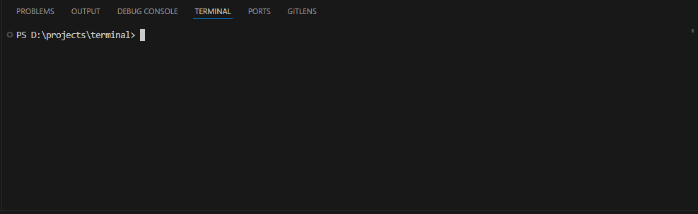
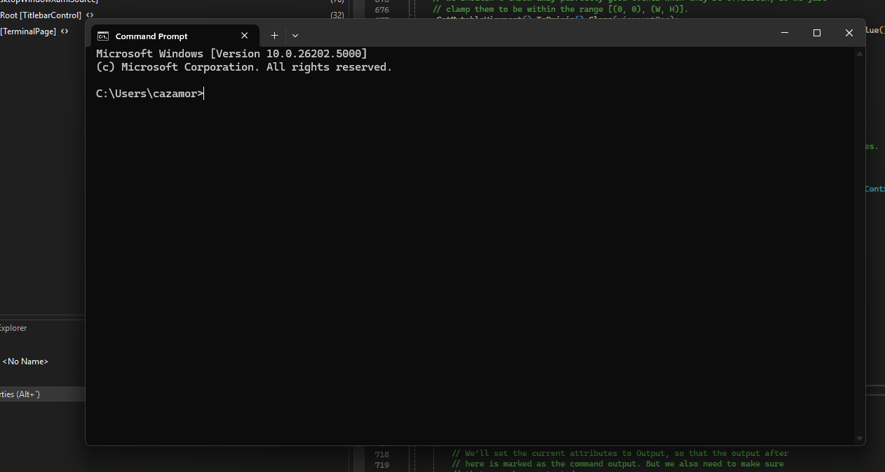
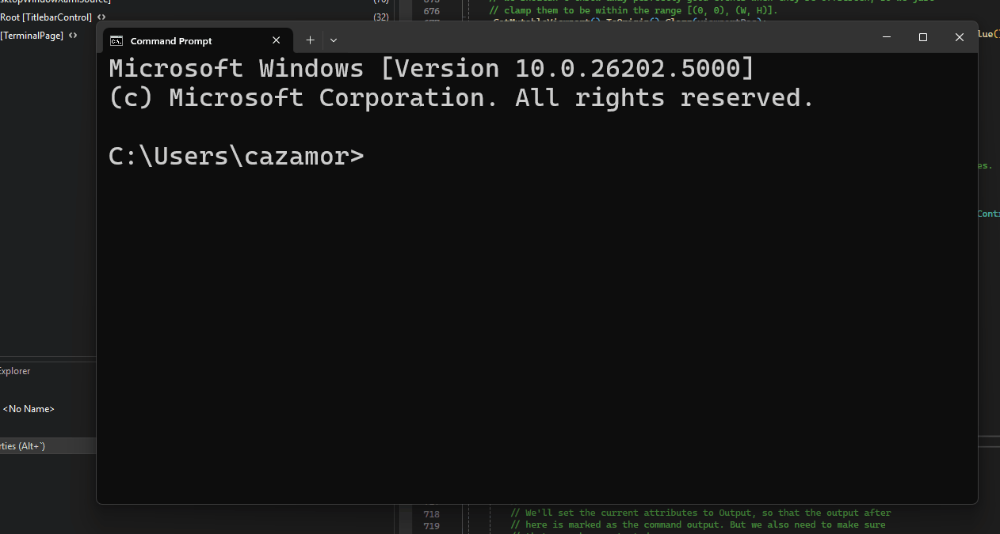
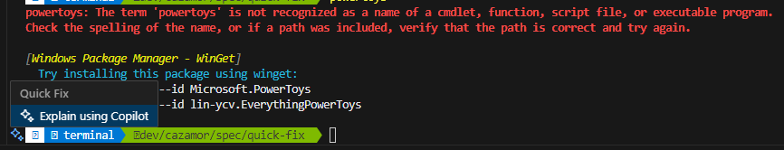

# Quick Fix
## Solution Design
Quick Fix will be a new UI surface that allows the user to interact with the terminal and leverage the context of a specific command being executed. The UI is discussed in the [UI/UX Design section](#ui/ux-design).

The UI itself will live in the TerminalControl layer, but it can be populated by both the TerminalControl and the TerminalApp layer (similar to the context menu). The suggestions will be appended as top-level items. Only one Quick Fix menu will be available at a time as it only appears on the latest prompt if an error occurred; this is in alignment with VS Code's design.

The actual suggestions will be populated from various sources such as the following:
- WinGet Command Not Found OSC Sequence:
	- `OSC 9001; CmdNotFound; <missingCmd>` will be used by the attached CLI app to notify the terminal that a command `missingCmd` wasn't found. The TerminalControl layer will notify the TerminalApp layer that this VT sequence as received and the TerminalApp layer will use WinGet's API to search for any packages that would remediate this error and construct a list of suggested packages to be installed.
`OSC 9001` can be expanded on to add more suggestions via VT sequences from the underlying CLI app; for more on this, read the [Future considerations section](#future-considerations).

TerminalApp will be notified upon receiving an `OSC 9001; CmdNotFound`. At this point, we'll know that a Quick Fix menu must be shown at the next prompt, and we can use the WinGet API to convert the given `missingCmd` into a list of suggestions (in this case, of the form `winget install...`). These suggestions will be handed back down to the TerminalControl layer to be added to the Quick Fix menu as entries. Since we're in the TerminalControl layer, the suggestions may not need to be converted into SendInput actions, as we already have access to the `RawWriteString()` api. The menu will simply use `RawWriteString()` to inject the string into the prompt.

A corner case that VS Code handles is that if there is already text in the prompt area, it sends a `^C`, then injects the suggestion, then executes it. In Windows Terminal, for simplicity, we'll always send a ^C, inject the suggestion, and execute it.[^5]

An additional corner case is handling a buffer resize and reflow. Since there will only ever be one Quick Fix menu and it will be displayed at the prompt, we'll simply use the cursor position to figure out where the prompt is.

The WinGet API to convert the given `missingCmd` into a list of suggestions may be relatively slow as we have to query the WinGet database. Performing the search when the quick fix menu is open would not be ideal as the user may have to wait for WinGet to finish searching. Instead, the conversion should happen around the time that the prompt is introduced (whether from output or a reflow scenario) asynchronously, off the output thread.

## UI/UX Design
A Quick Fix icon will be displayed immediately left of the prompt. If the icon fits in the left-padding region (a `padding` value where the left side is 16 or greater), it will be drawn there. Otherwise, a thin accent-colored vertical bar will be displayed overlapping the text region; when the icon is hovered over, the icon will appear more clear by becoming more opaque and enlarging to overlap with the text region.

When the icon (exposed as a button) is invoked, the Quick Fix menu (exposed as a flyout menu) will be displayed. This menu will include the following:
- WinGet Command Not Found:
	- If a command wasn't found in the immediately previous output (between prompts), this entry will be enabled. It includes a nested menu of all the WinGet suggestions. If no suggestions were found or the previous output didn't have a missing command, this entry will be disabled.
- App Suggestions:
	- The underlying CLI app could specifically recommend a command using a custom VT Sequence. For more information, read the [Future considerations section](#future-considerations).
These suggestions will be displayed as "Run: \<command\>", which aligns with the design used in VS Code's Quick Fix menu.

### Mockups
The design is based on VS Code's Quick Fix feature, which looks like the following:

When the Quick Fix button fits in the gutter, it will look like the following:

If the Quick Fix button doesn't fit well in the gutter, it will be collapsed and expand when the mouse hovers over it. It will look like the following:

## Accessibility
When a Quick Fix is available, an accessibility notification should be dispatched to alert the user that it is available. Aside from that, Quick Fix must be keyboard accessible via a default key binding. The UI will be a WinUI flyout menu, so it will be accessible by default once it is displayed and under focus.

## Future considerations
If the user has shell integration enabled in the session, we should be able to detect if the user has typed in the prompt. This way, we can be smarter about when to send the `^C` instead of always sending it.

The Quick Fix menu can also be a home for future extensions to live. We can and should take inspiration from VS Code's implementation[^2] [^3].

Other possible sources of suggestions in the quick fix menu include the following:
- App Suggestions:
	- `OSC 9001; SuggestInput; <cmd>; <description>` will be used by the attached CLI app to directly make suggestions to the terminal. The TermControl layer will stuff the `cmd` parameter into a new entry in `Suggestions`. An optional `description` can be provided to display in the UI for additional information.
- Triggers and Pattern Matchers[^4] (Similar to VS Code's Terminal[^1])
	- when `git push` fails due to an upstream not being set, suggest to push with the upstream set.
	- When a `git` subcommand fails with a similar command error, suggest to use the similar command(s).
	- When `git push` results in a suggestion to create a GitHub PR, suggest to open the link.
As more sources of suggestions are added, `IVector<String> GetQuickFixContext(UInt32 Row)` will be modified to return `IVector<QuickFixSuggestion>` instead, where the `QuickFixSuggestion` will be able to include additional metadata like the optional description above, an icon, or anything we feel is necessary in the future.A nested design can be revisited to organize the suggestions better too.

This paradigm can be extended to gutter marks for shell integration as well.

The Quick Fix menu can also include an entry to redirect the user to Terminal Chat. VS Code has a similar feature that looks like this:

## Resources
[^1]: [VS Code: Terminal Quick Fix Documentation](https://code.visualstudio.com/docs/terminal/shell-integration#_quick-fixes)
[^2]: [VS Code: Expose shell integration command knowledge to extensions](https://github.com/microsoft/vscode/issues/145234)
[^3]: [VS Code: Terminal quick fix API](https://github.com/microsoft/vscode/issues/162950)
[^4]: [Triggers and Custom Clickable Links Spec](https://github.com/microsoft/terminal/pull/15700)
[^5]: If the user has shell integration enabled in the session, we should be able to detect if the user has typed in the prompt. This way, we can be smarter about when to send the `^C` instead of always sending it.