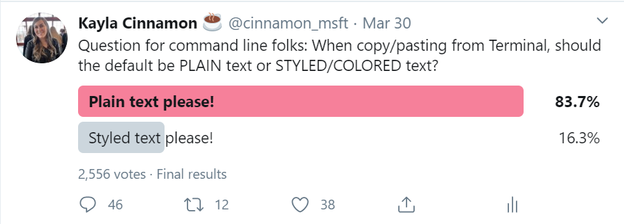

# Formatted Copy

## Abstract

When copying text, the Terminal should provide the option of including formatting. Not all apps that receive text allow for picking which format you want when pasting. The default should be to only copy plain text, based on the response from this poll on Twitter.

## Solution Proposals

A proposal for the right click behavior as well as two user settings proposals are described below. The conclusion the team arrived at is at the bottom under the [Conclusions section](#conclusions).

1. [Settings option 1 - global setting](#settings-option-1---global-setting)
2. [Settings option 2 - key binding argument](#settings-option-2---key-binding-argument)
3. [Right click behavior](#right-click-behavior)

### Settings option 1 - global setting

We could have a global setting that when enabled, would copy formatting to the clipboard on all copy operations.

### Settings option 2 - key binding argument

We could add an argument to the `copy` key binding argument to allow for formatted copying when the user chooses to do so.

### Right click behavior

By default, right clicking to copy would only copy the plain text.

## UI/UX Design

### Settings option 1 - global setting

a. The user could list which kinds of formats they want included when they copy. When right clicking, they would copy with these formats.

`"copyFormats": ["html","rtf","plain"]`

b. We could also just combine html and rtf into a single boolean. Users would either get plain text only (`false`) or all formatting (`true`) onto their clipboard. If this is set to `true`, the default right click behavior is reversed: right clicking copies the formatting.

`"copyFormatting": true`

### Settings option 2 - key binding argument

a. Just like the `trimWhitespace` argument you can add to the `copy` key binding, we could add one for text formatting. This would not change the right click behavior.

`{"command": {"action": "copy", "keepFormatting": true}, "keys": "ctrl+a"}`

b. We could also split out the html and rtf formats. The right click behavior would still stay as default.

`{"command": {"action": "copy", "formats": ["html","rtf","plain"]}, "keys": "ctrl+a"}`

## Capabilities

### Accessibility

This shouldn't affect accessibility.

### Security

This does not affect security.

### Reliability

This does not affect reliability.

### Compatibility

This breaks the existing behavior of always copying the formatting. The justification for breaking this default behavior is in response to the community saying the default should be plain text only.

### Performance, Power, and Efficiency

## Potential Issues

One possible issue is that discovering how to copy the formatting might be difficult to find. We could mitigate this by adding it into the settings.json file and commenting it out.

## Conclusions

The team has decided to have plain text as the default copy behavior and to enable formatted copying with a global setting that accepts a boolean value (settings option 1 - global setting, option b). In the future, we can modify this setting to also accept an array, so the user can specify which formats they would like to copy. Additionally, a key binding can be added to allow for greater flexibility.

## Future considerations

We could always add an additional option if people want more flexibility. For example, if we ship a global setting now, we could ship a key binding later that lets you choose how you want to copy, and vice versa. Additionally, we can add functionality to the global setting that allows for specific formats or styles to be copied.
