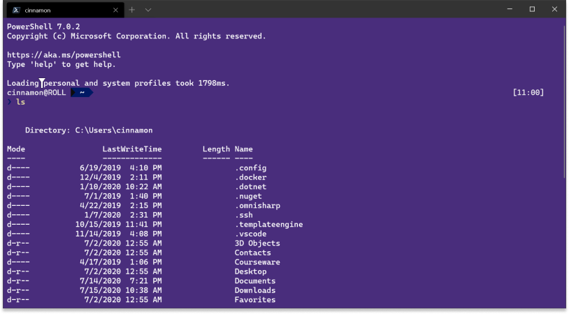
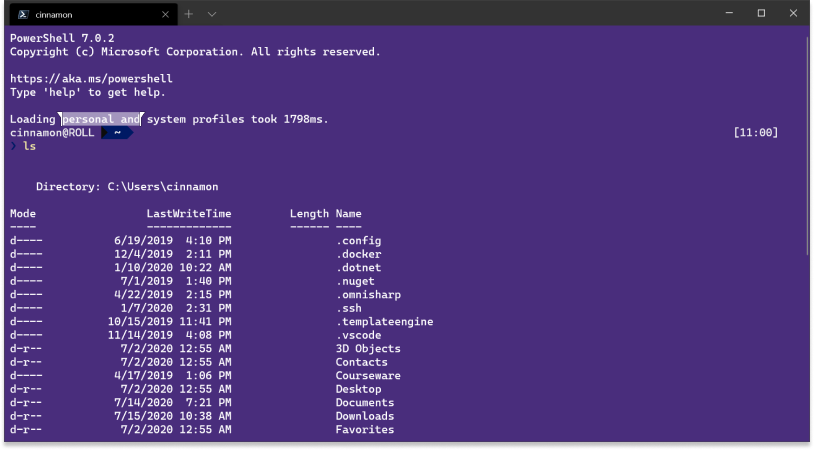

# Keyboard Selection

## Abstract

This spec describes a new set of key bindings that allows the user to create and update a selection without the use of a mouse or stylus.

## Inspiration

ConHost allows the user to modify a selection using the keyboard. Holding `Shift` allows the user to move the second selection endpoint in accordance with the arrow keys. The selection endpoint updates by one cell per key event, allowing the user to refine the selected region.

### Creating a selection
Mark Mode is a ConHost feature that allows the user to create a selection using only the keyboard. In CMD, pressing <kbd>ctrl+m</kbd> enters mark mode. The current cursor position becomes a selection endpoint. The user can use the arrow keys to move that endpoint. While the user then holds <kbd>shift</kbd>, the selection endpoint ('start') is anchored to it's current position, and the arrow keys move the other selection endpoint ('end').

Additionally, pressing <kbd>shift+arrow</kbd> also initiates a selection, but it anchors the first selection endpoint to the cursor position.

Other terminal emulators have different approaches to this feature. iTerm2, for example, has Copy Mode (documentation [linked here](https://iterm2.com/documentation-copymode.html)). Here, <kbd>cmd+shift+c</kbd> makes the current cursor position become a selection endpoint. The arrow keys can be used to move that endpoint. However, unlike Mark Mode, a key binding <kbd>c+space</kbd> is used to change the start/stop selecting. The first time it's pressed, the 'start' endpoint is anchored. The second time it's pressed, the 'end' endpoint is set. After this, you can still move a cursor, but the selection persists until a new selection is created (either by pressing the key binding again, or using the mouse).

Though tmux is not a terminal emulator, it does also have Copy Mode that behaves fairly similarly to that of iTerm2's.


## Solution Design

The fundamental solution design for keyboard selection is that the responsibilities between the Terminal Control and Terminal Core must be very distinct. The Terminal Control is responsible for handling user interaction and directing the Terminal Core to update the selection. The Terminal Core will need to update the selection according to the direction of the Terminal Control. Terminal Core maintains the state of the selection.

Relatively recently, TerminalControl was split into `TerminalControl`, `ControlInteractivity`, and `ControlCore`. Changes made to `ControlInteractivity`, `ControlCore`, and below propagate functionality to all consumers, meaning that the WPF terminal would benefit from these changes with no additional work required.

### Fundamental Terminal Control Changes

`ControlCore::TrySendKeyEvent()` is responsible for handling the key events after key bindings are dealt with in `TermControl`. At the time of writing this spec, there are 2 cases handled in this order:
- Clear the selection (except in a few key scenarios)
- Send Key Event

The first branch will be updated to _modify_ the selection instead of usually _clearing_ it. This will happen by converting the key event into parameters to forward to `TerminalCore`, which then updates the selection appropriately.

#### Abandoned Idea: Make keyboard selection a collection of standard keybindings
One idea is to introduce an `updateSelection` action that conditionally works if a selection is active (similar to the `copy` action). For these key bindings, if there is no selection, the key events are forwarded to the application.

Thanks to Keybinding Args, there would only be 1 new command:
| Action | Keybinding Args | Description |
|--|--|--|
| `updateSelection` |                                                | If a selection exists, moves the last selection endpoint. |
|                       | `Enum direction { up, down, left, right }` | The direction the selection will be moved in. |
|                       | `Enum mode { char, word, view, buffer }`   | The context for which to move the selection endpoint to. (defaults to `char`) |


By default, the following keybindings will be set:
```JS
// Character Selection
{ "command": {"action": "updateSelection", "direction": "left",  "mode": "char" }, "keys": "shift+left" },
{ "command": {"action": "updateSelection", "direction": "right", "mode": "char" }, "keys": "shift+right" },
{ "command": {"action": "updateSelection", "direction": "up",    "mode": "char" }, "keys": "shift+up" },
{ "command": {"action": "updateSelection", "direction": "down",  "mode": "char" }, "keys": "shift+down" },

// Word Selection
{ "command": {"action": "updateSelection", "direction": "left",  "mode": "word" }, "keys": "ctrl+shift+left" },
{ "command": {"action": "updateSelection", "direction": "right", "mode": "word" }, "keys": "ctrl+shift+right" },

// Viewport Selection
{ "command": {"action": "updateSelection", "direction": "left",  "mode": "view" }, "keys": "shift+home" },
{ "command": {"action": "updateSelection", "direction": "right", "mode": "view" }, "keys": "shift+end" },
{ "command": {"action": "updateSelection", "direction": "up",    "mode": "view" }, "keys": "shift+pgup" },
{ "command": {"action": "updateSelection", "direction": "down",  "mode": "view" }, "keys": "shift+pgdn" },

// Buffer Corner Selection
{ "command": {"action": "updateSelection", "direction": "up",    "mode": "buffer" }, "keys": "ctrl+shift+home" },
{ "command": {"action": "updateSelection", "direction": "down",  "mode": "buffer" }, "keys": "ctrl+shift+end" },
```
These are in accordance with ConHost's keyboard selection model.

This idea was abandoned due to several reasons:
1. Keyboard selection should be a standard way to interact with a terminal across all consumers (i.e. WPF control, etc.)
2. There isn't really another set of key bindings that makes sense for this. We already hard-coded <kbd>ESC</kbd> as a way to clear the selection. This is just an extension of that.
3. Adding 12 conditionally effective key bindings takes the spot of 12 potential non-conditional key bindings. It would be nice if a different key binding could be set when the selection is not active, but that makes the settings design much more complicated.
4. 12 new items in the command palette is also pretty excessive.
5. If proven wrong when this is in WT Preview, we can revisit this and make them customizable then. It's better to add the ability to customize it later than take it away.

#### Abandoned Idea: Make keyboard selection a simulation of mouse selection
It may seem that some effort can be saved by making the keyboard selection act as a simulation of mouse selection. There is a union of mouse and keyboard activity that can be represented in a single set of selection motion interfaces that are commanded by the TermControl's Mouse/Keyboard handler and adapted into appropriate motions in the Terminal Core.

However, the mouse handler operates by translating a pixel coordinate on the screen to a text buffer coordinate. This would have to be rewritten and the approach was deemed unworthy.


### Fundamental Terminal Core Changes

The Terminal Core will need to expose a `UpdateSelection()` function that is called by the keybinding handler. The following parameters will need to be passed in:
- `enum SelectionDirection`: the direction that the selection endpoint will attempt to move to. Possible values include `Up`, `Down`, `Left`, and `Right`.
- `enum SelectionExpansion`: the selection expansion mode that the selection endpoint will adhere to. Possible values include `Char`, `Word`, `View`, `Buffer`.

#### Moving by Cell
For `SelectionExpansion = Char`, the selection endpoint will be updated according to the buffer's output pattern. For **horizontal movements**, the selection endpoint will attempt to move left or right. If a viewport boundary is hit, the endpoint will wrap appropriately (i.e.: hitting the left boundary moves it to the last cell of the line above it).

For **vertical movements**, the selection endpoint will attempt to move up or down. If a **viewport boundary** is hit and there is a scroll buffer, the endpoint will move and scroll accordingly by a line.

If a **buffer boundary** is hit, the endpoint will not move. In this case, however, the event will still be considered handled.

**NOTE**: An important thing to handle properly in all cases is wide glyphs. The user should not be allowed to select a portion of a wide glyph; it should be all or none of it. When calling `_ExpandWideGlyphSelection` functions, the result must be saved to the endpoint.

#### Moving by Word
For `SelectionExpansion = Word`, the selection endpoint will also be updated according to the buffer's output pattern, as above. However, the selection will be updated in accordance with "chunk selection" (performing a double-click and dragging the mouse to expand the selection). For **horizontal movements**, the selection endpoint will be updated according to the `_ExpandDoubleClickSelection` functions. The result must be saved to the endpoint. As before, if a boundary is hit, the endpoint will wrap appropriately. See [Future Considerations](#FutureConsiderations) for how this will interact with line wrapping.

For **vertical movements**, the movement is a little more complicated than before. The selection will still respond to buffer and viewport boundaries as before. If the user is trying to move up, the selection endpoint will attempt to move up by one line, then selection will be expanded leftwards. Alternatively, if the user is trying to move down, the selection endpoint will attempt to move down by one line, then the selection will be expanded rightwards.

#### Moving by Viewport
For `SelectionExpansion = View`, the selection endpoint will be updated according to the viewport's height. Horizontal movements will be updated according to the viewport's width, thus resulting in the endpoint being moved to the left/right boundary of the viewport.

#### Moving by Buffer

For `SelectionExpansion = Buffer`, the selection endpoint will be moved to the beginning or end of all the text within the buffer. If moving up or left, set the position to 0,0 (the origin of the buffer). If moving down or right, set the position to the last character in the buffer.


**NOTE**: In all cases, horizontal movements attempting to move past the left/right viewport boundaries result in a wrap. Vertical movements attempting to move past the top/bottom viewport boundaries will scroll such that the selection is at the edge of the screen. Vertical movements attempting to move past the top/bottom buffer boundaries will be clamped to be within buffer boundaries.

**NOTE**: If `copyOnSelect` is enabled, we need to make sure we **DO NOT** update the clipboard on every change in selection. The user must explicitly choose to copy the selected text from the buffer.

### Mark Mode

Mark Mode is a mode where the user can create and modify a selection using only the keyboard.

When no selection is present, the user may use the `markMode` action to enter mark mode. Upon doing so, a selection will be created at the current cursor position.

When in mark mode, the user may...
- press <kbd>ESC</kbd> to clear the selection and exit mark mode
- invoke the `markMode` action to exit mark mode
- invoke the `copy` action (this includes right-clicking the terminal) to copy the selected text, clear the selection, and exit mark mode
- move the cursor in the following ways:
    - arrow keys --> move by character
    - ctrl + left/right --> move by word 
    - ctrl + home/end --> move to the beginning/end of the buffer
    - home/end --> move to the beginning/end of the line respectively
    - pgup/pgdn --> move up/down by viewport respectively
- expand the selection in the following ways:
    - shift + arrow keys --> move the "end" endpoint by character
    - ctrl + shift + left/right --> move the "end" endpoint by word 
    - ctrl + shift + home/end --> move the "end" endpoint to the beginning/end of the buffer
    - shift + home/end --> move the "end" endpoint to the beginning/end of the line respectively
    - shift + pgup/pgdn --> move the "end" endpoint up/down by viewport respectively

As with mouse selections, keybindings are still respected and pressing a key that is not bound to a keybinding (or mentioned above) will clear the selection and exit mark mode.

#### Corner cases

- In mark mode, if a selection was created via the keyboard, moving the cursor moves at the "end" endpoint. This is consistent with conhost.
- If a user creates a selection using the mouse, then enters mark mode, mark mode inherits the existing selection as if it was made using the keyboard.
- If `copyOnSelect` is enabled, the selection is copied when the selection operation is "complete". Thus, the selection is copied when the `copy` keybinding is used or the selection is copied using the mouse.
- If `copyOnSelect` is enabled, `ESC` is interpreted as "cancelling" the selection, so nothing is copied. Keys that generate input are also interpreted as "cancelling" the selection. Only the `copy` keybinding or copying using the mouse is considered "completing" the selection operation, and copying the content to the clipboard.

**NOTE** - Related to #3884:
    If the user has chosen to have selections persist after a copy operation, the selection created by Copy Mode is treated no differently than one created with the mouse. The selection will persist after a copy operation. However, if the user exits Copy Mode in any of the other situations, the selection is cleared.

#### Block Selection
A user can normally create a block selection by holding <kbd>alt</kbd> then creating a selection.

If the user is in Mark Mode, and desires to make a block selection, they can use the `toggleBlockSelection()` action. `toggleBlockSelection()` takes an existing selection, and transforms it into a block selection (or vice-versa).

All selections created in Mark Mode will have block selection disabled by default.

#### Rendering during Copy Mode
Since we are just moving the selection endpoints, rendering the selection rects should operate normally. We need to ensure that we still scroll when we move a selection point past the top/bottom of the viewport.

In ConHost, output would be paused when a selection was present. Windows Terminal does not pause the output when a selection is present, however, it does not scroll to the new output.

#### Interaction with Mouse Selection
If a selection exists, the user is basically already in Copy Mode. The user should be modifying the "end" endpoint of the selection when using the `updateSelection()` bindings. The existing selection should not be cleared (contrary to prior behavior). However, the half-y-beam will not be drawn. Once the user presses the `copyMode` or `moveSelectionPoint` keybinding, the half-y-beam is drawn on the targeted endpoint (which will then be "start").

During Copy Mode, if the user attempts to create a selection using the mouse, any existing selections are cleared and the mouse creates a selection normally. However, contrary to prior behavior, the user will still be in Copy Mode. The target endpoint being modified in Copy Mode, however, will be the "end" endpoint of the selection, instead of the cursor (as explained earlier in the flowchart).


#### Abandoned Idea: Copy Mode
Copy Mode is a more complex version of Mark Mode that is intended to provide a built-in way to switch the active selection endpoint. This idea was abandoned because we would then run into a user education issue. Rather than reinventing the wheel, selection should feel natural like that of a text editor, and any diversion from that model should be introduced separately (i.e. keybindings). Doing so ensures that users can "hit the ground running" when trying to make a selection, but won't be hindered by new functionality that is available.

Copy Mode is a mode where the user can create and modify a selection using only the keyboard. The following flowchart covers how the new `copymode()` action works:

![Copy Mode Flowchart][images/CopyModeFlowchart.png]

**NOTE**: `copyMode()` refers to the action, whereas `updateSelection()` refers to the underlying function that is being called in the code.

If a selection is not active, a "start" and "end" selection point is created at the cursor position. `updateSelection()` calls then move "start" and "end" together as one position.

Invoking `copyMode()` again, will then anchor "start" (meaning that it will be kept in place). Subsequent `updateSelection()` calls move the "end" selection point.

Invoking `copyMode()` essentially cycles between which selection point is targeted.

## UI/UX Design

### Key Bindings

| Action | Keybinding Args | Description |
|--|--|--|
| `selectAll`                    | none | Select the entire text buffer. |
| `markMode`                     | none | Toggle mark mode. If no selection exists, create a selection at the cursor position. Otherwise, use the existing selection as one in mark mode. |
| `toggleBlockSelection`         | none | Transform the existing selection between a block selection and a line selection.  |
| `switchSelectionEndpoint`      | none | If a selection is present, switch which selection endpoint is targeted when in mark mode or another keyboard selection mode (i.e. modified a mouse selection using the keyboard). |

By default, the following key binding will be set:
```JS
{ "command": "selectAll", "keys": "ctrl+shift+a" },

// Copy Mode
{ "command": "copyMode", "keys": "ctrl+shift+m" },
{ "command": "toggleBlockSelection" },
{ "command": "switchSelectionEndpoint" },
```

### Selection Markers

A y-beam will be used to identify which selection endpoint is currently being moved when in mark mode. The y-beam will match the cursor color and the font size so that it essentially fills a cell in the buffer.

When we're moving the cursor (this happens when mark mode is entered from no existing selection), a full y-beam will be displayed at the cursor position.



When <kbd>shift</kbd> is held, we're expanding the selection. In this case, the y-beam will be split, and the relevant half will be rendered on the active endpoint functioning as a selection marker.


If the selection is up against the end (or beginning) of the line, the selection marker can't be rendered normally because there is no space to render it off the side of the terminal. Instead, the selection marker will be horizontally flipped. Alternatively, it can be rendered on the next available cell (i.e. end of line translates to the beginning of the next line), but that would cause issues when the selection is positioned at the beginning or end of the buffer, thus the idea was abandoned.

If the active endpoint crosses the inactive endpoint, the selection marker will be flipped. In a sense, the flag will always point away from the selection.

The y-beam doesn't make as much sense for block selections, so instead an L-shaped marker will be placed hugging the corner of the active selection endpoint.

**NOTE:** Both half y-beams could have been presented as shown in the image below. This idea was omitted because then there is no indication for which half y-beam is currently focused.



### Miscellaneous

When mark mode is enabled, the cursor will stop blinking.

## Capabilities

### Accessibility

Using the keyboard is generally a more accessible experience than using the mouse. Being able to modify a selection by using the keyboard is a good first step towards making selecting text more accessible.

We will be expected to send "selection changed" events via UIA every time the cursor moves or selection updates (both are considered the same event).

### Security

N/A

### Reliability

With regards to the Terminal Core, the newly introduced code should rely on already existing and tested code. Thus no crash-related bugs are expected.

With regards to Terminal Control and the settings model, crash-related bugs are not expected. However, ensuring that the selection is updated and cleared in general use-case scenarios must be ensured.

### Compatibility

N/A

### Performance, Power, and Efficiency

N/A

## Potential Issues

### Grapheme Clusters
When grapheme cluster support is inevitably added to the Text Buffer, moving by "cell" is expected to move by "character" or "cluster". This is similar to how wide glyphs are handled today. Either all of it is selected, or none of it.

### Circling the buffer
As usual, if the buffer is circling, the selection should be updated to follow the content (and "scroll up" appropriately).

In the event that one endpoint "scrolls" off the buffer, we must clamp "start" to the buffer origin. Conversely, in the event that both endpoints "scroll" off the buffer, the selection must be considered cleared.

## Future considerations

### Word Selection Wrap
At the time of writing this spec, expanding or moving by word is interrupted by the beginning or end of the line, regardless of the wrap flag being set. In the future, selection and the accessibility models will respect the wrap flag on the text buffer.


## Resources

- https://blogs.windows.com/windowsdeveloper/2014/10/07/console-improvements-in-the-windows-10-technical-preview/
