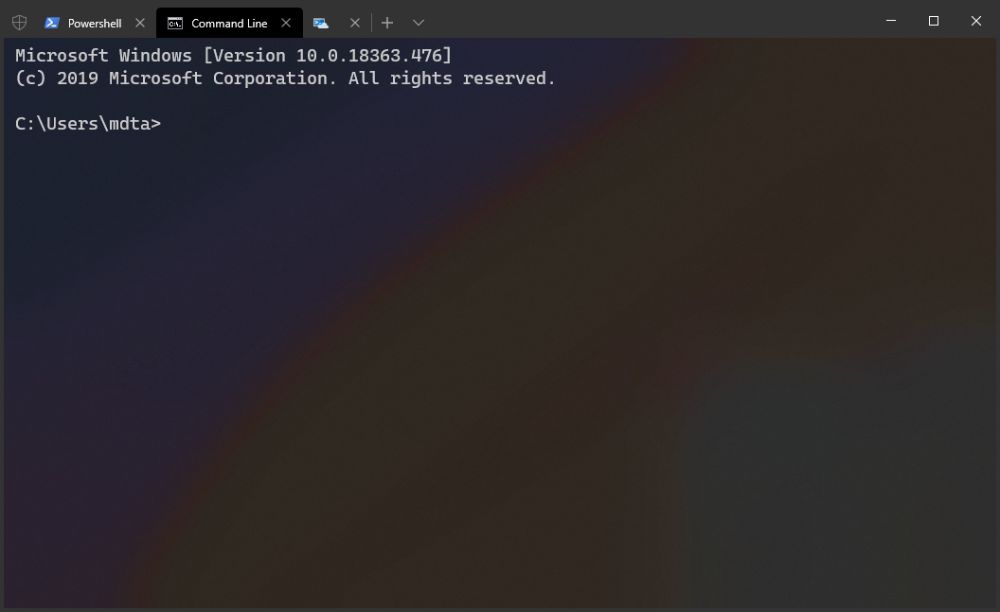

# Elevation Quality of Life Improvements

## Abstract

For a long time, we've been researching adding support to the Windows Terminal
for running both unelevated and elevated (admin) tabs side-by-side, in the same
window. However, after much research, we've determined that there isn't a safe
way to do this without opening the Terminal up as a potential
escalation-of-privilege vector.

Instead, we'll be adding a number of features to the Terminal to improve the
user experience of working in elevated scenarios. These improvements include:

* A visible indicator that the Terminal window is elevated ([#1939])
* Configuring the Terminal to always run elevated ([#632])
* Configuring a specific profile to always open elevated ([#632])
* Allowing new tabs, panes to be opened elevated directly from an unelevated
  window
* Dynamic profile appearance that changes depending on if the Terminal is
  elevated or not. ([#1939], [#8311])

## Background

_This section was originally authored in the [Process Model 2.0 Spec]. Please
refer to it there for its original context._

Let's presume that you're a user who wants to be able to open an elevated tab
within an otherwise unelevated Terminal window. We call this scenario "mixed
elevation" - the tabs within the Terminal can be running either unelevated _or_
elevated client applications.

It wouldn't be terribly difficult for the unelevated Terminal to request the
permission of the user to spawn an elevated client application. The user would
see a UAC prompt, they'd accept, and then they'd be able to have an elevated
shell alongside their unelevated tabs.

However, this creates an escalation of privilege vector. Now, there's an
unelevated window which is connected directly to an elevated process. At this
point, **any other unelevated application could send input to the Terminal's
`HWND`**. This would make it possible for another unelevated process to "drive"
the Terminal window, and send commands to the elevated client application.

It was initially theorized that the window/content model architecture would also
help enable "mixed elevation". With mixed elevation, tabs could run at different
integrity levels within the same terminal window. However, after investigation
and research, it has become apparent that this scenario is not possible to do
safely after all. There are numerous technical difficulties involved, and each
with their own security risks. At the end of the day, the team wouldn't be
comfortable shipping a mixed-elevation solution, because there's simply no way
for us to be confident that we haven't introduced an escalation-of-privilege
vector utilizing the Terminal. No matter how small the attack surface might be,
we wouldn't be confident that there are _no_ vectors for an attack.

Some things we considered during this investigation:

* If a user requests a new elevated tab from an otherwise unelevated window, we
  could use UAC to create a new, elevated window process, and "move" all the
  current tabs to that window process, as well as the new elevated client. Now,
  the window process would be elevated, preventing it from input injection, and
  it would still contains all the previously existing tabs. The original window
  process could now be discarded, as the new elevated window process will
  pretend to be the original window.
  - However, it is unfortunately not possible with COM to have an elevated
    client attach to an unelevated server that's registered at runtime. Even in
    a packaged environment, the OS will reject the attempt to `CoCreateInstance`
    the content process object. this will prevent elevated windows from
    re-connecting to unelevated client processes.
  - We could theoretically build an RPC tunnel between content and window
    processes, and use the RPC connection to marshal the content process to the
    elevated window. However, then _we_ would need to be responsible for
    securing access the RPC endpoint, and we feel even less confident doing
    that.
  - Attempts were also made to use a window-broker-content architecture, with
    the broker process having a static CLSID in the registry, and having the
    window and content processes at mixed elevation levels `CoCreateInstance`
    that broker. This however _also_ did not work across elevation levels. This
    may be due to a lack of Packaged COM support for mixed elevation levels.

    It's also possible that the author forgot that packaged WinRT doesn't play
    nicely with creating objects in an elevated context. The Terminal has
    previously needed to manually manifest all its classes in a SxS manifest for
    Unpackaged WinRT to allow the classes to be activated, rather than relying
    on the packaged catalog. It's theoretically possible that doing that would
    have allowed the broker to be activated across integrity levels.

    Even if this approach did end up working, we would still need to be
    responsible for securing the elevated windows so that an unelevated attacker
    couldn't hijack a content process and trigger unexpected code in the window
    process. We didn't feel confident that we could properly secure this channel
    either.

We also considered allowing mixed content in windows that were _originally_
elevated. If the window is already elevated, then it can launch new unelevated
processes. We could allow elevated windows to still create unelevated
connections. However, we'd want to indicate per-pane what the elevation state
of each connection is. The user would then need to keep track themselves of
which terminal instances are elevated, and which are not.

This also marks a departure from the current behavior, where everything in an
elevated window would be elevated by default. The user would need to specify for
each thing in the elevated window that they'd want to create it elevated. Or the
Terminal would need to provide some setting like
`"autoElevateEverythingInAnElevatedWindow"`.

We cannot support mixed elevation when starting in a unelevated window.
Therefore, it doesn't make a lot of UX sense to support it in the other
direction. It's a cleaner UX story to just have everything in a single window at
the same elevation level.

## Solution Design

Instead of supporting mixed elevation in the same window, we'll introduce the
following features to the Terminal. These are meant as a way of improving the
quality of life for users who work in mixed-elevation (or even just elevated)
environments.

### Visible indicator for elevated windows

As requested in [#1939], it would be nice if it was easy to visibly identify if
a Terminal window was elevated or not.

One easy way of doing this is by adding a simple UAC shield to the left of the
tabs for elevated windows. This shield could be configured by the theme (see
[#3327]). We could provide the following states:
* Colored (the default)
* Monochrome
* Hidden, to hide the shield even on elevated windows. This is the current
  behavior.


_figure 1: a monochrome UAC shield in the titlebar of the window, courtesy of @mdtauk_

We could also simplify this to only allow a boolean true/false for displaying
the shield. As we do often with other enums, we could define `true` to be the
same as the default appearance, and `false` to be the hidden option. As always,
the development of the Terminal is an iterative process, where we can
incrementally improve from no setting, to a boolean setting, to a enum-backed
one.

### Configuring a profile to always run elevated

Oftentimes, users might have a particular tool chain that only works when
running elevated. In these scenarios, it would be convenient for the user to be
able to identify that the profile should _always_ run elevated. That way, they
could open the profile from the dropdown menu of an otherwise unelevated window
and have the elevated window open with the profile automatically.

We'll be adding the `"elevate": true|false` setting as a per-profile setting,
with a default value of `false`. When set to `true`, we'll try to auto-elevate
the profile whenever it's launched. We'll check to see if this window is
elevated before creating the connection for this profile. If the window is not
elevated, then we'll create a new window with the requested elevation level to
handle the new connection.

`"elevate": false` will do nothing. If the window is already elevated, then the
profile won't open an un-elevated window.

If the user tries to open an `"elevate": true` profile in a window that's
already elevated, then a new tab/split will open in the existing window, rather
than spawning an additional elevated window.

There are three situations where we're creating new terminal instances: new
tabs, new splits, and new windows. Currently, these are all actions that are
also exposed in the `wt` commandline as subcommands. We can convert from the
commandline arguments into these actions already. Therefore, it shouldn't be too
challenging to convert these actions back into the equal commandline arguments.

For the following examples, let's assume the user is currently in an unelevated
Terminal window.

When the user tries to create a new elevated **tab**, we'll need to create a new
process, elevated, with the following commandline:

```
wt new-tab [args...]
```

When we create this new `wt` instance, it will obey the glomming rules as
specified in [Session Management Spec]. It might end up glomming to another
existing window at that elevation level, or possibly create its own window.

Similarly, for a new elevated **window**, we can make sure to pass the `-w new`
arguments to `wt`. These parameters indicate that we definitely want this
command to run in a new window, regardless of the current glomming settings.

```
wt -w new new-tab [args...]
```

However, creating a new **pane** is a little trickier. Invoking the `wt
split-pane [args...]` is straightforward enough.

<!-- Discussion notes follow:
If the current window doesn't have the same elevation level as the
requested profile, do we always want to just create a new split? If the command
ends up glomming to an existing window, does that even make sense? That invoking
an elevated split in an unelevated window would end up splitting the elevated
window? It's very possible that the user wanted a split in the tab they're
currently in, in the unelevated window, but they don't want a split in the
elevated window.

What if there's not space in the elevated window to create the split (but there
would be in the current window)? That would sure make it seem like nothing
happened, silently.

We could alternatively have cross-elevation splits default to always opening a
new tab. That might mitigate some of the odd behaviors. Until we actually have
support for running commands in existing windows, we'll always need to make a
new window when running elevated. We'll need to make the new window for new tabs
and splits, because there's no way to invoke another existing window.

A third proposal is to pop a warning dialog at the user when they try to open an
elevated split from and unelevated window. This dialog could be something like

> What you requested couldn't be completed. Do you want to:
> A. Make me a new tab instead.
> B. Forget it and cancel. I'll go fix my config.

I'm certainly leaning towards proposal 2 - always create a new tab. This is how
it's implemented in [#8514]. In that PR, this seems to work sensibly.
-->

After discussing with the team, we have decided that the most sensible approach
for handling a cross-elevation `split-pane` is to just create a new tab in the
elevated window. The user can always re-attach the pane as a split with the
`move-pane` command once the new pane in the elevated window.

#### Configure the Terminal to _always_ run elevated

`elevate` is a per-profile property, not a global property. If a user
wants to always have all instances of the Terminal run elevated, they
could set `"elevate": true` in their profile defaults. That would cause _all_
profiles they launch to always spawn as elevated windows.

#### `elevate` in Actions

Additionally, we'll add the `elevate` property to the `NewTerminalArgs` used in
the `newTab`, `splitPane`, and `newWindow` actions. This is similar to how other
properties of profiles can be overridden at launch time. This will allow
windows, tabs and panes to all be created specifically as elevated windows.

In the `NewTerminalArgs`, `elevate` will be an optional boolean, with the
following behavior:
* `null` (_default_): Don't modify the `elevate` property for this profile
* `true`: This launch should act like the profile had `"elevate": true` in its
  properties.
* `false`: This launch should act like the profile had `"elevate": false` in its
  properties.

We'll also add an iterable command for opening a profile in an
elevated tab, with the following json:

```jsonc
{
    // New elevated tab...
    "name": { "key": "NewElevatedTabParentCommandName", "icon": "UAC-Shield.png" },
    "commands": [
        {
            "iterateOn": "profiles",
            "icon": "${profile.icon}",
            "name": "${profile.name}",
            "command": { "action": "newTab", "profile": "${profile.name}", "elevated": true }
        }
    ]
},
```

#### Elevation from the dropdown

Currently, the new tab dropdown supports opening a new pane by
<kbd>Alt+click</kbd>ing on a profile. We could similarly add support to open a
tab elevated with <kbd>Ctrl+click</kbd>. This is similar to the behavior of the
Windows taskbar. It supports creating an elevated instance of a program by
<kbd>Ctrl+click</kbd>ing on entries as well.

## Implementation Details

### Starting an elevated process from an unelevated process

It seems that we're able to create an elevated process by passing the `"runas"`
verb to
[`ShellExecute`](https://docs.microsoft.com/en-us/windows/win32/api/shellapi/nf-shellapi-shellexecutea).
So we could use something like

```c++
ShellExecute(nullptr,
             L"runas",
             L"wt.exe",
             L"-w new new-tab [args...]",
             nullptr,
             SW_SHOWNORMAL);
```

This will ask the shell to perform a UAC prompt before spawning `wt.exe` as an
elevated process.

> 👉 NOTE: This mechanism won't always work on non-Desktop SKUs of Windows. For
> more discussion, see [Elevation on OneCore SKUs](#Elevation-on-OneCore-SKUs).

## Potential Issues

<table>
<tr>
<td><strong>Accessibility</strong></td>
<td>

The set of changes proposed here are not expected to introduce any new
accessibility issues. Users can already create elevated Terminal windows. Making
it easier to create these windows doesn't really change our accessibility story.

</td>
</tr>
<tr>
<td><strong>Security</strong></td>
<td>

We won't be doing anything especially unique, so there aren't expected to be any
substantial security risks associated with these changes. Users can already
create elevated Terminal windows, so we're not really introducing any new
functionality, from a security perspective.

We're relying on the inherent security of the `runas` verb of `ShellExecute` to
prevent any sort of unexpected escalation-of-privilege.

<hr>

One security concern is the fact that the `settings.json` file is currently a
totally unsecured file. It's completely writable by any medium-IL process. That
means it's totally possible for a malicious program to change the file. The
malicious program could find a user's "Elevated PowerShell" profile, and change
the commandline to `malicious.exe`. The user might then think that their
"Elevated PowerShell" will run `powershell.exe` elevated, but will actually
auto-elevate this attacker.

If all we expose to the user is the name of the profile in the UAC dialog, then
there's no way for the user to be sure that the program that's about to be
launched is actually what they expect.

To help mitigate this, we should _always_ pass the evaluated `commandline` as a
part of the call to `ShellExecute`. the arguments that are passed to
`ShellExecute` are visible to the user, though they need to click the "More
Details" dropdown to reveal them.

We will need to mitigate this vulnerability regardless of adding support for the
auto-elevation of individual terminal tabs/panes. If a user is launching the
Terminal elevated (i.e. from the Win+X menu in Windows 11), then it's possible
for a malicious program to overwrite the `commandline` of their default profile.
The user may now unknowingly invoke this malicious program while thinking they
are simply launching the Terminal.

To deal with this more broadly, we will display a dialog within the Terminal
window before creating **any** elevated terminal instance. In that dialog, we'll
display the commandline that will be executed, so the user can very easily
confirm the commandline.

This will need to happen for all elevated terminal instances. For an elevated
Windows Terminal window, this means _all_ connections made by the Terminal.
Every time the user opens a new profile or a new commandline in a pane, we'll
need to prompt them first to confirm the commandline. This dialog within the
elevated window will also prevent an attacker from editing the `settings.json`
file while the user already has an elevated Terminal window open and hijacking a
profile.

The dialog options will certainly be annoying to users who don't want to be
taken out of their flow to confirm the commandline that they wish to launch.
There's precedent for a similar warning being implemented by VSCode, with their
[Workspace Trust] feature. They too faced a similar backlash when the feature
first shipped. However, in light of recent global cybersecurity attacks, this is
seen as an acceptable UX degradation in the name of application trust. We don't
want to provide an avenue that's too easy to abuse.

When the user confirms the commandline of this profile as something safe to run,
we'll add it to an elevated-only version of `state.json`. (see [#7972] for more
details). This elevated version of the file will only be accessible by the
elevated Terminal, so an attacker cannot hijack the contents of the file. This
will help mitigate the UX discomfort caused by prompting on every commandline
launched. This should mean that the discomfort is only limited to the first
elevated launch of a particular profile. Subsequent launches (without modifying
the `commandline`) will work as they always have.

The dialog for confirming these commandlines should have a link to the docs for
"Learn more...". Transparency in the face of this dialog should
mitigate some dissatisfaction.

The dialog will _not_ appear if the user does not have a split token - if the
user's PC does not have UAC enabled, then they're _already_ running as an
Administrator. Everything they do is elevated, so they shouldn't be prompted in
this way.

The Settings UI should also expose a way of viewing and removing these cached
entries. This page should only be populated in the elevated version of the
Terminal.

</td>
</tr>
<tr>
<td><strong>Reliability</strong></td>
<td>

No changes to our reliability are expected as a part of this change.

</td>
</tr>
<tr>
<td><strong>Compatibility</strong></td>
<td>

There are no serious compatibility concerns expected with this changelist. The
new `elevate` property will be unset by default, so users will heed to opt-in
to the new auto-elevating behavior.

There is one minor concern regarding introducing the UAC shield on the window.
We're planning on using themes to configure the appearance of the shield. That
means we'll need to ship themes before the user will be able to hide the shield
again.

</td>
</tr>
<tr>
<td><strong>Performance, Power, and Efficiency</strong></td>
<td>

No changes to our performance are expected as a part of this change.

</td>
</tr>
</table>

### Centennial Applications

In the past, we've had a notoriously rough time with the Centennial app
infrastructure and running the Terminal elevated. Notably, we've had to list all
our WinRT classes in our SxS manifest so they could be activated using
unpackaged WinRT while running elevated. Additionally, there are plenty of
issues running the Terminal in an "over the shoulder" elevation (OTS) scenario.

Specifically, we're concerned with the following scenario:
  * the current user account has the Terminal installed,
  * but they aren't an Administrator,
  * the Administrator account doesn't have the Terminal installed.

In that scenario, the user can run into issues launching the Terminal in an
elevated context (even after entering the Admin's credentials in the UAC
prompt).

This spec proposes no new mitigations for dealing with these issues. It may in
fact make them more prevalent, by making elevated contexts more easily
accessible.

Unfortunately, these issues are OS bugs that are largely out of our own control.
We will continue to apply pressure to the centennial app team internally as we
encounter these issues. They are the team best equipped to resolve these issues.

### Default Terminal & auto-elevation

In the future, when we support setting the Terminal as the "default terminal
emulator" on Windows. When that lands, we will use the `profiles.defaults`
settings to create the tab where we'll be hosting the commandline client. If the user has
`"elevate": true` in their `profiles.defaults`, we'd usually try to
auto-elevate the profile. In this scenario, however, we can't do that. The
Terminal is being invoked on behalf of the client app launching, instead of the
Terminal invoking the client application.

**2021-08-17 edit**: Now that "defterm" has shipped, we're a little more aware
of some of the limitations with packaged COM and elevation boundaries. Defterm
cannot be used with elevated processes _at all_ currently (see [#10276]). When
an elevated commandline application is launched, it will always just appear in
`conhost.exe`. Furthermore, An unelevated peasant can't communicate with an
elevated monarch so we can't toss the connection to the elevated monarch and
have them handle it.

The simplest solution here is to just _always_ ignore the `elevate` property for
incoming defterm connections. This is not an ideal solution, and one that we're
willing to revisit if/when [#10276] is ever fixed.

### Elevation on OneCore SKUs

This spec proposes using `ShellExecute` to elevate the Terminal window. However,
not all Windows SKUs have support for `ShellExecute`. Notably, the non-Desktop
SKUs, which are often referred to as "OneCore" SKUs. On these platforms, we
won't be able to use `ShellExecute` to elevate the Terminal. There might not
even be the concept of multiple elevation levels, or different users, depending
on the SKU.

Fortunately, this is a mostly hypothetical concern for the moment. Desktop is
the only publicly supported SKU for the Terminal currently. If the Terminal ever
does become available on those SKUs, we can use these proposals as mitigations.

* If elevation is supported, there must be some other way of elevating a
  process. We could always use that mechanism instead.
* If elevation isn't supported (I'm thinking 10X is one of these), then we could
  instead display a warning dialog whenever a user tries to open an elevated
  profile.
  - We could take the warning a step further. We could add another settings
    validation step. This would warn the user if they try to mark any profiles
    or actions as `"elevate":true`

## Future considerations

* If we wanted to go even further down the visual differentiation route, we
  could consider allowing the user to set an entirely different theme ([#3327])
  based on the elevation state. Something like `elevatedTheme`, to pick another
  theme from the set of themes. This would allow them to force elevated windows
  to have a red titlebar, for example.
* Over the course of discussion concerning appearance objects ([#8345]), it
  became clear that having separate "elevated" appearances defined for
  `profile`s was overly complicated. This is left as a consideration for a
  possible future extension that could handle this scenario in a cleaner way.
* Similarly, we're going to leave [#3637] "different profiles when elevated vs
  unelevated" for the future. This also plays into the design of "configure the
  new tab dropdown" ([#1571]), and reconciling those two designs is out-of-scope
  for this particular release.
* Tangentially, we may want to have a separate Terminal icon we ship with the
  UAC shield present on it. This would be especially useful for the tray icon.
  Since there will be different tray icon instances for elevated and unelevated
  windows, having unique icons may help users identify which is which.

### De-elevating a Terminal

the original version of this spec proposed that `"elevated":false` from an
elevated Terminal window should create a new unelevated Terminal instance. The
mechanism for doing this is described in [The Old New Thing: How can I launch an
unelevated process from my elevated process, redux].

This works well when the Terminal is running unpackaged. However, de-elevating a
process does not play well with packaged centennial applications. When asking
the OS to run the packaged application from an elevated context, the system will
still create the child process _elevated_. This means the packaged version of
the Terminal won't be able to create a new unelevated Terminal instance.

From an internal mail thread:

> App model intercepts the `CreateProcess` call and redirects it to a COM
> service. The parent of a packaged app is not the launching app, it’s some COM
> service. So none of the parent process nonsense will work because the
> parameters you passed to `CreateProcess` aren’t being used to create the
> process.

If this is fixed in the future, we could theoretically re-introduce de-elevating
a profile. The original spec proposed a `"elevated": bool?` setting, with the
following behaviors:
* `null` (_default_): Don't modify the elevation level when running this profile
* `true`: If the current window is unelevated, try to create a new elevated
  window to host this connection.
* `false`: If the current window is elevated, try to create a new unelevated
  window to host this connection.

We could always re-introduce this setting, to supersede `elevate`.

### Change profile appearance for elevated windows

In [#3062] and [#8345], we're planning on allowing users to set different
appearances for a profile whether it's focused or not. We could do similar thing
to enable a profile to have a different appearance when elevated. In the
simplest case, this could allow the user to set `"background": "#ff0000"`. This
would make a profile always appear to have a red background when in an elevated
window.

The more specific details of this implementation are left to the spec
[Configuration object for profiles].

In discussion of that spec, we decided that it would be far too complicated to
try and overload the `unfocusedAppearance` machinery for differentiating between
elevated and unelevated versions of the same profile. Already, that would lead
to 4 states: [`appearance`, `unfocusedAppearance`, `elevatedAppearance`,
`elevatedUnfocusedAppearance`]. This would lead to a combinatorial explosion if
we decided in the future that there should also be other states for a profile.

This particular QoL improvement is currently being left as a future
consideration, should someone come up with a clever way of defining
elevated-specific settings.

<!--
Brainstorming notes for future readers:

You could have a profile that layers on an existing profile, with elevated-specific settings:

{
  "name": "foo",
  "background": "#0000ff",
  "commandline": "cmd.exe /k echo I am unelevated"
},
{
  "inheritsFrom": "foo",
  "background": "#ff0000",
  "elevate": true,
  "commandline": "cmd.exe /k echo I am ELEVATED"
}
-->

<!-- Footnotes -->

[#632]: https://github.com/microsoft/terminal/issues/632
[#1032]: https://github.com/microsoft/terminal/issues/1032
[#1571]: https://github.com/microsoft/terminal/issues/1571
[#1939]: https://github.com/microsoft/terminal/issues/1939
[#3062]: https://github.com/microsoft/terminal/issues/3062
[#3327]: https://github.com/microsoft/terminal/issues/3327
[#3637]: https://github.com/microsoft/terminal/issues/3637
[#4472]: https://github.com/microsoft/terminal/issues/4472
[#5000]: https://github.com/microsoft/terminal/issues/5000
[#7972]: https://github.com/microsoft/terminal/pull/7972
[#8311]: https://github.com/microsoft/terminal/issues/8311
[#8345]: https://github.com/microsoft/terminal/issues/8345
[#8514]: https://github.com/microsoft/terminal/issues/8514
[#10276]: https://github.com/microsoft/terminal/issues/10276

[Process Model 2.0 Spec]: https://github.com/microsoft/terminal/blob/main/doc/specs/%235000%20-%20Process%20Model%202.0.md
[Configuration object for profiles]: https://github.com/microsoft/terminal/blob/main/doc/specs/Configuration%20object%20for%20profiles.md
[Session Management Spec]: https://github.com/microsoft/terminal/blob/main/doc/specs/%234472%20-%20Windows%20Terminal%20Session%20Management.md
[The Old New Thing: How can I launch an unelevated process from my elevated process, redux]: https://devblogs.microsoft.com/oldnewthing/20190425-00/?p=102443
[Workspace Trust]: https://code.visualstudio.com/docs/editor/workspace-trust
