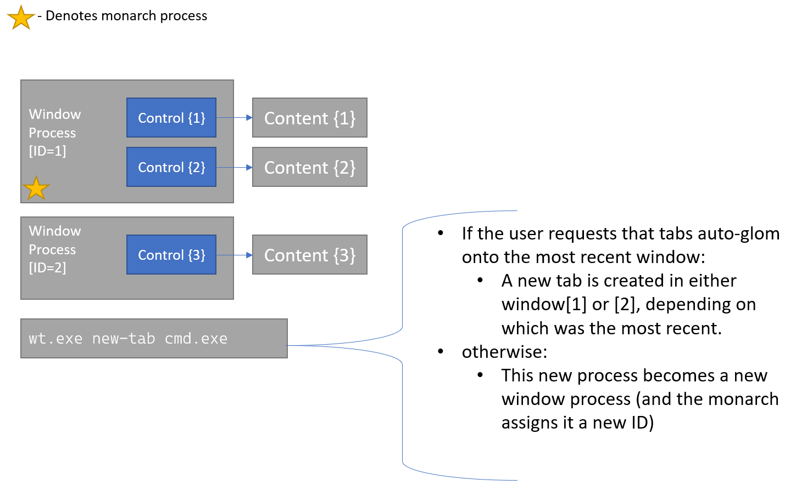
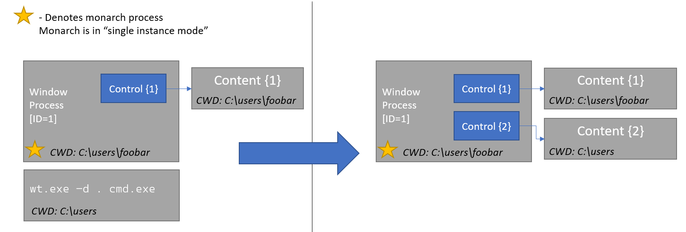

# Windows Terminal Session Management

## Abstract
This document is intended to serve as an addition to the [Process Model 2.0
Spec]. That document provides a big-picture overview of changes to the entirety
of the Windows Terminal process architecture, including both the split of
window/content processes, as well as the introduction of monarch/peasant
processes. The focus of that document was to identify solutions to a set of
scenarios that were closely intertwined, and establish these solutions would
work together, without preventing any one scenario from working. What that
document did not do was prescribe specific solutions to the given scenarios.

This document offers a deeper dive on a subset of the issues in [#5000], to
describe specifics for managing multiple windows with the Windows Terminal. This
includes features such as:

* Run `wt` in the current window ([#4472])
* Single Instance Mode ([#2227])

## Solution Design

### Monarch and Peasant Processes

This document assumes the reader is already familiar with the "Monarch and
Peasant" architecture as detailed in the [Windows Terminal Process Model 2.0
Spec]. As a quick summary:

* Every Windows Terminal window is a "Peasant" process.
* One of the Windows Terminal window processes is also the "Monarch" process.
  The Monarch is picked randomly from the Terminal windows, and there is only
  ever one Monarch process at a time.
* Peasants can communicate with the monarch when certain state changes (such as
  their window being activated), and the monarch can send commands to any of the
  peasants.

This architecture will be used to enable each of the following scenarios.

### Scenario: Open new tabs in most recently used window

A common feature of many browsers is that when a web URL is clicked somewhere,
the web page is opened as a new tab in the most recently used window of the
browser. This functionality is often referred to as "glomming", as the new tab
"gloms" onto the existing window.

Currently, the terminal does not support such a feature - every `wt` invocation
creates a new window. With the monarch/peasant architecture, it'll now be
possible to enable such a scenario.

As each window is activated, it will call a method on the `Monarch` object
(hosted by the monarch process) which will indicate that "I am peasant N, and
I've been focused". The monarch will use those method calls to update its own
internal stack of the most recently used windows.

Whenever a new `wt.exe` process is launched, that process will _first_ ask the
monarch if it should run the commandline in an existing window, or create its
own window.



If glomming is enabled, the monarch will dispatch the commandline to the
appropriate window for them to handle instead. To the user, it'll seem as if the
tab just opened in the most recent window.

Users should certainly be able to specify if they want new instances to glom
onto the MRU window or not. You could imagine that currently, we default to the
hypothetical value `"windowingBehavior": "useNew"`, meaning that each new wt gets
its own new window.

If glomming is disabled, then the Monarch will call back to the peasant and tell
it to run the provided commandline. The monarch will use the return value of
`ExecuteCommandline` to indicate that the calling process should create a window
and become a peasant process, and run the commandline itself.

#### Glomming within the same virtual desktop

When links are opened in the new Edge browser, they will only glom onto an
existing window if that window is open in the current virtual desktop. This
seems like a good idea of a feature for the Terminal to follow as well.

There must be some way for an application to determine which virtual desktop it
is open on. We could use that information to have the monarch track the last
active window _per-desktop_, and only glom when there's one on the current
desktop.

We could make the `windowingBehavior` property accept a variety of
configurations:

- `"useExisting"`: always glom to the most recent window, regardless of desktop.
- `"useExistingOnSameDesktop"`: Only glom if there's an existing window on this
  virtual desktop, otherwise create a new window. This will be the new default
  value.
- `"useNew"`: Never glom, always create a new window. This is technically the
  current behavior of the Terminal.

### Handling the current working directory

Consider the following scenario: the user runs `wt -d .` in the address bar of
explorer, and the monarch determines that this new tab should be created in an
existing window. For clarity during this example, we will label the existing
window WT[1], and the second `wt.exe` process WT[2].

An example of this scenario is given in the following diagram:



In this scenario, we want the new tab to be spawned in the current working
directory of WT[2], not WT[1]. So when WT[1] is about to run the commands that
were passed to WT[2], WT[1] will need to:

* First, stash its own CWD
* Change to the CWD of WT[2]
* Run the commands from WT[2]
* Then return to its original CWD.

So, as a part of the interface that a peasant uses to communicate the startup
commandline to the monarch, we should also include the current working
directory.

### Scenario: Run `wt` in the current window

One often requested scenario is the ability to run a `wt.exe` commandline in the
current window, as opposed to always creating a new window. Presume we have the
ability to communicate between different window processes. The logical extension
of this scenario would be "run a `wt` commandline in _any_ given WT window".

Each window process will have its own unique ID assigned to it by the monarch.
This ID will be a positive number. Windows can also have names assigned to them.
These names are strings that the user specifies. A window will always have an
ID, but not necessarily a name. Running a command in a given window with ID N
should be as easy as something like:

```sh
wt.exe --window N new-tab ; split-pane
```

(or for shorthand, `wt -w N new-tab ; split-pane`).

More formally, we will add the following parameter to the top-level `wt`
command:

#### `--window,-w <window-id>`
Run these commands in the given Windows Terminal session. This enables opening
new tabs, splits, etc. in already running Windows Terminal windows.
* If `window-id` is `0`, run the given commands in _the current window_.
* If `window-id` is a negative number, or the reserved name `new`, run the
  commands in a _new_ Terminal window.
* If `window-id` is the ID or name of an existing window, then run the
  commandline in that window.
* If `window-id` is _not_ the ID or name of an existing window, create a new
  window. That window will be assigned the ID or name provided in the
  commandline. The provided subcommands will be run in that new window.
* If `window-id` is omitted, then obey the value of `windowingBehavior` when
  determining which window to run the command in.

_Whenever_ `wt.exe` is started, it must _always_ pass the provided commandline
first to the monarch process for handling. This is important for glomming
scenarios (as noted above). The monarch will parse the commandline, determine
which window the commandline is destined for, then call `ExecuteCommandline` on
that peasant, who will then run the command.

#### Running commands in the current window:`wt --window 0`

If `wt -w 0 <commands>` is run _outside_ a WT instance, it could attempt to glom
onto _the most recent WT window_ instead. This seems more logical than something
like `wt --window last` or some other special value indicating "run this in the
MRU window".<sup>[[2]](#footnote-2)</sup>

That might be a simple, but **wrong**, implementation for "the current window".
If the peasants always raise an event when their window is focused, and the
monarch keeps track of the MRU order for peasants, then one could naively assume
that the execution of `wt -w 0 <commands>` would always return the window the
user was typing in, the current one. However, if someone were to do something
like `sleep 10 ; wt -w 0 <commands>`, then the user could easily focus another
WT window during the sleep, which would cause the MRU window to not be the same
as the window executing the command.

To solve this issue, we'll  other than
attempting to use the `WT_SESSION` environment variable. If a `wt.exe` process
is spawned and that's in its environment variables, it could try and ask the
monarch for the peasant who's hosting the session corresponding to that GUID.
This is more of a theoretical solution than anything else.

In the past we've been reluctant to rely too heavily on `WT_SESSION`. However,
an environment variable does seem to be the only reliable way to be confident
where the window was created from. We could introduce another environment
variable instead - `WT_WINDOW_ID`. That would allow us to shortcut the session
ID lookup. However, I worry about exposing the window ID as an environment
variable. If we do that, users will inevitably use that instead of the `wt -0`
alias, which should take care of the work for them. Additionally, `WT_WINDOW_ID`
wouldn't update in the child processes as tabs are torn out of windows to create
new windows.

Both solutions are prone to the user changing the value of the variable to some
garbage value. If they do that, this lookup will most certainly not work as
expected. Using the session ID (a GUID) instead of the window ID (an int) makes
it less likely that they guess the ID of an existing instance.

#### Running commands in a new window:`wt --window -1` / `wt --window new`

If the user passes a negative number, or the reserved name `new` to the
`--window` parameter, then we will always create a new window for that
commandline, regardless of the value of `windowingBehavior`. This will allow
users to do something like `wt -w -1 new-tab` to _always_ create a new window.

#### `--window` in subcommands

The `--window` parameter is a setting to `wt.exe` itself, not to one of its
subcommands (like `new-tab` or `split-pane`). This means that all of the
subcommands in a particular `wt` commandline will all be handled by the same
session. For example, let us consider a user who wants to open a new tab in
window 2, and split a new pane in window 3, all at once. The user _cannot_ do
something like:

```cmd
wt -w 2 new-tab ; -w 3 split-pane
```

Instead, the user will need to separate the commands (by whatever their shell's
own command delimiter is) and run two different `wt.exe` instances:

```cmd
wt -w 2 new-tab & wt -w 3 split-pane
```

This is done to make the parsing of the subcommands easier, and for the internal
passing of arguments simpler. If the `--window` parameter were a part of each
subcommand, then each individual subcommand's parser would need to be
enlightened about that parameter, and then it would need to be possible for any
single part of the commandline to call out to another process. It would be
especially tricky then to coordinate the work being done across process here.
The source process would need some sort of way to wait for the other process to
notify the source that a particular subcommand completed, before allowing the
source to dispatch the next part of the commandline.

Overall, this is seen as unnecessarily complex, and dispatching whole sets of
commands as a simpler solution.

### Naming Windows

It's not user-friendly to rely on automatically generated, invisible numbers to
identify windows. There's not a great way of identifying which window is which.
The user would need to track the IDs in their head manually. Instead, we'll
allow the user to provide a string name for the window. This name can be used to
address a window in addition to the ID.

Names can be provided on the commandline, in the original commandline. For
example, `wt -w foo nt` would name the new window "foo". Names can also be set
with a new action, `NameWindow`<sup>[[3]](#footnote-3)</sup>. `name-window`
could also be used as a subcommand. For example, `wt -w 4 name-window bar` would
name window 4 "bar".

To keep identities mentally distinct, we will disallow names that are integers
(positive or negative). This will prevent users from renaming a window to `2`,
then having `wt -w 2` be ambiguous as to which window it refers to.

Names must also be unique. If a user attempts to set the name of the window to
an already-used name, we'll need to ignore the name change. We could also
display a "toast" or some other type of low-impact message to the user. That
message would have some text like: "Unable to rename window. Another window with
that name already exists".

The Terminal will reserve the name `new`. It will also reserve any names
starting with the character `_`. The user will not be allowed to set the window
name to any of these reserved names. Reserving `_*` allows us to add other
keywords in the future, without introducing a breaking change.

## UI/UX Design

### `windowingBehavior` details

The following list gives greater breakdown of the values of `windowingBehavior`,
and how they operate:

* `"windowingBehavior": "useExisting", "useExistingOnSameDesktop"`:
  **Browser-like glomming**
  - New instances open in the current window by default.
  - `newWindow` opens a new window.
  - Tabs can be torn out to create new windows.
  - `wt -w -1` opens a new window.
* `"windowingBehavior": "useNew"`: No auto-glomming. This is **the current
  behavior** of the Terminal.
  - New instances open in new windows by default
  - `newWindow` opens a new window
  - Tabs can be torn out to create new windows.
  - `wt -w -1` opens a new window.

We'll be changing the default behavior from `useNew` to
`useExistingOnSameDesktop`. This will be more consistent with other tabbed
applications.

## Concerns

<table>
<tr>
<td><strong>Accessibility</strong></td>
<td>

There is no expected accessibility impact from this feature. Each window will
handle UIA access as it normally does.

In the future, we could consider exposing the window IDs and/or names via UIA.

</td>
</tr>
<tr>
<td><strong>Security</strong></td>
<td>

Many security concerns have already be covered in greater detail in the parent
spec, [Process Model 2.0 Spec].

When attempting to instantiate the Monarch, COM will only return the object from
a server running at the same elevation level. We don't need to worry about
unelevated peasants connecting to the elevated Monarch, or vice-versa.

</td>
</tr>
<tr>
<td><strong>Reliability</strong></td>
<td>

We will need to be careful when working with objects hosted by another process.
Any work we do with it MUST be in a try/catch, because at _any_ time, the other
process could be killed. At any point, a window process could be killed. Both
the monarch and peasant code will need to be redundant to such a scenario, and
if the other process is killed, make sure to display an appropriate error and
either recover or exit gracefully.

In any and all these situations, we will want to try and be as verbose as
possible in the logging. This will make tracking which process had the error
occur easier.

</td>
</tr>
<tr>
<td><strong>Compatibility</strong></td>
<td>

We will be changing the default behavior of the Terminal to auto-glom to the
most-recently used window on the same desktop in the course of this work, which
will be a breaking UX change. This is behavior that can be reverted with the
`"windowingBehavior": "useNew"` setting.

We acknowledge that this is a pretty massive change to the default experience of
the Terminal. We're planning on doing some polling of users to determine which
behavior they want by default. Additionally, we'll be staging the rollout of
this feature, using the Preview builds of the Terminal. The release notes that
first include it will call extra attention to this feature. We'll ask that users
provide their feedback in a dedicated thread, so we have time to collect
opinions from users before rolling the change out to all users.

We may choose to only change the default to `useExistingOnSameDesktop` once tab
tear out is available, so users who are particularly unhappy about this change
can still tear out the tab (if they can't be bothered to change the setting).

</td>
</tr>
<tr>
<td><strong>Performance, Power, and Efficiency</strong></td>
<td>

There's no dramatic change expected here. There may be a minor delay in the
spawning of new terminal instances, due to requiring cross-process hops for the
communication between monarch and peasant processes.

</td>
</tr>
</table>

## Potential Issues

### Mixed Elevation Levels

As of December 2020, we're no longer pursuing a "mixed-elevation" scenario for
the Terminal. This makes many of the cross-elevation scenarios simpler. Elevated
and unelevated `wt` instances will always remain separate. The different
elevation levels will maintain separate lists of window IDs. If the user is
running both an elevated and unelevated window, then there will be two monarchs.
One elevated, and the other unelevated.

There will also be some edge cases when handling the commandline that will need
special care. Say the user wanted to open a new tab in the elevated window, from
and unelevated `explorer.exe`. That would be a commandline like:

```sh
wt -w 0 new-tab -d . --elevated
```

Typically we first determine which window the commandline is intended for, then
dispatch it to that window. In this case, the `-w 0` will cause us to pass the
commandline to the current unelevated window. Then, that window will try to open
an elevated tab, fail, and create a new `wt.exe` process. This second `wt.exe`
process will lose the `-w 0` context. It won't inform the elevated monarch that
this commandline should be run in the active session.

We will need to make sure that special care is taken when creating elevated
instances that we maintain the `--window` parameter passed to the Terminal.

### `wt` Startup Commandline Options

There are a few commandline options which can be provided to `wt.exe` which
don't make sense to pass to another session. These options include (but are not
limited to):

* `--initialSize r,c`
* `--initialPosition x,y`
* `--fullscreen`, `--maximized`, etc.

When we're passing a commandline to another instance to handle, these arguments
will be ignored. they only apply to the initial creation of a window.
`--initialSize 32, 120` doesn't make sense if the window already has a size.

On startup of a new window, we currently assume that the first command is always
`new-tab`. When passing commandlines to existing windows, we won't need to make
that assumption anymore. There will already be existing tabs.

### Monarch MRU Window Tracking

As stated above, the monarch is responsible for tracking the MRU window stack.
However, when the monarch is closed, this state will be lost. The new monarch
will be elected, but it will be unable to ask the old monarch for the MRU
order of the windows.

We had previously considered an _acceptable_ UX when this would occur. We would
randomize the order (with the new monarch becoming the MRU window). If someone
noticed this bug and complained, then we had a theoretical solution prepared.
The peasants could inform not only the monarch, but _all other peasants_ when
they become activated. This would mean all peasants are simultaneously tracking
the MRU stack. This would mean that any given peasant would be prepared always
to become the monarch.

A simpler solution though would be to not track the MRU stack in the Monarch at
all. Instead, each peasant could just track internally when they were last
activated. The Monarch wouldn't track any state itself. It would be distributed
across all the peasants. The Monarch could then iterate over the list of
peasants and find the one with the newest `LastActivated` timestamp.

Now, when a Monarch dies, the new Peasant doesn't have to come up with the stack
itself. All the other Peasants keep their state. The new Monarch can query them
and get the same answer the old Monarch would have.

We could further optimize this by having the Monarch also track the stack. Then,
the monarch could query the MRU window quickly. The `LastActivated` timestamps
would only be used by a new Monarch when it is elected, to reconstruct the MRU
stack.

## Implementation Plan

This is a list of actionable tasks generated as described by this spec:

* [ ] Add support for `wt.exe` processes to be Monarchs and Peasants, and
  communicate that state between themselves. This task does not otherwise add
  any user-facing features, merely an architectural update.
* [ ] Add support for the `windowingBehavior` setting as a boolean. Opening new
  WT windows will conditionally glom to existing windows.
* [ ] Add support for per-desktop `windowingBehavior`, by adding the support for
  the enum values `"useExisting"`, `"useExistingOnSameDesktop"` and `"useNew"`.
* [ ] Add support for `wt.exe` to pass commandlines intended for another window
  to the monarch, then to the intended window, with the `--window,-w
  window-id` commandline parameter.
* [ ] Add support for targeting and naming windows via the `-w` parameter on the
  commandline
* [ ] Add a `NameWindow` action, subcommand that allows the user to set the name
  for the window.
* [ ] Add an action that will cause all windows to briefly display a overlay
  with the current window ID and name. This would be something like the
  "identify" feature of the Windows "Display" settings.

## Future considerations

* What if the user wanted to pipe a command to a pane in an existing window?
  ```sh
  man ping > wt -w 0 split-pane cat
  ```
  Is there some way for WT to pass its stdin/out handles to the child process
  it's creating? This is _not_ related to the current spec at hand, just
  something the author considered while writing the spec. This likely belongs
  over in [#492], or in its own spec.
  - Or I suppose, with less confusion, someone could run `wt -w 0 split-pane --
    man ping > cat`. That's certainly more sensible, and wouldn't require any
    extra work.
* "Single Instance Mode" is a scenario in which there is only ever one single WT
  window. A user might want this functionality to only ever allow a single
  terminal window to be open on their desktop. This is especially frequently
  requested in combination with "quake mode", as discussed in [#653]. When Single
  Instance Mode is active, and the user runs a new `wt.exe` commandline, it will
  always end up running in the existing window, if there is one.

  An earlier version of this spec proposed a new value of `glomToLastWindow`.
  (`glomToLastWindow` was later renamed `windowingBehavior`). The `always` value
  would disable tab tear out<sup>[[1]](#footnote-1)</sup>. It would additionally
  disable the `newWindow` action, and prevent `wt -w new` from opening a new
  window.

  In discussion, it was concluded that this setting didn't make sense. Why did the
  `glomToLastWindow` setting change the behavior of tear out? Single Instance Mode
  is most frequently requested in regards to quake mode. We're leaving the
  implementation of true single instance mode to that spec.
* It was suggested in review that we could auto-generate names for windows, from
  some list of words. Prior art could be the URLS for gfycat.com or
  what3words.com, which use three random words. I believe `docker` also assigns
  names from a random selection of `adjective`+`name`. This is an interesting
  idea, and something that could be pursued in the future.
    - This would be a massive pain to localize though, hence why this is left as
      a future consideration.
* We will _need_ to provide a commandline tool to list windows and their IDs &
  names. We're thinking a list of windows, their IDs, names, PIDs, and the title
  of the window.

  Currently we're stuck with `wt.exe` which is a GUI application, and cannot
  print to the console. Our need is now fairly high for the ability to print
  info to the console. To remedy this, we'll need to ship another helper exe as
  a commandline tool for working with the terminal. The design for this is left
  for the future.

## Footnotes

<a name="footnote-1"><a>[1]: While tear-out is a separate track of work from
session management in general, this setting could be implemented along with this
set of features, and later used to control tear out as well.

<a name="footnote-2"><a>[2]: Since we're reserving the keyword `new` to mean "a
new window", then we could also reserve `last` or `current` as an alias for "the
current window".

<a name="footnote-3"><a>[3]: We currently have two actions for renaming _tabs_
in the Terminal: `renameTab(name)`, and `openTabRenamer()`. We will likely
similarly need `nameWindow(name)` and `openWindowNamer()`. `openWindowNamer`
could display a dialog to allow the user to rename the current window at
runtime.


## Resources

* [Tab Tear-out in the community toolkit] - this document proved invaluable to
  the background of tearing a tab out of an application to create a new window.

<!-- Footnotes -->

[#5000]: https://github.com/microsoft/terminal/issues/5000
[#1256]: https://github.com/microsoft/terminal/issues/1256
[#4472]: https://github.com/microsoft/terminal/issues/4472
[#2227]: https://github.com/microsoft/terminal/issues/2227
[#653]: https://github.com/microsoft/terminal/issues/653
[#1032]: https://github.com/microsoft/terminal/issues/1032
[#632]: https://github.com/microsoft/terminal/issues/632
[#492]: https://github.com/microsoft/terminal/issues/492
[#4000]: https://github.com/microsoft/terminal/issues/4000
[#7972]: https://github.com/microsoft/terminal/pull/7972
[#961]: https://github.com/microsoft/terminal/issues/961
[`30b8335`]: https://github.com/microsoft/terminal/commit/30b833547928d6dcbf88d49df0dbd5b3f6a7c879
[Tab Tear-out in the community toolkit]: https://github.com/windows-toolkit/Sample-TabView-TearOff
[Quake mode scenarios]: https://github.com/microsoft/terminal/issues/653#issuecomment-661370107
[`ISwapChainPanelNative2::SetSwapChainHandle`]: https://docs.microsoft.com/en-us/windows/win32/api/windows.ui.xaml.media.dxinterop/nf-windows-ui-xaml-media-dxinterop-iswapchainpanelnative2-setswapchainhandle
[Process Model 2.0 Spec]: https://github.com/microsoft/terminal/blob/main/doc/specs/%235000%20-%20Process%20Model%202.0/%235000%20-%20Process%20Model%202.0.md
