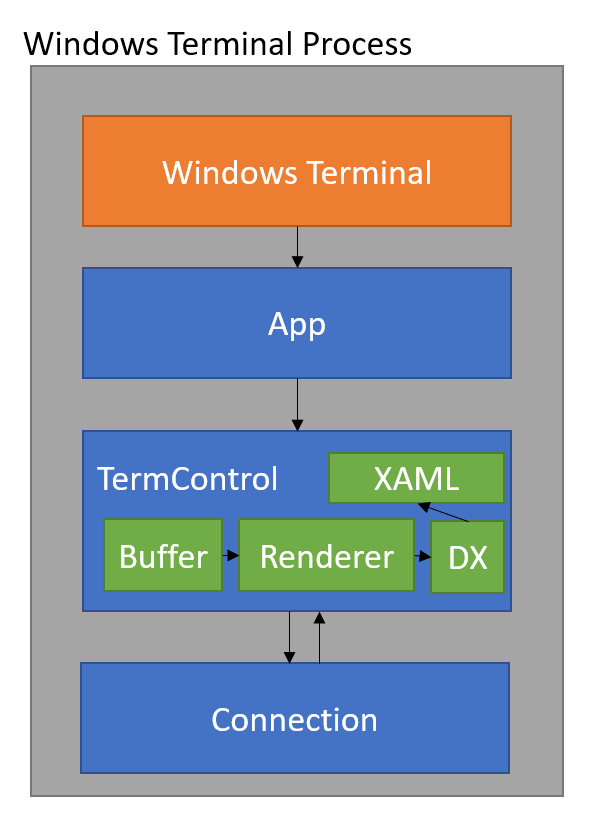
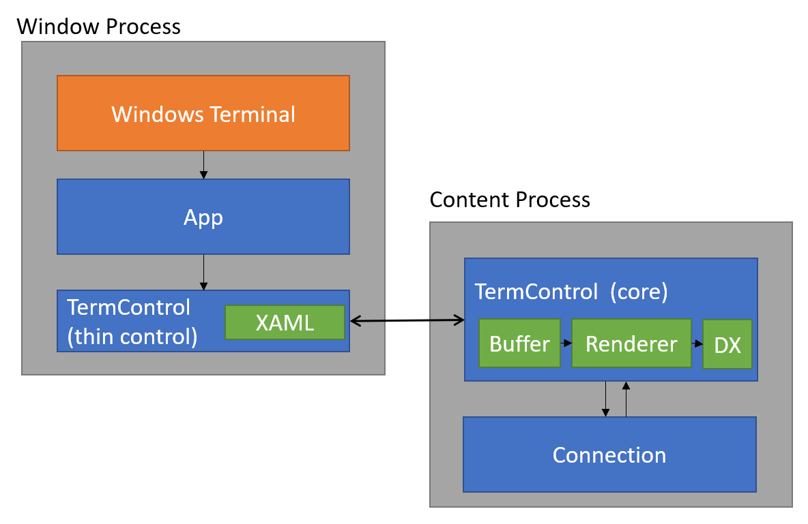
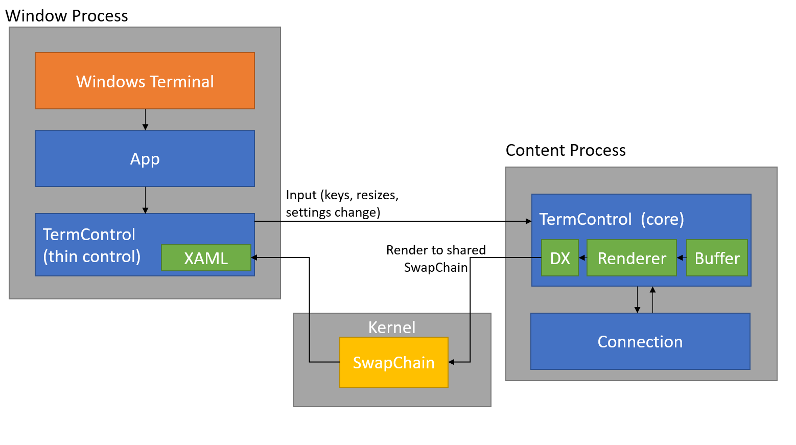
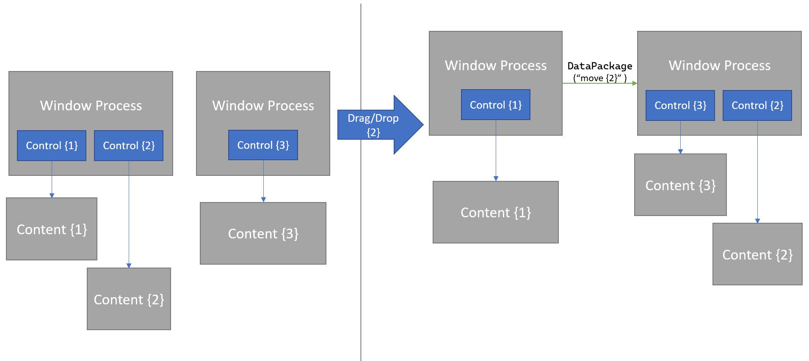
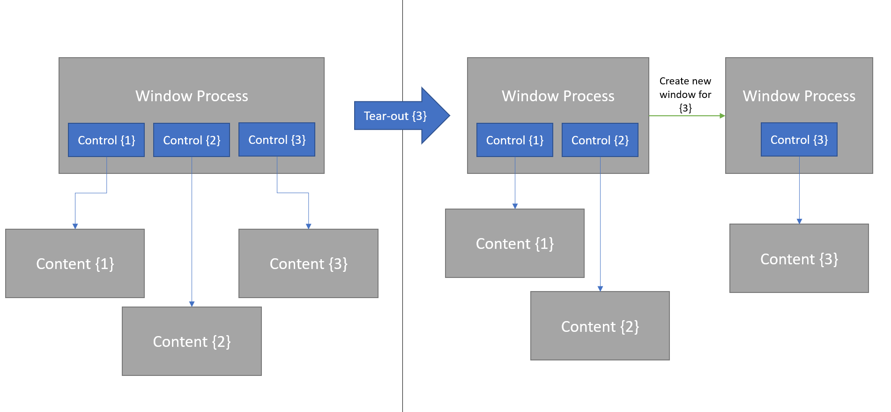

# Windows Terminal Process Model 2.0

## Abstract

The Windows Terminal currently exists as a single process per window. It has one
connection per terminal pane, which could be an additional conpty process and
associated client processes. This model has proven effective for the simple
windowing we've done so far. However, this single process model will not be
enough for more complex scenarios, like dragging tabs into other windows.

This spec outlines changes to the Terminal process model in order to enable the
following scenarios:

* Tab Tearoff/ Reattach ([#1256])
* Run `wt` in the current window ([#4472])
* Single Instance Mode ([#2227])
* Quake Mode ([#653])

Also discussed is "mixed elevation" ([#1032] & [#632]), which is closely related
to the above scenarios, and was investigated as a part of this re-architecture.

## Inspiration

Much of the design for this feature was inspired by an older web browser process
model. For a time, web browsers, would use a separate process for each of the
tabs within the browser, to help isolate the actual tabs from one another.
(Nowadays, browsers will have multiple tabs all hosted in a single process, to
attempt to reuse some resources between tabs. They do still break out the tab
content from the actual window's process).

The rxvt-unicode terminal emulator uses a similar client/server architecture. In
this model, the terminal "content" is hosted by a server process, and windows
act as a "client" for that content.

## Background

In order to better understand some of the following technical solutions, it's
important to understand some of the technical hurdles that need to be overcome.

### Drag and drop tabs to create new windows

An important scenario we're targeting is the ability to drag a tab out of the
window, and create a new Terminal window. When we do this, we want the new
window to be able to persist all the same state that the original window had for
that tab. For us, that primarily means the buffer contents and connection state.

However, _how_ do we move the terminal state to another window? The terminal
state is all located in-memory of the thread that created the `TermControl`
hosting the terminal buffer. It's fairly challenging to re-create this state in
another process.

Take a look at [this
document](https://github.com/windows-toolkit/Sample-TabView-TearOff) for more
background on how the scenario might work.

There's really only a limited selection of things that a process could transfer
to another with a drag and drop operation. If we wanted to use a string to
transfer the data, we'd somehow need to serialize then entire state of the tab.
That would mean turning its tree of panes, and the state of each of the buffers
in the tab, into some sort of string. Then, we would have the new window
deserialize that string to re-create the tab state. Consider that each buffer
might include 32000 rows of 80+ characters each, each with RGB attributes.  You
are looking at 30MB+ of raw data to serialize and de-serialize per buffer,
minimum. This sounds extremely fragile, if not impossible to do robustly.

What we need is a more effective way for separate Terminal windows to to be able
to connect to and display content that's being hosted in another process.

### Mixed admin and unelevated clients in a single window

Let's presume that you're a user who wants to be able to open an elevated tab
within an otherwise unelevated Terminal window. We call this scenario "mixed
elevation" - the tabs within the Terminal can be running either unelevated _or_
elevated client applications.

It wouldn't be terribly difficult for the unelevated Terminal to request the
permission of the user to spawn an elevated client application. The user would
see a UAC prompt, they'd accept, and then they'd be able to have an elevated
shell alongside their unelevated tabs.

However, this creates an escalation of privilege vector. Now, there's an
unelevated window which is connected directly to an elevated process. At this
point, any other unelevated application could send input to the Terminal's
`HWND`, making it possible for another unelevated process to "drive" the
Terminal window and send commands to the elevated client application.

## Solution Design

### Window and Content Processes

To begin, let's first take a look at a rough diagram of how the Windows Terminal
process looks today:



Currently, the entire Windows Terminal exists as a single process composed of
many parts. It has a top Win32 layer responsible for the window. This window
includes a UWP XAML-like App layer, which embeds many `TermControl`s. Each of
these contains the buffer and renderer, and communicates with a connection to
another process.

The primary concept introduced by this spec is the idea of two types of process,
which will work together to create a single Terminal window. These processes
will be referred to as the "Window Process" and the "Content Process".
* A **Window Process** is a process which is responsible for drawing a window to
  the desktop, and accepting input from the user. This is a window which hosts
  our XAML content, and the window which the user interacts with.
* A **Content Process** is a process which hosts a single terminal instance.
  This is the process that hosts the terminal buffer, state machine, and
  connection. It is also responsible for the `Renderer` and `DxEngine`.

These two types of processes will work together to present both the UI of the
Windows Terminal app, as well as the contents of the terminal buffers. A single
window process may be in communication with many content processes - one per
terminal instance. That means that each `TermControl` in a window process will
be hosted in a separate process.

The window process will be full of "thin" `TermControl`s - controls which are
only the XAML layer and a WinRT object which is hosted by the content process.
These thin `TermControl`s will receive input, and have all the UI elements
(including the `SwapChainPanel`) of the `TermControl` today, but the actual
_rendering_ to the swap chain, and the handling of those inputs will be done by
the content process.



As a broad outline, whenever the window wants to create a terminal, the flow
will be something like the following:

1. A window process will spawn a new content process, with a unique ID.
2. The window process will attach itself to the content process. It will
   indicate that it (the window process) is the content process's hosting
   window.
3. When the content process creates its swap chain, it will raise an event. The
   window process will use to connect that swap chain to the window process's
   `SwapChainPanel`.
4. The content process will read output from the connection and draw to the swap
   chain. The contents that are rendered to the swap chain will be visible in
   the window process's `SwapChainPanel`. This is because they share the same
   underlying kernel object.



The content process will be responsible for the terminal buffer and other
terminal state (the core `Terminal` object), as well as the `Renderer`,
`DxEngine`, and `TerminalConnection`. These are all being combined in the
content process, as to maximize performance. We don't want to have to hop across
the process boundary multiple times per frame, so the renderer must be in the
same process as the buffer. Similarly, we want to be able to read data off of
the connection as quickly as possible, and the best way to do this will be to
have the connection in the same process as the `Terminal` core.

#### Technical Details

Much of the above is powered by the magic of WinRT (which is powered by the
magic of COM). Whenever we create WinRT types, WinRT provides metadata about
these types that not only enables us to use them in-proc (via the
implementation), but also enables using these types _across process boundaries_.

Typically, these classes are given a unique GUID for the class. A process that
wants to implement one of these out-of-proc WinRT objects can register with the
system to say "I make `MyClass`'s, and their GUID is `{foo}`". These are called
WinRT _servers_. Then, consumers (_clients_) of that class can ask the system
"I'd like to instantiate a `{foo}` please", which will cause the server to
create a new instance of that object (in the server process), and the client
will be given a WinRT object which can interact with the classes WinRT
projection.

A server can register the types it produces with `CoRegisterClassObject`, like so:

```c++
CoRegisterClassObject(MyClassGUID,
                      winrt::make<MyClassFactory>().get(),
                      CLSCTX_LOCAL_SERVER,
                      REGCLS_MULTIPLEUSE,
                      &dwRegistration);

```

And a client can attempt to get an instance of `MyClass` with

```c++
auto myClass = create_instance<winrt::MyClass>(MyClassGUID, CLSCTX_LOCAL_SERVER);
```

We're going to be using that system a little differently here. Instead of using
a GUID to represent a single _Class_, we're going to use the GUID to uniquely
identify _content processes_. Each content process will receive a unique GUID on
creation. It will register as the server for that GUID. Any window process will
be able to connect to that specific content process strictly by GUID. Because
each GUID is unique to each content process, any time any client calls
`create_instance<>(theGuid, ...)`, it will uniquely attempt to connect to the
content process hosting `theGuid`.

If we wanted to have a second window process connect to the
_same_ content process as another window, all it needs is the content process's
GUID.

Now that we have a WinRT object that the content process hosts, we can have the
window and content process interact using that interface. The next important
thing to communicate between these processes is the swapchain. The swapchain
will need to be created by the content process. We also need to be able to
communicate the `HANDLE` to that swapchain out to the window process. The window
process needs to be able to attach that swapchain to the `SwapChainPanel` in the
window.

This is tricky, because WinRT does not natively expose a `HANDLE` type. That
would allow us to easily pass the `HANDLE` between these processes. Instead
we'll need to manually cast the `HANDLE` to `uint64_t` at the WinRT boundary,
and cast it back to a `HANDLE` when we want to use it.

Instead, the window will always need to be the one responsible for calling
`DuplicateHandle`. Fortunately, the `DuplicateHandle` function does allow a
caller to duplicate from another process into your own process.

When the content process needs to create a new swapchain, it'll raise an event.
The window process can listen for that event to indicate that the swapchain
changed. The window will then query for the content process's PID and create a
handle to the content process. The window will query the current value of the
content process's `HANDLE` to the swapchain. The window will then duplicate that
`HANDLE` into it's own process space. Now that the window has a handle to the
swapchain, it can use [`ISwapChainPanelNative2::SetSwapChainHandle`] to set the
SwapChainPanel to use the same swapchain.

This will allow the content process to draw to the swapchain, and the window
process to render that same swapchain.

> _author's note_: There's some internal work that's going on in parallel that
> will make this `DUplicateHandle` business more structured. Unfortunately, that
> work isn't public quite yet. It should be noted that in the version of this we
> end up shipping, we'll probably need a split COM & WinRT interface between the
> window and content processes. The COM interface will handle the passing of the
> swapchain handle, and the WinRT interface will do everything else.

#### Scenario: Tab Tear-off and Reattach

Because all that's needed to uniquely identify an individual terminal instance
is the GUID of the content process, it becomes fairly trivial to be able to
"move" a terminal instance from one window to another.



When a drag/drop operation happens, the payload of the event will contain the
structure of the tree of panes. This tree will contain the GUIDs of the content
processes that make up the leaf nodes of the tree. The receiving window process
will then be able to use that tree to be able to re-create a similar pane
structure in its window. It will use the GUIDs to be able to connect to the
content processes for the terminals in that tab.

The terminal buffer never needs to move from one process to another.  It always
stays in a single content process. The only thing that changes is which window
process is rendering the content process's swapchain.

When a new window is created from a torn-out tab in this manner, we will want to
ensure that the created window maintains the same maximized state as the origin
window. If the user tries to tear out a tab from a maximized window, the window
we create should _also_ be maximized.

Similar to dragging a tab from one window to another window, we can also detect
when the tab was dropped somewhere outside the bounds of a tab strip. When that
happens, we'll create a new WT window, and use the data package from the
drag-drop to initialize the structure of the window.



For our own sanity, we'll want to ensure that tabs cannot be torn out from a
"Preview" Windows Terminal window and dropped into a "Release" window. I'm not
positive that the system will prevent that on our behalf, so I think it's
important to call out that if this _is_ possible, we should expressly disallow
it.

#### Scenario: Mixed Elevation

It was initially theorized that this window/content model architecture would
also help enable "mixed elevation", where there are tabs running at different
integrity levels (read: elevated and unelevated) within the same terminal
window. However, after investigation and research, it has become apparent that
this scenario is not possible to do safely after all. There are numerous
technical difficulties involved, and each with their own security risks. At the
end of the day, the team wouldn't be comfortable shipping a mixed-elevation
solution, because there's simply no way for us to be confident that we haven't
introduced an escalation-of-privilege vector utilizing the Terminal. No matter
how small the attack surface might be, we wouldn't be confident that there are
_no_ vectors for an attack.

For the time being we'll continue with the current model of having one window
for unelevated processes, and another for elevated windows. We can revisit mixed
elevation in the future if we can get the focus and attention from some security
experts that could back up a technical solution.

Instead of supporting mixed elevation in a single window, we'll introduce a
number of new properties to profiles and various actions, to improve the user
experience of running elevated instances. These are detailed in the spec at
[Elevation Quality of Life Improvements].

Some things we considered during this investigation:

* If a user requests a new elevated tab from an otherwise unelevated window, we
  could use UAC to create a new, elevated window process, and "move" all the
  current tabs to that window process, as well as the new elevated client. Now,
  the window process would be elevated, preventing it from input injection, and
  it would still contains all the previously existing tabs. The original window
  process could now be discarded, as the new elevated window process will
  pretend to be the original window.
  - However, it is unfortunately not possible with COM to have an elevated
    client attach to an unelevated server that's registered at runtime. Even in
    a packaged environment, the OS will reject the attempt to `CoCreateInstance`
    the content process object. This will prevent elevated windows from
    re-connecting to unelevated client processes.
  - We could theoretically build an RPC tunnel between content and window
    processes, and use the RPC connection to marshal the content process to the
    elevated window. However, then _we_ would need to be responsible for
    securing access the RPC endpoint, and we feel even less confident doing
    that.
  - Attempts were also made to use a window-broker-content architecture, with
    the broker process having a static CLSID in the registry, and having the
    window and content processes at mixed elevation levels `CoCreateInstance`
    that broker. This however _also_ did not work across elevation levels. This
    may be due to a lack of Packaged COM support for mixed elevation levels.
    Even if this approach did end up working, we would still need to be
    responsible for securing the elevated windows so that an unelevated attacker
    couldn't hijack a content process and trigger unexpected code in the window
    process. We didn't feel confident that we could properly secure this channel
    either.

### Monarch and Peasant Processes

With the current design, it's easy to connect many content processes to a window
process, and move those content processes easily between windows. However, we
want to make sure that it's also possible to communicate between these
processes. What if we want to have only a single WT instance, so that whenever
WT is run, it creates a tab in the existing window? What if you want to run a
commandline in a given WT window?

In addition to the concept of Window and Content Processes, we'll also be
introducing another type of categorization for window processes. These are
"Monarch" and "Peasant" processes. This will allow for the coordination across
the various windows by the Monarch.

There will only ever be one monarch process at a given time, and every other WT
window process is a peasant process. However, we want this system to be
redundant, so that if the monarch ever dies, one of the remaining peasant
processes can take over for it. The new monarch will be chosen at random, so
we'll call this a probabilistic elective monarchy.

Essentially, the probabilistic elective monarchy will work in the following way:

1. We'll introduce a WinRT class (for the purpose of this doc we'll call it
  `Monarch`), with a unique GUID.
2. When any window process starts up, it'll first try to register as the server
   for the `Monarch` WinRT class.
   - The OS will allow subsequent processes to successfully register as the
    server for `Monarch` objects, but when someone tries to `create_instance` a
    `Monarch`, the OS will always create the `Monarch` from the first process to
    register.
3. After registering as a server for `Monarch`s, attempt to create a `Monarch`
   using `winrt::create_instance`.
4. Using that `Monarch`, ask it for it's PID.
   - If that PID is the same as the PID of the current process, then the window
     process knows that it is the monarch.
   - If that PID is some other process, then we know that we're not currently
     the monarch.
     - If we don't currently have an ID assigned to us, then ask the `Monarch`
       to assign one to us.
     - If we do have an ID (from a previous monarch), then let the new monarch
       know that we exist.
5. If we're a peasant process, then `WaitForSingleObject` on a handle to the
   monarch process. When the current monarch dies, go back to 3. At this point,
   we might be appointed the new monarch (by whatever process the OS uses to
   choose who the new server for `Monarch`s is.)
   - We're suggesting `WaitForSingleObject` here as opposed to having the
     monarch raise a WinRT event when it's closed, because it's possible that
     the monarch <!-- is assassinated --> closes unexpectedly, before it has an
     opportunity to notify the peasants.

By this mechanism, the processes will be able to communicate with the Monarch,
who'll be responsible for managing any inter-process communication between
windows we might need. In addition, the monarch might need to track some global
state that it can use to enable some of the following scenarios. An example of
such global state might be "which window process was the most recently focused
one?"

> _Author's note_: The terms "monarch" and "peasant" were chosen to
> intentionally be a bit silly. Any relationship to an existing software model
> is purely coincidence. The metaphor is what is really important here, the
> naming just so happens to bring a bit of levity to what is otherwise a fairly
> dense spec. As this terminology is only intended to be used within the code
> itself, we're not terribly concerned about the actual choice of words here.

#### Scenario: Open new tabs in most recently used window

> 👉 **Note**: This scenario is covered in depth in the spec titled "Windows
> Terminal Session Management". This section is intended to be an overview of
> the scenario. It should help show how window management fits in the larger
> picture of the other process model changes.

A common feature of many browsers is that when a web URL is clicked somewhere,
the web page is opened as a new tab in the most recently used window of the
browser. This functionality is often referred to as "glomming", as the new tab
"gloms" onto the existing window.

Currently, the terminal does not support such a feature - every `wt` invocation
creates a new window. With the monarch/peasant architecture, it'll now be
possible to enable such a scenario.

As each window is activated, it will call a method on the `Monarch` object
(hosted by the monarch process) which will indicate that "I am peasant N, and
I've been focused". The monarch will use those method calls to update its own
internal stack of the most recently used windows.

When tab glomming is enabled, and a new `wt.exe` process is launched, that
process will _first_ ask the monarch if it should run the commandline in an
existing window, or create its own window.


Depending on which window was the last focused, the monarch will dispatch the
commandline to the appropriate window for them to handle instead. To the user,
it'll seem as if the tab just opened in the most recent window.

Users should certainly be able to specify if they want new instances to glom
onto the MRU window or not. You could imagine that currently, we default to the
value `"windowingBehavior": "useNew"`, meaning that each new wt gets its own
new window.

#### Scenario: Run `wt` in the current window

> 👉 **Note**: This scenario is covered in depth in the spec titled "Windows
> Terminal Session Management". This section is intended to be an overview of
> the scenario. It should help show how window management fits in the larger
> picture of the other process model changes.

One often requested scenario is the ability to run a `wt.exe` commandline in the
current window, as opposed to always creating a new window. With the ability to
communicate between different window processes, one could imagine a logical
extension of this scenario being "run a `wt` commandline in _any_ given WT
window".

This spec by no means attempts to fully document how this functionality should
work. This scenario deserves its own spec to discuss various different naming
schemes for the commandline parameters. The following is given as an example of
how these arguments _might_ be authored and implemented to satisfy some of these
scenarios.

Since each window process will have it's own unique ID assigned to it by the
monarch, then running a command in a given window with ID `N` should be as easy
as something like:

```sh
wt.exe --window N new-tab ; split-pane
```

(or for shorthand, `wt -w N new-tab ; split-pane`).

This would create a new peasant, who could then ask the monarch if there is a
peasant with ID `N`. If there is, then the peasant can connect to that other
peasant, dispatch the current commandline to that other peasant, and exit,
before ever creating a window. If this commandline instead creates a new monarch
process, then there was _no_ other monarch, and so there must logically not be
any other existing WT windows, and the `--window N` argument could be safely
ignored, and the command run in the current window.

We should reserve the session id `0` to always refer to "The current window", if
there is one. So `wt -w 0 new-tab` will run `new-tab` in the current window (if
we're being run from WT).

If `wt -w 0 <commands>` is run _outside_ a WT instance, it could attempt to glom
onto _the most recent WT window_ instead. This seems more logical than something
like `wt --window last` or some other special value indicating "run this in the
MRU window".

That might be a simple, but **wrong**, implementation for "the current window".
If the peasants always raise an event when their window is focused, and the
monarch keeps track of the MRU order for peasants, then one could naively assume
that the execution of `wt -w 0 <commands>` would always return the window the
user was typing in, the current one. However, if someone were to do something
like `sleep 10 ; wt -w 0 <commands>`, then the user could easily focus another
WT window during the sleep, which would cause the MRU window to not be the same
as the window executing the command.

I'm not sure that there is a better solution for the `-w 0` scenario other than
attempting to use the `WT_SESSION` environment variable. If a `wt.exe` process is
spawned and that's in its environment variables, it could try and ask the
monarch for the peasant who's hosting the session corresponding to that GUID.
This is more of a theoretical solution than anything else.

#### Scenario: Quake Mode

"Quake mode" has a variety of different scenarios<sup>[[1]](#footnote-1)</sup>
that have all been requested, more than what fits cleanly into this spec. **This
section is not intended to be comprehensive.** However, there's one key aspect
of quake mode that is specifically relevant and worth mentioning here.

One of the biggest challenges with registering a global shortcut handler is
_what happens when multiple windows try to register for the same shortcut at the
same time_? From my initial research, it seems that only the first process to
register for the shortcut will succeed. This makes it hard for multiple windows
to handle the global shortcut key gracefully. If a second window is created, and
it fails to register the global hotkey, then the first window is closed, there's
no way for the second process to track that and re-register as the handler for
that key.

With the addition of monarch/peasant processes, this problem becomes much easier
to solve. Now, the monarch process will _always_ be the process to register the
shortcut key, whenever it's elected. If it dies and another peasant is elected
monarch, then the new monarch will register as the global hotkey handler.

Then, the monarch can use it's pre-established channels of communication with
the other window processes to actually drive the response we're looking for.

**Alternatively**, we could use an entirely other process to be in charge of the
registration of the global keybinding. This process would be some sort of
long-running service that's started on boot. When it detects the global hotkey,
it could attempt to instantiate a `Monarch` object.

* If it can't make one, then it can simply run a new instance of `wt.exe`,
  because there's not yet a running Terminal window.
* Otherwise, it can communicate to the monarch that the global hotkey was
  pressed, and the monarch will take care of delegating the activation to the
  appropriate peasant window.

This would mitigate the need to have at least one copy of WT running already,
and the user could press that keybinding at any time to start the terminal.


#### Rough interface design

This is by no means definitive, but one could imagine the `Monarch` and
`Peasant` classes exposing the following WinRT projections:

```c#
class Peasant
{
    void AssignID(UInt64 id); // Should only be called by the monarch
    UInt64 GetID();
    UInt64 GetPID();
    Boolean ExecuteCommandline(String[] args, String currentDirectory);
    event TypedEventHandler<Object, Object> WindowActivated;
}

class Monarch : Peasant
{
    UInt64 AddPeasant(Peasant peasant);
    Boolean IsInSingleInstanceMode();
    Peasant GetPeasant(UInt64 peasantID);
    Peasant GetMostRecentPeasant();
}
```

The peasant process can instantiate the `Peasant` object itself, in its process
space. Initially, the `Peasant` object won't have an ID assigned, and the call
to `AddPeasant` on the `Monarch` will both cause the Monarch to assign the
`Peasant` an ID, and add it to the Monarch process's list of processes. If the
`Peasant` already had an ID assigned by a previous monarch, then the new monarch
will simply re-use the value already existing in the `Peasant`. Now, the monarch
can call methods on the `Peasant` object directly to trigger changes in the
peasant process.

Note that the monarch also needs to have a peasant ID, because the monarch is
really just a peasant with the added responsibility of keeping track of the
other peasants as well.

It's important that `ExecuteCommandline` takes a `currentDirectory` parameter.
Consider the scenario `wt -w 0 -d .` - in this scenario, the process that's
executing the provided commandline should first change its working directory to
the provided `currentDirectory` so that something like `.` actually refers to
the directory where the command was executed.


### Default Terminal

In parallel to the above scenarios, the team is also investigating ways of
supporting a "default terminal application" on Windows (refer to [#492]). The
vision for default terminals is that when a commandline application is started
on Windows, instead of booting into `conhost.exe` as a default terminal, the
system will instead boot up whatever application the user has set as their
"default terminal application", whether that be the Windows Terminal or some
other terminal app (ConEmu, MinTTY, Hyper, etc).

This is another scenario that deserves its own full spec, though it warrants a
special callout in this document as well.

If we break down how the "defterm" scenario works, it's a bit of an inversion
from the normal way that the Terminal is started. Instead of the Terminal
creating a new connection, the connection already exists, it just needs to be
attached to a window of some sort.

Considering all the changes proposed above, we can also support defterm with the
following mechanism:

1. When `wt` is started as the target of a "defterm" invocation, the system will
   somehow pass us a `HANDLE` (or pair of `HANDLE`s) to indicate that we're
   being started to be the terminal for that commandline client.
    - The details of the connection information aren't really important at this
      time.

Then we have two paths forward:

#### Option A

2. The `wt` that's spawned in this way should become the _content process_ for
   this connection, because it has the direct connection to the client that's
   attempting to start.

3. This new content process will need a window. Depending on the configuration
   of the Terminal, the following could happen:
    - the content process could discover that there's no existing Monarch process,
      and that a new monarch should be created, with a reference to this content
      process (as a first tab)
    - The content process connects to the monarch, who then creates a new window
      process who attaches to the content process. (A new window is created.)
    - The content process connects to the monarch, who then tells an existing
      window process to attaches to the content process. (The client opens as a
      new tab either in the single instance or the most recent window, if glomming
      is enabled.)

**OR**

2. The `wt` that's spawned by the defterm connection is a new window process.
  It should create a new content process to handle this connection.
    - the content process will need a way of being invoked by passing it handles
      to the new client. This way, the content process can dupe these handles into
      it's own process space, to be able to create the `ITerminalConnection` in
      its own process space.

3. If this new window process is the monarch, then great! There are no other
windows to glom onto, so create the tab in this window process.

4. It'll ask the monarch if it's in single instance mode, or if the monarch is
  configured to glom tabs onto the most recent window, instead of spawning new
  ones. If it is configured in such a way, the new peasant window process will
  pass the content process's GUID to the Peasant\* that _should_ be the window for
  that new client
    - \*: note that this peasant could just be the monarch (in single instance
      mode, for example).

> 👉 NOTE: This area is left intentionally vague, because we're not exactly sure
> what the API surface exposed for default terminal invocations will look like.
> Hopefully, it shows that however we do end up implementing support for default
> terminal apps, the proposed Window/Content/Monarch/Peasant architecture will
> still be a compatible solution.

## UI/UX Design

There's not really all that much UI for this scenario. Ideally, all this will
happen behind the scenes, without the user really being exposed to the inner
machinations of the Terminal processes.

At the very least, resizes will occur off of the UI thread, which will help that
scenario feel better. While resizes happen fairly responsively in Release
builds, Debug builds used for development have fairly painful resizes occurring
on the UI thread, blocking all input until they're finished.

Ideally, we'll want the tab that's being dragged to be able to show the contents
of the tab as we're dragging it, similar to the way that Edgium currently does.
However, this is expected to be challenging and something that won't be a part
of the initial release of tab tear-out.

## Capabilities

<table>
<tr>
<td><strong>Accessibility</strong></td>
<td>

When working on the implementation of the window/content process split, we'll
need to ensure that the contents of the buffer are still readable by
accessibility tools like Narrator and NVDA. We'll be moving the actual buffer
out of the window process into the content process, so we'll need to make sure
that we can hook up the `TermControlAutomationPeer` across the process boundary.
Presumably, this is possible trivially because it's already implemented as a
WinRT type.

I'll be especially curious to make sure that
`TermControl::OnCreateAutomationPeer` can occur off the window process's UI
thread, because all cross-process calls will need to happen off the UI thread.

</td>
</tr>
<tr>
<td><strong>Security</strong></td>
<td>

As we'll be introducing a mechanism for crossing elevation boundaries, we'll
want to be especially careful as we make these changes.

Our biggest concern regarding mixed elevation was regarding the ability for a
non-elevated process to send input to another unelevated WT window, which was
connected to an elevated client process. With these proposed changes, we won't
have any unelevated windows connected to unelevated processes, so that concern
should be mitigated.

Additionally, we'll probably want to make sure that the user is visually
prompted when a connection to an elevated client is initiated. Typically, this
is done with a UAC prompt, which seems reasonable in this scenario as well.

We'll likely want to default elevated windows to spawning unelevated
connections, as to prevent accidentally running connections as an administrator.
This is in contrast to existing behavior, where all connections in an elevated
WT window are elevated.

Furthermore, we'll want to ensure that there's nothing that an unelevated client
process could do to trigger any sort of input callback in the parent window. If
the parent window is an elevated window, with other elevated connections, then
we don't want the unelevated content process to act as a vector by which
malicious software could hijack the elevated window.

</td>
</tr>
<tr>
<td><strong>Reliability</strong></td>
<td>

This is probably the biggest concern in this section. Because there will now be
many, many more processes in the process tree, it is imperative that whenever
we're doing cross-process operations, we do them safely.

Whenever we're working with an object that's hosted by another process, we'll
need to make sure that we work with it in a try/catch, because at _any_ time,
the other process could be killed. At any point, a content process could be
killed, without the window being closed. The window will need to be redundant to
such a scenario, and if the content process is killed, display an appropriate
error message, but _continue running_.

When the monarch process dies, we'll need to be able to reliably elect a new
monarch. While we're electing a new monarch, and updating the new monarch,
there's always the chance that the _new_ monarch is also killed (This is the
"Pope Stephen II" scenario). In this scenario, if at any point a peasant
notices that the monarch has died, the peasant will need to begin checking who
the new monarch is again.

There is certain to be a long tail of edge cases we'll discover as a product of
this change. We'll need to be prepared to see an inevitable decrease in initial
reliability numbers, and increased bug reports for a time. Additionally, these
bugs will likely be fairly difficult to track down. Initially, it may help us to
track these bugs down if we add additional tracing around each of the
inter-process calls we might make. Some example situations might include:
* When a process creates a new content process
* When a content process is attached by a window
* When a monarch is elected
* when a peasant receives its new ID from a monarch
* when either a window or content process _safely_ exits

In any and all of these situations, we'll want to try and be as verbose as
possible in the logging, to try and make tracking which process had the error
occur easier.

In the long run, this may end up _increasing_ reliability, as crashes in the
buffer should no longer cause the _entire_ terminal application to crash.


</td>
</tr>
<tr>
<td><strong>Compatibility</strong></td>
<td>

The biggest concern regarding compatibility will be ensuring that the Universal
app version of the Windows Terminal will still work as before. Although that
application isn't used by any customer-facing scenarios currently, it still
represents some long term goals for the Terminal.  We'll probably need to
disable tear-out _entirely_ on the universal app, at least to begin with.
Additionally, we'll need to ensure that all the controls in the universal
application are in-proc controls, not using the window/content split process
model.

I'm also concerned that each individual atomic step along the path towards this
goal still works. For more on this topic, see [Implementation
Plan](#implementation-plan).

</td>
</tr>
<tr>
<td><strong>Performance, Power, and Efficiency</strong></td>
<td>

There's no dramatic change expected here. There may be a minor delay in the
spawning of new terminal instances, due to requiring cross-process hops for the
instantiation of the content process.

Additionally, minor delays are expected to be introduced during startup for the
initial setup of the monarch/peasant relationship.

</td>
</tr>
</table>

## Potential Issues


### Extensions & non-terminal content

We've now created a _very_ terminal-specific IPC mechanism for transferring
_terminal_ state from one thread to another. However, what happens when we start
to have panes that contain non-terminal content in them? This is a scenario
that's most often associated with the concept of extensions in the Terminal, but
perhaps more relevantly could affect the Settings UI.

The Settings UI is something we intend on shipping in the Terminal as a part of
2.0, in the same time frame much of the above work is expected to be done. We
also plan on hopefully making the Settings UI appear as its own tab within the
Terminal. This would be the first example of having non-terminal content
directly in the application. How would we support tearing out the Settings UI
tab into it's own window?

Options available here include:

We could prevent tabs with non-terminal content open in them from being dragged
out entirely. They're stuck in their window until the non-terminal content is
removed. This seems like it would not be a good long-term solution. Users will
want to be able to tear their non-terminal content out of the window.

Alternatively, we could pass some well-defined string / JSON blob from the
source process to the target process, such that the extension could use that
JSON to recreate whatever state the pane was last in. The extension would be
able to control this content entirely.
- Maybe they want to pass a GUID that the new process will be able to user to
    `CreateInstance` the singleton for their UI and then dupe their swap chain
    to the new thread...

We'll need to define a syntax for the tear-out and drag/drop scenarios anyways,
so we should define that structure in a way that will allow future
extensibility.


Lets examine some sample JSON<sup>[[2]](#footnote-2)</sup><sup>[[3]](#footnote-3)</sup>

```json
{
  "tabs": [
    {
      "runtimeTitle": "foo",
      "runtimeColor": null,
      "panes": [
        {
          "split": "horizontal",
          "children": [
            {
              "size": 0.30,
              "contentType": "Microsoft.Terminal.TerminalControl",
              "payload": {
                "contentGuid": "{1-1-1-1}"
              }
            },
            {
              "size": 0.70,
              "contentType": "Microsoft.Terminal.TerminalControl",
              "payload": {
                "contentGuid": "{2-2-2-2}"
              }
            }
          ]
        }
      ]
    },
    {
      "runtimeTitle": null,
      "runtimeColor": null,
      "panes": [
        {
          "size": 1.0,
          "contentType": "Microsoft.Terminal.SettingsPage",
          "payload": {
            "currentPage": "globals"
          }
        }
      ]
    }
  ]
}
```

Here, we've got two tabs that have been serialized.
* The first has two panes, separated with a horizontal split. It has also been
  renamed to "foo".
  - The first pane takes up 30% of the parent, and contains a `TermControl`. The
    content process for that control is identified by the content GUID
    `{1-1-1-1}`
  - The second pane is also a `TermControl`, takes up 70% of the parent, and is
    attached to the content process `{2-2-2-2}`
* The second tab has a single pane, with a SettingsPage. The settings page has
  also specified in it's `payload` that its current page is the "globals" page.

When we send this serialized state to another window, it can use the content
GUIDs to initialize new `TermControl`s connected to the appropriate content
processes. It can also pass the `payload` to a new `SettingsPage`, so the
settings page can recreate whatever state it was in.

It would be at the discretion of each type of content to specify exactly what
would go into the `payload`, and how to best deserialize it. In the future, we'd
also need to consider how the content types should be identified and
instantiated, but that's a questions that's deferred to a future "extensions"
spec.

### Mixed elevation & Monarch / Peasant issues

Because we won't be able to `CoCreateInstance` across different elevation
levels, we won't be able to have elevated window processes communicate with
unelevated ones. This means that we'll end up having one monarch per elevation
level. This may end up a little confusing, as window IDs will be tracked
per-elevation level. That means there could be two different windows that share
the same ID - one elevated window, and one unelevated window. Only the windows
running at the same integrity level will be addressable via the commandline.

This might be a little confusing to the end user, but is seen as an acceptable
experience to the alternative of just completely disallowing running commands in
other elevated windows. If a user is running in an elevated window, they
probably will still want `wt -w 0 new-tab` to open in the current window.

### What happens to the content if the monarch dies unexpectedly?

What happens if you only have one window process, the monarch, and it
throws an exception for whatever reason? Will the content processes also attempt
to be peasants here? Or perhaps is there another mechanism by which the content
processes can realize all the windows are gone and start a new window process
who becomes the instant-monarch for all the still-living and remaining content
processes?

I suppose we _could_ have a content process try to auto-create a new window for
itself if it detects that it's window is gone, but it didn't receive a clean
close. Like, the window process would _need_ to call
`Content::WindowIsClosing()` to indicate that it's a clean close manually. I'm
not sure from and end user perspective if all the panes in a window exploding
out into their own windows is totally a great idea, but it's worth noting as a
possibility.

This is left unanswered for now - we can certainly experiment with the content
processes auto-recreating a window for themselves in the future.

## Implementation Plan

Obviously, everything that's discussed here represents an _enormous_ amount of
work. It's important that as we move towards this new model, that we do so in
safe, incremental chunks, such that each step is still a viable Terminal
application, but no single step is too large to review. As such, I'll attempt to
break down the work required into atomic pieces, and provide a relative ordering
for the work described above.

These tasks are broken into sections, because it seems that there's roughly
three tracks of work to be done here, which can be done relatively independently
of each other.

<hr>

1. Add Monarch/Peasant capabilities to `wt` window processes.
   - This does not need to involve any actual UX functionality, simply have the
    WT instances communicate with one another to see who is the Monarch.
   - The monarch will track and assign IDs to peasants.
2. (Dependent on 1): Add support for running a `wt` commandline in an existing
   window
   - Monarch should assign simple IDs for use with the `wt` commandline
   - `0` should be reserved as an alias for "the current window"
3. (Dependent on 1, maybe on 2): Add support for "single instance mode". New
   peasant windows will first ask the monarch if it's in single instance mode,
   and pass the peasant's commandline to the monarch if it is.
4. (Dependent on 1): Monarch registers for the global quake hotkey, and uses
   that to activate _the monarch_.
   - Pressing the key when a window is currently focused should minimize? Do nothing?
5. (Dependent on 4): any other quake mode improvements:
   - Summon the nearest window
   - make the window "drop down" from the top
   - Summon the MRU window
     - It would need to track a the MRU for windows, so pressing the shortcut when
       no window is active summons the MRU one.

<hr>

6. Change `TermControl`/`DxEngine` to create its own swap chain using
   `DCompositionCreateSurfaceHandle` and
   `CreateSwapChainForCompositionSurfaceHandle`. This is something that's
   already done in commit [`30b8335`].

7. (Dependent on 6) Refactor `TermControl` to allow it to have a WinUI layer and
   a Core layer. The WinUI layer will be only responsible for interacting with
   XAML, processing input, etc, and sending it to the core layer, which handles
   all the logic concerning input. The core will expose these methods that the
   UI layer calls as projected methods

8. (Dependent on 7): Expose the methods the UI layer calls on the core as
   projected methods. The control is still fundamentally in-proc, and the UI
   layer calls directly into the implementation of the control core, but the
   methods _could_ be used x-proc.

9. (Dependent on 8): Enable a `TermControl` to have an out-of proc core.
   - The core will need to be able to accept a PID using some method, and be able
    to `DuplicateHandle` the swapchain to that PID. It'll also need to raise the
    `SwapChainHandleChanged` event.
   - The Control UI layer would need to receive a GUID in the ctor, and use that
     connect to the out-of-proc core. It'll pass the UI's PID to the core, and
     attach to the core's swap chain handle.
   - The UI layer will be smart enough to call either the implementation method
     (if it's hosting in-proc) or the projected method (if it's out-of-proc).

10. (Dependent on 9?) The core layer needs to be able to construct connections
    itself, rather than have one passed in to it.
- In the future we'll probably want this to be more extensible, but for now
     we can probably just pass an enum for connection type, and an
     `IConnectionSettings` object to the core, and use the `ConnectionType` and
     setting to build the limited types of connection we currently have.

11. (Dependent on 9, 10) `wt.exe` needs to be able to spawn as a content
    process, accepting a GUID for its ID, and spawning a single control core.
- When the content process is first spawned, it won't create the core or
     connection, nor will it have any settings. The first client to connect to
     the content process should make sure to set up the settings before
     initializing the control.
- A scratch XAML Island application might be a useful tool at this point, to
     test hosting the content in another process (that's not a full-blown
     terminal instance).

12. (Dependent on 11) TerminalApp creates new content processes for each and
    every terminal instance it spawns. At this point, there's no tear-out, but
    the terminal instances are all out-of-proc from the window process.

13. (Dependent on 12) Terminal can drop tabs onto another WT window process by
    communicating the structure of the tab's panes and their content GUIDs.
- At this point, the tabs can't be torn out to create new windows, only move
     between existing windows
- It might be hard to have the tab "attach" to the tab row of the other window.
- It might be easiest to do this after 1, and communicate to the new window
     process the GUID of the old window process and the tab within the original
     window process, and just have the new window process ask the old window
     process what the structure of the tab is
  - Though, the tab won't be in the original process's list of tabs anymore,
       so that might not be helpful.

14. `wt` accepts an initial position, size on the commandline.

15. (Dependent on 13, 14) Tearing out a tab and dropping it _not_ on another WT
    window creates a new window for the tab.
- This will require and additional argument to `wt` for it to be able to
     inherit the structure of a given set of tabs. Either this will need to be
     passed on the cmdline, or the newly spawned process will need to be able to
     communicate with the original process to ask it what structure it should be
     building.
- Doing this after 1 might be helpful.
- Needs 14 to be able to specify the location of the new window.

<hr>

16. Add support for a `NewWindow` action
17. `wt` accepts a commandline arg to force it to auto-elevate itself if it
    isn't already elevated.
18. (Dependent on 16, 17) Users can mark a profile as `"elevated": true`, to
    always force a new elevated window to be created for elevated profiles.
19. (Dependent on 18) Add an `elevated` parameter to `NewTerminalArgs` that will
    allow a newTab or splitPane action to use that value of `elevated`, rather
    than the value from the profile.
20. Add a UAC shield to elevated terminal windows

## Footnotes

<a name="footnote-1"><a>[1]: See [Quake mode scenarios] for a longer enumeration
of possible scenarios.

<a name="footnote-2"><a>[2]: I'm not prescribing that this solution _must_
involve JSON. In this scenario, I'm using JSON merely as an example
serialization that we can quickly examine and discuss. If we did use JSON, we'd
almost certainly want to use a string as the payload type, so we can just pass
that string into some WinRT method projected by whatever type corresponds to the
provided `type`.

<a name="footnote-3"><a>[3]: The state that's serialized here for the contents
of a window might also be convenient to re-use for the restoration of terminal
window state across reboots. If we already know how to serialize the entire
state of a Terminal window, then storing that somewhere for a future terminal
launch to use seems like an obvious next step. See also [#961].

## Future considerations

* A previous discussion with someone on the input team brought up the following
  idea: When a tab is being torn out, move all the _other_ tabs to a new window,
  and continue dragging the current window. This should make the drag/drop
  experience feel more seamless, and might be able to allow us to render the tab
  content as we're drag/dropping.
  - If we pursue this, then we'll need to make sure that we re-assign the window
    ID's as appropriate. the _new_ window (with the tabs that are being left
    behind) should still have the same peasant ID as the original window, which
    will now get a new ID (as to not conflict)
* We could definitely do a `NewWindowFromTab(index:int?)` action that creates a
  new window from a current tab once this all lands.
  - Or it could be `NewWindowFromTab(index:union(int,int[])?)` to specify the
    current tab, a specific tab, or many tabs.
* During
  [review](https://github.com/microsoft/terminal/pull/7240#issuecomment-716022646),
  it was mentioned that when links are opened in the new Edge browser, they will
  only glom onto an existing window if that window is open in the current
  virtual desktop. This seems like a good idea of a feature for the Terminal to
  follow as well. Since Edge is able to do it, there must be some way for an
  application to determine which virtual desktop it is open on. We could use
  that information to have the monarch track the last active window per-desktop,
  and only glom when there's one on the current desktop.
  - We could even imagine changing the `glomToLastWindow` property to accept a
    combined `bool`/enum value:
    - `true` or `"always"`: always glom to the most recent window, regardless of
      desktop
    - `"sameDesktop"`: Only glom if there's an existing window on this virtual
      desktop, otherwise create a new window
    - `false` or `"never"`: Never glom, always create a new window.


### Elevation and Extensions

In [#4000], we're tracking adding support for 3rd party extensions to the
Terminal. These extensions will be code that runs either in-proc or out-of-proc,
and can interact with the Terminal in some way. As examples, they might provide
settings (profiles), or add UI elements, or parse the contents of the buffer.

Because the Terminal will be executing 3rd party code, I believe extensions that
run code should probably be disabled by default for elevated windows. This would
help reduce the attack surface for and attacker to leverage the Terminal as an
opportunity to have a user elevate the attacker's code.

Of course, the user might want to be able to use a well-behaved extension in
elevated windows, when they trust the extension. We could have an additional set
of settings the user could use to enable certain extensions in elevated windows.
However, this setting cannot live in the normal `settings.json` or even
`state.json` (see [#7972], since those files are writable by any medium-IL
process. Instead, this setting would need to live in a separate file that's
protected to only be writable by elevated processes. This would ensure that an
attacker could not just add their extension to the list of white-listed
extensions. When the settings UI wants to modify that setting, it'll need to
prompt the user for permission, but that's an acceptable user experience.


## TODOs

* [x] Experimentally prove that a elevated window can host an unelevated content
  - Research proved the opposite actually.
* [ ] Experimentally prove that I can toss content process IDs from one window
  to another
  - I don't have any doubt that this will work, but I want to have a
    proof-of-concept just in case.
* [ ] come up with a commandline mechanism for starting one `wt.exe` process either
  as a window process, or as a content process
  - `wt --content {guid}` seems reasonable to me. If there's a `--content
    {guid}` as the only two args, I think that's a distinct enough way to
    identify "you should be a content process".
* [ ] What about handling XAML input events? The "thin" term control will need to do
  that in-proc, so it can reply on the UI thread if a particular keystroke was
  handled or not.
  - I'm almost certain that the `Terminal::HandleKey()` stuff is going to need
    to be handled in the thin control, and the core will need to raise events to
    the control? oof
* [ ] Make sure I can pass the UiaProvider for the control core out to the
  Window Process, so the window process can use it to query buffer info.

## Addenda

This spec also has a follow-up spec which introduces further changes upon this
original draft. Please also refer to:

* November 2020: Windows Terminal Window Management

## Resources

* [Tab Tear-out in the community toolkit] - this document proved invaluable to
  the background of tearing a tab out of an application to create a new window.

<!-- Footnotes -->

[#5000]: https://github.com/microsoft/terminal/issues/5000
[#1256]: https://github.com/microsoft/terminal/issues/1256
[#4472]: https://github.com/microsoft/terminal/issues/4472
[#2227]: https://github.com/microsoft/terminal/issues/2227
[#653]: https://github.com/microsoft/terminal/issues/653
[#1032]: https://github.com/microsoft/terminal/issues/1032
[#632]: https://github.com/microsoft/terminal/issues/632
[#492]: https://github.com/microsoft/terminal/issues/492
[#4000]: https://github.com/microsoft/terminal/issues/4000
[#7972]: https://github.com/microsoft/terminal/pull/7972
[#961]: https://github.com/microsoft/terminal/issues/961
[`30b8335`]: https://www.github.com/microsoft/terminal/commit/30b833547928d6dcbf88d49df0dbd5b3f6a7c879
[#8135]: https://github.com/microsoft/terminal/pull/8135

[Tab Tear-out in the community toolkit]: https://github.com/windows-toolkit/Sample-TabView-TearOff
[Quake mode scenarios]: https://github.com/microsoft/terminal/issues/653#issuecomment-661370107
[`ISwapChainPanelNative2::SetSwapChainHandle`]: https://docs.microsoft.com/en-us/windows/win32/api/windows.ui.xaml.media.dxinterop/nf-windows-ui-xaml-media-dxinterop-iswapchainpanelnative2-setswapchainhandle
[Elevation Quality of Life Improvements]: https://www.github.com/microsoft/terminal/blob/main/doc/specs/%235000%20-%20Process%20Model%202.0/%231032%20-%20Elevation%20Quality%20of%20Life%20Improvements.md
