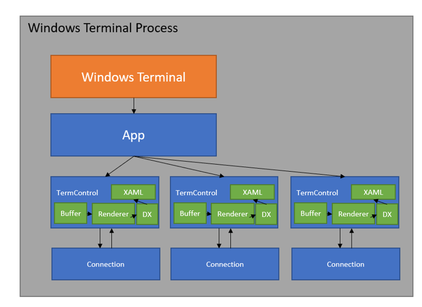
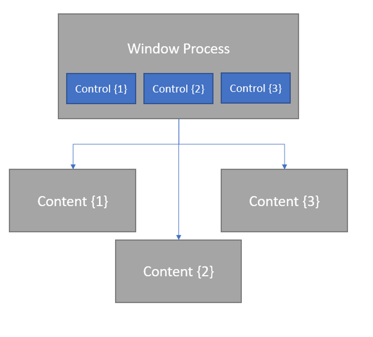
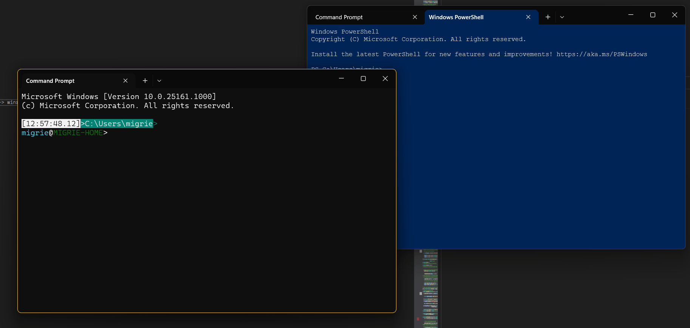

# Terminal Process Model 2.0

Mike Griese

---

# PROBLEM – Tab tear-out & merge

### WINDOW RELIABILITY
   We’d rather that crashes in one window don’t end up bringing down all your Terminal windows, so we should have one top-level window per-process
### XAML ISLANDS
   The Terminal is a XAML Islands application (with no path to WinUI 3 at the moment). There’s no way to have multiple XI windows in the same process currently.

### BUFFER CONTENTS
   How do we move 9001x32 (or more) characters, attributes, and other properties from one process to another quickly & efficiently?
### PERFORMANCE
   Any solution cannot meaningfully impact overall Terminal throughput and input responsiveness

---

# SOLUTION

## WINDOW AND CONTENT PROCESSES

Separate the Terminal into two types of process – Window, and Content.

### Window
TODO!
### Content
TODO!

---

# Current Process Model

* All one process
* `Connection` talks to ConPTY (conhost), which is responsible for communicating with client apps (`cmd`, `pwsh`, `WSL`, `ssh`)
* `TermControl` is the XAML control responsible for drawing the buffer to the screen, via DX
* `App` hosts the UI of the app, including other XAML elements

---

# Current Process Model

* All one process
* `App` hosts the UI of the app, including other XAML elements
* Multiple tabs each host their own `TermControl`s, who talk to their own `Connection`s

---

# Proposed Process Model

* Each connection / client / terminal instance lives in its own “Content Process”
* All XAML lives in a “Window Process”
* Windows host the content of multiple Content Processes

---

# Proposed Process Model

* Each connection / client / terminal instance lives in its own “Content Process”
* All XAML lives in a “Window Process”
* Windows host the content of multiple Content Processes

---

# Proposed Process Model

* Each connection / client / terminal instance lives in its own “Content Process”
* All XAML lives in a “Window Process”
* Windows host the content of multiple Content Processes

---

# PROOF OF CONCEPT

---

# Drop tab on an existing window

---

# Questions

---

# Addenda

---

# Window-Content IPC

* We’d rather not roll our own IPC mechanism to communicate between Window and Content processes
* WinRT (COM) already gives us a rich set of features for defining methods, events
* WinRT can already be used x-proc
* Small refactors to the `TermControl` code enabled us to create a WinRT boundary between the XAML code and the “core”

---

# Serialization of a Tab?

* TODO!
* we used the existing serialization code, it was grand!

