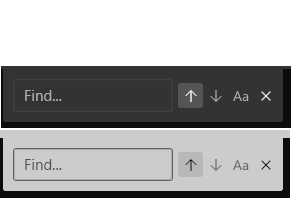
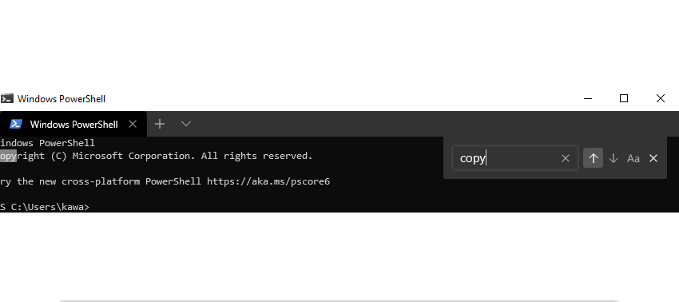
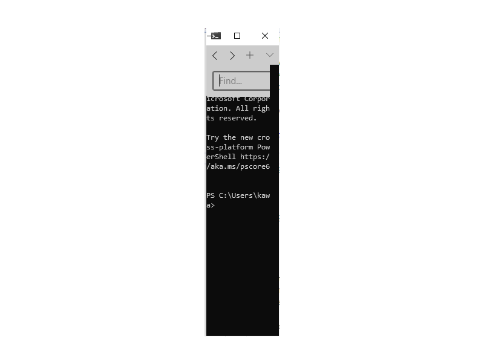

# Search in Terminal

## Abstract

This spec is for feature request #605 "Search". It goes over the details of a new feature that allows users to search text in Terminal, within one tab or from all tabs. Expected behavior and design of this feature is included. Besides, future possible follow-up works are also addressed. 

## Inspiration

One of the superior features of iTerm2 is it's content search. The search comes in two variants: search from active tab and search from all tabs. In almost any editor, there is an roughly equivalent string search. We also want to realize search experience in Terminal. There will be two variants, search within one tab or from multiple tabs. We will start with one-tab search implementation. 

## Solution Design

Our ultimate goal is to provide both search within one tab and search from all tabs experiences. But we can start with one-tab search. The search experience should have following features:

1. The search is triggered by KeyBindings. A new setting property named "find" will be enabled in the Json file. The user can set their own key bindings for search. The default is <kbd>ctrl+shift+f</kbd>. 
2. The user search in a XAML TextBox, which is contained in a custom `SearchBoxControl`. The default position of the search box is the top right corner.
3. We can have multiple search methods. The simplest one is exact text match. Other match methods include case-sensitive exact match and regex match. In the first phase, we will focus on case sensitive/insensitive text exact match. 
4. If currently there is no active selection, the search starts from the last line of the mutableViewport. If there is an active selection, we start from the previous or the next text of the selected text. We automatically go around if we reach the start point of the search.
5. The user should be able to fully interact with the terminal when the search box is on screen. 
6. For accessibility concerns, the user should be able to navigate all the interactive elements on the search box using keyboard tab if the search box is focused. Searchbox could be created and closed with keyboard bindings. Close is usually bound to Esc.

Conhost already has a module for search. It implements case sensitive or insensitive exact text match search, and it provides methods to select the found word. However, we want to make search as a shared component between Terminal and Console host. Now search module is part of Conhost, and its dependencies include BufferOut and some other types in ConHost such as SCREEN_INFORMATION. In order to make Search a shared component, we need to remove its dependency on ConHost types. BufferOut is already a shared component, but we need to make sure there is no other Conhost dependency.

We will create a `SearchBoxControl` Xaml `UserControl` element. When a search process begins, a `SearchBoxControl` object will be created and attached to `TermControl` root grid. In other words, one SearchBox is added for each `TermControl`. The reasons for this design is:

1. Each `TermControl` object is a Terminal Window and has a individual text buffer. In phase 1 we are going to search within the current terminal text buffer. 
2. If we put the search box under TerminalApp, then the search can only happen on the current focused Terminal. 
3. If the community does not like the current design, we can lift SearchBox to a higher level. 

### Search process implementation
1. Once the user press <kbd>ctrl+shift+f</kbd> (or user's custom key binding), a new `SearchBoxControl` object will be created and attached as a child of `TermControl`. Focus will move to the TextBox within the `SearchBoxControl`. 
2. Search is performed on a XAML TextBox. Once the user presses Enter or click up/down arrow button, we start to search from the last line of the current viewport or the current selection, and try to find the exact text in the text buffer. The nearest searched one will be selected. Then the search start point will be set to the selected text. The next search will start before or after the previous searched text.
3. We re-use the Search module in conhost. It performs the search in a brute-force approach. Starting from every position in the text buffer, the search algorithm compares the span of the searched string with buffer characters, and if the current buffer text matches the whole string, it will return store the position of the text in the buffer and return. The stored position information will be used for selection. 
3. The user can choose to search up or down. Search module realizes this, we just need to set a boolean flag. Default is search up. 
4. The user can choose to do case sensitive or insensitive match. This also realized by Search module by setting a boolean flag. Default is search case-insensitively. 
5. Tab navigation is realized by XAML. We just need to set TabNavigation="Cycle" in `SearchBoxControl`. 
6. If the user clicks on the "X" button or press <kbd>Esc</kbd>, the search box will disappear and the object will be destructed and detached from the `TermControl` XAML tree. In phase one we do not store any state. 
7. We need to guarantee full interaction with the terminal when the search box is open. To achieve this, search box and terminal input should be separated. If the current keyboard focus is on the search box, then keydown events will be handled on "search box level". 

## UI/UX Design

Above is the `SearchBoxControl` in dark theme and light theme.
  - The two buttons with up/down arrows controls the search direction, Each button will be styled to indicate which search direction is currently selected. 
  - The button with a "Aa" icon, if pressed, means that we are searching case-sensitivity. 
  - The current style puts all elements - the `X` button, the text box and the search pattern control buttons on one single line. This ensures that the `SearchBoxControl` won't be too high and block terminal text. This is similar with VSCode. Another possible layout style is to put elements in multiple layers. This will occupy more lines, but the search dialog will narrower. Considering that there is not many elements, we do not need multiple layers. 

The search box defaults to be on the top right corner of the Terminal window. If the current tab is split into panes, each pane will have a individual searchbox. 

#### Search process
1. The user presses <kbd>ctrl+shift+f</kbd> (or user's custom key binding) to open the search box. Focus will move to the TextBox. 
2. Search is performed on a XAML TextBox. Once the user presses Enter or click up/down arrow button, the search starts and searched text will be selected. Next search will be performed beginning from the current selection and go towards up/down. 
3. The user can choose to search up or down by selecting up arrow or down arrow buttons. The chosen button will be styled to indicate it is selected. If the user does not click the arrows buttons, the default direction is up. 
4. The user can choose to do case sensitive or insensitive match by checking a check box. The default is case insensitive. 
5. If the search box is focused, the user can navigate all the elements on the search box using tab. When selected, press Enter equals to click. 
6. If the user click the "X" button or press <kbd>Esc</kbd>, the search stopped and the search box disappears and focus will move back to Terminal.
7. Once the search box is closed (exiting search mode), the selection will still be there. This coincides with the current VS Code and cmd experience. To get rid of the selection, the user can just click other area of the window.
8. If the user clicks on the terminal when the search box is open, it will draw focus back to the terminal from the search box. The search box will still stay open. 
9. The user can interact with the terminal when the search box is open, which means that the user can scroll the terminal content, or input text when the focus is on the terminal control. 
10. If the user switches tabs while the search box is open, the focus will be moved back to the terminal. 

## Capabilities

1. The user can search exact matched text in the text buffer of the Terminal Screen. 
2. The user can choose to search case sensitively and insensitively. 
3. The user can search up or down. 
4. Found text will be selected. 
5. The search will start from the active selected text (inclusive) if there is one, or the end of the written text. 
6. The search will automatically go around when it reaches the starting point.
7. The user can use Tab to navigate all the elements in the search box. 
8. The user can search in the opposite direction with <kbd>Shift + Enter</kbd> 

### Accessibility

The user should be able to use search by keyboard only.
Once the searchbox is focused, the user can navigate between elements in the search box using Tab. And "click" using Enter. 

### Security

This feature should not introduce any new security issues.

### Reliability

1. The key input of Terminal command line and the search box should be separated. Search box should not block interaction with the command line when it is open. 
2. The search box should not block too much text. The search box only occupies one line, so it won't have big impact on the readability of the terminal output. 

### Compatibility

This feature won't break existing features of Terminal.

### Performance, Power, and Efficiency

This feature only launches in need. It does not impact the performance of Terminal. 

## Potential Issues
                                                              
1. If the terminal window is not wide enough for the search box to be visible, the buttons on the right of the `TextBox` will become invisible, but the `TextBox` is still visible and the window could not be narrower than the `TextBox`. This is similar to the behavior of other editors. Please see the image below:
   
2. If the terminal window is not high enough for the search box to be visible, the whole terminal screen, including the `SearchBoxControl` can disappear. This is similar to the behavior of other editors.

## Future considerations

In version 1, we want realize a case sensitive/insensitive exact text match. But we may consider the following features in version 2:

1. Add "Find" button in dropdown menu to trigger search. This enables the search feature to be operated with mouse only. However, this is not required by Accessibility so we do not cover this in phase one. 
2. Search from all tabs. For Version 1 we just want to realize search within one tab. However, the community also requests search from all tabs. This may require a big change to the search algorithm, but it is not seen as a popular use scenario, so we put it future phase. To implement multi-tab search, we can let TerminalPage or App own a `SearchBoxControl` object, and provide the text buffer of the current focused terminal. We need to change the search algorithm.  
3. Regular expression match. This is a useful search pattern and is implemented in some editors. However, this use scenario is not used as much as exact text search, thus, we put it in future phase.
4. Search history. Sometimes users would do the same search for several times, thus, storing the search history is useful. This is not realized by VSCode so it would be a good highlighting point in the future. 
5. High-light while you type. Emphasizing all the other matches in the buffer with an outline or selection with another color. This provides a clearer view of searched text. But we need to change the search and selection algorithm, so we put it in the future phase. 
6. Add size handle. Some text editors let the user resize the search box, and there is a size handle on the left side of the search box. This helps user when they search for long text. If the community desires it we may add a similar feature.

This open issue tracks the phase features of Search: https://github.com/microsoft/terminal/issues/3920

## Resources

GitHub Issue: https://github.com/microsoft/terminal/issues/605
