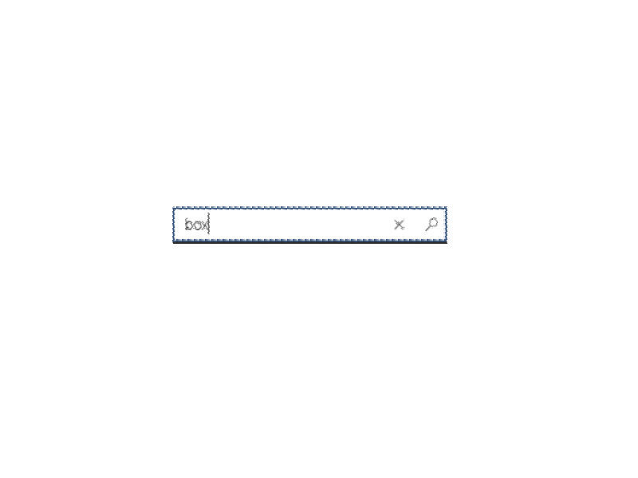

# Search in Terminal

## Abstract

This spec is for feature request #605 "Search". It goes over the details of a new feature that allows users to search text in Terminal, within one tab or from all tabs. Expected behavior and design of this feature is included. Besides, future possible follow-up works are also addressed. 

## Inspiration

One of the superior features of iTerm2 is it's content search. The search comes in two variants: search from active tab and search from all tabs. In almost any editor, there is an roughly equivalent string search. We also want to realize search experience in Terminal. There will be two variants, search within one tab or from multiple tabs. We will start with one-tab search implementation. 

## Solution Design

Our ultimate goal is to provide both search within one tab and search from all tabs experiences. But we can start with one-tab search. The search experience should have following features:

1. The search is triggered by keybindings "Ctrl + F". This coincides with other editors. In the future we will also consider adding a "Find" in the dropdown menu. 
2. The user search in a XAML AutoSuggestBox on the top right corner of the Terminal window. 
3. We can have multiple search methods. The simplest one is text exact match. Other match methods include case-sensitive exact match and regex match. In the first phrase, we will focus on case sensitive/insensitive text exact match. 
4. If currently there is no active selection, the search starts from the line that the cursor is on. If there is an active selection, we start from the previous or the next text of the selected text. We automatically go around if we reach the start point of the search. 
5. The search dialog should not block terminal's view. 

Conhost already has a module for search. It realizes case sensitive or insensitive exact text match search, and it provides methods to select the found word. However, we want to make search as a shared component between Terminal and Console host. Now search module is part of Conhost, and its dependencies include BufferOut and some other types in ConHost such as SCREEN_INFORMATION. In order to make Search a shared component, we need to remove its dependency on ConHost types. BufferOut is already a shared component, but we need to make sure there is no other Conhost dependency.

Search process:
Search is performed on a XAML AutoSuggestBox. Once the user click the "Find" icon, we start from the cursor (or the current selection), and try to find the exact text in the text buffer. The nearest searched one will be selected. And we set the search start point to the selected text. The next time "Find" button is clicked, the search will start before or after the previous searched text.
The user can choose to search up or down by choosing up arrow or down arrow buttons.
The user can choose to do case sensitive or insensitive match by clicking a button.
If the user click the "X" button, the search stopped and the search box disappears. In phrase one we do not store any state, but in the future we can consider storing the search history. 

## UI/UX Design

Above is the XAML AutoSuggestBox. We also need to add at least two more buttons, one for case sensitive/insensitive switch, and one for search direction switch. We can consider adding the buttons on the right side of the AutoSuggestBox.

The search box should be on the top right corner of the Terminal window. We need to avoid it blocking too much screen contents. 

## Capabilities

1. The user can search exact matched text in the text buffer of the Terminal Screen. 
2. The user can choose to search case sensitively and insensitively. 
3. The user can search up or down. 
4. Found text will be selected. 
5. The search will start from the active selected text (inclusive) if there is one, or where the cursor is. 
5. The search will automatically go around when it reaches the starting point. 

### Accessibility

This feature could help multitaksing terminal users. 

### Security

This feature should not introduce any new security issues.

### Reliability

This feature enable users to search for text in the terminal input/output history. This is a widely-used feature in most editors and thus improve the reliability of Terminal once added. 

### Compatibility

This feature won't break existing features of Terminal.

### Performance, Power, and Efficiency

This feature only launches in need. It does not impact the performance of Terminal. 

## Potential Issues

1. The search bar should not block command line view. 
2. Search should not block any program the Terminal is currently executing.

## Future considerations

In version 1, we want realize a case sensitive/insensitive exact text match. But we may consider the following features in version 2:

1. Add "Find" button in dropdown menu to trigger search. 
2. Search from all tabs. For Version 1 we just want to realize search within one tab. However, the community also requests search from all tabs. We put in our goals for Version 2. 
3. Regular experssion match. 
4. Search history.
5. High-light while you type. 
 

## Resources

Github Issue: https://github.com/microsoft/terminal/issues/605
