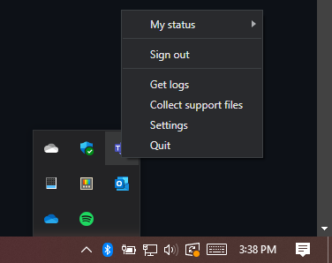

# Quake Mode

## Abstract

Many existing terminals support a feature whereby a user can press a keybinding
anywhere in the OS, and summon their terminal application. Oftentimes the act of
summoning this window is accompanied by a "dropdown" animation, where the window
slides in to view from the top of the screen. This global summon action is often
referred to as "quake mode", a reference to the video game Quake, who's console
slid in from the top.

This spec addresses both of the following two issues:
* "Quake Mode" ([#653])
* "Minimize to tray" ([#5727])

Readers should make sure to have read the [Process Model 2.0 Spec], for
background on Monarch and Peasant processes.

## Background

### Inspiration

For an example of the original Quake console in action, take a look at the
following video (noisy video warning): [Quake 3 sample]. Additionally, plenty of
existing terminal emulators support similar functionality:

* **Tilda** allows the user to specify different keys to summon the window on
  different monitors.
* **Guake** alternatively allows the user to either summon the terminal window to
  a specific monitor, or whichever monitor the mouse is on. Guake only allows
  one single instance, so pressing the global hotkey always summons the same
  instance.

### User Stories

The original quake mode thread (#653) is absolutely _filled_ with variations on
how users want to be able to summon their terminal windows. These include, but
are not limited to:

* **Story A** Press a hotkey anywhere to activate the single Terminal window
  wherever it was
* **Story B** Press a hotkey anywhere to activate the single Terminal window _on
  the current monitor_. If it wasn't previously on that monitor, move it there.
* **Story C** When the Terminal is summoned using the hotkey, have it "slide in"
  from the top. Similarly, slide out on deactivate.
* **Story D** <kbd>Ctrl+1</kbd> to activate the terminal on monitor 1,
  <kbd>Ctrl+2</kbd> to activate the terminal on monitor 2.
* **Story E** Variable dropdown speed
* **Story F** Minimize to tray, press a hotkey to activate the terminal window
  (#5727)
* **Story G** Terminal doesn't appear in alt+tab view, press a hotkey to
  activate the single terminal window / the nearest terminal window (I'm not
  sure this is distinct from the above)

## Solution Design

To implement this feature, we'll add the following settings:
* a new action, named `globalSummon`.
* a new global, app setting named `minimizeToTray`
* a new global, app setting named `alwaysShowTrayIcon`
* a new action, named `quakeMode`, and a specially named `_quake` window.

### `globalSummon` Action

The `globalSummon` action will be a keybinding the user can use to summon a
Terminal window from anywhere in the OS. Various arguments to the action will
specify which window is summoned, to where, and how the window should behave on
summon.

From a technical perspective, the action will work by using the
[`RegisterHotKey`] function. This API allows us to bind a particular hotkey with
the OS. Whenever that hotkey is pressed, our window message loop will receive a
`WM_HOTKEY`. We'll use the payload of that window message to lookup the action
arguments for that hotkey. Then we'll use those arguments to control which
window is invoked, where, and how the window behaves.

Since `RegisterHotKey` can only be used to register a hotkey _once_ with the OS,
we'll need to make sure it's only ever set up by the Monarch process. We know
that there will only ever be one Monarch for the Terminal at a time, so it's the
perfect process to have the responsibility of managing the global hotkey.

The Monarch will be responsible for calling `RegisterHotKey`, and processing the
`WM_HOTKEY` messages. It will then dispatch method calls to the appropriate
window to summon it. When a Monarch dies and a new process becomes the Monarch,
the new Monarch will re-register for the hotkeys.

#### Where in the settings?

Since users may want to bind multiple keys to summon different windows, we'll
need to allow the user to specify multiple keybindings simultaneously, each with
their own set of args.

We stick all the `globalSummon`s in the actions array, like they're any other
keybinding.

However, these are not keys that are handled by the TerminalApp layer itself.
These are keys that need to be registered with the OS. So while they will be in
the normal `KeyMap`, they will need to be retrieved from that object and
manually passed to the window layer.

> A previous iteration of this spec considered placing the `globalSummon`
> actions in their own top-level array of the settings file, separate from the
> keybindings. This is no longer being considered, because it would not work for
> the case where the user has something like:
> ```json
> { "keys": "ctrl+c", "command": { "action": "globalSummon", "monitor": 1 } },
> { "keys": "ctrl+v", "command": { "action": "copy" } },
> ```

#### Which window, and where?

When looking at the list of requested scenarios, there are lots of different
ways people would like to use the global summon action. Some want the most
recent window activated, always. Others want to have one window _per monitor_.
Some would like to move the window to where the user is currently interacting
with the PC, and others want to activate the window where it already exists.
Trying to properly express all these possible configurations is complex. The
settings should be unambiguous as to what will happen when you press the
keybinding.

I believe that in order to accurately support all the variations that people
might want, we'll need two properties in the `globalSummon` action. These
properties will specify _which_ window we're summoning, and _where_ to summon
the window. To try and satisfy all these scenarios, I'm proposing the following
two arguments to the `globalSummon` action:

```json
"monitor": "any"|"toCurrent"|"toMouse"|"onCurrent"|int,
"desktop": "any"|"toCurrent"|"onCurrent"
```

The way these settings can be combined is in a table below. As an overview:

* `monitor`: This controls the monitor that the window will be summoned from/to
  - `"any"`: Summon the MRU window, regardless of which monitor it's currently
    on.
  - `"toCurrent"`/omitted: (_default_): Summon the MRU window **TO** the monitor
    with the current **foreground** window.
  - `"toMouse"`: Summon the MRU window **TO** the monitor where the **mouse**
    cursor is.
  - `"onCurrent"`: Summon the MRU window **ALREADY ON** the current monitor.
  - `int`: Summon the MRU window for the given monitor (as identified by the
    "Identify" displays feature in the OS settings)

* `desktop`: This controls how the terminal should interact with virtual desktops.
  - `"any"`: Leave the window on whatever desktop it's already on - we'll switch
    to that desktop as we activate the window.
    - > NOTE: A previous version of this spec had this enum value as `null`.
      This was changed to `"any"` for parity with the `monitor` property.
  - `"toCurrent"`/omitted: (_default_): Move the window **to** the current
    virtual desktop
  - `"onCurrent"`: Only summon the window if it's **already on** the current
    virtual desktop

Neither `desktop` nor `monitor` is a required parameter - if either is omitted,
the omitted property will default to `toCurrent`.

Together, these settings interact in the following ways:

<!-- This table is formatted for viewing as rendered HTML. It's too complicated
for pure markdown, sorry. -->
<table>
<tr>
<td></td>
<th colspan=3><code>"desktop"</code></th>
</tr>
<!-- ----------------------------------------------------------------------- -->
<tr>
<th><code>"monitor"</code></th>
<td><code>any</code><br><strong>Leave where it is</strong></td>
<td><code>"toCurrent"</code><br><strong>Move to current desktop</strong></td>
<td><code>"onCurrent"</code><br><strong>On current desktop only</strong></td>
</tr>
<!-- ----------------------------------------------------------------------- -->
<tr>
<td><code>"any"</code><br> Summon the MRU window</td>

<td>Go to the desktop the window is on  (leave position alone)</td>
<td>Move the window to this desktop (leave position alone)</td>
<td>

If there isn't one on this desktop:
* create a new one (default position)

Else:
* activate the one on this desktop (don't move it)
</td>
</tr>
<!-- ----------------------------------------------------------------------- -->
<tr>
<td><code>"toCurrent"</code><br> Summon the MRU window TO the monitor with the foreground window</td>
<td>Go to the desktop the window is on, move to the monitor with the foreground window</td>
<td>Move the window to this desktop, move to the monitor with the foreground window</td>
<td>

If there isn't one on this desktop:
* create a new one (on the monitor with the foreground window)

Else:
* activate the one on this desktop, move to the monitor with the foreground window
</td>
</tr>
<!-- ----------------------------------------------------------------------- -->
<tr>
<td>
  <code>"toMouse"</code>
  <sup><a href="#footnote-2">[2]</a></sup> <br>
  Summon the MRU window TO the monitor with the mouse</td>
<td>Go to the desktop the window is on, move to the monitor with the mouse</td>
<td>Move the window to this desktop, move to the monitor with the mouse</td>
<td>

If there isn't one on this desktop:
* create a new one (on the monitor with the mouse)

Else:
* activate the one on this desktop, move to the monitor with the mouse
</td>
</tr>
<!-- ----------------------------------------------------------------------- -->
<tr>
<td><code>"onCurrent"</code><br> Summon the MRU window for the current monitor</td>
<td>

If there is a window on this monitor on any desktop,
* Go to the desktop the window is on (leave position alone)

else
* Create a new window on this monitor  & desktop
</td>
<td>

If there is a window on this monitor on any desktop,
* Move the window to this desktop (leave position alone)

else
* Create a new window on this monitor  & desktop
</td>
<td>

If there isn't one on this desktop, (even if there is one on this monitor on
another desktop),
* create a new one on this monitor

Else if ( there is one on this desktop, not this monitor)
* create a new one on this monitor

Else (one on this desktop & monitor)
* Activate the one on this desktop (don't move)
</td>
</tr>
<!-- ----------------------------------------------------------------------- -->
<tr>
<td><code>int</code><br> Summon the MRU window for monitor N</td>
<td>

If there is a window on monitor N on any desktop,
* Go to the desktop the window is on (leave position alone)

else
* Create a new window on this monitor  & desktop
</td>
<td>

If there is a window on monitor N on any desktop,
* Move the window to this desktop (leave position alone)

else
* Create a new window on this monitor & desktop
</td>
<td>

If there isn't one on this desktop, (even if there is one on monitor N on
another desktop),
* create a new one on monitor N

Else if ( there is one on this desktop, not monitor N)
* create a new one on monitor N

Else (one on this desktop & monitor N)
* Activate the one on this desktop (don't move)
</td>
</tr>
</table>


##### Stories, revisited

With the above settings, let's re-examine the original user stories, and see how
they fit into the above settings. (_Stories that are omitted aren't relevant to
the discussion of these settings_)

> When the `desktop` param is omitted below, that can be interpreted as "any
> `desktop` value will make sense here"

* **Story A** Press a hotkey anywhere to activate the single Terminal window
  wherever it was
  - This is `{ "monitor": "any", "desktop": "any" }`
* **Story B** Press a hotkey anywhere to activate the single Terminal window _on
  the current monitor_. If it wasn't previously on that monitor, move it there.
  - This is `{ "monitor": "toCurrent" }`
* **Story D** <kbd>Ctrl+1</kbd> to activate the terminal on monitor 1,
  <kbd>Ctrl+2</kbd> to activate the terminal on monitor 2.
  - This is `[ { "keys": "ctrl+1", monitor": 1 }, { "keys": "ctrl+2", monitor": 2 } ]`

As some additional examples:

```json
// Go to the MRU window, wherever it is
{ "keys": "win+1", "command":{ "action":"globalSummon", "monitor":"any", "desktop": "any" } },

// activate the MRU window, and move it to this desktop & this monitor
{ "keys": "win+2", "command":{ "action":"globalSummon", "monitor":"toCurrent", "desktop": "toCurrent" } },
// Since "toCurrent" & "toCurrent" are the default values, just placing a single
// entry here will bind the same behavior:
{ "keys": "win+2", "command": "globalSummon" },

// activate the MRU window on this desktop
{ "keys": "win+3", "command":{ "action":"globalSummon", "monitor":"any", "desktop": "onCurrent" } },

// Activate the MRU window on monitor 2 (from any desktop), and place it on the
// current desktop. If there isn't one on monitor 2, make a new one.
{ "keys": "win+4", "command":{ "action":"globalSummon", "monitor": 2, "desktop": "toCurrent" } },

// Activate the MRU window on monitor 3 (ONLY THIS desktop), or make a new one.
{ "keys": "win+5", "command":{ "action":"globalSummon", "monitor": 3, "desktop": "onCurrent" } },

// Activate the MRU window on this monitor (from any desktop), and place it on
// the current desktop. If there isn't one on this monitor, make a new one.
{ "keys": "win+6", "command":{ "action":"globalSummon", "monitor": "onCurrent", "desktop": "toCurrent" } },
```

#### Summoning a specific window

What if you want to press a keybinding to always summon a specific, named
window? This window might not be the most recent terminal window, nor one that
would be selected by the `monitor` and `desktop` selectors. You could name a
window "Epona", and press `win+e` to always summon the "Epona" window.

We'll add the following property to address this scenario

* `"window": string|int`
  - When omitted (_default_): Use monitor and desktop to find the appropriate
    MRU window to summon.
  - When provided: Always summon the window who's name or ID matches the given
    `window` value. If no such window exists, then create a new window with that
    name/id.

When provided _with_ `monitor` and `desktop`, `window` behaves in the following
ways:
* `desktop`
  - `"any"`: Go to the desktop the given window is already on.
  - `"toCurrent"`: If the window is on another virtual desktop, then move it to
    the currently active one.
  - `"onCurrent"`: If the window is on another virtual desktop, then move it to
    the currently active one.
* `monitor`
  - `"any"`: Leave the window on the monitor it is already on.
  - `"toCurrent"`: If the window is on another monitor, then move it to the
    currently active one.
  - `"onCurrent"`: If the window is on another monitor, then move it to the
    currently active one.
  - `<int>`: If the window is on another monitor, then move it to the specified
    monitor.

> NOTE: You read that right, `onCurrent` and `toCurrent` both do the same thing
> when `window` is provided. They both already know which window to select, the
> context of moving to the "current" monitor is all that those parameters add.

#### Other properties

Some users would like the terminal to just appear when the global hotkey is
pressed. Others would like the true quake-like experience, where the terminal
window "slides-in" from the top of the monitor. Furthermore, some users would
like to configure the speed at which that dropdown happens. To support this
functionality, the `globalSummon` action will support the following property:

* `"dropdownDuration": float`
  - When omitted, `0`, or a negative number: No animation is used
    when summoning the window. The summoned window is focused immediately where
    it is.
  - When a positive number is provided, the terminal will use that value as a
    duration (in seconds) to slide the terminal into position when activated.
  - The default would be some sensible value. The pane animation is .2s, so
    `0.2` might be a reasonable default here.

We could have alternatively provided a `"dropdownSpeed"` setting, that provided
a number of pixels per second. In my opinion, that would be harder for users to
use correctly. I believe that it's easier for users to mentally picture "I'd
like the dropdown to last 100ms" vs "My monitor is 1504px tall, so I need to set
this to 15040 to make the window traverse the entire display in .1s"

> NOTE: `dropdownDuration` will be ignored when the user has animations disabled
> in the OS. In that case, the terminal will just appear, as if it was set to 0.

Some users might want to be able to use the global hotkey to hide the window
when the window is already visible. This would let the hotkey act as a sort of
global toggle for the Terminal window. Others might not like that behavior, and
just want the action to always bring the Terminal into focus, and do nothing if
the terminal is already focused. To facilitate both these use cases, we'll add
the following property:

* `"toggleVisibility": bool`
  - When `true`: (_default_) When this hotkey is pressed, and the terminal
    window is currently active, minimize the window.
      - When `dropdownDuration` is not `0`, then the window will slide back off
        the top at the same speed as it would come down.
  - When `false`: When this hotkey is pressed, and the terminal window is
    currently active, do nothing.

### Quake Mode

In addition to just summoning the window from anywhere, some terminals also
support a special "quake mode" buffer or window. This window is one that closely
emulates the console from quake:
* It's docked to the top of the screen
* It takes the full width of the monitor, and only the bottom can be resized
* It often doesn't have any other UI elements, like tabs

For fun, we'll also be adding a special `"_quake"` window with the same
behavior. If the user names a window `_quake`, then it will behave in the
following special ways:

* On launch, it will ignore the `initialPosition` and
  `initialRows`/`initialCols` setting, and instead resize to the top half of the
  monitor.
* On launch, it will ignore the `launchMode` setting, and always launch in focus
  mode.
  - Users can disable focus mode on the `_quake` window if they do want tabs.
* It will not be resizable from any side except the bottom of the window, nor
  will it be drag-able.
* It will not be a valid target for the "most recent window" for window
  glomming. If it's the only open window, with `"windowingBehavior":
  "useExisting*"`, then a new window will be created instead.
  - It _is_ still a valid target for something like `wt -w _quake new-tab`

A window at runtime can be renamed to become the `_quake` window (if no other
`_quake` window exists). When it does, it will resize to the position of the
quake window, and enter focus mode.

We'll also be adding a special action `quakeMode`. This action is a special case
of the `globalSummon` action, to specifically invoke the quake window in the
current place. It is basically the same thing as the more elaborate:

```json
{
    "monitor": "toCurrent",
    "desktop": "toCurrent",
    "window": "_quake",
    "toggleVisibility": true,
    "dropdownDuration": 0.5
},
```

### Minimize to Tray

Many users have requested that the terminal additionally supports minimizing the
window "to the tray icon". This is a bit like when you close the Teams window,
but Teams is actually still running in the system tray, or the "notification
area".



_fig 1: an example of the Teams tray icon in the notification area_.

When users want to be able to "minimize to the tray", they want:
* The window to no longer appear on the taskbar
* The window to no longer appear in the alt-tab order

When minimized to the tray, it's almost as if there's no window for the Terminal
at all. This can be combined with the global hotkey (or the tray icon's context
menu) to quickly restore the window.

The tray icon could be used for a variety of purposes. As a simple start, we
could include the following three options:

```
Focus Terminal
---
Windows > Window 1 - <un-named window>
          Window 2 - "This-window-does-have-a-name"
---
Quit
```

Just clicking on the icon would summon the recent terminal window. Right
clicking would show the menu with "Focus Terminal", "Windows" and "Quit" in it, and
"Windows" would have nested entries for each Terminal window.

* "Focus Terminal" would do just that - summon the most recent terminal window,
  wherever it is.
* "Windows" would have nested popups for each open Terminal window. Each of
  these nested entries would display the name and ID of the window. Clicking
  them would summon that window (wherever it may be)
* "Quit" would be akin to quit in browsers - close all open windows
  <sup>[[1]](#footnote-1)</sup>.

The tray notification would be visible always when the user has
`"minimizeToTray": true` set in their settings. If the user has that set to
false, but would still like the tray, they can specify `"alwaysShowTrayIcon":
true`. That will cause the tray icon to always be added to the system tray.

There's not a combination of settings where the Terminal is "minimized to the
tray", and there's _no tray icon visible_. We don't want to let users get into a
state where the Terminal is running, but is totally hidden from their control.

From a technical standpoint, the tray icon is managed similar to the global
hotkey. The Monarch process is responsible for setting it up, and processing the
messages. When a Monarch dies and a new process becomes the Monarch, then it
will re-create the tray icon.

## UI/UX Design

To summarize, we're proposing the following set of settings:

```jsonc
{
    "minimizeToTray": bool,
    "alwaysShowTrayIcon": bool,
    "actions": [
        {
            "keys": KeyChord,
            "command": {
                "action": "globalSummon",
                "dropdownDuration": float,
                "toggleVisibility": bool,
                "monitor": "any"|"toCurrent"|"onCurrent"|int,
                "desktop": "any"|"toCurrent"|"onCurrent"
            }
        },
        {
            "keys": KeyChord,
            "command": {
                "action": "quakeMode"
            }
        }
    ]
}
```

## Potential Issues

<table>

<tr>
<td><strong>Compatibility</strong></td>
<td>

As part of this set of changes, we'll also be allowing the <kbd>Win</kbd> key in
keybindings. Generally, the OS reserves the Windows key for its own shortcuts.
For example, <kbd>Win+R</kbd> for the run dialog, <kbd>Win+A</kbd> for the
Action Center, <kbd>Win+V</kbd> for the cloud clipboard, etc. Users will now be
able to use the win key themselves, but they should be aware that the OS has
"first dibs" on any hotkeys involving the Windows key.

</td>
</tr>
<tr>
<td><strong>Mixed elevation</strong></td>
<td>

Only one app at a time gets to register for global hotkeys. However, from the
Terminal's perspective, unelevated and elevated windows will act like different
apps. Each privilege level has its own Monarch. The two are unable to
communicate across the elevation boundary.

This means that if the user often runs terminals in both contexts, then only one
will have the global hotkeys bound. The naive implementation would have the
first elevation level "win" the keybindings.

A different option would be to have elevated windows not register global hotkeys
_at all_. I don't believe that there's any sort of security implication for
having a global hotkey for an elevated window.

A third option would be to have some sort of `"whenElevated": bool?` property
for global hotkeys. This would explicitly enable a given hotkey for unelevated
vs elevated windows.
* `"whenElevated": null`: behave as normal - the first context level to run wins
* `"whenElevated": true`: only register the hotkey when running elevated
* `"whenElevated": false`: only register the hotkey when running unelevated

</td>
</tr>
<tr>
<td><strong>OneCore / Windows 10X</strong></td>
<td>

I'm fairly certain that none of these APIs would work on Windows 10X at all.
These features would have to initially be disabled in a pure UWP version of the
Terminal, until we could find workarounds. Since the window layer is the one
responsible for the management of the hotkeys and the tray icon, we're not too
worried about this.

</td>
</tr>
</table>

* If there are any other applications running that have already registered
  hotkeys with `RegisterHotKey`, then it's possible that the Terminal's attempt
  to register that hotkey will fail. If that should happen, then we should
  display a warning dialog to the user indicating which hotkey will not work
  (because it's already used for something else).

* Which is the "current" monitor? The one with the mouse or the one with the
  active window? This isn't something that has an obvious answer. Guake
  implements this feature where the "current monitor" is the one with the mouse
  on it. At least for the first iterations of this action, that's what we'll
  use.
  `monitor: onCurrent|onCurrentWindow|toCurrent|<int>`

* Currently, running both the Release and Preview versions of the Terminal at
  the same time side-by-side is not generally supported. (For example, `wt.exe`
  can only ever point at one of two.) If a user binds the same key to a
  `globalSummon` or `quakeMode` action, then only one of the apps will actually
  be able to successfully claim the global hotkey.

## Implementation plan

Currently, in [`dev/migrie/f/653-QUAKE-MODE`], I have some sample rudimentary
code to implement quake mode support. It allows for only a single global hotkey
that summons the MRU window, without dropdown. That would be a good place for
anyone starting to work on this feature. From there, I imagine the following
work would be needed:

* [ ] Add a `globalSummon` action. `AppHost` would need to be able to get _all_
  of these actions, and register all of them. Each one would need to be assigned
  a unique ID, so `WM_HOTKEY` can identify which hotkey was pressed.
    - This could be committed without any other args to the `globalHotkeys`. In
      this initial version, the behavior would be summoning the MRU window,
      where it is, no dropdown, to start with. From there, we'd add the
      remaining properties:
    * [ ] Add support for the `toggleVisibility` property
    * [ ] Add support for the `desktop` property to control how window summoning
      interacts with virtual desktops
    * [ ] Add support for the `monitor` which monitor the window appears on.
    * [ ] Add support for the `dropdownDuration` property
* [ ] Add the `minimizeToTray` setting, and implement it without any sort of flyout
    * [ ] Add a list of windows to the right-click flyout on the tray icon
    * [ ] Add support for the `alwaysShowTrayIcon` setting
* [ ] When the user creates a window named `_quake`, ignore the initial size,
  position, and launch mode, and create the window in quake mode instead.
    * [ ] Exempt the `_quake` window from window glomming
    * [ ] Add the `quakeMode` action, which `globalSummon`'s the `_quake` window.
    * [ ] Prevent the `_quake` window from being dragged or resized on the
      top/left/right.


### Future Considerations

I don't believe there are any other tracked requests that are planned that
aren't already included in this spec.

* Should the tray icon's list of windows include window titles? Both the name
  and title? Maybe something like `({name}|{id}): {title}`? I'd bet that most
  people don't end up naming their windows.
* Dropdown duration could be a `float|bool`, with `true`->(whatever the default
  is), `false`->0.
  - We could have the setting appear as a pair of radio buttons, with the first
    disabling dropdown, and the second enabling a text box for inputting an
    animation duration.
* It might be an interesting idea to have the ability to dock the quake window
  to a specific side of the monitor, not just the top. We could probably do that
  with a global setting `"quakeModeDockSide": "top"|"left"|"bottom"|"right"` or
  something like that.
* We might want to pre-load the quake window into the tray icon as an entry for
  "Quake Mode", and otherwise exclude it from the list of windows in that menu.
* We might think of other things for the Quake Mode window in the future - this
  spec is by no means comprehensive. For example, it might make sense for the
  quake mode window to automatically open in "always on top" mode.
* It was suggested that the quake mode window could auto-hide when it loses
  focus. That's a really neat idea, but we're a little worried about the
  implementation. What happens when the IME window gets focus? Or the Start
  Menu? Would those end up causing the quake window to prematurely minimize
  itself? For that reason, we're leaving this as a future consideration.
* Perhaps there could be a top-level object in the settings like
  ```json
  {
    "quakeMode": {
        "hideOnFocusLost": true,
        "useFocusMode": false,
        "profile": "my quake mode profile" ,
        "quakeModeDockSide": "bottom"
    }
  }
  ```
  That would allow the user some further customizations on the quake mode
  behaviors.
  - This was later converted to the idea in [#9992] - Add per-window-name global
    settings
* Another proposed idea was a simplification of some of the summoning modes. `{
  "monitor": "any", "desktop": "any" }` is a little long, and maybe not the most
  apparent naming. Perhaps we could add another property like `summonMode` that
  would act like an alias for a `monitor`, `desktop` combo.
  - `"summonMode": "activateInMyFace"`: `{ "monitor": "toCurrent", "desktop": "toCurrent" }`
  - `"summonMode": "activateWherever"`: `{ "monitor": "any", "desktop": "any" }`


## Resources

Docs on adding a system tray item:
* https://docs.microsoft.com/en-us/windows/win32/shell/notification-area
* https://www.codeproject.com/Articles/18783/Example-of-a-SysTray-App-in-Win32

Docs regarding hiding a window from the taskbar:
* https://docs.microsoft.com/en-us/previous-versions//bb776822(v=vs.85)#managing-taskbar-buttons

### Footnotes

<a name="footnote-1"><a>[1]: Quitting the terminal is different than closing the
windows one-by-one. Quiting implies an atomic action, for closing all the
windows. Once [#766] lands, this will give us a chance to persist the state of
_all_ open windows. This will allow us to re-open with all the user's windows,
not just the one that happened to be closed last.

<a name="footnote-2"><a>[2]: **Addenda, May 2021**: In the course of
implementation, it became apparent that there's an important UX difference
between summoning _to the monitor with the cursor_ vs _to the monitor with the
foreground window_. `"monitor": "toMouse"` was added as an option, to allow the
user to differentiate between the two behaviors.

[#653]: https://github.com/microsoft/terminal/issues/653
[#766]: https://github.com/microsoft/terminal/issues/766
[#5727]: https://github.com/microsoft/terminal/issues/5727
[#9992]: https://github.com/microsoft/terminal/issues/9992

[Process Model 2.0 Spec]: https://github.com/microsoft/terminal/blob/main/doc/specs/%235000%20-%20Process%20Model%202.0/%235000%20-%20Process%20Model%202.0.md
[Quake 3 sample]: https://youtu.be/ZmR6HQbuHPA?t=27
[`RegisterHotKey`]: https://docs.microsoft.com/en-us/windows/win32/api/winuser/nf-winuser-registerhotkey
[`dev/migrie/f/653-QUAKE-MODE`]: https://github.com/microsoft/terminal/tree/dev/migrie/f/653-QUAKE-MODE
