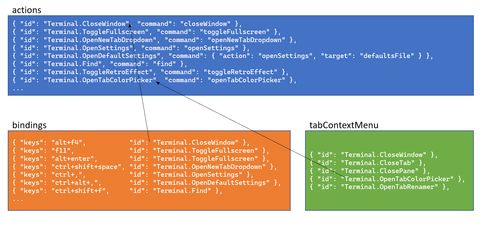
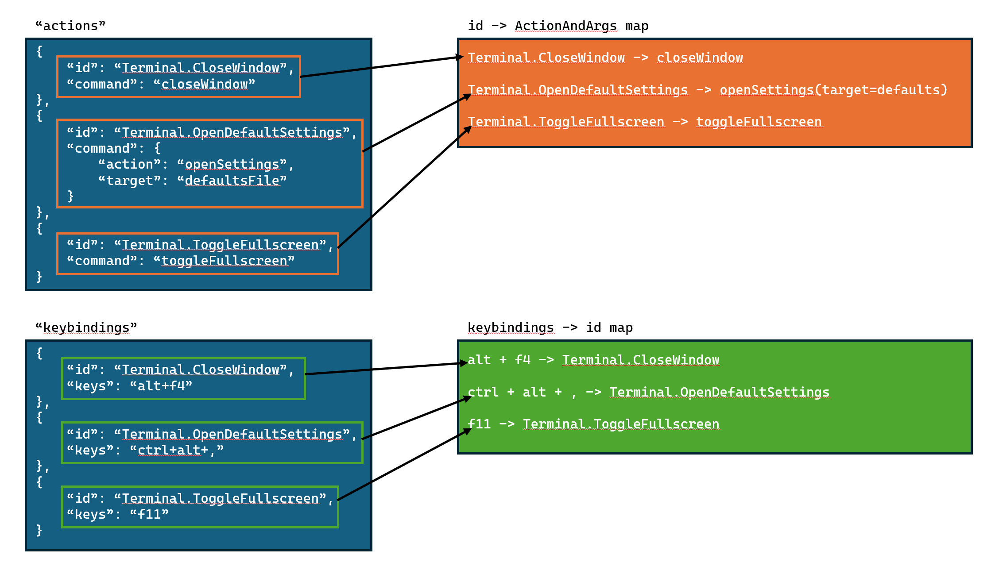

# Action IDs

## Abstract

This document is intended to serve as an addition to the [Command Palette Spec],
as well as the [New Tab Menu Customization Spec].

As we come to rely more on actions being a mechanism by which the user defines
"do something in the Terminal", we'll want to make it even easier for users to
re-use the actions that they've already defined, as to reduce duplicated json as
much as possible. This spec proposes a mechanism by which actions could be
uniquely identifiable, so that the user could refer to bindings in other
contexts without needing to replicate an entire json blob.

## Solution Design

This spec was largely inspired by the following diagram from @DHowett:



The goal is to introduce an `id` parameter by which actions could be uniquely
referred to. If we'd ever like to use an action outside the list of `actions`, we
can simply refer to the action's ID, allowing the user to only define the action
_once_.

We'll start by renaming `bindings` to `actions`. `bindings` was suggested as a
rename for `keybindings` in [#6532], as a way to make the name more generic.
Discussion with the team lead to the understanding that the name `actions` would
be even better, as a way of making the meaning of the "list of actions" more
obvious.

We will then restructure `defaults.json`, and also users' settings files (via `fixUpUserSettings`), in the following manner:
* Instead of each `command` json block containing both the `action` (along with additional arguments) and the `keys`, these will now be split up -
    * There will now be one json block for just the `command`/`action`, which will also contain the `id`. These json blocks will be in their own list called `actions`.
    * There will be another json block for the `keys`, which will refer to the action to be invoked by `id`. These json blocks will be in their own list called `keybindings`.

For example, let's take a look at the `split pane right` action in `defaults.json` as we currently have it:

`"actions": [..., { "command": { "action": "splitPane", "split": "right" }, "keys": "alt+shift+plus" }, ...]`

This will now become:

`"actions": [..., { "command": { "action": "splitPane", "split": "right" }, "id": "Terminal.SplitPaneRight" }, ...]`

`"keybindings": [..., { "keys": "alt+shift+plus", "id": "Terminal.SplitPaneRight" }, ...]`

Here is how we will parse settings file and construct the relevant settings model objects:
* We will first scan the `actions` list. We'll
  attempt to parse those entries into `ActionAndArgs` which we'll store in the
  global `id->ActionAndArgs` map. All actions defined in `defaults.json` must have an `id` specified, and all actions provided by fragments must also have `id`s. Any actions from the defaults or fragments that do not provide `id`s will be ignored. As for user-specified commands, if no `id` is set, we will auto-generate one for that command based on the action and any additional arguments. For example, the `split pane right` command above might result in an autogenerated id `User.SplitPaneRight`.
    * Note: this step is also where we will generate _commands_. We will use the name provided in the entry if it's set or the action's `GenerateName` method.
* Next we will scan the `keybindings` list. These entries will
  create a `KeyChord->ActionAndArgs` entry in the keybindings map. Since these objects should all contain an `id`, we will simply use the `id->ActionAndArgs` map we created in the previous step. Any object with `keys` set but no `id` will be ignored.

For a visual representation:



### Nested actions

We allow certain actions that take a form like this:

```
        {
            // Select color scheme...
            "name": { "key": "SetColorSchemeParentCommandName" },
            "commands": [
                {
                    "iterateOn": "schemes",
                    "name": "${scheme.name}",
                    "command": { "action": "setColorScheme", "colorScheme": "${scheme.name}" }
                }
            ]
        }
```

For this case, having an `id` on the top level could potentially make sense when it comes to using that `id` in a menu, but not in the case of using that `id` for a keybinding. For the initial implementation, we will not support an `id` for these types of actions, which leaves us open to revisiting this in the future.

### Layering

When layering `actions`, if a later settings file contains an action with the
same `id`, it will replace the current value. In this way, users can redefine
actions, or remove default ones (with something like `{ "id":
"Terminal.OpenTab", "command":null }`

We'd maintain a large list of default actions, each with unique `id`s set. These
are all given `id`'s with a `Terminal.` prefix, to easily identify them as
built-in, default actions. Not all of these actions will be given keys, but they
will all be given `id`s.

> 👉 NOTE: The IDs for the default actions will need to be manually created, not
> autogenerated. These `id`s are not strings displayed in the user interface, so
> localization is not a concern.

As we add additional menus to the Terminal, like the customization for the new
tab dropdown, or the tab context menu, or the `TermControl` context menu, they
could all refer to these actions by `id`, rather than duplicating the same json.

As for fragments, all actions in fragments _must_ have an `id`. If a fragment provides an action without an `id`, or provides an `id` that clashes with one of the actions in `defaults.json`, that action will be ignored.

> 👉 NOTE: This will mean that actions will now need an `OriginTag`, similar to profiles and color schemes

### Existing Scenarios

Keybindings will still be stored as a `keys->Action` mapping, so the user will
still be able to override default keybindings exactly the same as before.

Similarly, commands in the Command Palette will continue using their existing
`name->Action` mapping they're currently using. For a binding like

```json
{ "keys": "ctrl+alt+x", "id": "Terminal.OpenDefaultSettings" },
```
* We'll bind whatever action is defined as `Terminal.OpenDefaultSettings` to
  <kbd>ctrl+alt+x</kbd>.
* We'll use whatever action is defined as `Terminal.OpenDefaultSettings` to
  generate a name for the command palette.

### Future Context Menus

In [New Tab Menu Customization Spec], we discuss allowing the user to bind
actions to the new tab menu. In that spec, they can do so with something like
the following:

```json
{
    "newTabMenu": [
        { "type":"action", "command": { "action": "adjustFontSize", "delta": 1 }, }
        { "type":"action", "command": { "action": "adjustFontSize", "delta": -1 }, }
        { "type":"action", "command": "resetFontSize", }
        { "type":"profile", "profile": "cmd" },
        { "type":"profile", "profile": "Windows PowerShell" },
        { "type":"separator" },
        {
            "type":"folder",
            "name": "Settings...",
            "icon": "C:\\path\\to\\icon.png",
            "entries":[
                { "type":"action", "command": "openSettings" },
                { "type":"action", "command": { "action": "openSettings", "target": "defaultsFile" } },
            ]
        }
    ]
}
```

In this example, the user has also exposed the "Increase font size", "Decrease
font size", and "Reset font size" actions, as well as the settings files in a
submenu. With this proposal, the above could instead be re-written as:

```json
{
    "newTabMenu": [
        { "type":"action", "id": "Terminal.IncreaseFontSize" },
        { "type":"action", "id": "Terminal.DecreaseFontSize" },
        { "type":"action", "id": "Terminal.ResetFontSize" },
        { "type":"profile", "profile": "cmd" },
        { "type":"profile", "profile": "Windows PowerShell" },
        { "type":"separator" },
        {
            "type":"folder",
            "name": "Settings...",
            "icon": "C:\\path\\to\\icon.png",
            "entries":[
                { "type":"action", "id": "Terminal.OpenDefaultSettings" },
                { "type":"action", "id": "Terminal.OpenSettings" },
            ]
        }
    ]
}
```

In this example, the actions are looked up from the global map using the `id`
provided, enabling the user to re-use their existing definitions. If the user
re-defined the `Terminal.IncreaseFontSize` action to mean something else, then
the action in the new tab menu will also be automatically updated.

Furthermore, when additional menus are added (such as the tab context menu, or
the `TermControl` context menu), these could also leverage a similar syntax to
the above to allow re-use of the `id` parameter.

Discussion with the team also suggested that users shouldn't be able to define
actions in these menus _at all_. The actions should exclusively be defined in
`actions`, and other menus should only be able to refer to these actions by
`id`.

## UI/UX Design

There's not a whole lot of UI for this feature specifically. This is largely
behind-the-scenes refactoring of how actions can be defined.

## Capabilities

### Accessibility

_(not applicable)_

### Security

_(no change expected)_

### Reliability

_(no change expected)_

### Compatibility

_(no change expected)_

### Performance, Power, and Efficiency

_(no change expected)_

## Potential Issues

This won't necessarily play well with iterable commands in the Command Palette,
but that's okay. For iterable commands, users will still need to define the
actions manually.

## Future considerations

* See the following issues for other places where this might be useful:
  - [#1912] - Context Menu for Tabs
    * See also [#5524], [#5025], [#5633]
  - [#3337] - Right-click menu inside TerminalControl (w/ Copy & Paste?)
    * See also [#5633] and [#5025], both those actions seem reasonable in either
      the tab context menu or the control context menu.

<!-- Footnotes -->
[Command Palette Spec]: ./doc/specs/%232046%20-%20Command%20Palette.md
[New Tab Menu Customization Spec]: ./doc/specs/%231571%20-%20New%20Tab%20Menu%20Customization.md

[#1571]: https://github.com/microsoft/terminal/issues/1571
[#1912]: https://github.com/microsoft/terminal/issues/1912
[#3337]: https://github.com/microsoft/terminal/issues/3337
[#5025]: https://github.com/microsoft/terminal/issues/5025
[#5524]: https://github.com/microsoft/terminal/issues/5524
[#5633]: https://github.com/microsoft/terminal/issues/5633
[#6532]: https://github.com/microsoft/terminal/issues/6532
[#6899]: https://github.com/microsoft/terminal/issues/6899
