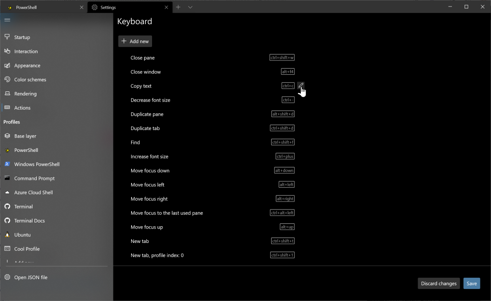
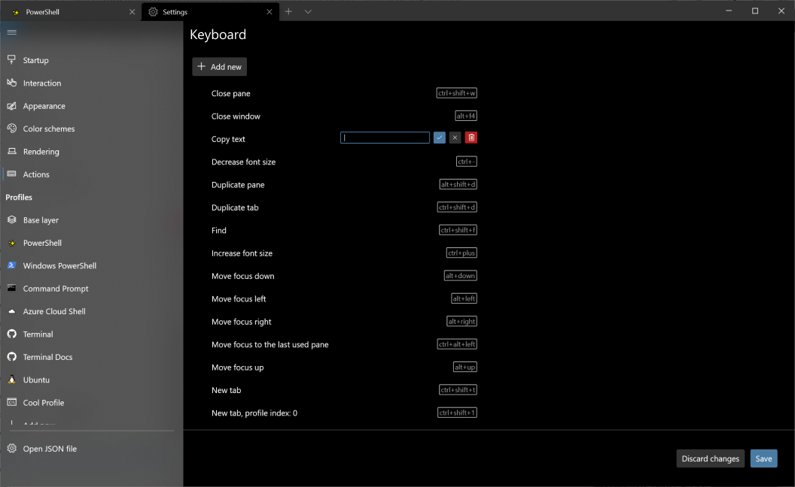
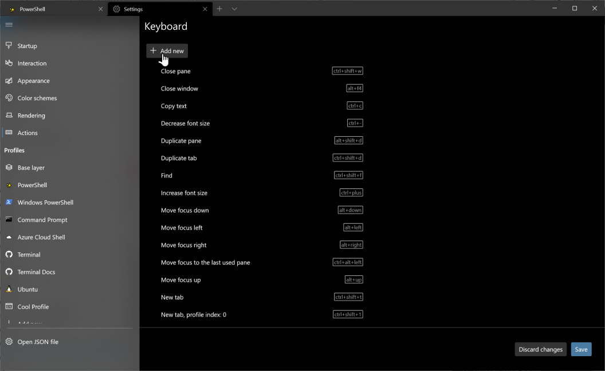
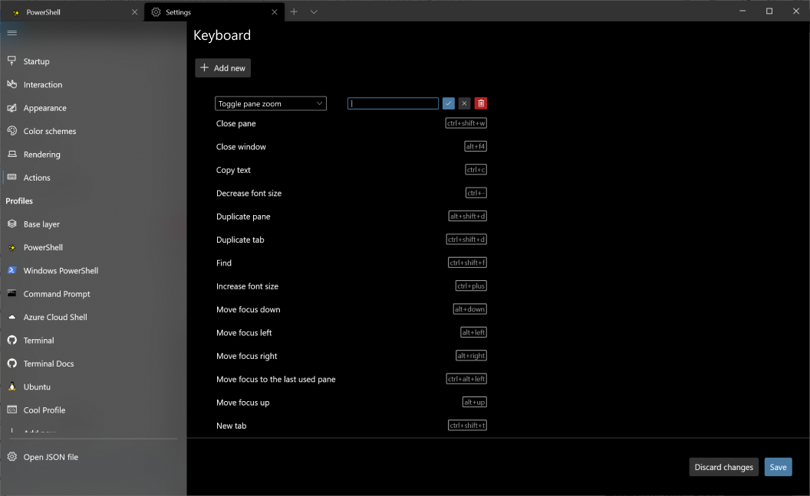

# Actions Page

## Abstract

We need to represent actions inside the settings UI. This spec goes through the possible use cases and reasoning for including specific features for actions inside the settings UI.

## Background

### Inspiration

It would be ideal if we could get the settings UI to have parity with the JSON file. This will take some design work if we want every feature possible in relation to actions. There is also the option of not having parity with the JSON file in order to present a simpler UX.

### User Stories

All of these features are possible with the JSON file. This spec will go into discussion of which (possibly all) of these user stories need to be handled by the settings UI.

- Add key bindings to an action that does not already have keys assigned
- Edit key bindings for an action
- Remove key bindings from an action
- Add multiple key bindings for the same action
- Create an iterable action
- Create a nested action
- Choose which actions appear inside the command palette
- See all possible actions, regardless of keys

Commands with properties:
- sendInput has "input"
- closeOtherTabs has "index"
- closeTabsAfter has "index"
- renameTab has "title"*
- setTabColor has "color"*
- newWindow has "commandline", "startingDirectory", "tabTitle", "index", "profile"
- splitPane has "split", "commandline", "startingDirectory", "tabTitle", "index", "profile", "splitMode", "size"
- copy has "singleLine", "copyFormatting"
- scrollUp has "rowsToScroll"
- scrollDown has "rowsToScroll"
- setColorScheme has "colorScheme"

Majority of these commands listed above are intended for the command palette, so they wouldn't make much sense with keys assigned to them anyway.

### Future Considerations

One day we'll have actions that can be invoked by items in the dropdown menu. This setting will have to live somewhere. Also, once we get a status bar, people may want to invoke actions from there.

## Solution Design

### Proposal 1: Keyboard and Command Palette pages

Implement a Keyboard page in place of the Actions page. Also plan for a Command Palette page in the future if it's something that's heavily requested. The Command Palette page would cover the missing use cases listed below.

When users want to add a new key binding, the dropdown will list every action, regardless if it already has keys assigned. This page should show every key binding assigned to an action, even if there are multiple bindings to the same action.

Users will be able to view every possible action from the command palette if they'd like.

Use cases covered:
- Add key bindings to an action that does not already have keys assigned
- Edit key bindings for an action
- Remove key bindings from an action
- Add multiple key bindings for the same action
- See all actions that have keys assigned

Use cases missing:
- Create an iterable action
- Create a nested action
- Choose which actions appear inside the command palette
- See all possible actions, regardless of keys

* **Pros**:
- This allows people to edit their actions in most of their scenarios.
- This gives us some wiggle room to cover majority of the use cases we need and seeing if people want the other use cases that are missing.

* **Cons**:
- Unfortunately we couldn't cover every single use case with this design.
- You can't edit the properties that are on some commands, however the default commands from the command palette include options with properties anyway. For example "decrease font size" has the `delta` property already included.

### Proposal 2: Have everything on one Actions page

Implement an Actions page that allows you to create actions designed for the command palette as well as actions with keys.

Use cases covered:
- Add key bindings to an action that does not already have keys assigned
- Edit key bindings for an action
- Remove key bindings from an action
- Add multiple key bindings for the same action
- See all actions that have keys assigned
- Create an iterable action
- Create a nested action
- Choose which actions appear inside the command palette
- See all possible actions, regardless of keys

I could not come up with a UX design that wasn't too complicated or confusing for this scenario.

**Pros**:
- There is full parity with the JSON file.

**Cons**:
- Could not come up with a simplistic design to represent all of the use cases (which makes the settings UI not as enticing since it promotes ease of use).

## Conclusion

We considered Proposal 2, however the design became cluttered very quickly and we agreed to create two pages and start off with Proposal 1.

## UI/UX Design

The Add new button is using the secondary color, to align with the button on the Color schemes page.

## Potential Issues

This design is not 1:1 with the JSON file, so actions that don't have keys will not appear on this page. Additionally, you can't add a new action without keys with this current design.

You also cannot specify properties on commands (like the `newTab` command) and these will have to be added through the JSON file. Considering there are only a few of these and we're planning to iterate on this and add a Command Palette page, we were okay with this decision.

## Resources

### Footnotes
