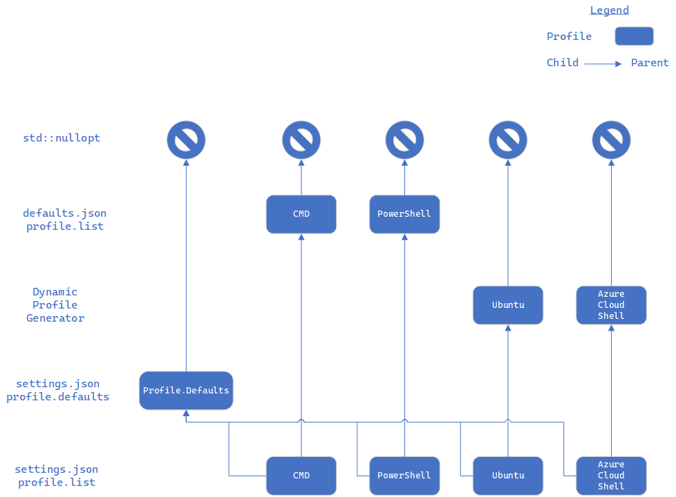

# Terminal Settings Model

## Abstract

This spec proposes a major refactor and repurposing of the TerminalSettings project as the TerminalSettingsModel.
 TerminalSettingsModel would be responsible for exposing, serializing, and deserializing settings as WinRT objects
 for Windows Terminal. In doing so, Terminal's settings model is accessible as WinRT objects to existing components
 like TerminalApp, TerminalControl, and TerminalCore. Additionally, Terminal Settings can be used by the Settings UI or
 Shell Extensions to modify or reference Terminal's settings respectively.

## Inspiration

The main driver for this change is the Settings UI. The Settings UI will need to read and modify Terminal's settings
 objects. At the time of writing this spec, the Terminal's settings are serialized as objects in the TerminalApp project.
 To access these objects via XAML, the Settings UI needs them to be WinRT objects. Additional features that need the
 settings objects to be WinRT objects include future shell extensions, like jumplist.

## Solution Design

### Terminal Settings Model: Objects and Projections

The following TerminalApp objects will become WinRT objects and will be moved to the TerminalSettingsModel project
(formerly TerminalSettings):
- ColorScheme
- Profile
- GlobalAppSettings
- CascadiaSettings

The TerminalSettingsModel project will have a root namespace of `Microsoft.Terminal.Settings.Model`.

Adjacent to the introduction of these settings objects, `IControlSettings` and `ICoreSettings` will be moved
 to the `Microsoft.Terminal.TerminalControl` namespace. This allows for a better consumption of the
 settings model that is covered later in the (Consumption section)[#terminal-settings-model:-consumption].

#### Moving/Splitting the Action Model

Windows Terminal represents actions via several objects:
- `AppKeyBindings`: a map of all the defined keybindings and their corresponding actions
- `ActionAndArgs`: a (de)serializable action (this holds more objects inside of it, but we won't focus on that for now)
- `ShortcutActionDispatch`: responsible for dispatching events pertinent to a given ActionAndArgs object
`TerminalApp`'s `TerminalPage` handles any events dispatched by the `ShortcutActionDispatch`.

With the introduction of the TerminalSettingsModel, we will split `AppKeyBindings` using a `KeyMapping` class.
 This separation will look something like the following:
```c++
namespace TerminalApp
{
    [default_interface] runtimeclass AppKeyBindings : Microsoft.Terminal.TerminalControl.IKeyBindings
    {
        AppKeyBindings();

        // NOTE: It may be possible to move both of these to the constructor instead
        void SetDispatch(ShortcutActionDispatch dispatch);
        void SetKeyMap(KeyMapping keymap);
    }
}

namespace TerminalSettingsModel
{
    [default_interface] runtimeclass KeyMapping
    {
        void SetKeyBinding(ActionAndArgs actionAndArgs, Microsoft.Terminal.TerminalControl.KeyChord chord);
        void ClearKeyBinding(Microsoft.Terminal.TerminalControl.KeyChord chord);

        Microsoft.Terminal.TerminalControl.KeyChord GetKeyBindingForAction(ShortcutAction action);
        Microsoft.Terminal.TerminalControl.KeyChord GetKeyBindingForActionWithArgs(ActionAndArgs actionAndArgs);
    }
}
```
This separation leaves `AppKeyBindings` with the responsibility of detecting and dispatching actions, whereas
 `KeyMapping` handles the (de)serialization and navigation of the key bindings.


### Fallback Value

Cascading settings allows our settings model to be constructed in layers (i.e. settings.json values override defaults.json values). With the upcoming introduction of the Settings UI and serialization, it is important to know where a setting value comes from. Consider a Settings UI displaying the following information:
```json
    // <profile>: <color scheme value>
    "defaults": "Solarized", // profiles.defaults
    "A": "Raspberry", // profile A
    "B": "Tango", // profile B
    "C": "Solarized" // profile C
```
If `profiles.defaults` gets changed to `"Tango"` via the Settings UI, it is unclear if profile C's value should be updated as well. We need profile C to record if it's value is inherited from profile.defaults or explicitly set by the user.

#### Object Model Inheritance

To start, each settings object will now have a `CreateChild()` function. For `GlobalAppSettings`, it will look something like this:
```c++
GlobalAppSettings GlobalAppSettings::CreateChild() const
{
    GlobalAppSettings child {};
    child._parents.append(this);
    return child;
}
```
`std::vector<T> _parents` serves as a reference for who to ask if a settings value was not provided by the user. `LaunchMode`, for example, will now have a getter/setter that looks similar to this:
```c++
// _LaunchMode will now be a std::optional<LaunchMode> instead of a LaunchMode
// - std::nullopt will mean that there is no user-set value
// - otherwise, the value was explicitly set by the user

// returns the resolved value for this setting
LaunchMode GlobalAppSettings::LaunchMode()
{
    // fallback tree:
    //  - user set value
    //  - inherited value
    //  - system set value
    return til::coalesce_value(_LaunchMode, _parents[0].LaunchMode(), _parents[1].LaunchMode(), ..., LaunchMode::DefaultMode);
}

// explicitly set the user-set value
void GlobalAppSettings::LaunchMode(LaunchMode val)
{
    _LaunchMode = val;
}

// check if there is a user-set value
// NOTE: This is important for the Settings UI to identify whether the user explicitly or implicitly set the presented value
bool GlobalAppSettings::HasLaunchMode()
{
    return _LaunchMode.has_value();
}

// explicitly unset the user-set value (we want the inherited value)
void GlobalAppSettings::ClearLaunchMode()
{
    return _LaunchMode = std::nullopt;
}
```

As a result, the tracking and functionality of cascading settings is moved into the object model instead of keeping it as a json-only concept.

#### Updates to CascadiaSettings

As `CascadiaSettings` loads the settings model, it will create children for each component of the settings model and layer the new values on top of it. Thus, `LayerJson` will look something like this:
```c++
void CascadiaSettings::LayerJson(const Json::Value& json)
{
    _globals = _globals.CreateChild();
    _globals->LayerJson(json);

    // repeat the same for Profiles...
}
```
For `defaults.json`, `_globals` will now hold all of the values set in `defaults.json`. If any settings were omitted from the `defaults.json`, `_globals` will fallback to its parent (a `GlobalAppSettings` consisting purely of system-defined values).

For `settings.json`, `_globals` will only hold the values set in `settings.json`. If any settings were omitted from `settings.json`, `_globals` will fallback to its parent (the `GlobalAppSettings` built from `defaults.json`).

This process becomes a bit more complex for `Profile` because it can fallback in the following order:
1. `settings.json` profile
2. `settings.json` `profiles.defaults`
3. (if a dynamic profile) the hard-coded value in the dynamic profile generator
4. `defaults.json` profile

`CascadiaSettings` must do the following...
1. load `defaults.json`
   - append newly created profiles to `_profiles` (unchanged)
2. load dynamic profiles
   - append newly created profiles to `_profiles` (unchanged)
3. load `settings.json` `profiles.defaults`
   - construct a `Profile` from `profiles.defaults`. Save as `Profile _profileDefaults`.
   - `CreateChild()` for each existing profile
   - add `_profileDefaults` as the first parent to each child (`_parents=[_profileDefaults, <value from generator/defaults.json> ]`)
   - replace each `Profile` in `_profiles` with the child
4. load `settings.json` `profiles.list`
   - if a matching profile exists, `CreateChild` from the matching profile, and layer the json onto the child.
      - NOTE: we do _not_ include `_profileDefaults` as a parent here, because it is already an ancestor
   - otherwise, `CreateChild()` from `_profileDefaults`, and layer the json onto the child.
   - As before, `_profiles` must be updated such that the parent is removed

Additionally, `_profileDefaults` will be exposed by `Profile CascadiaSettings::ProfileDefaults()`. This will enable [#7414](https://github.com/microsoft/terminal/pull/7414)'s implementation to spawn incoming commandline app tabs with the "Default" profile (as opposed to the "default profile").


#### Nullable Settings
Some settings are explicitly allowed to be nullable (i.e. `Profile` `Foreground`). These settings will be stored as the following struct instead of a `std::optional<T>`:
```c++
template<typename T>
struct NullableSetting
{
    IReference<T> setting{ nullptr };
    bool set{ false };
};
```
where...
- `set` determines if the value was explicitly set by the user (if false, we should fall back)
- `setting` records the actual user-set value (`nullptr` represents an explicit set to null)

The API surface will experience the following small changes:
- the getter/setter will output/input an `IReference<T>` instead of `T`
- `Has...()` and `Clear...()` will reference/modify `set`


### CreateChild() vs Copy()

Settings objects will have `CreateChild()` and `Copy()`. `CreateChild()` is responsible for creating a new settings object that inherits undefined values from its parent. `Copy()` is responsible for recreating the contents of the settings object, including a reference to a copied parent (not the original parent).

`CreateChild()` will only be used during (de)serialization to adequately interpret and update the JSON. `CreateChild()` enables, but is not explicitly used, for retrieving a value from a settings object. It can also be used to enable larger hierarchies for inheritance within the settings model.

The Settings UI will use `Copy()` to get a deep copy of `CascadiaSettings` and data bind the UI to that copy. Thus, `Copy()` needs to be exposed in the IDL.

#### Copying _parents
It is important that `_parents` is handled properly when performing a deep copy. We need to be aware of the following errors:
- referencing `_parents` will result in inheriting from an obsolete object tree
- referencing a copy of `_parents` can result in losing the meaning of a reference
  - For example, `profile.defaults` is a parent to each presented profile. When a change occurs to `profile.defaults`, that change should impact all profiles. An improper copy may only apply the change to one of the presented profiles

The hierarchy we have created has evolved into a directed acyclic graph (DAG). For example, the hierarchy for profiles will appear similar to the following:



In order to preserve `profile.defaults` as a referenced parent to each profile, a copy of the DAG can be performed using the following algorithm:
```python
# Function to clone a graph. To do this, we start
# reading the original graph depth-wise, recursively
# If we encounter an unvisited node in original graph,
# we initialize a new instance of Node for
# cloned graph with key of original node
def cloneGraph(oldSource, newSource, visited):
    clone = None
    if visited[oldSource.key] is False and oldSource.adj is not None:
        for old in oldSource.adj:

            # Below check is for backtracking, so new
            # nodes don't get initialized every time
            if clone is None or(clone is not None and clone.key != old.key):
                clone = Node(old.key, [])
            newSource.adj.append(clone)
            cloneGraph(old, clone, visited)

            # Once, all neighbors for that particular node
            # are created in cloned graph, code backtracks
            # and exits from that node, mark the node as
            # visited in original graph, and traverse the
            # next unvisited
            visited[old.key] = True
    return newSource
```
Source: https://www.geeksforgeeks.org/clone-directed-acyclic-graph/

This algorithm operates in O(n) time and space where `n` is the number of profiles presented. The above algorithm will be slightly modified to...
- hold a separate reference to profile.defaults `Profile` in the `CascadiaSettings` clone
- visited will be a map of pointers to the cloned `Profile`. This ensures that profiles reference the same `Profile`, over creating a new copy

### Terminal Settings Model: Serialization and Deserialization

Introducing these `Microsoft.Terminal.Settings.Model` WinRT objects also allow the serialization and deserialization
 logic from TerminalApp to be moved to TerminalSettings. `JsonUtils` introduces several quick and easy methods
 for setting deserialization. This will be moved into the `Microsoft.Terminal.Settings.Model` namespace too.

Serialization will be an extension of the existing `JsonUtils` `ConversionTrait` struct template. `ConversionTrait`
 already includes `FromJson` and `CanConvert`. Serialization would be handled by a `ToJson` function.


### Terminal Settings Model: Warnings and Serialization Errors

Today, if the deserialization of `CascadiaSettings` encounters any errors, an exception is thrown and caught/handled
 by falling back to a simple `CascadiaSettings` object. However, WinRT does not support exceptions.

To get around this issue, when `CascadiaSettings` encounters a serialization error, it must internally record
 any pertinent information for that error, and return the simple `CascadiaSettings` as if nothing happened.
 The consumer must then call `CascadiaSettings::GetErrors()` and `CascadiaSettings::GetWarnings()` to properly
 understand whether an error occurred and how to present that to the user.


#### TerminalApp: Loading and Reloading Changes

TerminalApp will construct and reference a `CascadiaSettings settings` as follows:
- TerminalApp will have a global reference to the "settings.json" filepath
- construct an `CascadiaSettings` using `CascadiaSettings("settings.json")`. This builds an `CascadiaSettings`
   from the "defaults.json" file data (which is already compiled as a string literal)
   and layers the settings.json data on top of it.
- check for errors/warnings, and handle them appropriately

This will be different from the current model which has the settings.json path hard-coded, and is simplified
 to a `LoadAll()` call wrapped in error handlers.

**NOTE:** This model allows us to layer even more settings files on top of the existing Terminal Settings
 Model, if so desired. This could be helpful when importing additional settings files from an external location
 such as a marketplace.

When TerminalApp detects a change to settings.json, it'll repeat the steps above. We could cache the result from
 constructing an `CascadiaSettings` from "defaults.json" data to improve performance.


#### TerminalControl: Acquiring and Applying the Settings

At the time of writing this spec, TerminalApp constructs `TerminalControl.TerminalSettings` WinRT objects
 to expose `IControlSettings` and `ICoreSettings` to any hosted terminals. In moving `IControlSettings`
 and `ICoreSettings` down to the TerminalControl layer, TerminalApp can now have better control over
 how to expose relevant settings to a TerminalControl instance.

`TerminalSettings` (which implements `IControlSettings` and `ICoreSettings`) will be moved to
 TerminalApp and act as a bridge connecting `CascadiaSettings` to the TermControl. It will operate
 very similarly as it does today. On construction of the TermControl or hot-reload,
 `TerminalSettings` will be constructed by copying the relevant values of `CascadiaSettings`.
 Then, it will be passed to TermControl (and TermCore by extension).


## UI/UX Design

N/A

## Capabilities

### Accessibility

N/A

### Security

N/A

### Reliability

N/A

### Compatibility

N/A

### Performance, Power, and Efficiency

## Potential Issues

N/A

## Future considerations

### TerminalSettings: passing by reference

`TermApp` synthesizes a `TerminalSettings` by copying the relevant values of `CascadiaSettings`,
 then giving it to a Terminal Control. Some visual keybindings and interactions like ctrl+scroll
 and ctrl+shift+scroll to change the font size and acrylic opacity operate by directly modifying
 the value of the instantiated `TerminalSettings`. However, when a settings reload occurs,
 these instanced changes are lost.

`TerminalSettings` can be used as a WinRT object that references (instead of copies) the relevant
 values of `CascadiaSettings`. This would prevent those instanced changes from being lost on a settings
 reload.

Since previewing commands like `setColorScheme` would require a clone of the existing `TerminalSettings`,
 a `Clone` API can be added on `TerminalSettings` to accomplish that. When passing by value,
 `TerminalSettings` can just overwrite the existing property (i.e.: color scheme). When passing
 by reference, a slightly more complex mechanism is required to override the value.

Now, instead of overwriting the value, we need to override the reference to a constant value
(i.e.: `snapOnInput=true`) or a referenced value (i.e.: `colorScheme`).

### Layering Additional Settings
As we begin to introduce more sources that affect the settings (via extensions or themes),
 we can introduce a `LayerSettings(String path)`. This layers the new settings file
 onto the existing `CascadiaSettings`. This is already done internally, we would just expose
 it via C++/WinRT.

```c++
runtimeclass CascadiaSettings
{
    // Load a settings file, and layer those changes on top of the existing CascadiaSettings
    void LayerSettings(String path);
}
```

### Settings UI: Modifying and Applying the Settings (DRAFT)

```c++
runtimeclass CascadiaSettings
{
    // Create a copy of the existing CascadiaSettings
    CascadiaSettings Clone();

    // Compares object to "source" and applies changes to
    // the settings file at "outPath"
    void Save(String outPath);
}
```

The Settings UI will also have a reference to the `CascadiaSettings settings` from TerminalApp
 as `settingsSource`. When the Settings UI is opened up, the Settings UI will also have its own `CascadiaSettings settingsClone`
 that is a clone of TerminalApp's `CascadiaSettings`.
```c++
settingsClone = settingsSource.Clone()
```

As the user navigates the Settings UI, the relevant contents of `settingsClone` will be retrieved and presented.
 As the user makes changes to the Settings UI, XAML will update `settingsClone` using XAML data binding.
 When the user saves/applies the changes in the XAML, `settingsClone.Save("settings.json")` is called;
 this compares the changes between `settingsClone` and `settingsSource`, then injects the changes (if any) to `settings.json`.

As mentioned earlier, TerminalApp detects a change to "settings.json" to update its `CascadiaSettings`.
 Since the above triggers a change to `settings.json`, TerminalApp will also update itself. When
 something like this occurs, `settingsSource` will automatically be updated too.

In the case that a user is simultaneously updating the settings file directly and the Settings UI,
 `settingsSource` and `settingsClone` can be compared to ensure that the Settings UI, the TerminalApp,
 and the settings files are all in sync.

 **NOTE:** In the event that the user would want to export their current configuration, `Save`
 can be used to export the changes to a new file.

 ### Reserialization (DRAFT)

After deserializing the settings, injecting the new json into settings.json
 should not remove the existing comments or formatting.

The reserialization process takes place right after comparing the `settingsSource` and `settingsClone` objects.
 For each setting found in the diff, we go to the relevant part of the JSON and see if the key is already there.
 If it is, we update the value to be the one from `settingsClone`. Otherwise, we append the key/value pair
 at the end of the section (much like we do with dynamic profiles in `profiles`).

## Resources

- [Preview Commands](https://github.com/microsoft/terminal/issues/6689)
- [New JSON Utils](https://github.com/microsoft/terminal/pull/6590)
- [Spec: Settings UI](https://github.com/microsoft/terminal/pull/6720)
