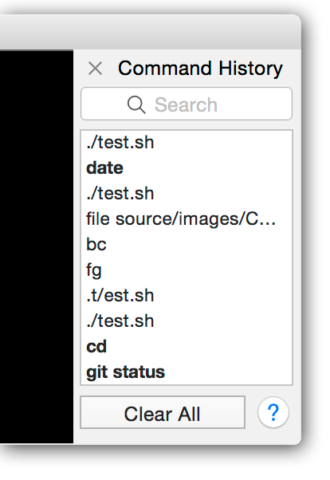

# Windows Terminal - Command Line North Star

## Abstract

The terminal is a critical component of Windows. It is the primary interface for
developers, system administrators, and power users. In recent years, there's
been renewed enthusiasm for the command-line environment, and new competitors on
the scene are pushing the limits of what terminals can be on other platfoms. As
a result, Microsoft recognizes the need to invest in pushing the boundaries of
terminals to enhance the user experience and remain competitive. This document
outlines the long-term strategic enhancements planned for the Windows Terminal,
with the goal of creating a more powerful and feature-rich terminal experience
that meets the evolving needs of our users.

These efforts should be considered in addition to other table-stakes
functionality. Things like improving UTF-8 support, tearing tabs out of the
window, continued expansion of VT sequence support, continued performance
improvements, and partner team asks are still important priorities. They are not
to be considered "instead of" this work, but as a fundamental baseline to this
effort. These scenarios listed below are "in addition to" the Terminal
fundamentals. Without continued investment in the fundamentals, then the north
star features here will serve only to polish a turd. Focus on fundamentals and
existing known priorities remains important to avoid mistrust generated by
questions like _"Why would they add this feature instead of working on
{fundamental issue that's existed for years}"_.

## Background

This document is a broad architectural overview of proposed features for the
Terminal. None of the scenarios listed here are described in particular detail.
Rather, the intent is to show a broad overview of how these elements work with
one another. For more detailed individual specs, refer to the following docs:

* [Notebooks]
* [Tasks]
* [Suggestions UI]
* [Copilot]
* [Shell Integration]

### Context

This document was originally authored in 2022, in the midst of the ongoing
global COVID-19 pandemic. At the time, one of the key focuses of the tech
industry was ways to empower remote collaboration. The reader will find a number
of scenarios that are heavily influenced by this. While the pandemic has begun
to recede, and companies are returning to the office in greater numbers, it
remains an important mission to support collaboration in whatever form it might
take.

Subsequently, recent advances in large language models have made "AI"
experiences more reliable and convincing. This has created the opportunity to
build new experiences powered by these "AI" models. Further additions were made
to this doc to reflect these advancements. While these language models can
provide powerful new experiences, it remains important that we continue to
prioritize ["human intelligence", enhanced by
AI](#addenda-human-intelligence-and-artificial-intelligence).

## Pillars

This document focuses on a few key scenarios which are more revolutionary
feature adds rather than "table stakes" features the Terminal has been focused
on for the last few years. These are grouped into the following pillars:
* Command-line tooling is easier to discover and use
* The Terminal advances the command-line shell UX
* The Terminal enables new CLI experiences
* The Terminal enables powerful collaboration
* The Terminal provides a first-class accesibility experience

### Command-line tooling is easier to discover and use

(_The Terminal makes my existing command-line workflow better_)

* AI enables users to describe what they want to do with the commandline, rather
  than relying on user's knowledge of specific commands and arguments. <!-- D -->
* AI can quickly provide explanations of what's happening - error messages and
  command lines can be explained without needing to leave the context of the
  Terminal. <!-- D -->
* Markdown integration for quickly running blocks of commands from existing
  markdown documentation <!-- E -->
* Recording the contents of the Terminal output to a file is simple and
  optimized for sharing on GitHub <!-- F -->
* Searching for errors is as simple as right clicking on some selected text
<!-- * Customizations to command-line tools is easy to discover and install ~The
  Terminal exposes a curated list of ways to customize your command-line
  tooling, and easily install~ -->
<!-- * Working across multiple machines is made easy
  * Automatic detection of saved ssh sessions and Hyper-V VMs makes connecting simple
  * Broadcasting input to multiple tabs and panes makes exectuting the same
    commands in multiple environments easy -->

### The Terminal advances the command-line shell UX

(_Things the Terminal can do for the user, to provide a modern experience_)

* Prompts, command-lines, output are marked semantically <!-- A -->
* Icons in the gutter to indicate if a command succeeded, had an error, or was canceled <!-- A -->
* Icons in the gutter can be used to quickly: <!-- A -->
  * re-run the command
  * copy the output to the clipboard
  * Save the command line as an action for later.
* Horizontal markers can be used to subtly indicate the separation between different commands <!-- A -->
* The terminal remembers command-lines ("Tasks") <!-- B -->
* Users can share complicated command-lines with one another for easy access
* Errors and warnings in output can be automatically identified and jumped to <!-- A -->

### The Terminal enables new CLI experiences

(_New experiences that CLI applications can deliver for users_)

* CLI apps can drive rich auto-complete suggestions presented by the Terminal <!-- C -->
* CLI applications can send Windows notifications via the Terminal
* CLI apps can display images in the Terminal (sixel)
* CLI apps can provide clickable suggestions <!-- ala https://github.com/microsoft/terminal/issues/5001#issuecomment-1246562464 -->

### The Terminal enables powerful collaboration

* LiveShare - share a terminal window with a member of your team for realtime collaboration
* Useful commands and notes can be shared automatically across members of your team

### The Terminal provides a first-class accesibility experience
* Terminals can describe their contents prcatically to assistive technologies, through a new "terminal" UIA pattern <!--  (word delims, alt/main buffer) -->
* CLI apps can help direct the behavior of screen readers, via new VT sequences
* High Contrast Mode within the Terminal itself adjusts text colors to make sure all CLI apps are visible.
* CLI apps can provide auto-completions which the Terminal can use to present rich details to screen readers <!-- C -->

## Business Justification

**"The command line works best on Windows"**. Your shells, your tools, don't
just work, but work _best_ on Windows, enabled by enhancements provided by the
Windows Terminal.

The Terminal remains the primary dev environment for developers of all sorts of
toolchains. It remains the most familiar experience for users who are
considering Windows over MacOS or linux.

The terminal is a deeply personal app. Users spend a lot of time adjusting their
terminal of choice to fit their needs. Once users find one they like, they're
unlikely to change. Developers are highly opinionated. One-size-fits-all
solutions are typically not good enough. Every developer has their own opinions
on how they'd like their keybindings, what colors they'd like to use, what shell
or editor is best. By providing the most customizable terminal possible, we
address the largest possible cohort of developers. Giving developers knobs for
every possible setting removes any incentive for developers to seek out an
alternative.

There's plenty of interest in reinvigorating the command line experience.
Applications like [Fig] and [Warp] demonstrate the desire for not just incremental
improvements to the user experience of the command-line, but wholesale
reimagining. To date, the Windows Terminal has managed to meet current
expectations of terminals on other platforms (and remains short of competitiors,
like ITerm2, in many regards).

For some market comparison - Warp raised $26M of funding, and Fig raised $2.4M.
That's 28 million combined dollars of investment into the command-line
experience, which at this point was only produced tooling for MacOS.

These "Hero scenarios" create a compelling differentiating experience on
Windows. They position Windows as the premier command line development
experience. By providing the best-in-class developer experience, we seek to
provide an ecosystem where developers would be reluctant to choose another
platform. Scenarios here help create an ecosystem of features surrounding the
Terminal, features which aren't immediately reproducible on other platforms.

## Scenario Details

Above is listed a high-level description of some user stories. This section
provides a deeper drill into some of the above areas.

### Scenario A: More powerful commanding powered by advanced shell integration

The Terminal provides a way for command line shells to semantically mark parts
of the command-line output. By marking up parts of the output, the Terminal can
richer experiences. The Terminal will know where each command starts and stops,
what the actual command was and what the output of that command is. This allows
the terminal to expose quick actions for:
* Quickly navigating the history by scrolling between commands
* Re-running a previous command in the history
* Copying all the output of a single command-line
* A visual indicator to separate out one command-line from the next, for quicker
  mental parsing of the output of the command-line.
* Collapsing the output of a command, as to reduce noise
* Visual indicators that highlight commands that succeeded or failed.
* Jumping to previously used directories

Enabling these features requires that the shell co-operates with the terminal,
to tell the Terminal about these parts of the output. Typically, this would
require complicated customizations that the user would have to install manually
into their shell's configuration. We will provide sample snippets that will
enable this functionality for a variety of shells. However, VsCode has
experimented with functionality to automatically insert this functionality into
shells it's familiar with. This has been reasonably successful to date, so it
provides a valuable guide for a way the Terminal could do the same. This would
enable the Terminal to have a simple setting that would automatically enable
powerful features for the user's shell, without them needing to configure their
shell at all.

### Scenario B: The Terminal knows and remembers complicated command lines, so I don't have to

The command line experience is often filled with running a number of commands
with some frequency, but also a small number of commands infrequently.
Command-line options and parameters are not easily discoverable, forcing
developers to constantly refer back to documentation. Team members often need to
use the same command-lines within the scope of their project, but need to share
them amongst the team manually.

Users might run a series of commands like `git commit -m "..."`,  `git push`
multiple times an hour. For these kinds of scenarios, it might be helpful if the
commands were easily accessible with a single keystroke, rather than typing them
out every single time.

Other commands the user might run once a month, or even less frequently. Some
projects might have a very complicated command-line for pushing an updated
package to nuget, which the developer only needs to run once every few months.
That kind of infrecuency leads to the developer needing to look up the command
from their notes every time, if the notes even exist. Consider a single
developer working on the OS repo, who might work in a variety of projects within
that repo. They might need to bounce around between projects every couple
months. Each project might have its own build scripts, test deployment scripts,
and output files that are interesting. Without good notes, it would be easy for
the developer to simply forget the commands for a single project in the months
between working on it.

Similarly, there are scenarios where one member of a team might author a
complicated command-line for doing something in their project. ~As an example -
sometimes a local clone of the Terminal repo can get into a broken state where a
user needs to delete a couple `.xbf` files, but just blindly deleting them all
would force a full rebuild. I've got a handy script that just deletes the bad
ones, but any time someone on the team needs this they need to go where? Our
wiki? Our OneNote? Somewhere deep in the Teams chat history?~ Now, that
developer needs to share it manually with the rest of the team. The team would
need to have a well documented way of sharing command-lines between members - a
practice that surely not every team has mastered.

Furthermore, there is often a discommect between what the user wants to do, and
what the user needs to type at a command-line. Consider "I need to compress this
directory to a `tar.gz` archive". The user knows what they want to do, but they
now need to go pull up a man page or Stack Overflow to figure out how to do what
they want.

Enter **[Tasks]**. These are sets of command-lines that can quickly
be saved, shared, with descriptive names and longer descriptions. They can be
grouped - by application, by team, by whatever the user chooses. Descriptive
names allow users to quickly navigate the menu looking for the thing they want
to do. When shared to your team{repo/project/?}, they automatically show up for
other team members.

After running a command in your shell that you'd like to save for later, all it
takes is a simple <kbd>↑</kbd>, <kbd>Home</kbd>, `wt save `, and the terminal will stash that
command-line for later use.

Tasks are powered by the [Suggestions UI].

### Scenario C: The Terminal enables powerful autocompletion suggestions, driven by the shell

Shells are already powerful tools in their own right. Anyone who's used a shell
more than a few times is probably familiar with shells' ability to tab-complete
paths at the prompt. Most modern shells provide elaborate mechanisms for command
line apps to extend their tab completion, so that subcommands, arguments, and
parameter values can also be tab-completed. However, these options are not
usually highly discoverable - the completions the shell might provide still
assume the user hast started typing the correct value.

PowerShell has started to attempt to mitigate this with its MenuComplete, which
outputs possible suggestions beneath the prompt inline with other commandline
output. Other shells (like `fish`, `zsh`) have similar extensions as well.
However, everyone needs to implement support for these menus themselves.

One major downside of this is that these menus are very hard for screen readers
to interact with. The mechanism used to redraw parts of the "menu" to indicate
the selection changed usually means that a screen reader will re-read the entire
menu of suggestions. Furthermore, there's no way for a screen reader to indicate
the purpose of this text.

To remedy this, we'll implement a new VT escape sequence. This sequence can be
used by a CLI application to tell the terminal to render a menu of suggestions.
This will enable the Terminal to present all the options the shell knows about
to the user in a quickly filterable menu. By being a dedicated control within
the Terminal, the Terminal can provide unique UIA patterns for this menu to make
it clear to screen readers what is happening.

By authoring this as a open VT standard, we enable not just Terminal and
PowerShell to use this to communicate with one another, but any combination of
terminal and CLI application. The ecosystem works best when we all work
together. Prototypes for this protocol and menu were started by the VsCode
terminal's team. Both VsCode and Terminal can reuse the same plumbing, as well
as `xterm`, `alacritty`, `gnome-terminal` or anything else out there.

Shell autocompletion is powered by the [Suggestions UI].

### Scenario D: AI powered commandline experience

Recent advancements in large language models have created a rapidy evolving
ecosystem of AI-enhanced experiences. These models are highly effective at
synthesizing responses to natural language questions. The command line is no
different, and is an environment ripe for innovation.

The commandline is an environment filled with verbose, often esoteric output.
This is a place where AI might be valuable for translating those error messages
to simple language explaining what went wrong.

In the reverse, translating natural language descriptions of what the user wants
to do into actual commands is a well-trodden path for innovation. In only the
few months since the broad rollout of gpt-3 and Github Copilot, already there
are many examples of "natural language to commandline". There's already [Codex
CLI], [Copilot CLI], and [Warp AI] all working on natural language experiences
in the terminal.

These are just two key scenarios we're targeting. This is a space where the
current pace of innovation is very rapid. The landscape of what models are
available and what they are capable is evolving weekly. Staying on top of these
innovations and finding ways to integrate these experiences into the Terminal
will be an important part of our strategy moving forward.

Crucially, we'll want to create a pluggable infrastructure for these AI
features. This will enable developers to pick and choose whatever model they
prefer. The Terminal will ask simple, abstract queries from these plugins, and
leave the prompting implementation to the actual plugin author themselves. This
will allow the greatest flexibility for experimentation on both the part of the
Terminal and the model backend itself. The Terminal won't need to concern itself
with the raw prompt construction. The plugin authors will be able to experiment
and fine-tune their prompts to get the best results.

This scenario is discussed in greater detail in [Copilot] and the specs in that
directory.

### Scenario E: Markdown notebooks

Notebooks have risen to popularity in recent years as a way of combining both
code and documentation in a single experience. They enable users to seamlessly
write code, and execute it to see the output, write documentation on the code,
and share that with others. However, there's not really anything like notebooks
for generic commandline experiences.

There are, however, markdown files. Markdown has become a bit of a lingua franca
of the developer experience. It's used prominently on GitHub - the "homepage" of
any repo on GitHub is now typically a markdown file. This file will have all
sorts of documentation, and notably these READMEs are often filled with commands
that one can execute for this project. Downloading, installing its dependencies,
building and running the project, etc, all commands that are already listed
today in READMEs across the world.

It would be a major convenience for users to be able to just load a pre-rendered
markdown file directly into their terminal windows. These files already include
marked blocks of code which identify sets of commands for the command line. It
should be as simple as clicking a button to run these commands in the Terminal,
or even to run a whole file worth of commands automatically.

This scenario is discussed in greater detail in [Notebooks] and the specs in that
directory.

<!--

Omitted from North Star - these are valuable features, but not pushing the
boundary of what's possible by terminal emulators today

### Scenario W: Enhancements to remote connections

* Dynamic profiles from `.sshconfig`
* [#12773] Dynamic profiles from Hyper-V VMs
* Broadcast Input Mode
* -->

### Scenario F: Quick Terminal recording

Case in point: [Textualize]. This is a website that's loaded with recordings of
the terminal doing something cool. And they're all using **macOS**. That
reinforces the precedent that cool command line experiences are being developed
for _not Windows_.

Gifs that could easily be shared in READMEs on GitHub, where developers
already frequently use recordings of their terminal to demonstrate how their
tools work. By including not just the body of the Terminal, but the frame
itself, it's immediately apparent to someone watching that _this is the Windows
Terminal_. The observer knows that this gif was recoded on Windows, and that the
maintainer built this tool on Windows (and ideally, for Windows). By making the
experience as quick and painless as possible, developers could quickly create
engaging documentation for their users.

## UI/UX Design

Below are some screenshots of similar features from other apps. Featured here prominently are iTerm2, Warp, and VsCode's own xterm.js.

### Prior art
#### Workflows, suggestions

#### Shell autocompletion

#### Notebooks

## Conclusion

Investing engineering resources into pushing the boundaries of the Terminal is a
critical strategy that will benefit Windows and Microsoft as a whole. By
providing new user experiences and capabilities, we can boost the entire Windows
ecosystem. A more powerful terminal will attract developers to build new and
innovative applications for Windows, making the platform more vibrant and
exciting. By leveraging our connected services via Visual Studio, GitHub, and AI
we can create a more compelling and attractive platform to better serve the
needs of our users. This robust developer experience will help Windows stand out
as the best platform for developers and system administrators.

<!-- ### Future Considerations

[comment]: # Are there other future features planned that might affect the current design of this setting? The team can help with this section during the review. -->

## Resources

This architecture docs is intentionally a 10000ft overview. For more detailed docs on these scenarios, see the following docs:

* [Notebooks]
* [Tasks]
* [Suggestions UI]
* [Copilot]
* [Shell Integration]

## Addenda: Human Intelligence and Artificial Intelligence

An ongoing theme within the tech industry is how AI can empower user with new
experiences. I think it is important to remember that Human Intelligence should
always be relied upon first and foremost. AI can be a useful backstop for human
intelligence, but it is no replacement. Whenever possible, we should rely on the
user's own knowledge and expertise, before using AI for suggestions.

As an example: Tasks and AI Command Suggestions. Tasks are usually a better
answer for the user - they represent the user has already found the answer of
how to do something. They've already evaluated that task as the correct solution
to the problem. Tasks that are shared with the rest of your team are similar - a
team mate has already found the right solution for a problem within your
project. Their solution is going to be more reliable than asking a language
model to synthesize a result.

AI can be used to enhance human intelligence, when at the limits of the user's
knowledge. Large language models can be used to produce results that are
sometimes correct and often incorrect. They're best at synthesizing results the
user could have otherwise found in a web search or in documentation. Providing
immediate access to those answers helps the user stay in the flow. For more
challenging queries that the model may not have exact, correct responses for,
even wrong responses can be valuable. They can help to inspire human creativity.
A wrong response might help point the user in the direction of the correct
solution.

## Addenda: Shell Integration metrics from VsCode

In the first month that Shell Integration was enabled by default for all VsCode users:

* ~57% machines fired shell integration-related events (_I think this covers all
  who used the terminal_). Of those:
  * 40% succeeded activation at least once
  * 83% failed activation silently/gracefully at least once (_This improved in subsequent releases_)
  * 0.2% Failed due to process exit (_This was likely mostly https://github.com/microsoft/vscode/issues/157611_)
  * ~0.4% changed the setting manually to true or false

That last number, 0.4%, would suggest that the number of people who opted out is
_very_ low and that the feature would be largely inoffensive.

### Footnotes

<a name="footnote-1"><a>[1]:

[Fig]: https://github.com/withfig/autocomplete
[Warp]: https://www.warp.dev/
[#13445]: https://github.com/microsoft/terminal/issues/13445
[Textualize]: https://www.textualize.io/
[#12773]: https://github.com/microsoft/terminal/issues/12773
[Notebooks]: ./Markdown%20Notebooks.md
[Tasks]: ./Tasks.md
[Suggestions UI]: ./Suggestions-UI.md
[Shell Integration]: ./Shell-Integration-Marks.md
[Copilot]: ./Copilot/Overview.md

[Codex CLI]: https://github.com/microsoft/Codex-CLI
[Copilot CLI]: https://githubnext.com/projects/copilot-cli/
[Warp AI]: https://docs.warp.dev/features/warp-ai
