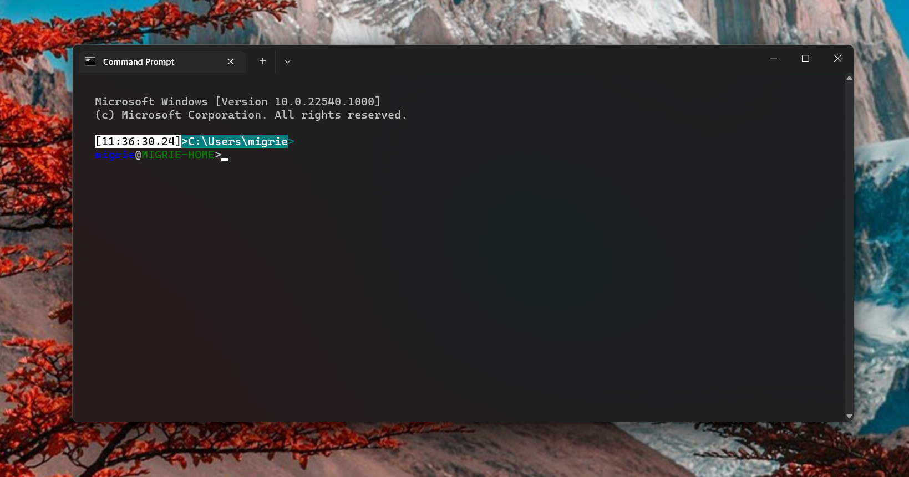

# Mica in the Terminal

## Abstract

This document serves as a companion doc to the [Theming Spec], rather than a
spec on it's own. The context of broader application-level theming support is
necessary to understand the big picture of the designs in this discussion.


This spec is intended to help understand the problem space of adding [Mica] to
the Windows Terminal. Introduced in Windows 11, Mica is a new type of material
that incorporates theme and desktop wallpaper to paint the background of
windows. The effect results in a blurred, transparency-like effect, quite
similar to [Acrylic]. However, the technical limitations of Mica make it more
complicated to integrate seamlessly with the Terminal experience.

## Background

Mica is a material that can only be applied to the root of the UI tree, and
applies to the entire background surface. It's recommended to be used at the
`Page` level, in place of a solid brush like
`ApplicationPageBackgroundThemeBrush`. If the developer wants a surface within
the page to have a Mica background, they need to make sure to have that element
(and all elements behind it up until the `Page`) have a `Transparent`
background, so that Mica will be visible through the elements.

This is contrasted with something like Acrylic, where the acrylic effect is
specified at the Element layer itself. An element can request having a
`HostBackdrop` brush for its background, and the element will have the Acrylic
effect regardless of the structure of the rest of the elements in the UI tree.

Another important use case here is "Vintage Transparency" (or "unblurred
transparency"), which is an unblurred transparency effect for the Terminal
window. This is achieved with the `TransparentBackground` API, which enables the
Terminal to disable the emergency backstop of the XAML Island. When that's
enabled, controls that are transparent will be blended, unblurred, with whatever
is visible behind the window. This works because the entire tree of the Terminal
window underneath the `TermControl`s are `Transparent`, all the way up to the
window itself.

Right now, the Terminal exposes three settings<sup>[[1]](#footnote-1)</sup>:
* Background color
* Background Opacity
* Whether the user would like to enable acrylic or not

These settings are exposed at the "Profile"<sup>[[2]](#footnote-2)</sup> level.
Properties on a profile are roughly considered to be "what the terminal control
will look like when I run this settings profile". Users can have one profile
with acrylic, one without, and open [Panes] with these profiles side-by-side in
the Terminal. It's entirely possible that a user would have both a pane with and
acrylic background, and one with an unblurred background in the same window.

### User Stories

* The Terminal should be able to have Mica in the title bar, behind the tabs.
* Users will want Mica in the control area, as well as in the titlebar
* Users may want Mica in the control, but with a solid titlebar, or an accent
  colored title bar, or an acrylic one...
* Users will want mica in the titlebar with other effects (acrylic, vintage
  transparency) in the control area

This is where things get complicated. Given that a control can choose what type
of material it has now, users would likely expect to be able to choose between
acrylic, unblurred transparency, or Mica. However, Mica can only be applied at
the root of the window. It's applied behind everything else in the window. From
an implementation standpoint, Mica is a window-level property, not a control
level one. If we want to have Mica under one control, we need to enable it for
the _whole window_. If we enable Mica for the whole window, that would
simultaneously prevent Vintage Transparency from working as expected. This is
because the semi-transparent controls would no longer have a fully transparent
window background to sit on top of - they'd be blended instead with the Mica
background behind the window.

## Solution design

### Mica for `TermControl`s
If we make enabling Mica for the control a per-profile setting, I believe that
will lead to greater user confusion. It would result in "spooky action at a
distance", where creating any pane with Mica would force the entire window to
have a Mica background. This would change the appearance of any other unblurred
transparent panes in the window, causing them to also be subjected to the Mica
treatment as well.

**Proposal**: create a window-level theme property `window.background.useMica`
(or similar), which will enable Mica for the entire window. When enabled, users
can use a fully transparent, unblurred background for their profile to achieve
the Mica effect within the control. When enabled, users **won't** be able to see
through to the desktop with any vintage opacity settings.

By nesting Mica usage under `"window.background"`, it will be clearer that it's
something that applies to the whole window, as the background for everything.
I believe this is the most acceptable way to expose Mica to our users without
"spooky action at a distance".

An example of what mica in the control area might look like:



### Mica in the titlebar

To achieve Mica in the titlebar, we'll similarly need to allow users to set the
titlebar area to totally transparent, to allow the mica behind the window to be
visible. A simple theme to achieve that might look like:

```jsonc
{
    "theme": "My Mica Titlebar Theme",
    "themes": [
        {
            "name": "My Mica Titlebar Theme",
            "window":{
                "background.useMica": true, // Use mica behind the window
            },
            "tabRow":{
              "background": "#00000000", // Make the TabView Transparent
            }
        }
    ]
}
```

As noted before, due to the intentional limitations of the Mica material, if the
user wants Mica in the tab row, they won't be able to use vintage opacity in any
controls. The vintage opacity of the controls will show through to the Mica
layer, instead of transparent through the whole window.

## Considered implementations

* We experimented with a new DWM API in SV2 which should enable us to set the
  background of our window to Mica. This did seem to work for the root window.
  It however, did not seem to work for the "drag window", the child HWND which
  we use to intercept nonclient messages in our titlebar area. Apparently, that
  API does not work at all for `WS_CHILD` windows, by design. This unfortunately
  prevents us from allowing Mica only in the titlebar area, without also
  applying it to the rest of the main window.
* We considered rolling our own Mica brush to allow us to style individual
  elements. This didn't seem terribly hard at face value, considering [the Mica
  recipe] is basically open-source. However, it seems to rely on some
  closed-source `IGraphicsEffect`s from the `Composition.Effects` namespace.
  Apparently, those effects are only [implemented in Win2D]. It's unclear at
  this time if the Terminal would be capable of ingesting Win2D now or in the
  future. It does seem as though [Win2D is available via cppwinrt], so that's of
  some solace.

  **However**, that does leave us in the world where we're rolling our own
  custom Mica brush, and would need to keep it up to date with the OS
  implementation. We'd be firmly off the rails of the recommended Mica usage,
  and our support would be likely very minimal. This is reason alone to
  avoid this path, and instead push for a platform-supported solution.

  **TODO!**: We should make sure to have a Future Considerations section on how
  we'd implement per-element Mica, should that option be available to us in the
  future.

## Potential Issues

This is not a particularly ergonomic design. From a UX perspective, the user
needs to enable one setting in the UI to enable Mica, and then go to profile
settings to set the profile to _transparent_ for each of the profiles they want
with Mica. That's not very intuitive by any means.

Mica would also impact our ability to enable the "acrylic on an unfocused
window" functionality, requested in [#7158]. To support that feature, we need to
have a transparent window backdrop, so that the in-app acrylic will magically
use the desktop background. With Mica and this setting enabled, the acrylic
would apply on top of the Mica layer. Either warnings would need to be
displayed, or one setting would have to disable the other. At the very least,
the documentation needs to be very clear about this.

In [this comment], the poster shows a pretty cool mockup of what a background
image for the _window_ might look like. This kinda fills a similar problem space
as Mica. If there were a background image for the whole Terminal window, then
in-app acrylic would apply on top of the image. Vintage transparency wouldn't
work through the image, it would apply on _top_ of the image. Perhaps, because
of these related concerns, there should be a singular `window.background`
property, that contains an object of settings. Or, to follow the solely dot
notation from before

```jsonc
{
    "theme": "My Background Theme",
    "themes": [
        {
            "name": "My Background Theme",
            "window":{
                "background.useMica": true, // Use mica behind the window
                "background.image": "some/path/to/image", // Use a BG image
                "background.imageOpacity": 25, // Image is mostly transparent
            },
            "tabRow":{
              "background": "#00000000", // Make the TabView Transparent
            }
        }
    ],
    "profiles": {
        "defaults": {
            "opacity": 0 // Panes are all totally transparent
        }
    }
}
```

## Future considerations

* I believe Insiders builds have support for two different variants of Mica -
  standard Mica, and "Thin" Mica. We may need to support a future enum value
  here, with values `"none", "original", "thin"`. For compatibility with the
  boolean values, `true=="original"`, `false=="none"`.

## Resources


### Footnotes

<a name="footnote-1"><a>[1]: For simplicity of the spec, I'm ignoring the
background image settings. I'm also ignoring the small quirk where (at the time
of writing), vintage opacity doesn't work on Windows 10. That creates some weird
quirks where acrylic is always enabled if the user wants transparency on Windows
10. A full discussion of this would only serve to complicate what is
fundamentally a Windows 11-centric discussion.

<a name="footnote-2"><a>[2]: We're also gonna leave out a discussion of focused
& unfocused "appearance" setting objects, again for brevity.

[Theming Spec]: ./%233327%20-%20Application%20Theming.md
[Mica]: https://docs.microsoft.com/en-us/windows/apps/design/style/mica
[Acrylic]: https://docs.microsoft.com/en-us/windows/apps/design/style/acrylic
[Panes]: https://docs.microsoft.com/en-us/windows/terminal/panes
[#3327]: https://github.com/microsoft/terminal/issues/3327
[#10509]: https://github.com/microsoft/terminal/issues/10509
[#7158]: https://github.com/microsoft/terminal/issues/7158
[this comment]: https://github.com/microsoft/terminal/issues/3327#issuecomment-765493313
[the Mica recipe]: https://github.com/microsoft/microsoft-ui-xaml/blob/0db5d0398cb38d69b06e26ef734cbbdebdebe774/dev/Materials/Backdrop/SystemBackdropBrushFactory.cpp#L8-L54
[implemented in Win2D]: https://docs.microsoft.com/en-us/uwp/api/windows.ui.composition.compositioneffectbrush?view=winrt-22000#remarks
[Win2D is available via cppwinrt]: https://stackoverflow.com/questions/49342164/is-win2d-yet-available-in-c-winrt
