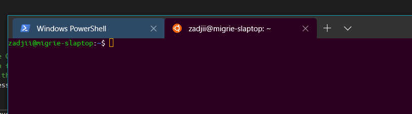
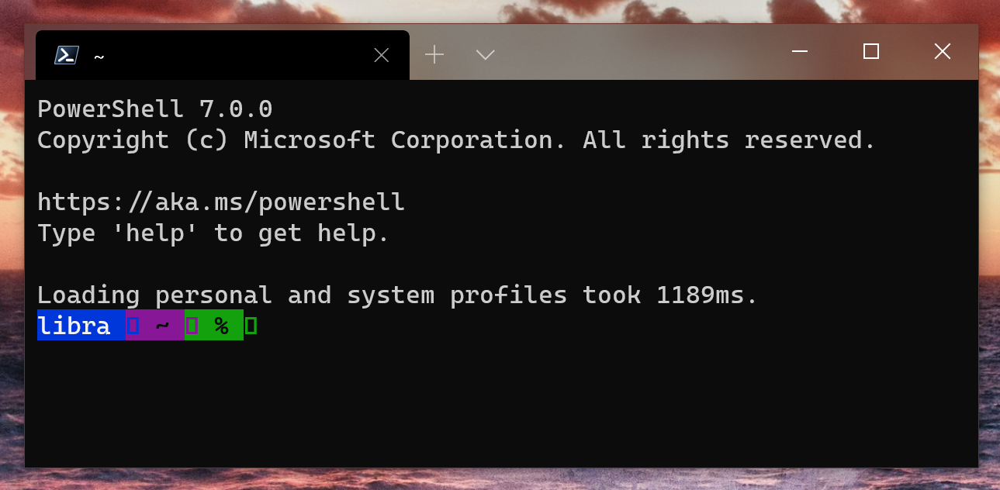
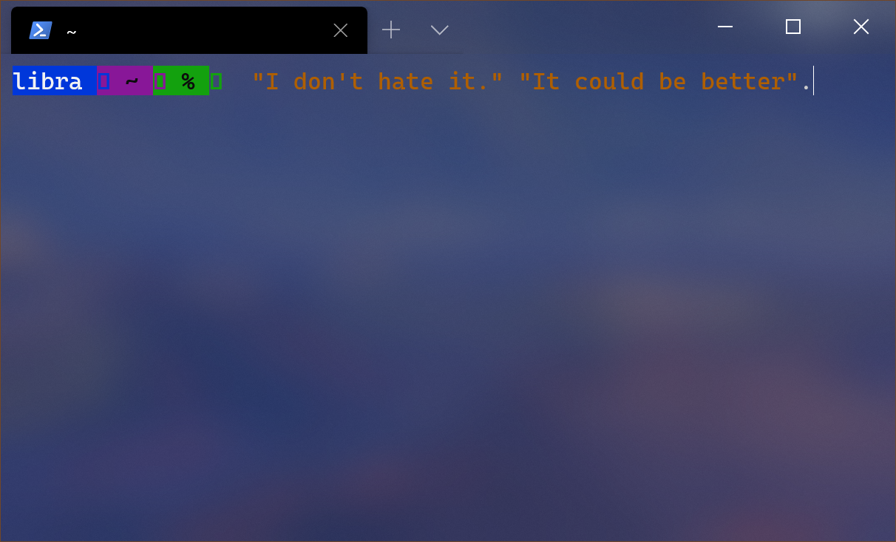
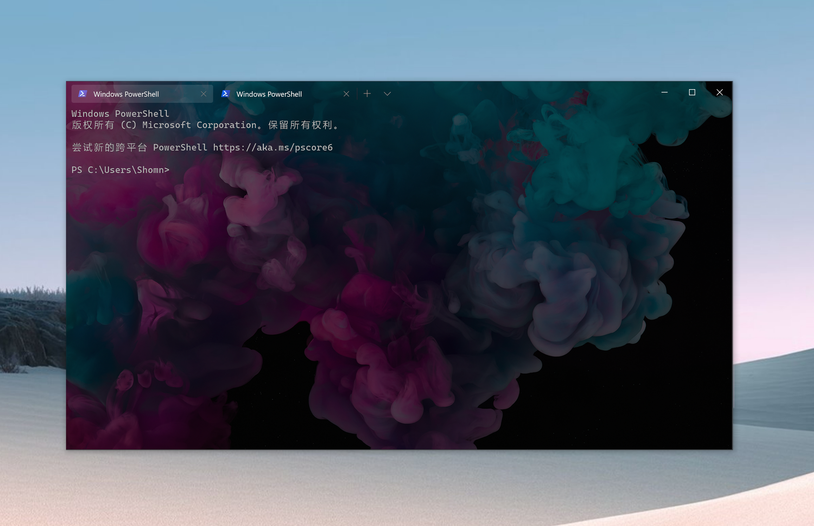
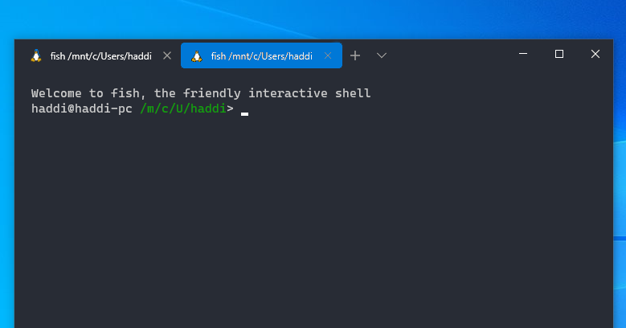

TODO!S:
* How do themes play with different window title settings? (different themes for different windows. `_quake` esp.))
* any clever ideas for elevated themes?
* Reconcile with global `experimental.useBackgroundImageForWindow` from [#12893]

# Application Theming

## Abstract

This spec outlines how the Windows Terminal will enable users to create custom
"themes" for the application, enabling further customization of the window.
These themes will be implemented as objects containing a group of UI-specific
properties, so users can quickly apply a group of properties atomically.

## Inspiration

Much of the inspiration for this feature comes from VsCode and its themes. These
themes can be more than just different color palettes for the editor - these
themes can control the appearance of a variety of UI elements of the VsCode
window.

## Solution Design

### Requested Functionality ("User Stories")

The following is a long list of ideas of elements of the window that the user
should be able to customize:

* [ ] Pane Border colors (both the background, and the "focused" color) ([#3061])
* [ ] Pane border width ([#3062])
* [ ] Tab _Row_ and _Item_ Background color ([#702]/[#1337]/[#2994]/[#3774]/[#1963])
    - Some users want to set these to the accent color
    - Some users want to set these to a specific custom color
    - Some users want this to use the color straight from the active Terminal,
      allowing the tab or titlebar to "blend into" the terminal
* [ ] Feature Request: Setting to hide/remove close ("x") button from tabs ([#3335])
* [ ] Various different tab sizing modes
    - the current sizing, which is `SizeToContent`
    - Setting a min/max width on tabs
    - Configuring tabs to split the available space

Other lower-priority ideas:
* [ ] Enable hiding the tab icon altogether
* [ ] Enable forcing tab icons to monochrome
* [ ] Tab row height
* [ ] Tab row font size, font face
* [ ] Tab corner radius
* [ ] Margin between tabs? Padding within the tab?
* [ ] Left-justify / Center / right-justify tab text, when tabs are wider than
  their text?
* [ ] Control colors for light vs dark vs high-contrast modes
* [ ] Enable/disable a shadow underneath the tab row, between tabs and content
* [ ] Enable/disable a shadow cast by terminals on pane borders or a shadow cast
  by pane borders on Terminal panes
* [ ] Similarly to the tabs, styling the Status Bar ([#3459])
    - Maybe enable it to have the same color as the active TermControl, causing
      the same "seamless" effect (see [this
      comment](https://github.com/microsoft/terminal/issues/3459#issuecomment-550501577))
    - Change font size, face, colors
    - Control the borders on the status bar - no top border would give the
      impression it's "seamless"

Additionally, the user should be able to easily switch from one installed theme
to another. The user should be able to copy a simple blob of settings from the
web and paste it into their settings to be able to easily try the theme out.

### Difference between "Themes" and "Schemes"

The avid follower of the Windows Terminal might know that the Terminal already
contains support for "color schemes". What makes themes different from these
schemes, and why should they be separate objects?

**Color Schemes** are objects that generally control the appearance of the
Terminal Control itself (the proverbial "black rectangle with text in it").
Primarily, color schemes are used for setting the "color table" of a terminal
instance, setting the values for each of the 16 colors in the terminal's color
table, and the default foreground and background colors. These are properties
that only apply to the contents of the terminal itself, and not necessarily the
entire application. Individual terminal control instances can have different
color schemes. Furthermore, these schemes are largely in-line with schemes
available on other platform's terminals. These schemes were heavily inspired by
the great work done at [iTerm2-Color-Schemes].

Alternatively, **Themes** are sets of properties that apply primarily to the
window of the application itself, but not necessarily the terminal content.
These properties apply globally to the entire window, as opposed to controlling
the appearance of individual terminals. These properties include things such as
the coloration and styling of the tabs in the tab row.

### Theme objects

Themes will be implemented largely similar to the color schemes implementation.
Currently, the terminal contains a list of available color schemes, and profiles
can chose to apply a scheme from the list of schemes. We'll add a list of
`themes`, and globally, the user will be able to specify one of these themes to
apply.

Take for example the following settings excerpt:

```json
{
    "theme": "My Boxy Theme",
    "themes": [
        {
            "name": "My Boxy Theme",
            "window":{
              "applicationTheme": "dark"
            },
            "tab": {
              "radius": 0,
              "padding": 5,
              "background": "terminalBackground",
              "textColor": "key:SystemAccentColorLight3",
              "icon": "outline",
              "closeButton": "hidden",
            },
            "tabRow":{
              "background": "accent",
              "shadows": false
            }
        },
        {
            "name": "My small light theme",
            "window":{
              "applicationTheme": "light"
            },
            "tab": {
              "background": "#80ff0000",
              "height": 8,
              "icon": "hidden",
              "closeButton": "hover"
            },
            "tabRow":{
              "background": "#ffffffff",
              "acrylicOpacity": 50,
            }
        }
    ]
}
```

In the above settings snippet, we see the following things:
1. A list of `themes` that the user can pick from. Each theme has a `name`
   property used to identify the theme, and a group of properties for the theme.
2. The user has set the `theme` to `"My Boxy Theme"`, the first theme
   in the list of themes. If the user wanted to switch to the other installed
   theme, `"My small light theme"`, they'd simply need to change this property.

> _note_: Initially, we had considered a `elementPropertyName`-like syntax as
opposed to the object-grouped one above. We also considered a
`element.propertyName`-like syntax. Overall, we liked the object based one best.
>
> **For simplicity, we'll be using `element.propertyName` syntax throughout to**
> **refer to these properties, when grouped under `element` objects in the theme.**

These Theme objects are designed to make it simple for the user to be able to
quickly download these as an extension in the future, and hot-switch between
them. Imagine: an application that would provide a gallery of uploaded themes,
and the user could install them as [fragment extensions].

### Exposed theme properties

Themes should be able to control a variety of elements of the Terminal UI. Some
of these settings will be easier to implement than others. As such, below is a
set of properties that seems appropriate to include as part of a "v1" theming
implementation. In [Future Considerations](#future-considerations), we'll
enumerate additional properties that could be added in the future to further
control the UI.

#### Highest priority theming properties

These are the elements that have orders of magnitude more requests:
* Customizing the titlebar color, including the unfocused titlebar color. This
  includes merging with the existing `useAcrylicInTabRow` setting.
* Customizing the tab color
* Enabling Mica for the window

These represent the most important asks of theming in the Terminal. Everything
else that follows is merely "nice to have". The most important elements then
are:

* Properties:
    - `tab.background`
    - `tabRow.background`
    - `tabRow.acrylicOpacity`
    - `tabRow.unfocusedBackground`
    - `window.background.useMica`
* Theme color variants:
    - `"#rrggbb"` or `"#rrggbbaa"`
    - `"accent"`
    - `"terminalBackground"`

#### Additional theming v1 Properties

These are additional settings that seem of higher priority or would be easier to
implement. They are categorized by the element of the Terminal they are
controlling:

##### Individual Tabs

* `tab.cornerRadius`: Control the radius of the corners of the tab items.
  Accepts a `double`. If this is set to `0`, then the tabs will have squared-off
  corners. No particular limit is set on the max value accepted, though larger
  values might not be aesthetically pleasing.
* `tab.bottomCornerRadius`: Control the radius of the bottom corners of the tab
  items. This can be used to make the tabs look like "buttons" in the tab row,
  instead of tabs.
* `tab.closeButton`: Control the visibility of the close button for a tab item.
  Accepts the following values:
    - `visible`: The default behavior of the tab item close button - always
      visible.
    - `hover`: The close button on a tab item only appears when the tab is
      hovered.
    - `hidden`: The close button on a tab is always hidden.
* `tab.icon`: Control the visibility, appearance of the tab icon
    - `visible`: The default behavior of the tab item icon - always visible, and
      in full color.
    - `outline`: The icon is always visible, but is only drawn as an outline,
      using `BitmapIconSource.ShowAsMonochrome(true)`
    - `hidden`: The icon is hidden
* `tab.background`: Control the color of the background of tab items. See below
  for accepted colors.

##### Tab Row / "Titlebar"

* `tabRow.background`: Control the color of the background of the tab row. When
  tabs in the titlebar are enabled, this sets the color of the titlebar. See
  below for accepted colors.
    - Notably, this is named `tabRow.background`, **not** `titlebar.background`.
      Outside of tabs-in-titlebar mode, we can't control the window titlebar
      color.
    - This ignores any alpha and always uses 1.0 for the alpha channel. See
      [Titlebar complications](#Titlebar-complications) for details.
* `tabRow.unfocusedBackground`: Control the color of the background of the tab
  row, when the window is unfocused. See below for accepted colors.
    - **TODO!** When omitted, should this default to the `tabRow.background`
      value (if set), or just the normal unfocused window color? "the normal
      unfocused window color" is a SUBSTANTIALLY easier implementation.
    - This ignores any alpha and always uses 1.0 for the alpha channel. See
      [Titlebar complications](#Titlebar-complications) for details.
* `tabRow.acrylicOpacity`: Optional integer representation of an opacity
  (0-100). When provided, the `tabRow.background` color is treated as an acrylic
  brush, with the given `TintOpacity`. When omitted, `tabRow.background` is
  treated as a solid color.
    - This is to replace the original `useAcrylicInTabRow` setting.
    - This is NOT provided for the `tabRow.unfocusedBackground` setting. See
      [Titlebar complications](#Titlebar-complications) for details.

##### Panes

* `pane.borderColor`: Control the color of the border used to separate panes.
  This is the color of the inactive border between panes.
* `pane.activeBorderColor`: Control the color of the border of the active pane
* `pane.borderWidth`: Control the width of the borders used to separate panes.

##### Window Properties

* `window.applicationTheme`: If set, will set the XAML `RequestedTheme`
  property. This can be one of `light`, `dark` or `system`. This controls how
  XAML fundamentally styles UI elements. If not provided, will use the default
  value "system", which will use whatever the system's default theme is.
* `window.roundedCorners`: A boolean, to control whether the window has rounded
  corners on Windows 11.
* `window.background.useMica`: a boolean that enables/disables Mica. For more
  discussion, see [Mica Spec].
* `window.background.image`: a path to an image to use as the background for the
  whole of the content of the Terminal, including in the tab row space.
    - Additional properties to control the sizing of this image (`padding`,
      `stretchMode`, `opacity`, etc) would also be exposed as
      `window.background.imagePadding`, a la the similar Profile settings.

#### Theme Colors

For properties like `tab.background` and `tabRow.background`, these colors can
be one of:
* an `#rrggbb`, `#aarrggbb` color. (Alpha is ignored for `tabRow.background`)
* `accent` for the _titlebar_ version of the accent color. Notably, this is
  **not** just some `SystemAccentColor` value, it's apparently some other value.
  This has a different value depending on if the window is focused or not. Refer
  to Edge the "use accent color on titlebars" setting enabled as a reference.
* `terminalBackground` to use the default background color of the active
  terminal instance.
* `terminalForeground` to use the default foreground color of the active
  terminal instance.
* `key:SomeXamlKey` to try and look `SomeXamlKey` up from our resources as a
  `Color`, and use that color for the value.
    - `accent` is NOT the same thing as `key:SystemAccentColor`? If it is, is it a reasonable
      alias that we'd want to provide anyways?
    - **TODO! DISCUSSION**: PR[#5280] suggested `{ "key": "SomeResourceKey" }` for
      string resources, should we use that format for colors like this as well?

This will enable users to not only provide custom colors, but also use the
dynamic color of the active terminal instance as well.

Using `terminalBackground` with multiple concurrent panes with different
backgrounds could certainly lead to some odd behavior. The intention of the
setting is to provide a way for the tab/titlebar to "seamlessly" connect to the
terminal content. However, two panes side-by-side could have different
background colors, which might have an unexpected appearance. Since the user
must have opted in to this behavior, they'll need to decide personally if
that's something that bothers them aesthetically. It's entirely possible that a
user doesn't use panes, and this wouldn't even be a problem for them.

<!-- We could maybe mitigate this by providing the user a way of specifying the
`tab.background` color as having both a "single pane" and "multiple pane" mode,
though I'm not sure I'm in love with this:

```json
    "tab.background": {"single": "terminalBackground", "multiple": null},
    "tab.background": {"single": "terminalBackground", "multiple": "#ff0000"},
    "tab.background": [ "terminalBackground", null ]
```

 Also shown is an array based implementation, as an option. Overall I'm not
 happy with this, so I think it shouldn't be in the final draft of the spec, but
 I'm leaving it for now as an option.
-->

### Implementation of theming

Largely, whenever possible, we should be able to implement this theming support
by modifying our application's `ResourceDictionary` with custom values to
control the appearance of UI elements.

For example, the `TabView` already exposes a number of XAML resources we can
modify to adjust it's appearance.
* `TabViewBackground` controls the appearance of the background of the tab view.
  In `showTabsInTitlebar: true` mode, this is the color of the titlebar.
* `TabViewItemHeaderBackground` and `TabViewItemHeaderBackgroundSelected`
  control the appearance of an individual tab.

By modifying the values of these brushes, we can control the appearance of the
tabs. So long as we only in-place modify the resources, XAML is smart enough to
be able to update it's appearance automatically. We can do this by querying the
`ResourceDictionary` for a given resource, and changing it's value, rather than
`insert`ing a new value into the `ResourceDictionary` to replace the old one.

In addition to the above properties, I propose adding a couple of our own
properties: `PaneBorderWidth`: To control the width of pane borders
`PaneBorderBrush`: To control the appearance of _inactive_ pane borders
`ActivePaneBorderBrush`: To control the appearance of _active_ pane borders

In order to respond to the live-updating of the `TermControl`'s background
color, we'll need to add some more specific logic beyond simply updating a XAML
resource when settings change. Whenever a `TermControl`'s background color
changes, or the active pane in a tab changes:
* If `tab.background == "terminalBackground"`:
    - If this control is the tab's active terminal control (and the tab doesn't
      have a custom color set by the color picker), update the tab's own
      `TabViewItem` with updated `TabViewItemHeaderBackground` and
      `TabViewItemHeaderBackgroundSelected` values.
        - Here, we _don't_ want to update the `App`'s resources, since those
          apply globally, and each tab might have a control with a different
          color.
        - The color set by the color picker should override the color from the
          theme (as the former is a run-time property set to override the
          latter).
* If `tabRow.background == "terminalBackground"`:
    - If this control is the active terminal of the active `Tab`, then we need
      to raise an event to communicate this updated value up to the window
      layer. We'll raise a `"TabRowBackgroundBrush"` property changed event,
      that the app host can listen for and use to set the titlebar's color, if
      needed.
    - The `TerminalPage` also will need to set the Background of the
      `TabRowControl` to match.

The `tab.cornerRadius` might be a bit trickier to implement. Currently, there's
not a XAML resource that controls this, nor is this something that's exposed by
the TabView control. Fortunately, this is something that's exposed to us
programmatically. We'll need to manually set that value on each `TabViewItem` as
we create new tabs. When we reload settings, we'll need to make sure to come
through and update those values manually.

> NOTE: [microsoft-ui-xaml#2201] suggested that this will be possible with a
> future MUX version and changing the `OverlayCornerRadius`.

### Tab Background Color, Overline Color, and the Tab Color Picker

Concurrently with the writing of this spec, work is being done to add a "color
picker" for tabs, that lets the user manually set a background color for tabs.
This may in the future cause some complications with setting a color for tabs
from the theme.

When both features are combined, the color set at runtime but the color picker
should override whatever color the user has set in the theme. When the color
picker "clears" the color it has set for the tab, it should revert to the color
from the theme (if one is set).

Also mentioned in the implementation of the color picker feature was the ability
to not set the entire color of the tab, but just the color of a tab "overline",
similar to the way Firefox (by default) styles the focused tab.

Currently, the `TabView` doesn't support a tab "overline" like this, however, in
the future where this is possible, we'd love to also support such an overline.
However, the story of setting the tab color manually becomes a bit more
confusing now.

* The user should be able to set both the `tab.background` and `tab.overline`
  colors in a theme.
* The user should be able to configure whether the color picker sets the
  `background` or the `overline` color of the tab.

The second setting added above will allow the user to change what's controlled
by the color picker. Similarly to how the color picker can set the background of
the tab to override the background from the theme, the user could configure the
color picker to be able to change the overline color, not the background color
of the tab. Then, when the user uses the color picker, the overline color will
be overridden by the color picker, instead of the tab background color.

**Other things to consider:**
* Users might want to be able to set a tab color as a part of the profile. One
  could imagine wanting to set the tab background color for Windows PowerShell
  to `rgb(1, 36, 86)` automatically. If we make this property part of the
  Profile, then we should use the profile's value as the runtime-override (of
  the theme value) for this property. If the color picker is used to set the
  color of the tab, then it'll override the runtime color for that tab.
  - How does this interact with multiple Panes in a tab? Should the Tab
    override color be per-terminal instance? If the terminal has a tab color,
    then that would override the theme, but not the tab's own override color?
    - If that were the case, the order of precedence would be:
      1. A color set at runtime with the color picker
      2. A color from the active terminal within the tab, if it has one
      3. The tab color from the theme
* Users might want to be able to configure the titlebar to use a color based off
  the active tab color. We might need an additional special value like
  `terminalBackground` that lets users say "I want to use the active tab color
  as the titlebar color".
  - During [#3789], there was a point where the terminal raised actually
    implemented something like this. In it's implementation, the titlebar color
    would be slightly lighter or darker than the tab color (to provide some
    contrast). We'd want to make sure that the user could specify both "I want
    to use the tab color with some contrast applied" or just literally "Use
    whatever the active tab's color is."

### Default Themes

Late in 1.0, we renamed the old property `requestedTheme` to just `theme`.
Currently, the user can use that property to simply set the XAML
`RequestedTheme` property, which controls the theming of all the XAML UI
elements. Currently, they can set that value to one of `light`, `dark` or
`system`.

To maintain backwards compatibility with that setting, we'll introduce _three_
themes to `defaults.json`:

```json
    "themes": [
        {
            "name": "light",
            "window":{
              "applicationTheme": "light"
            },
        },
        {
            "name": "dark",
            "window":{
              "applicationTheme": "dark"
            },
        },
        {
            "name": "system",
            "window":{
              "applicationTheme": "system"
            },
        }
    ]
```

Each of these themes will only define one property by default: the
`window.applicationTheme` property, which is now responsible for setting the
XAML `RequestedTheme` property. With these default themes, the user will still
be able to use the old names seamlessly to get the same behavior.

Additionally, the user will NOT be able to override these built-in themes.
Experience trying to not serialize the default color schemes has proven
exceptionally tricky, so we're not going to allow that for the built-in themes.
The user will always need to fork them to create a new theme. If they're found
in the user settings file, we'll just ignore them.


## UI/UX Design

[TODO!]: # TODO: We should include more mockups here. That would be nice.


_fig 1_: Using a tab color set to "terminalBackground". The Windows PowerShell
tab has also set its color with the color picker.


_fig 2_: Using an acrylic titlebar color, with a tab color set to
"terminalBackground"


_fig 3_: Using an acrylic terminal background, and the titlebar color is set to
"terminalBackground"

 _fig
4_: Using a single image as the background for the window, with a transparent
tab row, and rounded bottoms on the TabViewItems. Courtesy of
[@Shomnipotence](https://github.com/microsoft/terminal/issues/3327#issuecomment-765493313)

 _fig
5_: Using a bottom corner radius to make tabs appear like buttons on the tab row. Courtesy of
[@simioni](https://github.com/microsoft/terminal/issues/3774#issuecomment-609408305)


[TODO!]: # TODO: Settings UI mocks? These pretty substantially affect the UI.
<!-- We probably need to expose them in the UI in some way, and not just leave them as "power user settings" -->

## Potential Issues

It's totally possible for the user to set some sort of theme that just looks
bad. This is absolutely a "beauty in the eye of the beholder" situation - not
everyone is going to like the appearance of every theme. The goal of the
Terminal is to provide a basic theme that's appropriate for anyone, but empower
users to customize the terminal however they see fit. If the user chooses a
theme that's not particularly appealing, they can always change it back.

### Accessibility

For people using the default theming, there should not be any particular
regressions. However, this change does open up the Terminal to changes that
might make the Terminal less accessible with certain theme configurations. As
these themes would all be user-defined and controlled by the user, we're not
concerned that this will be much of an issue. If a user finds one of their
themes is less accessible, they can always change the theme to be more
appropriate for them, or even switch to another theme.

Furthermore, this might _help_ certain accessibility stories. Users could pick
themes with _even more_ contrast than the Terminal provides by default, or
larger font sizes, which might help make parts of the Terminal _more_ visible
than the default UI.

### Security

This should not introduce any _new_ security concerns. We're relying on the
security of jsoncpp for parsing json. Adding new keys to the settings file
will rely on jsoncpp's ability to securely parse those json values.

### Reliability

This change should not have any particular reliability concerns.

### Compatibility

The biggest compatibility concern is regarding the existing values for the
`theme` property, which is addressed above.

#### `useAcrylicInTabRow` migration

[TODO!]: # TODO: Deprecating the current titlebar acrylic setting, or totally overriding in theme.

#### `experimental.useBackgroundImageForWindow` migration

[TODO!]: # TODO: Deprecating the current setting or migrating or whatever


### Performance, Power, and Efficiency

This change should not have any particular performance concerns. Additional
acrylic usage might impact battery life. There's not much concern for any
substantial new impacts, however.

### Branding

Are we concerned that by enabling theming, the appearance of the Terminal won't
be as static, and won't necessarily have as specific a look? It might be harder
for potential users see a screenshot of the Terminal and _know_ "Thats the
Windows Terminal". Is this something we're really all that concerned about
though? If this is something users want (it is), then shouldn't that be what
matters?

### Titlebar complications

Unfortunately, the original User32 titlebar is actually always drawn underneath
our titlebar. Even when the tabs are in the titlebar, that's actually just XAML
content drawn on top of the original frame. The rest of the window is
transparent, but the titlebar is there.

Our design to enable unfocused acrylic to work relies on in-app acrylic to allow
the acrylic to blur with the transparent window contents. However, since the
User32 titlebar is always there, in-app acrylic would end up always blurring
_the original titlebar_, which looks ridiculous. This means we can't have
unfocused acrylic without showing that titlebar. We'd rather remove that
foot gun, and make it explicit that this setting does not exist.

### Light & dark mode theming

One request that comes up with frequency is the ability to change the color
scheme of a profile automatically based on the system theme. Many users have
scripts that automatically change between light and dark theme in the OS based
on time of day.

One thing this design does not do well is account for such theme-switching
scenarios. This design assumes a static set of colors for a whole Terminal
theme, regardless of whatever `window.applicationTheme` is set to. Should the
user leave `window.applicationTheme` set to `system`, it's entirely likely that
they would like the rest of their colors to automatically update to match.

To address this, we'll allow the window-level `theme` property to not only allow
a string for a name-based lookup in the list of themes, but als an object. That
object will accept two properties: `light` and `dark`. Each of these accepts a
string representing the name of a theme to use for that specific OS theme. These
strings will default to `"light"` and `"dark"` respectively.
```jsonc
{
    "theme": {
        "light": "my light theme",
        "dark": "my dark theme"
    }
}
```

<!-- Also considered: allow the user to set their own brushes as part of a theme, like:
```jsonc
{
    "name": "My theme aware theme",
    "brushes": {
        "light": {
            "Foo": "#ff0000"
        },
        "dark": {
            "Foo": "#00ff00"
        }
    },
    "window.applicationTheme": "system",
    "tabRow.background": "key:Foo",
}
```
This seemed far too complicated to actually understand. -->

### Admin window themes

[TODO!]: # TODO! Any clever ideas?

Same idea as the light vs dark mode theme ideas. How should users be able to
style admin vs regular windows?

## Addenda

This spec also has a follow-up spec which elaborates on the complexities of Mica
in the Terminal. Please also refer to:

* [Mica in the Terminal]

## Future considerations

* Mentioned in [#7005] was the idea of shipping a default theme that had values
  aligned with the appearance of the Edge browser. Perhaps something like:
  ```jsonc
  {
      "name": "Edge",
      "window":{
        "applicationTheme": "system"
      },
      "tab": {
        "background": "#whatever-color-edge-is" // Might need a "key:" resource here for light/dark theme switching
      },
      "tabRow":{
        "background": "accent",
      }
  },
  ```
* Applications should be able to install themes as fragments.
  - We probably shouldn't allow layering for fragment themes - don't want
    `foo.exe` installing a `light` theme that totally overrides the built-in
    one. Right? **TODO! DISCUSSION**
* ~I don't think it's unreasonable to implement support for `theme` as either a
  string or an object. If `theme` is a string, then we can do a name-based
  lookup in a table of themes. If it's an object, we can just use that object
  immediately. Doing this might provide a simpler implementation plan whereby we
  allow `"default"|"light"|"dark"|{object}` at first, and then later add the
  list of themes.~
  - This was a cool idea, but ultimately discarded in favor of the OS light/dark
    theme switching, which needed the object version of `theme` to be reserved
    for the OS mode lookup.
* A cool idea from discussion: `window.highContrastSchemes` as a theme member
  that controls a per-control property. This would override the color scheme of
  any pane with a high contrast version, ignoring any colors emitted by the
  client application. Details are left for a future spec.

#### Theming v2 Properties

* `tab.padding`: Control the padding _within_ a tab between the text and the
  "sides" of the tab
* `tab.textColor`: Change the color of the text on a tab
* `tabRow.shadows`: Enable/disable the tab "shadows"
  - note that they're enabled by default and already nearly impossible to see in
    dark mode.
* `tabRow.height`: Change the height of the tab row.
* `tabRow.underlineHeight`: Controls the height of a border placed between the
  tab row and the Terminal panes beneath it. This border doesn't exist
  currently.
* `tabRow.underlineColor`: Controls the color of the aforementioned underline
* `window.frameColor`: The `DWMWA_BORDER_COLOR` DWM attribute is [SUPER fun to
  play with], and trivial to set. We should definitely exposed it.

<!-- Footnotes -->

[iTerm2-Color-Schemes]: https://github.com/mbadolato/iTerm2-Color-Schemes
[#3061]: https://github.com/microsoft/terminal/issues/3061
[#3062]: https://github.com/microsoft/terminal/issues/3062
[#702]: https://github.com/microsoft/terminal/issues/702
[#1337]: https://github.com/microsoft/terminal/issues/1337
[#2994]: https://github.com/microsoft/terminal/issues/2994
[#3774]: https://github.com/microsoft/terminal/issues/3774
[#3789]: https://github.com/microsoft/terminal/pull/3789
[#1963]: https://github.com/microsoft/terminal/issues/1963
[#3335]: https://github.com/microsoft/terminal/issues/3335
[#3459]: https://github.com/microsoft/terminal/issues/3459
[#7005]: https://github.com/microsoft/terminal/issues/7005

[#5280]: https://github.com/microsoft/terminal/pull/5280

[microsoft-ui-xaml#2201]: https://github.com/microsoft/microsoft-ui-xaml/pull/2201#issuecomment-606888293
[#12893]: https://github.com/microsoft/terminal/pull/12893
[Mica in the Terminal]: ./%2310509%20-%20Mica.md
[Mica Spec]: ./%2310509%20-%20Mica.md
[SUPER fun to play with]: https://github.com/microsoft/terminal/issues/12950
[fragment extensions]: https://docs.microsoft.com/en-us/windows/terminal/json-fragment-extensions
