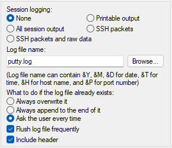
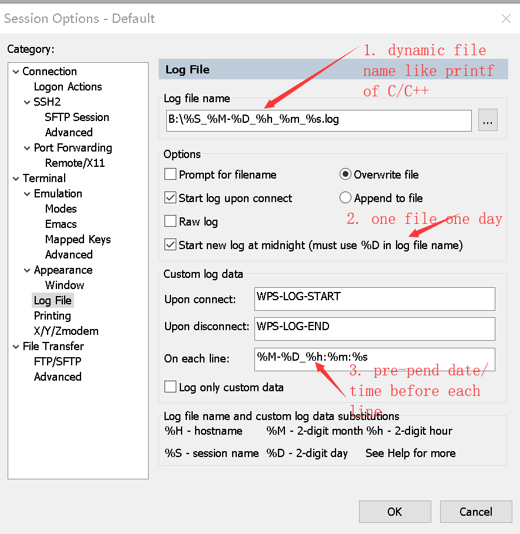
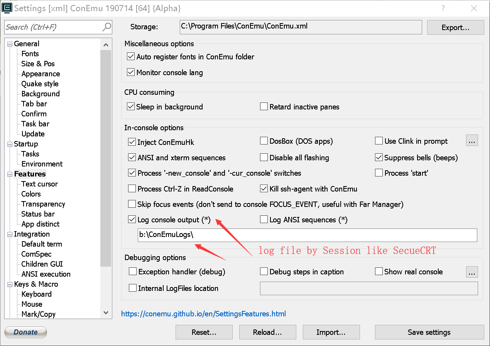

# Buffer Exporting and Logging

## Abstract

A common user need is the ability to export the history of a terminal session to
a file, for later inspection or validation. This is something that could be
triggered manually. Many terminal emulators provide the ability to automatically
log the output of a session to a file, so the history is always captured. This
spec will address improvements to the Windows Terminal to enable these kinds of
exporting and logging scenarios.

## Background

### Inspiration

Below are screenshots from the settings pages of three different terminal
emulators with similar features - PuTTY, SecureCRT, and ConEmu:



_figure 1: PuTTY settings_



_figure 2: SecureCRT settings_



_figure 3: ConEmu settings_

These applications all offer some settings in common. Primarily, the important
feature is the ability to specify a path to a log file which contains some
special string formatting. This allows the user to log to different files based
on the time & date of the session, or based on the session name.

### User Stories

* **Story A**: The user is able to use a context menu entry on the tab to export
  the contents of the buffer to a file, which they are prompted for.
  - This is explicitly what was requested in [#642]
* **Story B**: The user can bind an action to export the contents of the buffer
  to a file, which they are prompted for.
  - Very similar to **A**, but via the command palette or a keybinding.
* **Story C**: The user can export to an explicit file via an action
  - similar to **B**, but allowing for declaring the path to a file rather than
    prompting at runtime.
* **Story D**: The user can choose to append to a file when exporting, rather
  than overwriting.
* **Story E**: The user can specify a format string in the path to the file to
  export to, which the Terminal will automatically replace with variables like
  the time, date, and profile name.
* **Story F**: When opening a specific profile, the user can automatically log
  to a file
* **Story G**: The user can execute an action to start or stop logging to a
  given file.


## Solution Design

I'm proposing the following actions and profile settings

* New Action: `exportBuffer()`.
  - Export the contents of the buffer to a file.
  - `path` (string, defaults to `""`): When empty, prompt the user for a name of
    a file to export to, using a file picker. This path accepts special
    formatting strings that will be substituted with certain variables
    (discussed [below](#path-formatting)).
  - `append` (boolean, defaults to `false`): When `false`, the file's contents
    will be overwritten. When `true`, the buffer contents will be appended to
    the end of the file.
* New Profile Settings object: `logSettings`
  - This is an object that describes a set of behavior for logging a profile.
  - `path`: Same as the `path` in the `ExportBufferArgs` above
  - `append`: Same as the `append` in the `ExportBufferArgs` above
  - `captureAllOutput`: (boolean, defaults to `false`) When true, don't log only
    printable characters, also log non-printable escape characters written to
    the Terminal.
  - `captureInput`: (boolean, defaults to `false`) Additionally log input to the
    Terminal to the file. Input will be formatted as the traditional VT
    sequences, rather than the full `win32-input` encoding.
  - `newFileEveryDay`: (boolean, defaults to `false`) This requires the `day` to
    be an element of the path format string. When logging with this setting,
    opens a new file at midnight and starts writing that one.
  <!-- TODO! - `flushFrequently`: (boolean, defaults to `true`) -->
* New Profile setting: `logAutomatically` (boolean, default `false`). When true,
  terminals with this profile will begin logging automatically.
* New Action: `toggleLogging()`.
  - Start or stop logging to the configured file. If the terminal is already
    logging with different settings than in this action, then stop logging
    regardless (don't just start logging to the new file)
  - This action accepts all the same args the profile's `logSettings` object.
  - If _any_ args are provided, use those args. If _none_ are provided, then use
    the logging settings present in the profile (if there are any).
  - If there's not path provided (either in the args to the action or in the
    profile), prompt the user to pick a file to log to.

### Examples
```json
{
    "actions": [
        { "keys": "f1", "command": "exportBuffer" },
        { "keys": "f2", "command": { "action": "exportBuffer", "path": "c:\\logs\\${year}-${month}-${date}\\{profile}.txt" } },

        { "keys": "f3", "command": "toggleLogging" },
        { "keys": "f4", "command": { "action": "toggleLogging", "path": "c:\\logs\\${profile}.log", "append": true } },
    ],
    "profiles": [
        {
            "name": "foo",
            "logging": {
                "path": "c:\\foo.txt",
                "append": true
            },
            "automaticallyLog": false
        },
        {
            "name": "bar",
            "logging": {
                "path": "c:\\logs\\${date}\\bar.txt",
                "append": false
            },
            "automaticallyLog": true
        }
    ]
}
```

Revisiting our original stories:

* **Story A**: This is already implemented in [#11062]
* **Story B**: This is the action bound to <kbd>f1</kbd>.
* **Story C**: This is the action bound to <kbd>f2</kbd>.
* **Story D**: This is the `append` property in the actions, profile settings.
* **Story E**: An example of this is in the action bound to <kbd>f2</kbd>,
  <kbd>f4</kbd>, and in the profile "bar"'s logging settings.
* **Story F**: The profile "bar" is configured to automatically log when opened.
* **Story G**: This is the action bound to <kbd>f4</kbd>.

In addition,
* When opening the profile "foo", it will not automatically log to a file.
  - Pressing <kbd>f3</kbd> will begin logging to `c:\foo.txt`
  - Pressing <kbd>f4</kbd> will begin logging to `c:\logs\foo.log`

### Path formatting

[TODO!]: # TODO!

For discussion: What syntax do we want?
* PuTTY uses `&Y`, `&M`, `&D`, `&T`, `&H`, `&P` for year, month, day, time, host
  and port respectively.
* SecureCRT uses:
  - `%H` – hostname
  - `%S` – session name
  - `%Y` – four-digit year
  - `%M` – two-digit month
  - `%D` – two-digit day of the month
  - `%h` – two-digit hour
  - `%m` – two-digit minute
  - `%s` – two-digit seconds
  - `%t` – three-digit milliseconds
  - `%%` – percent (%)
  - `%envvar%` – environment variable (for instance `%USERNAME%`)

We have some precedent for formatting with `${braces}`, a la the iterable
command in the Command Palette (e.g `${profile.name}`). Additionally, [#9287]
implements support for environment variables in the Terminal with the
`${env:VARIABLE}` syntax.

What variables do we want exposed, and how do we want users to be able to format
them?

This doc was initially authored assuming we'd go with a `${braces}` syntax, like:
  - `${profile}` – profile name
  - `${year}` – four-digit year
  - `${month}` – two-digit month
  - `${day}` – two-digit day of the month
  - `${hour}` – two-digit hour
  - `${minute}` – two-digit minute
  - `${second}` – two-digit second
  - `${ms}` – three-digit milliseconds
  - `${env:variable}` – environment variable (for instance `${env:USERPROFILE}`)
    (inspired by [#9287])

### Exporting vs Logging
As far as specific implementation details goes, exporting is the easier work to
do. [#11062] already wires up the `TerminalApp` to retrieve the buffer contents
from the `TermControl`, so writing them at request is easy.

Logging is harder. We don't want the `TermControl` telling the `TerminalApp`
layer about every piece of output logged. Especially in the post-[#5000] world
where that's a cross-process hop. Instead, we'll want the `ControlCore` /
`ControlInteractivity` to do _logging_ themselves.

### Logging Mechanics

#### When do we log?

[TODO!]: # TODO!

When do we decide to actually log? Take for example typing in a `pwsh` or
`bash` prompt. Imagine the user types
<kbd>w</kbd><kbd>h</kbd><kbd>a</kbd><kbd>t</kbd>, then hits
<kbd>Bksp</kbd><kbd>Bksp</kbd>, such that the prompt is just `wh`. What should
the log contain? `what^h ^h^h ^h`<sup>[[1]](#footnote-1)</sup>? `wh`?

My worry with logging the backspaces is that conpty is sometimes a bit noisier
than it needs to be with using `^H` as a cursor positioning sequence. Should we
only log lines when the cursor newlines or otherwise moves from the line it is
currently on?

I'll need to look at what PuTTY emits for the "Printable output" option.

#### What happens when we _start_ logging?

If the user has a terminal that did not start with logging enabled, but then
started logging with `toggleLogging`, what should we log? All future output? Or
should we log the current buffer contents as well?

I'm inclined to lean towards simply "all future output", and ignore any current
buffer content. If the user rally wants to log the current buffer contents _and_
start logging, they can use a `multipleActions` action ([#11045]) to
`exportBuffer` to a file, then `toggleLogging` to that same file with
`"append":true`.

## Potential Issues

<table>

<tr>
<td><strong>Compatibility</strong></td>
<td>

Since this functionality is entirely new, nothing here should negatively affect
existing functionality.

</td>
</tr>
<tr>
<td><strong>Performance, Power, and Efficiency</strong></td>
<td>

When logging, it's expected there will be a measurable performance hit. We can
try to mitigate this by only writing to the file on a background thread,
separate from the connection or rendering thread. Since auto-logging will only
take place in the content process, we're not worried about the file writing
occurring on the UI thread.

</td>
</tr>
</table>

Also frequently requested is the ability to log timestamps of when commands are
executed. I don't think that this is a valuable feature for the Terminal to
implement ourselves. Windows Terminal is fundamentally just a _terminal
emulator_, it doesn't really know what's going on behind the scenes with
whatever client application (`cmd`, `powershell`, `bash`, `vim`) that is
connected to it. WT doesn't know when the user is typing in commands to the
shell, or if the user is just typing in text in `emacs` or something. There's no
way for the terminal to know that. It's _typically_ the client application's
responsibility to save it's own command history. `bash` and `powershell` both do
a pretty good job of saving this to another file to restore across sessions,
while `cmd.exe` doesn't.

Windows is a messy world and this model gets a little tricky here. `cmd.exe`
isn't actually managing it's own command history _at all_. `conhost` is doing
that work on behalf of the client applications. Some long time ago someone
thought it would be a good idea to have the `readline` functionality baked
directly into the console host. Whether that was a good idea or not remains to
be seen - it's certainly made things like `python.exe`'s REPL easier to
implement, since they don't need to maintain their own history buffer, but it
makes it hard to de-tangle behavior like this from the console itself.

I'm not sure how it would be possible to add a keybinding to the Windows
Terminal that would be able to save the console's _command_ history. Especially
considering the Terminal might _not_ be connected to a console host session at
all. If the Windows Terminal were directly running a `wsl` instance (something
that's not possible today, but something we've considered adding in the future),
then there wouldn't be a `conhost` in the process tree at all, and now
requesting the command history from the console wouldn't work _mysteriously_.

Furthermore, shells can always be configured to emit timestamps in their prompts
themselves. Since the Terminal has no knowledge of when a command is actually
entered, but the _shell_ does, it makes the most sense to configure the user's
_shell_ to emit that information. The Terminal will then dutifully log that
output along with everything else.

## Implementation Plan

Below is a rough outline of how I'd go about implementing these features. Each
lop-level checkbox could be its own PR, following from [#11062].

### Buffer exporting

* [ ] Add an `exportBuffer()` action that opens the file picker
* [ ] Add a string `path` parameter to `exportBuffer()` that allows the user to
  press a key and immediately export the buffer to a whole path
  - default to `""`, which indicates "open the file picker"
* [ ] add a boolean `append` (default to `false`) parameter to `exportBuffer`.
  When true, export to the file given by appending, not overwriting the file
* [ ] Enable string formatting in the `path` parameter.
  - What format do we want? `yyyy-mm-dd`? `%Y-%m-%D`? `&Y-&m-&D`? `${year}-${month}-${day}`?
  - What are all the variables we want?
    - Year, month, day, hour, minute - those are easy
    - `WT_SESSION`, for a uuid for each session maybe?
    - Profile name perhaps? Commandline?
* [ ] more...

### Automatic logging

* [ ] `toggleLogging()` Action for start/stop logging, with `path`, `append`
  properties (like `exportBuffer()`)
  - `ToggleLoggingArgs` contains a single member `LoggingSettings`, which
    contains `path` and `append` properties. This will make sense below.
* [ ] add `LoggingSettings` property for "log all output" (default would just be
  "log printable output")
* [ ] add `LoggingSettings` property for "log input" (Though, we'd probably want
  to log it as normal VT encoded, not as `win32-input` encoded)
* [ ] Per-profile setting for `logSettings`, which can contain an entire
  `LoggingSettings` (like the `ToggleLoggingArgs`). When `toggleLogging` with no
  args, try to use the profile's `loggingSettings` instead.
* [ ] Per-profile setting for `automaticallyLog`, which would log by default
  when the profile is opened
* [ ] `LoggingSettings` property for "New file every day", which only works when
  the `{day}` is in the path string. When auto-logging with this setting, opens
  a new file at midnight and starts writing that one.
<!-- * [ ] `LoggingSettings` property for "Flush log frequently", defaults to
  `true`(?). This causes us to flush all output to the file, instead of just...
  on close? on newline? It's unclear exactly when PuTTY flushes with this off.
  Need more coffee. -->

### Future Considerations

* When logging begins, the Terminal could display a toast for "Logging to
  {filename}", and a similar one for "Stopped logging to {filename}".
* There's no good way of displaying a UI element to indicate that a pane is
  currently logging to a file. I don't believe PuTTY displays any sort of
  indicator. SecureCRT only displays a checkbox within the context menus of the
  application itself.
  

  Maybe when logging to a file, we could replace the "Export Text" context menu
  entry with "Stop Logging"
* We could maybe add a setting to disable logging from the alt buffer. This
  might help make this setting more valuable for users who are using full-screen
  applications like `vim`. Since those applications redraw the entire viewport
  contents frequently, the log might be unnecessarily noisy. Disabling logging
  while in the alt buffer would show that the user opened vim, and then they did
  some things after vim exited.
* Logging all output will be VERY helpful to us in the future for trying to
  recreate bugs on our end that users can repro but we can't!

## Resources

PuTTY Logging documentation: https://tartarus.org/~simon/putty-snapshots/htmldoc/Chapter4.html#config-logfilename
ConEmu Logging documentation: https://conemu.github.io/en/AnsiLogFiles.html

### Footnotes

<a name="footnote-1"><a>[1]: Remember that `^H` is non-destructive, so the
sequence `what^h ^h^h ^h` is can be read as:
  * print "what"
  * move the cursor back one
  * print a space (overwriting 't')
  * move the cursor back one (now it's on the space where 't' was)
  * move the cursor back one
  * print a space (overwriting 'a')
  * move the cursor back one (now it's on the space where 'a' was)

[#642]: https://github.com/microsoft/terminal/issues/642
[#5000]: https://github.com/microsoft/terminal/issues/5000
[#9287]: https://github.com/microsoft/terminal/pull/9287
[#11045]: https://github.com/microsoft/terminal/pull/11045
[#11062]: https://github.com/microsoft/terminal/pull/11062
