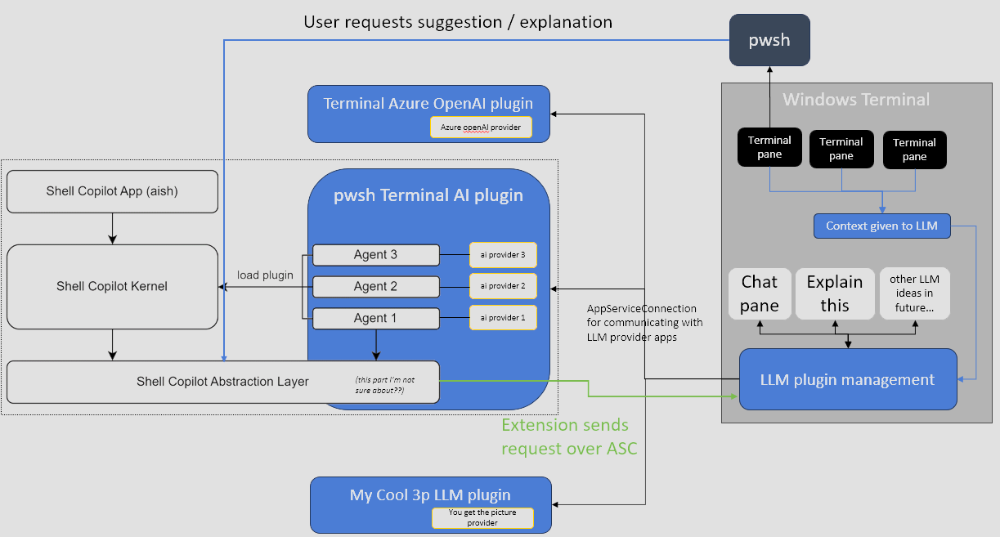
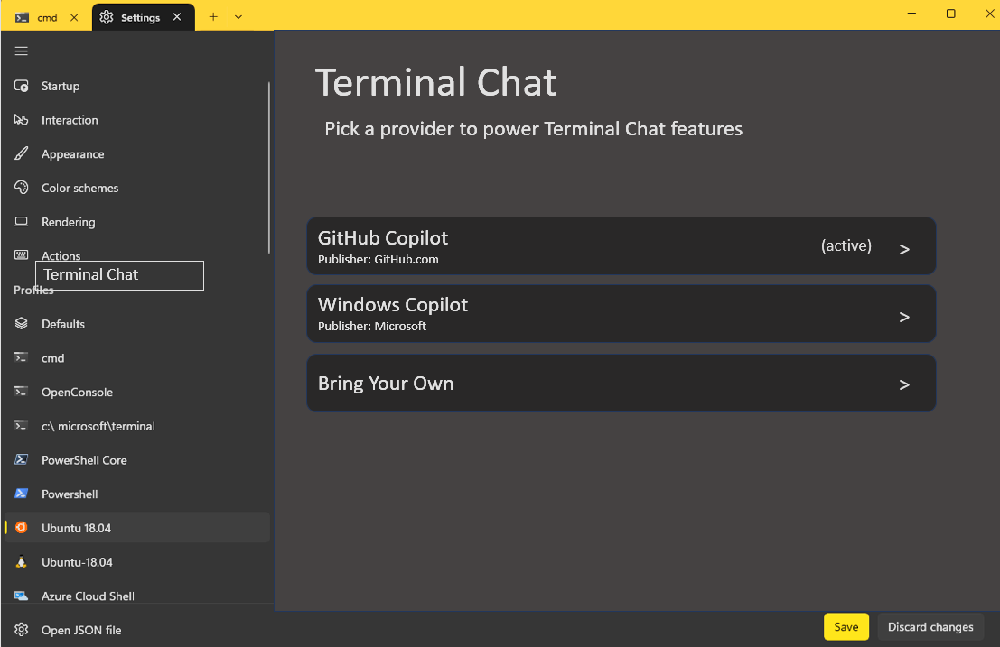

# Terminal AI Extensions

## Abstract

This is a quick and dirty description of how the Terminal could implement our AI
experiences using a extensible backend. This will allow the Terminal to iterat
on AI-powered experiences, without any dedicated AI code in the Terminal itself.
This enables multiple different AI models to be plugged in to the Terminal, each
hosted in their own app package. The Terminal will communicate with these
packages over a well-defined [App Service Connection].

- [Terminal AI Extensions](#terminal-ai-extensions)
  - [Abstract](#abstract)
  - [Solution Details](#solution-details)
    - [Declaring the Extension \& Host](#declaring-the-extension--host)
    - [Picking a backend](#picking-a-backend)
    - [Establishing the connection](#establishing-the-connection)
    - [Connection "API"](#connection-api)
      - [Note on responses](#note-on-responses)
      - [Prompting](#prompting)
      - [Explain this](#explain-this)
  - [User Experience and Design](#user-experience-and-design)
  - [Potential Issues](#potential-issues)
    - [Tenents](#tenents)
  - [Before spec is done TODO!s](#before-spec-is-done-todos)
  - [Future considerations](#future-considerations)
  - [Resources](#resources)
    - [Footnotes](#footnotes)


## Solution Details

Below is a very technical description of how we will put this support together.
For the remainder of this doc, we'll be using a hypothetical "GitHub Copilot for
the Terminal" extension for our examples. We'll cover first how the apps will
need to be manifested so they can communicate with one another. Then we'll
briefly touch on how Terminal can use this model to pick from different
extensions to choose it's AI model. Lastly, we'll decribe the API the Terminal
will use to communicate with these extensions.



### Declaring the Extension & Host

Terminal becomes an app _service client_. It is also an app _extension host_. It
is gonna register as the host for `com.microsoft.terminal.aiHost` extensions in
the following way:

```xml

        <uap3:Extension Category="windows.appExtensionHost">
          <uap3:AppExtensionHost>
            <uap3:Name>com.microsoft.terminal.aiHost</uap3:Name>
          </uap3:AppExtensionHost>
        </uap3:Extension>

```

The Github extension app registers as a `com.microsoft.terminal.aiHost`
extension. It also declares a `windows.appService`, which it will use to service
the extension. In the blob for `aiHost` extension, the App should add a property
indicating the name of the AppService that should be used for the extension. For
example:

```xml
<!-- <Package.Applications.Application.Extensions>... -->
<uap:Extension Category="windows.appService" EntryPoint="CopilotService.AiProviderTask">
  <uap3:AppService Name="com.github.copilot.terminalAiProvider" />
</uap:Extension>

<uap3:Extension Category="windows.appExtension">
    <uap3:AppExtension Name="com.microsoft.terminal.aiHost"
        Id="GitHubCopilot"
        DisplayName="GitHub Copilot"
        Description="whatever"
        PublicFolder="Public">
        <uap3:Properties>
            <ProviderName>com.github.copilot.terminalAiProvider</ProviderName>
        </uap3:Properties>
    </uap3:AppExtension>
</uap3:Extension>
```

Extension authors should then refer to [this
example](https://github.com/microsoft/Windows-universal-samples/blob/main/Samples/AppServices/cppwinrt/RandomNumberService/RandomNumberGeneratorTask.cpp)
for how they might implement the `Task` to handle these incoming requests.

### Picking a backend

Terminal will be able to enumerate the apps that implement the `aiHost`
extension. We'll use that as a list for a combobox in the settings to give users
a choice of which backend to choose (or to disable the experience entirely).

When we enumerate those packages, we'll get the `ProviderName` property out of
their manifest, and stash that, so we know how to build the app service
connection to that app. The code conhost & Terminal use today for defterm
already does something similar to get a clsid out of the manifest.

If the user chooses to set the chosen provider to "None", then when they invoke
one of the AI experiences, we'll simply inform them that no AI provider is set
up, and provide a deep link to the Settings UI to point them at where to pick
one.

### Establishing the connection

_[Sample code](https://github.com/microsoft/Windows-universal-samples/blob/ad9a0c4def222aaf044e51f8ee0939911cb58471/Samples/AppServices/cppwinrt/AppServicesClient/KeepConnectionOpenScenario.cpp#L52-L57)_

When the Terminal needs to invoke the AI provider, it will do so in the following fashion:

```c++
//Set up a new app service connection
connection = AppServiceConnection();
connection.AppServiceName(L"com.github.copilot.terminalAiProvider");
connection.PackageFamilyName(L"Microsoft.GithubWhatever.YouGet.ThePoint_8wekyb3d8bbwe");
connection.ServiceClosed({ get_weak(), &KeepConnectionOpenScenario::Connection_ServiceClosed });
AppServiceConnectionStatus status = co_await connection.OpenAsync();
```

This will create an `AppServiceConnection` that the Terminal can use to pass
`ValueSet` messages to the extension provider. These messages aren't great for
any sort of real-time communication, but are performant enough for "the user
clicked a button, now they want a response back".

Once we've got a connection established, we'll need to establish that the app is
authenticated, before beginning to send queries to that connection. TODO! how?

### Connection "API"

> [!IMPORTANT]
>
> TODO!
>
> This section was authored at the start of 2023. We since moved from
> just "a list of commands" to a more chat-like experience. This section is
> super out of date.
>

Terminal will fire off a `ValueSet`s to the provider to perform various tasks we
need[^1]. Depending on what's needed, we'll send different requests, with
different expected payload.

Terminal will only communicate messages on predefined "verbs". This will allow
the Terminal to build its UI and experience regardless of how the backend has
decided to implement its own API. So long as the backend AI provider implements
this API interface, the Terminal will be able to build a consistent UI
experience.

Terminal will keep its manipulation of the input request to a minimum. It is up
to each model provider to craft how it wants to handle each scenario. Different
models might have different APIs for requests and responses. Different apps may
want to customize the context that they provide with the prompt the user typed,
to give more relevant responses. The Terminal tries to not declare how each
extension should interface with a particular AI backend. Instead, the Terminal
only provides a general description of what it would like to happen.

#### Note on responses

In each response below, there's a `result` and `message` property returned to
the Terminal. This allows the app to indicate some sort of error message to the
user. This will likely be most used for authentication errors and network
errors.

In those cases, the Terminal will be able to provide dedicated UI messages to
indicate the error. For example, in the case of an authentication failure, the
Terminal may provide a button to send a message to the service host so that it
can re-authenticate the user.

Or, perhaps, the user might be authenticated, but might not have a particular AI
experience enabled for their account. The Terminal could similarly provide a
button to prompt the user to remedy this. TODO! should we? Or is that the
responsibility of the extension?


#### Prompting

<table>
<thead>
    <td>Request</td>
    <td>Response</td>
</thead>
<tr>
<td>

```ts
{
    "verb": "promptForCommands",
    "prompt": string,
    "context": {}
}
```

</td>
<td>

```ts
{
    "verb": "promptForCommands",
    "result": number,
    "message": string
    "commands": string[],
}
```

</td>
</tr>
</table>

**Purpose**: The `prompt` is a natural-language description of a command to run.
The provider should take this and turn it into a list of `commands` that the
user could run. The `commands` should be commandlines that could be directly ran
at the prompt, without any additional context accompanying them.

We could theoretically put command history in `context`, if that's not PII / if
we're allowed to. That might help refine results. For example, knowing if the
commandline should be a CMD/PowerShell/bash (or other \*nix-like shell) would
greatly refine results.


#### Explain this

<table>
<thead>
    <td>Request</td>
    <td>Response</td>
</thead>
<tr>
<td>

```ts
{
    "verb": "explainThis",
    "prompt": string,
    "context": {}
}
```

</td>
<td>

```ts
{
    "verb": "promptForCommands",
    "result": number,
    "message": string
    "response": string,
}
```

</td>
</tr>
</table>

**Purpose**: The `prompt` is a string of text in the user's terminal. They would
like more information on what it means.

We could theoretically put additional command history in `context`, if that's
not PII / if we're allowed to. Most specifically, I think it might be helpful to
give the entirety of the command that the prompt appeared in, if that's known to
us. Again, that might be PII.

This could be used in two contexts:
* A terminal-buffer initiated "what does this mean" scenario. This could be
  something like:
  * The user selected some text in the buffer and wants to know what it means
  * A command exited with an error, and the Terminal provided a shortcut to
    inquire what that particular error means.
* A UI-driven "I need some help" scenario. This is a more ChatGPT-like
  experience. The user wants to know more about something, with more context
  than just commands as responses.

## User Experience and Design




_programmer art mockup of settings page displaying list of available Terminal LLM providers_

Presumably then each drill-in page would have individual settings Terminal can
then control for each provider. For example, controlling permissions to what the
plugin can or cannot do / access

## Potential Issues

* [ ] TODO! Branding - how do we want to allow individual providers to specify
  branding elements in the AI experiences? I'm thinking things like title text,
  logos, etc.
* [ ] TODO! As noted above - how exactly should authentication/subscription
  failures be handled?
  * Do we need a dedicated "authenticate" verb on the API?
* [ ] TODO! Determine how much additional context can be sent to extensions.
* [ ] TODO! We need to also add a way for Terminal to securely store the allowed
  permissions per-provider. For example, if we're even thinking about providing
  profile/commandline/history/command context to the provider, the user needs to
  be able to disable that on a per-provider basis.
* [ ] TODO! ...

### Tenents

<table>

<tr><td><strong>Sustainability</strong></td><td>

[comment]: # What kind of impacts, if any, will this feature have on the environment?

It's not good, that's for sure.

* This [source] estimated a single ChatGPT query at 6.79 Wh.
  * An IPhone 15 has a 12.98 Wh battery
  * So a single query is like, .5 phone batteries of power.
* According to [the EIA], the US contributes 0.86 pounds of CO2 per kWh
* Napkin math: We've got 1M users with one query a day. (Obviously, it might be
  more users with fewer queries, or fewer with more.)
  * That's (6.79Wh * 1000000/day) = 6790000 Wh = 6790 kWh / day
  * That's (6790kWh * 0.86 lb CO2 / kWh) = 5839.4 lbs CO2 / day
  * = 2.64870729 metric tons CO2 / day
  * = 966.77816085 tons/year

Author note: I'd rather not build a product that adds measurable tons of CO2 a
day. Not sure how we can justify this until the power consumption of LLMs comes
down dramatically.

<tr><td><strong>Privacy</strong></td><td>

[comment]: # How will user data be handled? What data will be shared with extension providers?

Terminal will present to users a number of settings to control how much context plugins are able to recieve from the Terminal.

* Currently selected text
* Currently typed commandline
* Most recent (N) command(s)
  * and errorlevels
  * and output
* Environment variables
* profile commandline(?) (we may want to always provide the target exe, without args, as a bare min)
* Other panes too?

TODO! This list is incomplete; you can help by adding missing items

</td></tr>

<tr><td><strong>Accessibility</strong></td><td>

[comment]: # How will the proposed change impact accessibility for users of screen readers, assistive input devices, etc.

</td></tr>

<tr><td><strong>Security</strong></td><td>

[comment]: # How will the proposed change impact security?

Terminal will have per-provider settings that it controls OUTSIDE of
`settings.json` that controls the permissions for each individual plugin. This
will ensure that plugins do not grant themselves additional permissions by
writing to the Terminal's settings themselves.

</td></tr>

<tr><td><strong>Reliability</strong></td><td>

[comment]: # Will the proposed change improve reliability? If not, why make the change?

</td></tr>

<tr><td><strong>Compatibility</strong></td><td>

[comment]: # Will the proposed change break existing code/behaviors? If so, how, and is the breaking change "worth it"?

</td></tr>

<tr><td><strong>Performance, Power, and Efficiency</strong></td><td>

[comment]: # Will the proposed change

</td></tr>

</table>

## Before spec is done TODO!s
* [ ] TODO! PowerShell folks would like to have the connection be two-way. Can we have extensions invoke experiences in the Terminal?
* [ ] TODO! add interface for Terminal to query what providers are available in each terminal extension
  - I think we should do that within a single `uap3:AppExtension`, so that apps
    can change the list of providers on the fly, without an update to the app
    package
* [ ] ...

## Future considerations

* Maybe it'd be cool if profiles could specify a default LLM provider? So if you
  opened the chat / whatever with that pane active, we'd default to that
  provider, rather than the one that is otherwise selected as the default?

## Resources

* The [App Service Connection Sample](https://github.com/Microsoft/Windows-universal-samples/tree/main/Samples/AppServices) is basically mandatory reading for how this will work.

### Footnotes
[^1]: A ValueSet isn't exactly JSON, but it is close enough that I'm gonna use it for simplicity


[App Service Connection]: https://learn.microsoft.com/en-us/windows/uwp/launch-resume/how-to-create-and-consume-an-app-service
[source]: https://medium.com/@zodhyatech/how-much-energy-does-chatgpt-consume-4cba1a7aef85
[the EIA]: https://www.eia.gov/tools/faqs/faq.php?id=74&t=11
