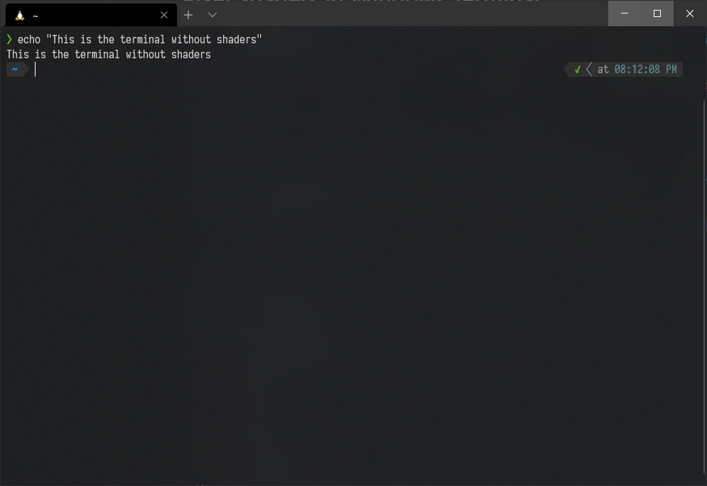
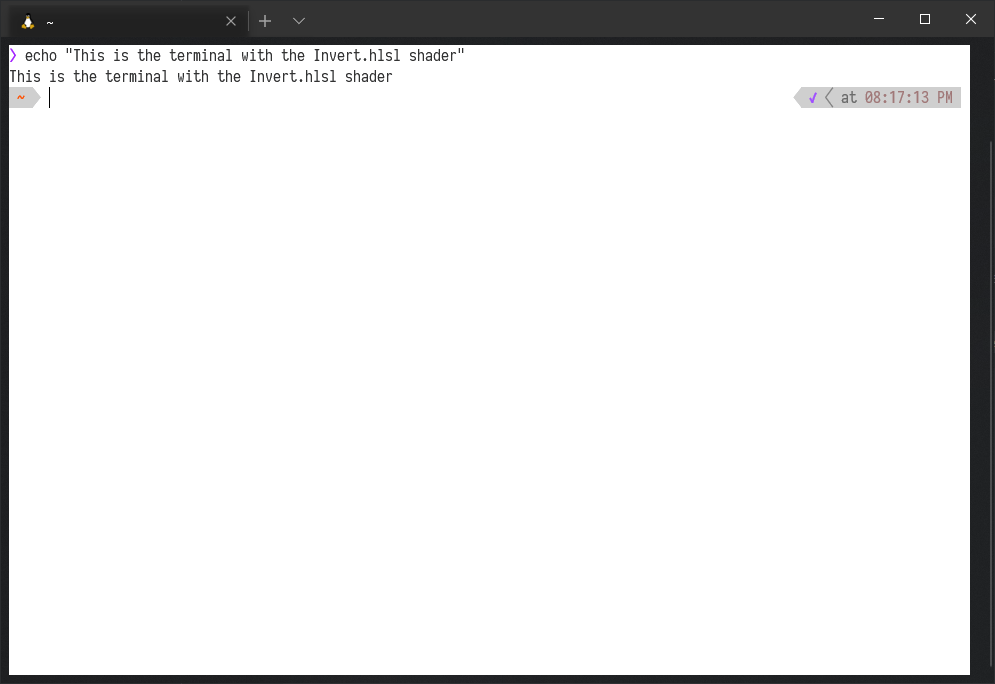
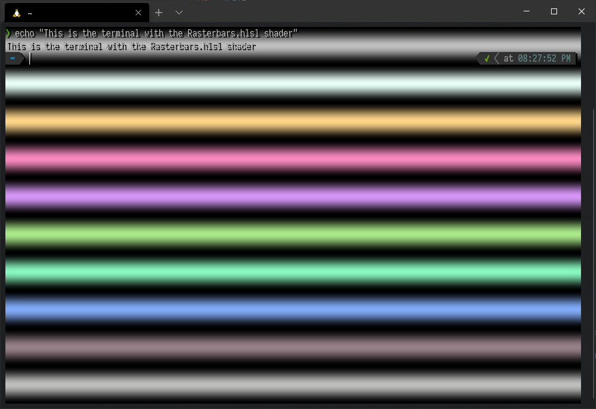
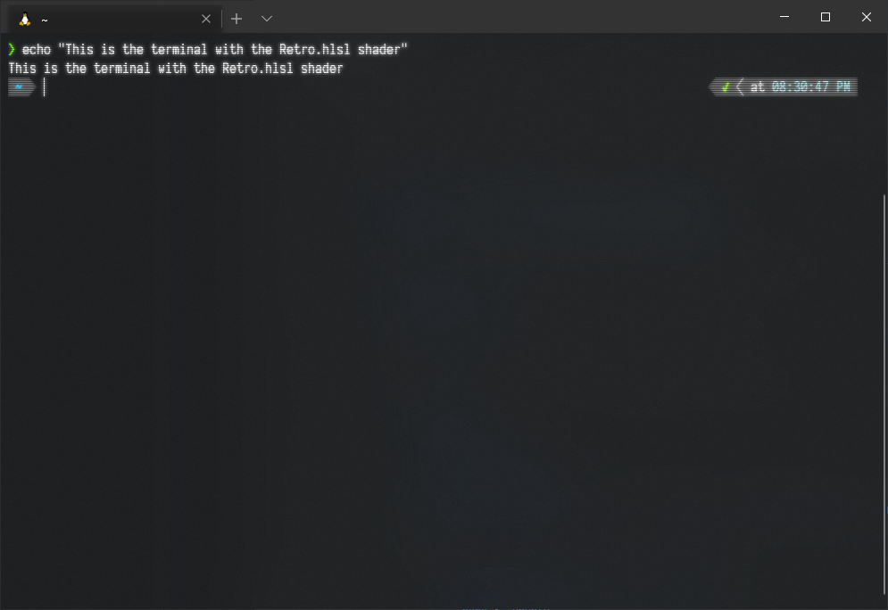
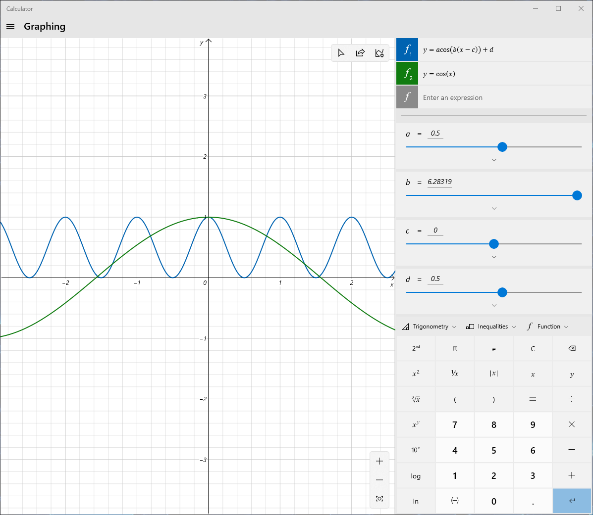

# Pixel Shaders in Windows Terminal

Due to the sheer amount of computing power in GPUs, one can do awesome things with pixel shaders such as real-time fractal zoom, ray tracers and image processing.

Windows Terminal allows user to provide a pixel shader which will be applied to the terminal. To try it out, add the following setting to one of your profiles:

```
"experimental.pixelShaderPath": "<path to a .hlsl pixel shader>"
```
> **Note**: if you specify a shader with `experimental.pixelShaderPath`, the Terminal will use that instead of the `experimental.retroTerminalEffect`.

To get started using pixel shaders in the Terminal, start with the following sample shader. This is `Invert.hlsl` in this directory:

```hlsl
// A minimal pixel shader that inverts the colors

// The terminal graphics as a texture
Texture2D shaderTexture;
SamplerState samplerState;

// Terminal settings such as the resolution of the texture
cbuffer PixelShaderSettings {
  // The number of seconds since the pixel shader was enabled
  float  Time;
  // UI Scale
  float  Scale;
  // Resolution of the shaderTexture
  float2 Resolution;
  // Background color as rgba
  float4 Background;
};

// A pixel shader is a program that given a texture coordinate (tex) produces a color.
// tex is an x,y tuple that ranges from 0,0 (top left) to 1,1 (bottom right).
// Just ignore the pos parameter.
float4 main(float4 pos : SV_POSITION, float2 tex : TEXCOORD) : SV_TARGET
{
    // Read the color value at the current texture coordinate (tex)
    //  float4 is tuple of 4 floats, rgba
    float4 color = shaderTexture.Sample(samplerState, tex);

    // Inverts the rgb values (xyz) but don't touch the alpha (w)
    color.xyz = 1.0 - color.xyz;

    // Return the final color
    return color;
}
```

Save this file as `C:\temp\invert.hlsl`, then update a profile with the setting:

```
"experimental.pixelShaderPath": "C:\\temp\\invert.hlsl"
```

Once the settings file is saved, open a terminal with the changed profile. It should now invert the colors of the screen!


 Default Terminal | Inverted Terminal 
---------|---------
  |  


If your shader fails to compile, the Terminal will display a warning dialog and ignore it temporarily. After fixing your shader, touch the `settings.json` file again, or open a new tab, and the Terminal will try loading the shader again.

## HLSL

The language we use to write pixel shaders is called `HLSL`. It's a `C`-like language, with some restrictions. You can't allocate memory, use pointers or recursion.
What you get access to is computing power in the teraflop range on decently recent GPUs. This means writing real-time raytracers or other cool effects are in the realm of possibility.

[shadertoy](https://shadertoy.com/) is a great site that show case what's possible with pixel shaders (albeit in `GLSL`). For example this [menger sponge](https://www.shadertoy.com/view/4scXzn). Converting from `GLSL` to `HLSL` isn't overly hard once you gotten the hang of it.

## Adding some retro raster bars

Let's try a more complicated example. Raster bars was cool in the 80's, so let's add that. Start by modifying shader like so: (This is `Rasterbars.hlsl`)

```hlsl
// A minimal pixel shader that shows some raster bars

// The terminal graphics as a texture
Texture2D shaderTexture;
SamplerState samplerState;

// Terminal settings such as the resolution of the texture
cbuffer PixelShaderSettings {
  // The number of seconds since the pixel shader was enabled
  float  Time;
  // UI Scale
  float  Scale;
  // Resolution of the shaderTexture
  float2 Resolution;
  // Background color as rgba
  float4 Background;
};

// A pixel shader is a program that given a texture coordinate (tex) produces a color.
// tex is an x,y tuple that ranges from 0,0 (top left) to 1,1 (bottom right).
// Just ignore the pos parameter.
float4 main(float4 pos : SV_POSITION, float2 tex : TEXCOORD) : SV_TARGET
{
    // Read the color value at the current texture coordinate (tex)
    //  float4 is tuple of 4 floats, rgba
    float4 color = shaderTexture.Sample(samplerState, tex);

    // Read the color value at some offset, will be used as shadow
    float4 ocolor = shaderTexture.Sample(samplerState, tex+2.0*Scale*float2(-1.0, -1.0)/Resolution.y);

    // Thickness of raster
    const float thickness = 0.1;

    float ny = floor(tex.y/thickness);
    float my = tex.y%thickness;
    const float pi = 3.141592654;


    // ny is used to compute the rasterbar base color
    float cola = ny*2.0*pi;
    float3 col = 0.75+0.25*float3(sin(cola*0.111), sin(cola*0.222), sin(cola*0.333));

    // my is used to compute the rasterbar brightness
    //  smoothstep is a great little function: https://en.wikipedia.org/wiki/Smoothstep
    float brightness = 1.0-smoothstep(0.0, thickness*0.5, abs(my - 0.5*thickness));

    float3 rasterColor = col*brightness;

    // lerp(x, y, a) is another very useful function: https://en.wikipedia.org/wiki/Linear_interpolation
    float3 final = rasterColor;
    // Create the drop shadow of the terminal graphics
    //  .w is the alpha channel, 0 is fully transparent and 1 is fully opaque
    final = lerp(final, float(0.0), ocolor.w);
    // Draw the terminal graphics
    final = lerp(final, color.xyz, color.w);

    // Return the final color, set alpha to 1 (ie opaque)
    return float4(final, 1.0);
}
```

Once reloaded, it should show some retro raster bars in the background, with a drop shadow to make the text more readable.

 

## Retro Terminal Effect

As a more complicated example, the Terminal's built-in `experimental.retroTerminalEffect` is included as the `Retro.hlsl` file in this directory. 



## Animated Effects

You can use the `Time` value in the shader input settings to drive animated effects. `Time` is the number of seconds since the shader first loaded. Here’s a simple example with a line of inverted pixels that scrolls down the terminal (`Animate_scan.hlsl`):

```hlsl
float4 main(float4 pos : SV_POSITION, float2 tex : TEXCOORD) : SV_TARGET
{
    // Read the color value at the current texture coordinate (tex)
    float4 color = shaderTexture.Sample(samplerState, tex);
    
    // Here we spread the animation over 5 seconds. We use time modulo 5 because we want
    // the timer to count to five repeatedly. We then divide the result by five again
    // to get a value between 0.0 and 1.0, which maps to our texture coordinate.
    float linePosition = Time % 5 / 5;
    
    // Since TEXCOORD ranges from 0.0 to 1.0, we need to divide 1.0 by the height of the
    // texture to find out the size of a single pixel
    float lineWidth = 1.0 / Resolution.y;
	
    // If the current texture coordinate is in the range of our line on the Y axis: 
    if (tex.y > linePosition - lineWidth && tex.y < linePosition)
    {
        // Invert the sampled color
        color.rgb = 1.0 - color.rgb;
    }
    
    return color;
}
```
What if we want an animation that goes backwards and forwards? In this example (`Animate_breathe.hlsl`), we'll make the background fade between two colours. Our `Time` value only ever goes up, so we need a way to generate a value that sweeps back and forth from `0.0` to `1.0`. Trigonometric functions like cosine are perfect for this and are very frequently used in shaders. 

`cos()` outputs a value between `-1.0` and `1.0`. We can adjust the wave with the following formula:

```
a * cos(b * (x - c)) + d
```

Where `a` adjusts the amplitude, `b` adjusts the wavelength/frequency, `c` adjusts the offset along the x axis, and `d` adjusts the offset along the y axis. You can use a graphing calculator (such as the Windows Calculator) to help visualize the output and experiment:



As shown above, by halving the output and then adding `0.5`, we can shift the range of the function to `0.0` - `1.0`. Because `cos()` takes input in radians, if we multiply `x` (`Time`) by tau (`2*pi`), we are effectively setting the wavelength to `1.0`. 

In other words, our full animation will be one second long. We can modify this duration by dividing tau by the number of seconds we want the animation to run for. In this case, we’ll go for five seconds.

Finally we use linear interpolation to achieve our breathing effect by selecting a color between our two chosen colors based on the output from our cosine.

```hlsl
// pi and tau (2 * pi) are useful constants when using trigonometric functions
#define TAU 6.28318530718

float4 main(float4 pos : SV_POSITION, float2 tex : TEXCOORD) : SV_TARGET
{
    // Read the color value at the current texture coordinate (tex)
    float4 sample = shaderTexture.Sample(samplerState, tex);
    
    // The number of seconds the breathing effect should span
    float duration = 5.0;
    
    float3 color1 = float3(0.3, 0.0, 0.5);  // indigo
    float3 color2 = float3(0.1, 0.1, 0.44); // midnight blue
    
    // Set background colour based on the time
    float4 backgroundColor = float4(lerp(color1, color2, 0.5 * cos(TAU / duration * Time) + 0.5), 1.0);
    
    // Draw the terminal graphics over the background
    return lerp(backgroundColor, sample, sample.w);
}
```

Feel free to modify and experiment!

