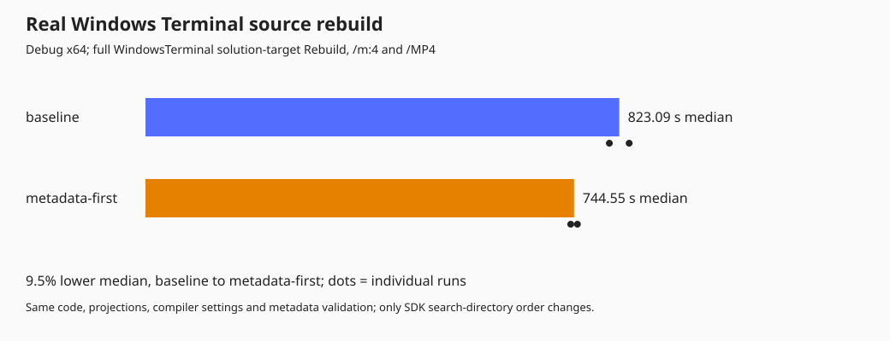
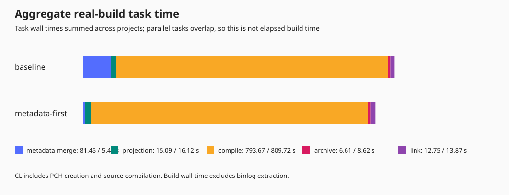
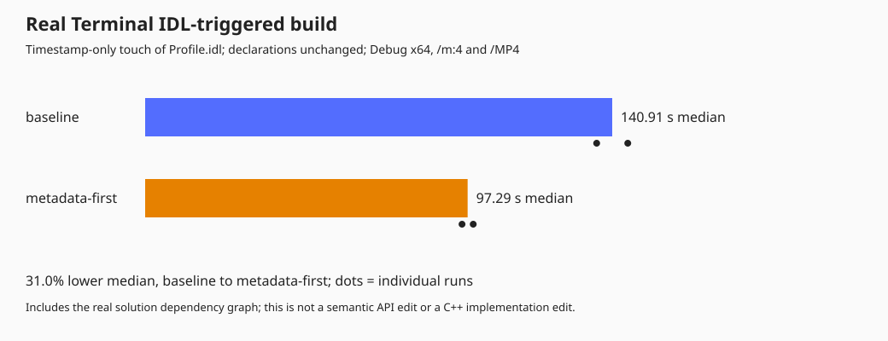

# Faster real Terminal builds, without a WinRT refactor

Further experiments are recorded in
[MORE_BUILD_EXPERIMENTS.md](MORE_BUILD_EXPERIMENTS.md), including a smaller
Model PCH. Those marginal results are separate from the metadata-search
comparison below; the percentages should not be added.

**A small metadata-search change reduced the actual WindowsTerminal source
rebuild from 13m 43s to 12m 25s: 9.5% faster, saving 79 seconds.** It is enabled
by default. No C++, IDL, XAML, PCH, compiler, or DLL-boundary changes are needed
for this improvement.

| Full WindowsTerminal solution-target rebuild | Median | Individual runs |
| --- | ---: | ---: |
| Original metadata search order | 823.09 s | 805.87 / 840.31 s |
| Common SDK contracts first | 744.55 s | 738.76 / 750.35 s |





[Raw measurements and fingerprints](results/metadata-search-measurements.json)
and [aggregated results](results/metadata-search-summary.json).

## Incremental builds

| Real solution Build scenario | Baseline median | Optimized median |
| --- | ---: | ---: |
| Timestamp-only touch of `Profile.idl` | 140.91 s | 97.29 s (**31.0% faster**) |
| No-op | 25.66 s | 26.78 s (**no improvement**) |



[Raw incremental samples](results/metadata-incremental-measurements.json).
Each scenario has two runs per variant, in alternating order. Touching the
IDL triggered five metadata merges; no-op runs triggered none. The IDL
contents were unchanged and its original timestamp was restored. This
measures metadata invalidation, **not a semantic API edit** or an ordinary
C++ implementation edit. The recorded compiler task count counts MSBuild
task invocations, including up-to-date tasks, not compiler process launches.

The change helps builds that regenerate metadata. It does not remove the
existing no-op build overhead or speed up C++ template compilation.

## The change

`mdmerge` searches its metadata directories in order when resolving referenced
types. C++/WinRT supplies many SDK contract directories, with commonly needed
Foundation types behind unrelated contracts and large third-party metadata.
Repeating those searches across the component merges was expensive.

The new target in
`build\rules\Microsoft.Windows.CppWinRT.Additional.targets` puts the directories
containing the **already resolved** `Windows.Foundation.FoundationContract`
and `Windows.Foundation.UniversalApiContract` first. All remaining directories
retain their relative order. `src\common.nugetversions.targets` imports the
rule for C++/WinRT projects.

This is a 19-line target file and one import, not a conversion of the Model
or App. It does not hardcode an SDK path/version, drop any metadata directories,
replace individual contracts with aggregate metadata, or turn off validation.
The normal `mdmerge -v` command remains in use.

Across the full rebuild, aggregate metadata-merge task time fell from
**81.45 s to 5.43 s**. Aggregate compiler task time did not improve
(793.67 s baseline versus 809.72 s optimized); this is a metadata lookup
improvement, not a claim of faster C++ compilation.

## Why this version is deliberately narrow

Using the SDK's unified `Windows.winmd` was also fast, but changed emitted
assembly references from individual contracts to `Windows`. That version was
rejected. Reordering the **original contract directories** achieved the speedup
without that metadata change.

For all four complete rebuilds, all **11 merged product WinMD files** were
byte-identical at the metadata level after clearing only the module version
ID that `mdmerge` regenerates on every run. The comparison includes the
complete metadata, not merely type names or file sizes. Assembly references,
signatures, GUID attributes, and other metadata are covered.

Six small MSBuild checks cover default enablement, opt-out, no metadata, no
common contracts, shared directories, and already-ordered inputs. The rule
leaves the original order intact when no common contracts are present.

The actual executable was then built with the optimization enabled by default,
without supplying its property. An isolated portable copy opened a terminal
window, opened the lazy-loaded Settings UI, and closed with exit code zero.
The user's normal settings and package registrations were not changed.
Release/ARM64 builds and packaged deployment were not exercised.

Earlier experiments with embedded debug information and MSBuild's parallel
tool scheduler did not improve the real Model library and were not retained.
The earlier own-projection PCH experiment remains disabled; its negative
results are recorded separately in [FULL_TERMINAL.md](FULL_TERMINAL.md).

## Measurement conditions

The measured command rebuilds the **real executable's entire solution dependency
closure**, using `Terminal\Window\WindowsTerminal:Rebuild`, not a stand-in
library or an already-built DLL wrapper.

Runs used Debug x64, `/m:4`, `/MP4`, VS 2026 Insiders / MSVC 14.51.36231, SDK
10.0.26100.0, and C++/WinRT 3.0.260818.1 on a Ryzen 7 7840U machine with 64 GB
RAM. Order was baseline / optimized / optimized / baseline. Both variants
disabled the earlier wrapper and own-projection PCH experiments.

Installed dependencies and OS caches were warm; package generation and
dependency restore were excluded. These are source rebuilds, **not
cache-flushed machine-cold builds**. Two samples per variant are exploratory
measurements, not a universal percentage or a statistically precise forecast.
The four individual runs are shown rather than just the median.

Wall times exclude subsequent binlog analysis and metadata comparisons.
Aggregate task times overlap across projects and are not an elapsed-time
breakdown. Build inputs and measurement scripts were fingerprinted and remained
unchanged throughout the comparison.

## Use and reproduce

Build normally: the metadata optimization is on by default in both Visual
Studio and command-line builds. To compare with the original behavior, rebuild
with `/p:TerminalOptimizeMetadataSearch=false`.

With repository dependencies restored and the actual executable built once:

```powershell
$msbuild = 'C:\Program Files\Microsoft Visual Studio\18\Insiders\MSBuild\Current\Bin\amd64\MSBuild.exe'
.\build\scripts\Test-MetadataSearch.ps1 `
    -MsBuild $msbuild -OutputDirectory "$env:TEMP\terminal-metadata-tests"

.\scratch\NativeBoundaryPrototype\Measure-Terminal.ps1 `
    -MsBuild $msbuild -Experiment MetadataSearch -Repetitions 2 `
    -OutputDirectory "$env:TEMP\terminal-metadata-full-$(Get-Date -Format yyyyMMdd-HHmmss)"

.\scratch\NativeBoundaryPrototype\Measure-MetadataIncremental.ps1 `
    -MsBuild $msbuild `
    -OutputDirectory "$env:TEMP\terminal-metadata-incremental-$(Get-Date -Format yyyyMMdd-HHmmss)"
```

The runner rejects failed builds, changed inputs, or changed merged metadata.
It preserves individual samples, logs, binlogs, and SVG graphs. The old
`OwnProjection` experiment remains available explicitly and disables this
metadata optimization in both of its variants.

This work is local; nothing has been submitted publicly. No broad native-core
conversion is necessary for the measured improvement.
