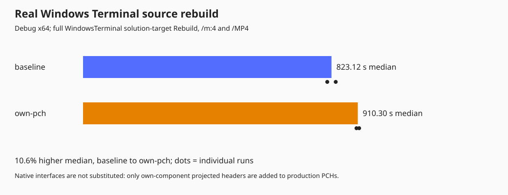
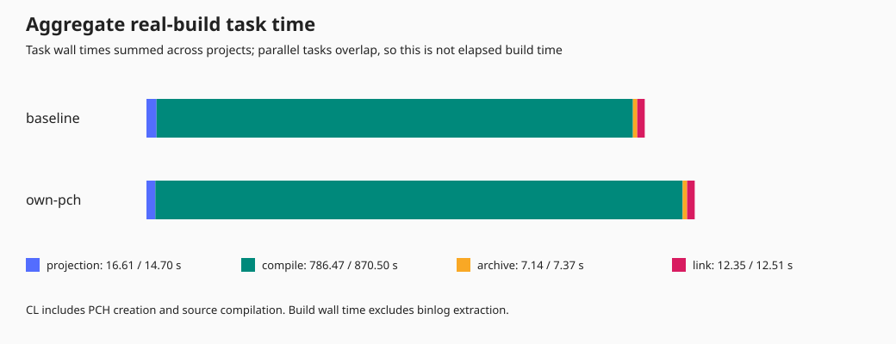
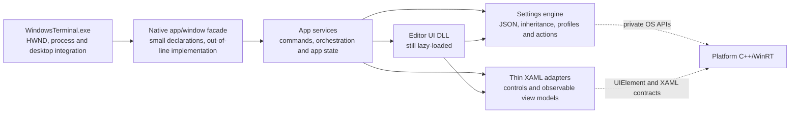

# Applying the experiment to the real Terminal

**Subsequent result:** [FASTER_BUILD.md](FASTER_BUILD.md) records a successful
minimal build-system change: **9.5% faster real Terminal rebuilds** by
prioritizing existing SDK metadata search directories. The report below
preserves the earlier, rejected PCH experiment and larger architecture study.

This follow-up uses the **actual WindowsTerminal solution target and its
dependency closure**, not the small adapter slice. Changes remain local and
opt-in. No native production API migration has been implemented.

## Result: this shortcut did not speed up the product

Four successful real `WindowsTerminal.exe` solution-target rebuilds produced:

| Variant | Median elapsed | Individual runs | Change |
| --- | ---: | ---: | ---: |
| Existing production PCHs | 823.12 s (13m 43s) | 837.14 / 809.09 s | baseline |
| Add own-component projections to PCHs | 910.30 s (15m 10s) | 914.67 / 905.93 s | **10.6% slower** |

The whole-product prototype is therefore **not recommended or enabled by
default**. The earlier 75.3% native-boundary slice improvement is not a measured
full-Terminal improvement. A real native facade/core migration remains unbuilt.





Raw samples, build-input fingerprints and per-project compiler task times:
[terminal-measurements.json](results/terminal-measurements.json).

| Project | Baseline median CL task sum | Own-PCH median CL task sum |
| --- | ---: | ---: |
| Model implementation library | 116.47 s | 243.92 s |
| Editor | 134.81 s | 124.88 s |
| App implementation library | 107.24 s | 97.08 s |
| Host (unchanged PCH) | 28.87 s | 31.69 s |

Editor and App showed modest reductions, but the Model increase outweighed
them. The long Model task was PCH creation in one run and source compilation
in the other; these samples do **not** establish a compiler-level root cause.
Do not attribute all the elapsed difference to one named compilation phase.
The unchanged host also varied, illustrating the limits of this small sample.

The PCH creation smoke checks grew Model from about 1,350 to 1,382 MiB,
Editor from 1,479 to 1,529 MiB, and App from 1,704 to 1,750 MiB. These are
file sizes, not measurements of peak RAM or compiler working set.

A second, scratch-only attempt cached `CascadiaSettings.h` and its private
implementation dependencies. Its PCH compiled, but the actual Model library
did not: additional declarations caused existing global JSON-key names to
collide and changed unqualified projected/implementation type lookup. The
attempt was rejected and its hook removed rather than making broad unrelated
source changes. A successful PCH-only check is not a successful product port.

The graph's negative-change wording was corrected after timing collection;
the raw JSON retains the original measured renderer fingerprint. No timed
build sources were changed during the four-run comparison.

## The tested production change

The Model, Editor and App already use production precompiled headers. Their
PCHs include platform and other components' projections, but leave their own
generated namespace headers to be parsed repeatedly by implementation files.

`TerminalPrecompileOwnProjection=true` adds those existing headers to their
existing PCHs:

| Implementation project | Header cached |
| --- | --- |
| `Microsoft.Terminal.Settings.ModelLib` | `winrt/Microsoft.Terminal.Settings.Model.h` |
| `Microsoft.Terminal.Settings.Editor` | `winrt/Microsoft.Terminal.Settings.Editor.h` |
| `TerminalAppLib` | `winrt/TerminalApp.h` |

There are no changed IDL signatures, XAML bindings, resource scopes, DLL
boundaries or activation exports. The host already precompiles App/Model
projections, so it is unchanged. This is a production parsing-cost experiment,
**not** removal of WinRT or a claim that combining DLLs is sufficient.

The flag defaults off, applies only to these three implementation projects,
and is independent of the earlier `TerminalLeanDllWrappers` experiment.

## Measurement protocol

`Measure-Terminal.ps1` runs four complete solution-target rebuilds, in order
baseline / own-PCH / own-PCH / baseline. Each rebuild uses Debug x64, four
MSBuild nodes and `/MP4`. Dependency restore and packaging are excluded;
installed NuGet/vcpkg dependencies and OS caches remain warm. Sources and
measurement scripts are fingerprinted and must remain fixed.

Elapsed wall time includes the complete rebuild and excludes subsequent
binlog analysis. Per-project `CL` task sums include PCH creation and source
compilation. Aggregate task times overlap across projects and are **not**
an elapsed-time breakdown. Two runs per variant are exploratory evidence,
not a statistically strong or machine-cold result.

The initial successful executable build took 8 minutes 36 seconds, but was
partly warm and used a different starting state. It is provisioning evidence,
**not the baseline in this comparison**.

## What a native full-product refactor would look like

The goal is to remove product WinRT types from **consumer contracts**, not
platform C++/WinRT from implementation code:



Start with native facades in the **existing DLLs**. There is no need to move
objects or combine resource scopes before demonstrating the interface saving.
Model and App already have implementation static libraries behind their DLL
shells. A final DLL consolidation can be a separate decision.

| Current leak | Replacement direction |
| --- | --- |
| Host consumes projected `AppLogic` / `TerminalWindow` and Model types | Small native app/window controllers; DTOs for window preferences and launch requests |
| `AppLogic.idl` exposes `CascadiaSettings` and `KeyChord` to `Command` maps | Native settings/service queries; keep mappings private to the service |
| `TerminalWindow.idl` exposes Model settings and settings-related events | Native event subscriptions with explicit lifetime, cancellation and thread contracts |
| Editor `ProfileViewModel` owns projected `Profile` / `CascadiaSettings` / `WindowSettings` | Native editing session behind the same observable XAML-facing view model |
| Editor XAML imports the Model namespace directly | UI-owned bindable properties/enums and thin adapters, not native business objects exposed to XAML |

A native facade should expose opaque controllers/PIMPLs, a few stable value
types, and out-of-line operations. It should not expose `implementation::*`
headers, generated `.g.h` files, or all of the business model as inline C++
templates. That would move rather than remove parsing cost.

The settings service owns loading, inheritance, dynamic profiles, action maps,
validation and serialization. An editing session preserves the editor's
draft/copy/save/reset behavior and stable profile identity. A XAML-facing view
model adapts that session to `INotifyPropertyChanged` and observable UI
collections on the UI thread. Platform `UIElement`/XAML interfaces may still
cross the UI hosting seam; generated product-wide settings projections need
not.

Keeping C++/WinRT-authored classes privately inside the engine is a possible
transitional implementation: its own IDL/projection generation still exists,
but consumers no longer import that metadata or parse those headers. Only a
later native engine port removes its internal generation cost as well.

### Preserve these semantics explicitly

Native value snapshots alone are not replacements for live settings objects.
Preserve inherited-versus-explicit values, stable object/profile identity,
shared references, mutation visibility, draft isolation, save errors,
collection notifications, revocation, asynchronous cancellation and UI-thread
affinity. Native callbacks must become the same XAML property notifications,
not silently change two-way binding or event order.

Keep Editor's delayed loading and metadata-provider registration until a
startup/memory comparison supports changing it. STL-bearing private interfaces
require a consistent compiler/CRT; they are not a stable external plugin ABI.

### Do not start by linking all the existing objects together

Each DLL has its own activation/module lifecycle and entry points.
`UTILS_DEFINE_LIBRARY_RESOURCE_SCOPE` is a binary-wide `selectany` global:
combining current objects can select one scope rather than preserve all the
resource namespaces. Debug resource-validation sections also become shared.
XAML metadata providers, generated XBF/PRI assets, WinMD-to-DLL manifests,
packaging and test-host resource aggregation must be rewired together.

Thus one possible destination is a native core DLL linked from business-logic
libraries plus separate UI adapter DLLs. A single enormous DLL is not a
prerequisite, and folding Editor into it can regress startup.

## Practical migration order

1. Cache existing projections in production PCHs and measure the real product.
   This bounds the inexpensive parsing improvement before paying for a port.
2. Replace the host-to-App product projection with a native app/window facade,
   initially implemented in `TerminalApp.dll`. Remove product projections from
   host headers only after all methods, events and settings reads are covered.
3. Introduce a native settings-service/edit-session contract in the existing
   Model DLL; migrate App and Editor consumers. Move direct Model XAML bindings
   to UI adapters, preserving identity, inheritance and notifications.
4. Remove now-unused consumer WinMD references and generation passes. Consider
   converting private engine classes or combining business libraries only
   after these seams work.

For each seam measure full source rebuild, no-op build, implementation edit,
native public-header edit and IDL edit. Record actual invalidated projects and
critical-path time, not just summed compiler work. Exercise terminal startup,
Settings navigation/edit/save/reset, settings reload, inherited profiles,
multi-window events and packaged/unpackaged activation. A reduced dependency
graph should especially help ordinary incremental work; a clean-build
percentage cannot prove that.

## Application evidence and remaining limits

After rejecting the implementation-header experiment, the normal generated
Model sources and default executable build were restored successfully. Using
the existing unpackaged-layout target and an independent `.portable` fixture,
the actual executable opened a terminal window, opened the lazy-loaded Settings
UI through UI Automation, exposed the Startup navigation item, and closed with
exit code zero. This check used the **restored baseline**, not an opt-in native
port or proof of the faster behavior of either rejected experiment.

An earlier bounded `-Embedding` check remained alive past 20 seconds. It was
not counted as a passing startup check; the smoke script instead exercises a
normal terminal window. The cause of that baseline handoff-timeout behavior
was not investigated as part of this build study.

Packaged activation, Release/ARM64 builds, startup/memory performance and a
native facade conversion remain unverified. No failed build was included in
the four-sample graphs, and no changes were submitted publicly.

## Reproducing the real-product comparison

Use the same restored repository dependencies and a selected Visual Studio
installation throughout. The solution target matters: standalone project
builds omit some proxy-header and WinMD ordering edges.

```powershell
$msbuild = 'C:\Program Files\Microsoft Visual Studio\18\Insiders\MSBuild\Current\Bin\amd64\MSBuild.exe'
& $msbuild OpenConsole.slnx '/t:Terminal\Window\WindowsTerminal' `
    /p:Configuration=Debug /p:Platform=x64 /m:4 /p:CL_MPCount=4 `
    /p:GenerateAppxPackageOnBuild=false /p:AppxBundle=Never /nr:false
if ($LASTEXITCODE) { throw 'Provisioning build failed' }

.\scratch\NativeBoundaryPrototype\Measure-Terminal.ps1 `
    -OutputDirectory "$env:TEMP\terminal-full-$(Get-Date -Format yyyyMMdd-HHmmss)" `
    -MsBuild $msbuild -Repetitions 2
```

For a normal opt-in build, add `/p:TerminalPrecompileOwnProjection=true` to the
solution build command. To undo the experiment, pass `false`; this property
changes compiler options, so switching modes requires regeneration of the
affected PCHs and source objects.

### Isolated application smoke

After building the desired variant, prepare the existing unpackaged layout.
Then `Smoke-Terminal.ps1` copies it to a **new** runtime directory, adds
`.portable`, and supplies independent settings. It does not change the user's
normal settings or register an application package. Use Windows PowerShell for
the optional UI Automation check; its Settings-menu lookup expects English UI.

```powershell
$root = (Get-Location).Path + '\'
& $msbuild src\cascadia\WindowsTerminal\WindowsTerminal.vcxproj `
    /t:_WTPrepareUnpackagedLayoutForRun /p:Configuration=Debug /p:Platform=x64 `
    "/p:SolutionDir=$root" /p:BuildProjectReferences=false `
    /p:TerminalPrecompileOwnProjection=true /p:GenerateAppxPackageOnBuild=false `
    /p:AppxBundle=Never /nr:false
if ($LASTEXITCODE) { throw 'Unpackaged layout failed' }
$smoke = "$env:TEMP\terminal-smoke-$(Get-Date -Format yyyyMMdd-HHmmss)"
& powershell.exe -NoProfile -File scratch\NativeBoundaryPrototype\Smoke-Terminal.ps1 `
    -BuiltLayout bin\x64\Debug\WindowsTerminal -RuntimeDirectory $smoke `
    -OutputFile "$smoke\smoke.json" -ExerciseSettings
if ($LASTEXITCODE) { throw 'Application smoke failed' }
```
