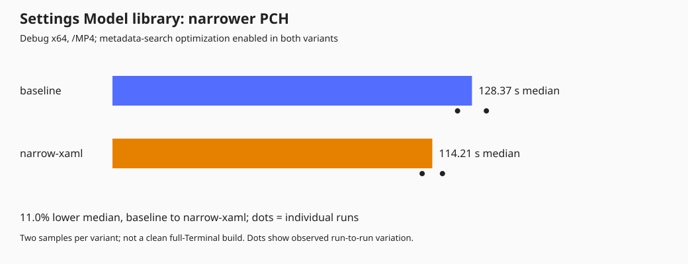
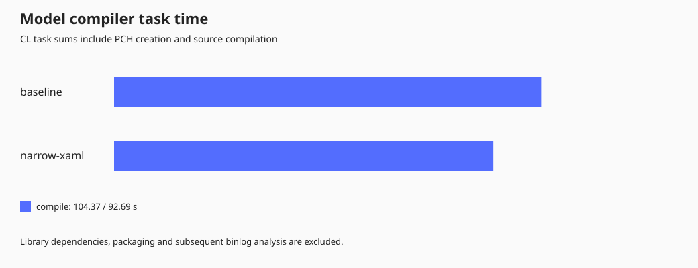

# Additional build experiments

The useful low-risk result is **a smaller Settings Model PCH**: remove the
unused full WinUI controls projection and include base Windows XAML APIs
instead of the full Windows controls projection.

This is a three-line header change, with no IDL, ABI, compiler-option, or
runtime refactor. It is retained in `TerminalSettingsModel\pch.h`. The older,
rejected own-projection PCH experiment remains off.

## Retained: narrower Model PCH

| Actual Model implementation-library rebuild | Median | Samples |
| --- | ---: | ---: |
| Current baseline, including the committed metadata optimization | 128.37 s | 133.52 / 123.22 s |
| Narrower XAML includes | 114.21 s | 117.83 / 110.58 s |

That is **14.16 seconds / 11.0% lower** in this project-level experiment.
PCH size fell from **1,350.06 MiB to 1,127.19 MiB**, saving **222.87 MiB
(16.5%)**. File size is not a measurement of compiler peak RAM.





[Raw project measurements](results/narrow-model-measurements.json).

The Model uses XAML resources, brushes, and enums, but does not need all the
control method definitions in its PCH. Its generated public model headers
already supply the declarations required by its IDL contracts, including
WinUI enums. `Windows.UI.Xaml.h` supplies the base XAML APIs actually used.
The complete Model library, not just `pch.cpp`, compiled successfully.

The first screening step removed only `Microsoft.UI.Xaml.Controls.h`:
133.52 to 126.30 seconds in one before/after sample. Replacing
`Windows.UI.Xaml.Controls.h` with `Windows.UI.Xaml.h` then brought the sample
to 117.83 seconds. Those single samples are screening results, not independent
precise attribution for each include. The table above includes a repeat with
the original headers restored.

### Actual executable rebuilds

I also measured the real WindowsTerminal solution `Build` after touching the
Model's PCH header, forcing Model recompilation and the necessary product
relinks. Unrelated work was settled before each timed group. Both variants
used the committed metadata-search optimization, `/m:4`, and `/MP4`.

| Order | PCH variant | Elapsed | Model compiler task sum |
| --- | --- | ---: | ---: |
| 1 | Original | 121.45 s | 98.99 s |
| 2 | Narrow | 112.76 s | 89.41 s |
| 3 | Narrow | 111.03 s | 87.06 s |
| 4 | Original restored | 144.37 s | 115.99 s |
| 5 | Original repeat | 183.43 s | 153.24 s |
| 6 | Narrow restored | 141.83 s | 110.87 s |

**The later measurements were noisy.** After the fifth sample, with no build
running, system CPU use was still approximately 21-27%. I did not stop other
work on the shared machine. The ranges overlap, so I am **not quoting a
stable whole-product speedup** from this series. These are PCH-triggered
incremental executable builds, not clean full-product rebuilds.

All eleven merged product WinMDs matched across all six samples, excluding
only their nondeterministic module version IDs. The final product remains
built with the narrower PCH. The existing Settings Model test binary passed
all **158 tests**, and an isolated portable executable opened a terminal,
opened the lazy-loaded Settings UI, and closed successfully.

## Other experiments

| Experiment | Observed result | Decision |
| --- | --- | --- |
| Put common platform references first for **MIDL**, not `mdmerge` | Median 16.29 s original vs 17.25 s reordered; two samples each | No benefit; hook removed |
| Model compilation with **8 workers** | 98.71 s, versus 110.58-117.83 s with 4 workers and the same narrow PCH | Promising local tuning; only one sample, no default change |
| MSBuild MultiToolTask scheduler, globally bounded to **8 workers** | 111.47 s for the same Model rebuild | Slower than ordinary `/MP8`; not retained |
| Replace platform references with SDK union metadata **only during XAML compilation** | Real Editor build failed to resolve the existing `Windows.Foundation.UniversalApiContract` assembly reference | Rejected; hook removed and normal build restored |

The `/MP8` result is hardware/workload-dependent, not a code optimization.
With multiple projects compiling concurrently it can oversubscribe CPUs or
memory. The earlier four-worker baseline was deliberately fixed for fair
source comparisons; this does not establish that the repository's normal
automatic concurrency defaults are slow.

The XAML experiment initially used direct compile-pass targets, which failed
even for the baseline because normal build setup was missing. That attempt
was discarded. Through the actual Editor `Build` pipeline, the ordinary
baseline succeeded; the union-metadata variant then failed contract assembly
resolution. No failed run was used as a performance sample.

The earlier no-op binlog shows approximately 18 seconds of aggregate XAML
compiler task time in a roughly 27-second build. That is an interesting
remaining cost, but skipping those passes without correct dependency and
output tracking risks stale generated bindings. No such shortcut was added.

## Conditions and reproduction

Measurements used Debug x64, VS 18 Insiders / MSVC 14.51.36231, SDK
10.0.26100.0, installed dependencies and warm OS caches. Restore and packaging
were excluded. No dependency, compiler version, or application architecture
was changed. These are exploratory results on a shared Ryzen 7 7840U machine
with 64 GB RAM, not isolated-machine statistical estimates.

The library timing excludes dependency builds. Product timing includes the
real solution graph, but excludes untimed settling builds, binlog extraction,
and metadata comparisons. Timestamp-only benchmark touches are restored.
All samples, including the slower ones, are preserved in
[more-build-experiments.json](results/more-build-experiments.json).

```powershell
$msbuild = 'C:\Program Files\Microsoft Visual Studio\18\Insiders\MSBuild\Current\Bin\amd64\MSBuild.exe'
$output = "$env:TEMP\terminal-pch-$(Get-Date -Format yyyyMMdd-HHmmss)"

# Measures the currently checked-out PCH; use a new label/directory per state.
.\scratch\NativeBoundaryPrototype\Measure-Model.ps1 `
    -MsBuild $msbuild -OutputDirectory "$output\model" `
    -Variant narrow-xaml -Repetitions 2

.\scratch\NativeBoundaryPrototype\Measure-ModelPchProduct.ps1 `
    -MsBuild $msbuild -OutputDirectory "$output\product" `
    -Variant narrow-xaml -Repetitions 2
```

For the original-header baseline, use the two original includes
`Windows.UI.Xaml.Controls.h` and `Microsoft.UI.Xaml.Controls.h` in the Model
PCH. Keep all other sources and compiler settings fixed. The scripts record
the PCH source hash; they do not silently switch the source variant.

The source change is local and uncommitted. Release/ARM64 builds, packaged
deployment, and a new full clean-product speedup have not been established.
