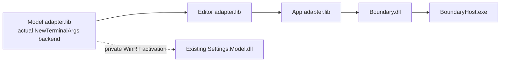
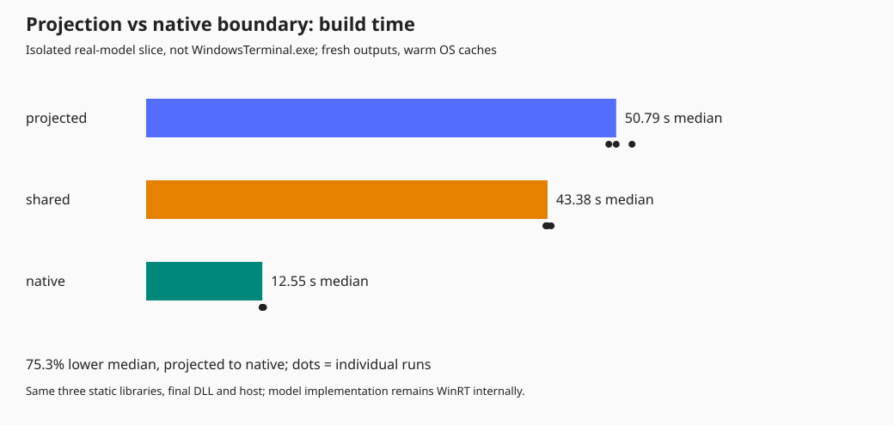
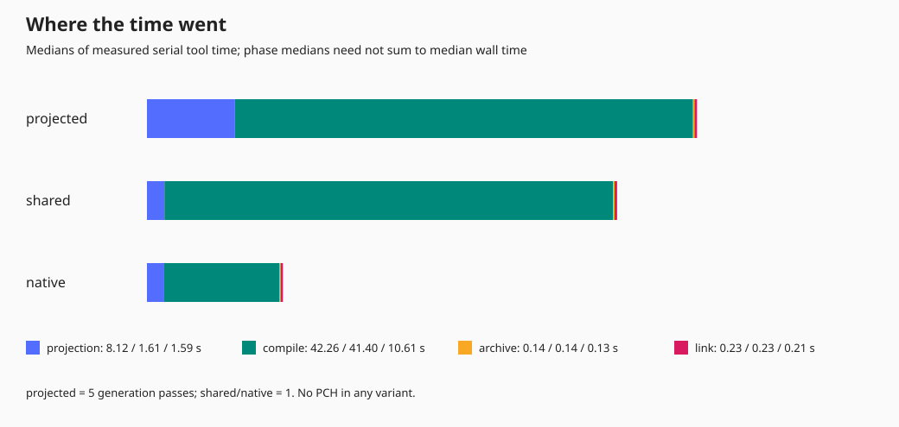
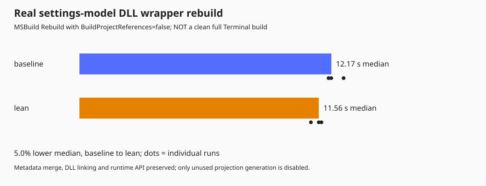
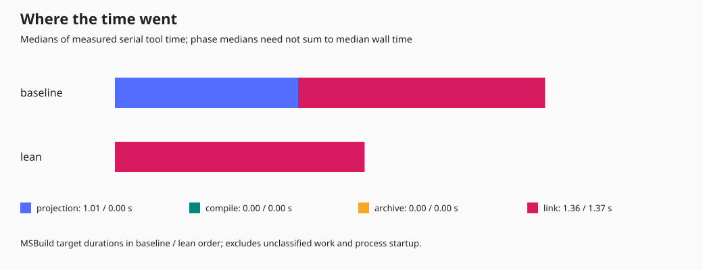
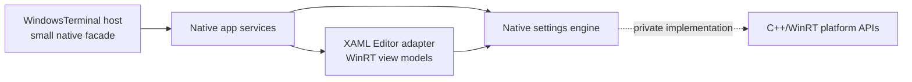

# Native-boundary build experiment

This is a **local prototype, not a port of Terminal to a single native DLL**.
The native-boundary and own-projection PCH experiments are opt-in. The later
metadata-search optimization is enabled by default. Nothing has been submitted
publicly.

**Latest experiments:** [MORE_BUILD_EXPERIMENTS.md](MORE_BUILD_EXPERIMENTS.md)
retains a smaller Model PCH: **223 MiB smaller, with 11.0% lower isolated
Model-library rebuild time** in the measured samples. Real executable
header-triggered builds were also exercised, but later CPU contention
prevents a stable whole-product percentage.

**Successful real-product improvement:** [FASTER_BUILD.md](FASTER_BUILD.md)
records a **9.5% faster actual Terminal rebuild (13m 43s to 12m 25s)** from a
small metadata-search-order change, with no C++/WinRT architecture refactor.

**Earlier real-product follow-up:** [FULL_TERMINAL.md](FULL_TERMINAL.md) records four
actual executable rebuilds and the native full-product architecture. Its
own-projection PCH shortcut was **10.6% slower**, not a successful full-Terminal
speedup. The opt-in `TerminalPrecompileOwnProjection` remains off by default.

## What is being tested

There are two independent experiments:

1. **Real DLL wrapper:** rebuild `Microsoft.Terminal.Settings.Model.dll` with
   its existing static-library dependencies already built. Disable only unused
   platform, reference and component projection generation in its link-only
   wrapper. Keep metadata merging, resources, linking and activation exports.
   The opt-in also recognizes the equivalent Control and App DLL shells.
2. **Native boundary slice:** build three small static libraries into one DLL,
   then build an EXE that consumes it. The backend activates the **real
   `NewTerminalArgs` implementation in the existing settings-model DLL**.
   Pass six launch-argument fields through model, editor, app and host stages.
   Compare independently generated WinRT projections, a shared projection, and
   a native value interface. Only the backend uses C++/WinRT in the native case.

The slice's model/editor/app stages are new adapters, **not the original
TerminalSettingsModel, TerminalSettingsEditor or TerminalApp implementations**.
The real model DLL remains a runtime dependency; it has not been folded into
the experimental DLL. In particular, these results do not measure removal of
the original Editor/App IDL, XAML compilation, packaging, or startup behavior.

All slice variants use the same static-library/DLL topology. This separates
the effect of the interface from the effect of reducing the DLL count.



The `projected` case exposes `NewTerminalArgs` in `Boundary.h` and independently
generates SDK/dependency projections for each translation unit/project stand-in.
The `shared` case exposes exactly the same type, but all stages use one generated
header tree. The `native` case exposes `LaunchValues` (`std::wstring` and
`std::optional`), copies fields out of the backend object, and does not expose
any WinRT type in the consumer header.

The host checks six round trips per build, including empty and Unicode strings,
quotes and spaces, absent optionals, index zero, and explicit `false` vs absent
elevation. All three variants perform the same title/directory edits.

## Measurements

The recorded results and SVG graphs are in `results`. The raw JSON contains
individual runs, tool phase durations, configuration and machine information.
The graphs show medians and individual wall-time samples.

| Isolated boundary slice | Median build | Observed range | Change from projected |
| --- | ---: | ---: | ---: |
| Independent projections | 50.79 s | 50.00-52.50 s | baseline |
| Shared generated projection | 43.38 s | 43.19-43.76 s | 14.6% lower |
| Native consumer interface | 12.55 s | 12.53-12.69 s | 75.3% lower |

Of the slice's median measured tool time, compilation fell from **42.26 s to
10.61 s**, while generation fell from **8.12 s to 1.59 s**. Sharing the header
tree alone left compilation at roughly **41.40 s**. The interesting signal is
the dependency-parsing cost, not DLL linking (about a quarter of a second).

The real Model DLL wrapper measured **12.17 s baseline vs 11.56 s lean**
(three runs each, approximately **5.0% / 0.60 s** lower median). Its unused
projection targets accounted for approximately **1.01 s** in the baseline.
This is a modest local saving, not evidence of a dramatic whole-product gain.









**Do not extrapolate the slice percentage to a full Terminal build.**

The slice uses serial MSVC tools, `/Od /Zi /MDd`, and **no precompiled headers**.
The production projects use PCHs and parallel compilation. The slice deliberately
makes dependency parsing visible; it does not reproduce the production compile
mix, number of translation units, UI bindings, or incremental rebuild graph.
Sharing generated headers avoids generation work, not repeated parsing.

Each run starts with fresh generated headers, objects and libraries in a unique
directory, but uses already installed dependencies and warm OS caches. This is
a clean-output build, not a machine-cold or cache-flushed build. Dependency
restore and construction of the real model DLL are excluded. Build wall time
excludes the subsequent runtime checks. Runs are serial; slice order rotates,
and wrapper order alternates. Three successful runs per variant are recorded.

Wrapper phase timings come from MSBuild's target performance summary.
Slice phase timings are individual external-tool wall times. They are **not
interchangeable**, and phase medians need not sum to the median build wall time.

## Reproducing

Use PowerShell 7, Node.js, the repository's NuGet dependencies, and an x64 Visual
Studio developer environment. For example:

```powershell
$vswhere = "${env:ProgramFiles(x86)}\Microsoft Visual Studio\Installer\vswhere.exe"
$vs = & $vswhere -latest -prerelease -products * `
    -requires Microsoft.VisualStudio.Component.VC.Tools.x86.x64 `
    -property installationPath
Import-Module "$vs\Common7\Tools\Microsoft.VisualStudio.DevShell.dll"
Enter-VsDevShell -VsInstallPath $vs -SkipAutomaticLocation `
    -DevCmdArguments '-arch=x64 -host_arch=x64'
$msbuild = "$vs\MSBuild\Current\Bin\amd64\MSBuild.exe"
$root = (Get-Location).Path + '\'

# Restore dependencies first if the repository's packages are missing.
# nuget restore dep\nuget\packages.config -PackagesDirectory packages -NonInteractive

# Preserve the solution's otherwise implicit proxy/metadata build ordering.
& $msbuild src\host\proxy\Host.Proxy.vcxproj /t:Build `
    /p:Configuration=Debug /p:Platform=x64 "/p:SolutionDir=$root" /m:4
if ($LASTEXITCODE) { throw 'Proxy build failed' }
& $msbuild src\cascadia\TerminalSettingsModel\dll\Microsoft.Terminal.Settings.Model.vcxproj `
    /t:Build /p:Configuration=Debug /p:Platform=x64 `
    "/p:SolutionDir=$root" /m:4 /p:CL_MPCount=4
if ($LASTEXITCODE) { throw 'Model build failed' }

$output = "$env:TEMP\terminal-boundaries-$(Get-Date -Format yyyyMMdd-HHmmss)"
.\scratch\NativeBoundaryPrototype\Measure-Wrappers.ps1 `
    -OutputDirectory "$output\wrappers" -MsBuild $msbuild -Repetitions 3
.\scratch\NativeBoundaryPrototype\Measure.ps1 `
    -OutputDirectory "$output\boundaries" -Repetitions 3
```

The slice defaults to SDK `10.0.26100.0`; select another installed SDK using
`-SdkVersion`. Do not benchmark variants concurrently. The scripts fail rather
than include a failed build or failed runtime check as a successful sample.
Keep the build tools and sources fixed across measured runs.
The slice records source/binary/metadata SHA-256 hashes and rejects a run set if
any of those inputs change while it is being measured. The backend DLL is pinned
for each test process's lifetime so that returned projected objects cannot
outlive their implementation.

The wrapper script rebuilds the existing model DLL in place, without rebuilding
its dependencies. To restore the default wrapper generation afterward:

```powershell
& $msbuild src\cascadia\TerminalSettingsModel\dll\Microsoft.Terminal.Settings.Model.vcxproj `
    /t:Rebuild /p:Configuration=Debug /p:Platform=x64 `
    "/p:SolutionDir=$root" /p:BuildProjectReferences=false `
    /p:TerminalLeanDllWrappers=false
```

## What the production architecture actually costs

`Microsoft.Terminal.Settings.ModelLib.vcxproj` and `TerminalAppLib.vcxproj`
already contain almost all their implementation code in static libraries.
Their DLL projects wrap those libraries. Merely changing another
`ConfigurationType` to `StaticLibrary` does **not** remove MIDL, metadata merge,
projection generation, template instantiation or XAML compilation.

The dependency graph contains Core/Control metadata ahead of the Model, Model
ahead of Editor, and Editor ahead of App/Host. Shared types in IDL couple those
generation stages even when the corresponding code is statically linked.
There are also manual WinMD references and solution-only build dependencies,
so a clean standalone `WindowsTerminal.vcxproj` build is not a reliable baseline
without restoring that ordering.

There are concrete obstacles to a naive monolithic link:

- Each component contributes `DllMain`, activation-module entry points, and a
  module/factory lifecycle. These need deliberate aggregation.
- `UTILS_DEFINE_LIBRARY_RESOURCE_SCOPE` defines a `selectany` global shared by
  a binary. Combining current Model/Editor/App objects would pick one resource
  scope, not preserve three. Debug resource-validation sections are also
  binary-wide. A successful link alone would not demonstrate correctness.
- XAML bindings, custom controls and metadata providers still need WinRT-facing
  types. App deliberately delays loading the Editor metadata provider/DLL until
  Settings opens. Consolidation can regress startup and memory usage.
- The EXE's manifest and packaged resource collection currently map WinMDs to
  separate implementations. Activation, PRI/XBF collection, test hosts and
  packaging must be updated together.

## Recommended next architecture

Prefer **native business-logic libraries behind small, non-inline C++ interfaces**
over exposing `implementation::*` classes to all consumers. Use a PIMPL/opaque
handle or carefully scoped immutable values. Keep platform C++/WinRT use private
to implementation files. Keep projected XAML view models and controls in a thin
UI adapter, potentially retaining the lazy-loaded Editor DLL.



This means removing business types from cross-layer IDL, not just changing how
their existing object files are linked. For example, `AppLogic.idl` currently
returns Model `CascadiaSettings` and a map of Control `KeyChord` to Model
`Command`; those signatures expose the dependencies to the host.

The native snapshot prototype changes identity/aliasing semantics deliberately.
A full conversion needs explicit ownership, two-way binding, notifications,
thread affinity, cancellation and error contracts; snapshots cannot silently
replace live observable settings objects. Exported STL-bearing interfaces also
require a compatible compiler/CRT. They are not a stable public DLL ABI.

The next decisive comparison is a real native service seam built with the
production PCHs and compile settings, followed by whole-product clean-output,
no-op, implementation-edit and public-header/IDL-edit measurements. Record
binlogs, validate settings/UI behavior and packaged/unpackaged activation, and
compare startup as well as builds before expanding the refactor.

No successful whole-`WindowsTerminal.exe` baseline/after comparison was obtained
in the **initial slice study**. The clean standalone project build exposed missing
solution-only ordering (the proxy headers and Settings App Adapter WinMD
inputs); the model subtree was then built successfully in explicit order.
That restore/build consumed most of the worktree drive's available space,
leaving roughly 5 GB. The isolated measurements use the session artifact drive.
There is therefore no measured full-app speedup, packaged app validation, or
verified single-DLL conversion to report.
