# AtlasEngine

## General architecture overview

```mermaid
graph TD
    Renderer["Renderer (base/renderer.cpp)<br><small>breaks the text buffer down into GDI-oriented graphics<br>primitives (#quot;change brush to color X#quot;, #quot;draw string Y#quot;, ...)</small>"]
    RenderEngineBase[/"RenderEngineBase<br>(base/RenderEngineBase.cpp)<br><small>abstracts 24 LOC 👻</small>"\]
    GdiEngine["GdiEngine (gdi/...)"]

    subgraph AtlasEngine["AtlasEngine (atlas/...)"]
        AtlasEngine.cpp["AtlasEngine.cpp<br><small>Implements IRenderEngine text rendering API<br>breaks GDI graphics primitives down into DWRITE_GLYPH_RUNs</small>"]
        AtlasEngine.api.cpp["AtlasEngine.api.cpp<br><small>Implements the parts run inside the console<br>lock (many IRenderEngine setters)<small>"]
        AtlasEngine.r.cpp["AtlasEngine.r.cpp<br><small>Implements the parts run<br>outside of the console lock<small>"]
        Backend.cpp["Backend.cpp<br><small>Implements common functionality/helpers</small>"]
        BackendD2D.cpp["BackendD2D.cpp<br><small>Pure Direct2D text renderer (for low latency<br>remote desktop and older/no GPUs)</small>"]
        BackendD3D.cpp["BackendD3D.cpp<br><small>Custom, performant text renderer<br>with our own glyph cache</small>"]
    end

    Renderer -.-> RenderEngineBase
    %% Mermaid.js has no support for backwards arrow at the moment
    RenderEngineBase <-.->|extends| GdiEngine
    Renderer ----> AtlasEngine
    AtlasEngine.cpp <--> AtlasEngine.api.cpp
    AtlasEngine.cpp <--> AtlasEngine.r.cpp
    AtlasEngine.r.cpp --> BackendD2D.cpp
    AtlasEngine.r.cpp --> BackendD3D.cpp
    BackendD2D.cpp -.- Backend.cpp
    BackendD3D.cpp -.- Backend.cpp
```

As you can see, breaking the text buffer down into GDI-style primitives just to rebuild them into DirectWrite ones, is pretty wasteful. It's also incredibly bug prone. It would be beneficial if the TextBuffer and rendering settings were given directly to AtlasEngine so it can do its own bidding.

## BackendD3D

The primary entrypoint for rendering is `IBackend::Render` and `BackendD3D` implements it via the following functions, by calling them one by one in the order listed here.

### `_handleSettingsUpdate`

### `_drawBackground`

### `_drawCursorPart1` / `_drawCursorPart2`

### `_drawText`

### `_drawSelection`

### `_handleSettingsUpdate`

