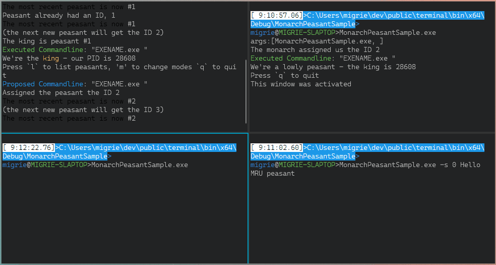

# Monarch/Peasant Sample

This directory contains a sample monarch/peasant application. This is a type of
application where a single "Monarch" can coordinate the actions of multiple
other "Peasant" processes, as described by the specs in [#7240] and [#8135].

This project is intended to be a standalone sample of how the architecture would
work, without involving the entirety of the Windows Terminal build. Eventually,
this architecture will be incorporated into `wt.exe` itself, to enable scenarios
like:
* Run `wt` in the current window ([#4472])
* Single Instance Mode ([#2227])

For an example of this sample running, see the below GIF:



This sample operates largely by printing to the console, to help the reader
understand how it's working through its logic.

## Usage

```
MonarchPeasantSample.exe [--session,-s session-id] [args...]
```

This will run a new instance of the MonarchPeasantSample.

One of the running `MonarchPeasantSample` processes will be the "Monarch",
responsible for coordinating the creation of windows between processes. It can
be toggled between different `glomToLastWindow` modes by pressing `m`. It can be
exited with `q`.

The other instances will be "peasants", who can be told to execute commandlines.
`q` will exit the process. Any other keypress will "activate" the peasant
window, informing the monarch that this peasant is the newly-active one.

If the `session-id` is provided on the commandline, then the monarch will try to
pass the provided `args` to the specified peasant process, accounting for the
current value of `glomToLastWindow`. See the spec in [#8135] for details of how
this argument works. The actual `args...` params are unused.

## Project layout

The code is vaguely separated into the following files, with the following
purposes. As this code isn't production-ready code, the layering isn't
particularly well organized nor enforced.

* `Monarch.idl/.h/.cpp`: Code for the WinRT Monarch object, responsible for
  coordinating the Peasants
* `Peasant.idl/.h/.cpp`: Code for the WinRT Peasant object, which represents any
  individual application instance.
* `AppState.h/.cpp`: This file contains some common state that's used throughout
  the application, in order to help encapsulate it all in one place.
* `MonarchMain.cpp`: This file contains the main loop for the monarch process.
  It needs to be able to process console input, and additionally wait on the
  peasants, to know when they've died.
* `PeasantMain.cpp`: This file contains the main loop for the peasant process.
  It needs to be able to wait on both console input, and on the Monarch process,
  to be able to determine who the next monarch should be.

## Remaining TODOs

This project represents an _incomplete_ example, but one that covers enough of
the edge cases for the reader to comprehend the architecture. Below is a list of
things that are missing from the sample:

* [ ] The Monarch should store a stack for the MRU peasant, not just the single
  MRU one
* [ ] The Monarch needs to `WaitForMultipleObjects` on Peasants, to remove them
  from the map when they die
* [ ] After an "election", the entire MRU window state is lost, because it was
  only stored in the current monarch. This needs to be distributed to all the
  other Peasants when it changes.
* [ ] Theoretically, `ProposeCommandline` should use the CWD of the process
  calling it. That's left unimplemented for brevity.
* [ ] Technically, the Monarch is also a Peasant, and any keypress should also
  activate the Monarch window as the MRU one.
* [ ] We're storing a strictly-increasing int for to determine what the next ID
  for a peasant should be. This seems silly, and like we could probably just
  iterate to find the first gap in the map (I'm sure there's a better way of
  doing this that I can't recall, don't tell my CS540 professor)
* [ ] The following steps causes an unexpected crash:
    - Create a monarch(#1) & peasant(#2)
    - activate the peasant(#2)
    - exit the peasant(#2)
    - try running `MonarchPeasantSample.exe -s 0` (or `-s 2`)
    - THIS WILL FAIL, but it _should_ just run the commandline in the monarch
      (in the case of `-s 0`) or in a new window (in the `-s 1` case)
        - The reason this fails is because the Monarch tries to call
          `Peasant::ExecuteCommandline`, but the Peasant object doesn't actually
          exist anymore (the process is dead!). Three fixes will help here:
          - wrap all calls to peasants with try/catch's
          - Do the "keep a MRU stack" thing (so we know `-s 0` is now the monarch)
          - Do the "wait on Peasant processes" thing, to know to pop #2 from the
            map and MRU stack.

## Utilities

Use the following helper script to open a new Terminal window with 4 splits - 3
running instances of MonarchPeasantSample.exe, and a fourth which can be used to
issue commands.

```cmd
pushd %OPENCON%\bin\x64\Debug\MonarchPeasantSample
wt -d . cmd /k MonarchPeasantSample.exe ; sp -d . cmd /k MonarchPeasantSample.exe ; sp -d . cmd /k MonarchPeasantSample.exe ; sp -d .
popd

```

[#2227]: https://github.com/microsoft/terminal/issues/2227
[#4472]: https://github.com/microsoft/terminal/issues/4472
[#7240]: https://github.com/microsoft/terminal/pull/7240
[#8135]: https://github.com/microsoft/terminal/pull/8135
